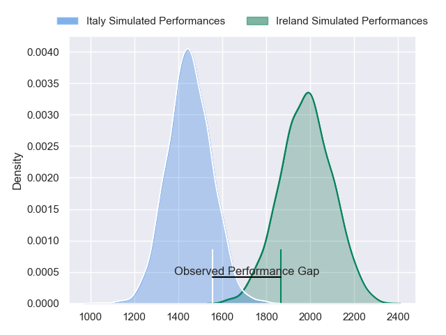
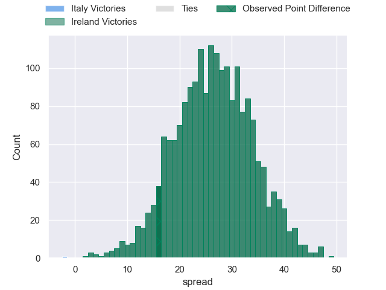
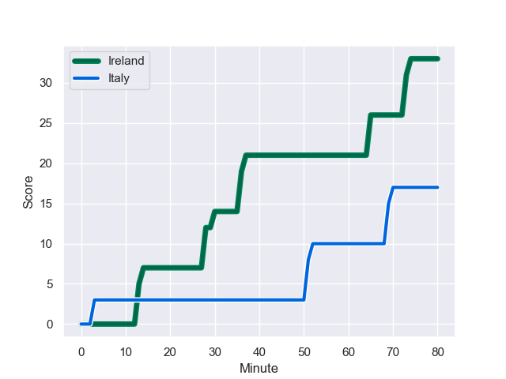
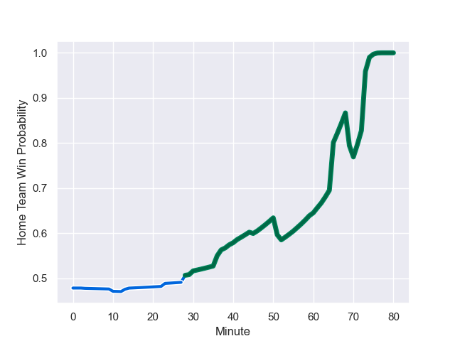

---  
layout: page  
title: Italy at Ireland; 17.0-33.0  
date: 2023-08-04 18:00:00 -0500  
categories: match review  
---
# Italy at Ireland; 17.0-33.0

# Club Level Predictions

The first set of predictions treats a club as the smallest object, as the club develops its members, organizes a gameplan, and deploys its players as needed for each match. This club model has a prediction of 0.947, which translates to predicting Ireland to win by 26.4.

Each club has a rating and a rating deviation (simiar to a Glicko system), and expected performances can be generated. This allows for simulated matches and spreads like the ones below.
## Projected Performances

## Projected Spreads

## Projected Results

# Player Level Predictions - Version 1

Treating teams instead as an entity made up of the currently active players, I have ratings for each player in an altogether different system. These can be combined to form team ratings once teamsheets are announced, weighting starters a bit higher than the reserves. After the match is played, players can be weighted by their minutes on the field, allowing for an accurate measure of the team's composition. With these compiled team ratings, we can make predictions, measure inaccuracy, and update the individual player ratings.
## Prediction with Player Minutes: Ireland by 0.2

Italy by 3.8 on a neutral field
## Prediction without Player Minutes: Ireland by 0.5

Italy by 3.5 on a neutral pitch

## Scores over Time

## Win Probability over Time

There were 8 large changes in win probability in this match

|   Away Minutes | Away Player         |   Away elo |   Away Percentile |   Number |   Home Percentile |   Home elo | Home Player      |   Home Minutes |
|---------------:|:--------------------|-----------:|------------------:|---------:|------------------:|-----------:|:-----------------|---------------:|
|             60 | Danilo Fischetti    |      79.75 |                40 |        1 |                67 |      83.89 | Dave Kilcoyne    |             52 |
|             56 | Giacomo Nicotera    |      85.7  |                54 |        2 |                67 |      83.07 | Rob Herring      |             52 |
|             10 | Marco Riccioni      |      78.47 |                46 |        3 |                69 |      84.37 | Tom O'Toole      |             52 |
|             46 | Dino Lamb           |      85.94 |                52 |        4 |                64 |      84.12 | Iain Henderson   |             56 |
|             80 | Federico Ruzza      |     106.46 |                82 |        5 |                73 |      87.22 | Joe McCarthy     |             80 |
|             74 | Sebastian Negri     |      86.19 |                53 |        6 |                80 |      89.64 | Ryan Baird       |             80 |
|             41 | Manuel Zuliani      |      95.97 |                76 |        7 |                76 |      85.98 | Caelan Doris     |             80 |
|             80 | Lorenzo Cannone     |      81.93 |                41 |        8 |                63 |      85.52 | Jack Conan       |             36 |
|             41 | Stephen Varney      |      85.48 |                54 |        9 |                89 |     102.82 | Craig Casey      |             45 |
|             80 | Paolo Garbisi       |      65.11 |                13 |       10 |                85 |      98.85 | Jack Crowley     |             80 |
|             80 | Monty Ioane         |     128.73 |                97 |       11 |                67 |      83.67 | Jacob Stockdale  |             80 |
|             75 | Tommaso Menoncello  |     111.09 |                86 |       12 |                66 |      83.46 | Stuart McCloskey |             80 |
|             80 | Juan Ignacio Brex   |      85.26 |                47 |       13 |                72 |      88.99 | Robbie Henshaw   |             62 |
|             23 | Paolo Odogwu        |      93.33 |                70 |       14 |                83 |      94.39 | Keith Earls      |             80 |
|             80 | Tommaso Allan       |      92.99 |                60 |       15 |                68 |      88.31 | Jimmy O'Brien    |             41 |
|             24 | Luca Bigi           |      86.46 |               nan |       16 |               nan |      84.64 | Tom Stewart      |             28 |
|             23 | Paolo Buonfiglio    |      86.75 |               nan |       17 |               nan |      84.92 | Cian Healy       |             28 |
|             70 | Simone Ferrari      |      87.06 |               nan |       18 |               nan |      85.22 | Tadhg Furlong    |             28 |
|             34 | Niccolo Cannone     |      87.4  |               nan |       19 |               nan |      85.55 | Tadhg Beirne     |             24 |
|             39 | Michele Lamaro      |      87.77 |               nan |       20 |               nan |      85.91 | Cian Prendergast |             44 |
|              6 | Giovanni Pettinelli |      85.06 |               nan |       21 |               nan |      86.74 | Caolin Blade     |             35 |
|             39 | Alessandro Fusco    |      84.87 |               nan |       22 |               nan |      83.26 | Ciaran Frawley   |             39 |
|             54 | Lorenzo Pani        |      82.4  |                51 |       23 |               nan |      86.3  | Calvin Nash      |             18 |

# Player Level Predictions - Version 2

Treating teams instead as an entity made up of the currently active players, I have ratings for each player in an altogether different system. These can be combined to form team ratings once teamsheets are announced, weighting starters a bit higher than the reserves. After the match is played, players can be weighted by their minutes on the field, allowing for an accurate measure of the team's composition. With these compiled team ratings, we can make predictions, measure inaccuracy, and update the individual player ratings.
## Prediction with Player Minutes: Italy by 1.0

Italy by 4.6 on a neutral field
## Prediction without Player Minutes: Italy by 0.8

Italy by 4.4 on a neutral pitch

|   Away Minutes | Away Player         |   Away elo |   Away variance |   Number |   Home variance |   Home elo | Home Player      |   Home Minutes |
|---------------:|:--------------------|-----------:|----------------:|---------:|----------------:|-----------:|:-----------------|---------------:|
|             60 | Danilo Fischetti    |      40.51 |           49.95 |        1 |              50 |      46.65 | Dave Kilcoyne    |             52 |
|             56 | Giacomo Nicotera    |      46.65 |           50    |        2 |              50 |      46.65 | Rob Herring      |             52 |
|             10 | Marco Riccioni      |      40.86 |           50    |        3 |              50 |      46.65 | Tom O'Toole      |             52 |
|             46 | Dino Lamb           |      46.65 |           50    |        4 |              50 |      46.65 | Iain Henderson   |             56 |
|             80 | Federico Ruzza      |      97.45 |           49.88 |        5 |              50 |      46.65 | Joe McCarthy     |             80 |
|             74 | Sebastian Negri     |      46.65 |           50    |        6 |              50 |      46.65 | Ryan Baird       |             80 |
|             41 | Manuel Zuliani      |      49.64 |           49.92 |        7 |              50 |      46.65 | Caelan Doris     |             80 |
|             80 | Lorenzo Cannone     |      75.04 |           49.95 |        8 |              50 |      46.65 | Jack Conan       |             36 |
|             41 | Stephen Varney      |      46.65 |           50    |        9 |              50 |      46.65 | Craig Casey      |             45 |
|             80 | Paolo Garbisi       |      46.65 |           50    |       10 |              50 |      46.65 | Jack Crowley     |             80 |
|             80 | Monty Ioane         |      87.77 |           49.88 |       11 |              50 |      46.65 | Jacob Stockdale  |             80 |
|             75 | Tommaso Menoncello  |      64.33 |           49.88 |       12 |              50 |      46.65 | Stuart McCloskey |             80 |
|             80 | Juan Ignacio Brex   |      46.65 |           50    |       13 |              50 |      46.65 | Robbie Henshaw   |             62 |
|             23 | Paolo Odogwu        |      46.65 |           50    |       14 |              50 |      46.65 | Keith Earls      |             80 |
|             80 | Tommaso Allan       |      48.03 |           49.88 |       15 |              50 |      46.65 | Jimmy O'Brien    |             41 |
|             24 | Luca Bigi           |      46.65 |           50    |       16 |              50 |      46.65 | Tom Stewart      |             28 |
|             23 | Paolo Buonfiglio    |      46.65 |           50    |       17 |              50 |      46.65 | Cian Healy       |             28 |
|             70 | Simone Ferrari      |      46.65 |           50    |       18 |              50 |      46.65 | Tadhg Furlong    |             28 |
|             34 | Niccolo Cannone     |      46.65 |           50    |       19 |              50 |      46.65 | Tadhg Beirne     |             24 |
|             39 | Michele Lamaro      |      46.65 |           50    |       20 |              50 |      46.65 | Cian Prendergast |             44 |
|              6 | Giovanni Pettinelli |      46.65 |           50    |       21 |              50 |      46.65 | Caolin Blade     |             35 |
|             39 | Alessandro Fusco    |      46.65 |           50    |       22 |              50 |      46.65 | Ciaran Frawley   |             39 |
|             54 | Lorenzo Pani        |      18.18 |           49.88 |       23 |              50 |      46.65 | Calvin Nash      |             18 |

