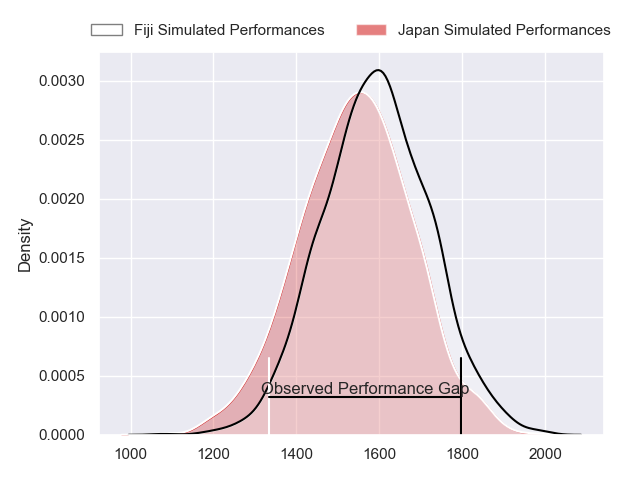
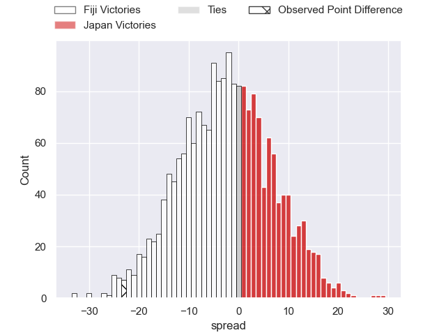
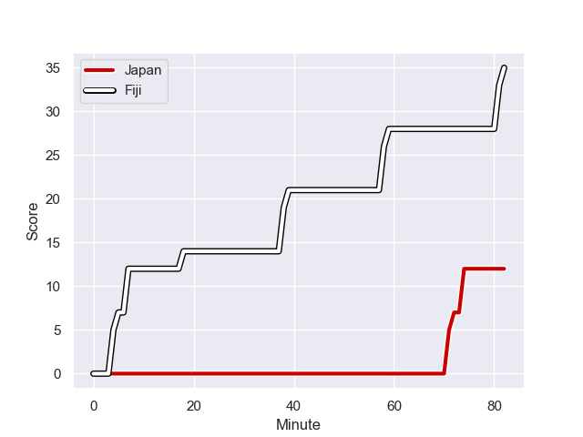
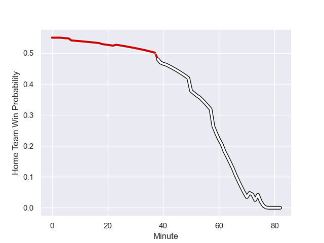

---  
layout: page  
title: Fiji at Japan; 35.0-12.0  
date: 2023-08-04 18:00:00 -0500  
categories: match review  
---
# Fiji at Japan; 35.0-12.0

# Club Level Predictions

The first set of predictions treats a club as the smallest object, as the club develops its members, organizes a gameplan, and deploys its players as needed for each match. This club model has a prediction of 0.436, which translates to predicting Fiji to win by 2.4.

Each club has a rating and a rating deviation (simiar to a Glicko system), and expected performances can be generated. This allows for simulated matches and spreads like the ones below.
## Projected Performances

## Projected Spreads

## Projected Results

# Player Level Predictions - Version 1

Treating teams instead as an entity made up of the currently active players, I have ratings for each player in an altogether different system. These can be combined to form team ratings once teamsheets are announced, weighting starters a bit higher than the reserves. After the match is played, players can be weighted by their minutes on the field, allowing for an accurate measure of the team's composition. With these compiled team ratings, we can make predictions, measure inaccuracy, and update the individual player ratings.
## Prediction with Player Minutes: Japan by 12.7

Japan by 8.7 on a neutral field
## Prediction without Player Minutes: Japan by 14.7

Japan by 10.7 on a neutral pitch

## Scores over Time

## Win Probability over Time

There were 2 large changes in win probability in this match

|   Away Minutes | Away Player             |   Away elo |   Away Percentile |   Number |   Home Percentile |   Home elo | Home Player        |   Home Minutes |
|---------------:|:------------------------|-----------:|------------------:|---------:|------------------:|-----------:|:-------------------|---------------:|
|             53 | Eroni Mawi              |      52.96 |                13 |        1 |                73 |      94.41 | Keita Inagaki      |             41 |
|             50 | Sam Matavesi            |      58.58 |                23 |        2 |                23 |      69.16 | Atsushi Sakate     |             41 |
|             50 | Luke Tagi               |      87.75 |                79 |        3 |                97 |     123.07 | Asaeli Ai Valu     |             41 |
|             82 | Albert Tuisue           |      64.13 |                35 |        4 |                 7 |      60.57 | James Moore        |             82 |
|             66 | Temo Mayanavanua        |      86.04 |                75 |        5 |                40 |      78.47 | Amato Fakatava     |             23 |
|             82 | Lekima Tagitagivalu     |      95.83 |                89 |        6 |                90 |     115.53 | Jack Cornelsen     |             82 |
|             53 | Kitione Kamikamica      |      79.11 |                63 |        7 |                45 |      86.74 | Pieter Labuschagne |             82 |
|             82 | Ratu Meli Derenalagi    |      96.06 |                90 |        8 |                37 |      79.61 | Kazuki Himeno      |             59 |
|             50 | Simione Kuruvoli        |      86.79 |                72 |        9 |                48 |      83.4  | Naoto Saito        |             41 |
|             60 | Ben Volavola            |      71.19 |                42 |       10 |                29 |      77.07 | Rikiya Matsuda     |             56 |
|             82 | Selestino Ravutaumada   |      92.31 |                85 |       11 |                27 |      77    | Jone Naikabula     |             82 |
|              7 | Vilimoni Botitu         |      86.53 |                64 |       12 |                34 |      81.62 | Tomoki Osada       |             82 |
|             82 | Waisea Nayacalevu       |      90.89 |                81 |       13 |                82 |     108.11 | Dylan Riley        |             62 |
|             82 | Jiuta Wainiqolo         |      90.4  |                83 |       14 |                91 |     118.53 | Semisi Masirewa    |             82 |
|             82 | Sireli Maqala           |      96.65 |                85 |       15 |                72 |     103.23 | Kotaro Matsushima  |             82 |
|             32 | Tevita Ikanivere        |     123.05 |                97 |       16 |                98 |     123.96 | Shota Horie        |             41 |
|             29 | Peni Ravai              |     100.59 |                86 |       17 |                69 |      84.82 | Craig Millar       |             41 |
|             32 | Mesake Doge             |      68.13 |                25 |       18 |                65 |      84.4  | Jiwon Gu           |             41 |
|             16 | Te Ahiwaru Cirikidaveta |     100.73 |                83 |       19 |               nan |      88.94 | Kanji Shimokawa    |             59 |
|             29 | Joseva Tamani           |      72.53 |                28 |       20 |                92 |     108.65 | Ben Gunter         |             23 |
|             32 | Frank Lomani            |      81.91 |                54 |       21 |                56 |      80.7  | Yutaka Nagare      |             41 |
|             75 | Teti Tela               |      97.15 |                77 |       22 |                38 |      76.07 | Seungsin Lee       |             26 |
|             22 | Ilaisa Droasese         |      84.6  |                56 |       23 |               nan |      86.54 | Ryoto Nakamura     |             20 |

# Player Level Predictions - Version 2

Treating teams instead as an entity made up of the currently active players, I have ratings for each player in an altogether different system. These can be combined to form team ratings once teamsheets are announced, weighting starters a bit higher than the reserves. After the match is played, players can be weighted by their minutes on the field, allowing for an accurate measure of the team's composition. With these compiled team ratings, we can make predictions, measure inaccuracy, and update the individual player ratings.
## Prediction with Player Minutes: Japan by 6.6

Japan by 3.3 on a neutral field
## Prediction without Player Minutes: Japan by 7.7

Japan by 4.4 on a neutral pitch

|   Away Minutes | Away Player             |   Away elo |   Away variance |   Number |   Home variance |   Home elo | Home Player        |   Home Minutes |
|---------------:|:------------------------|-----------:|----------------:|---------:|----------------:|-----------:|:-------------------|---------------:|
|             53 | Eroni Mawi              |      55.08 |           49.83 |        1 |           49.71 |      98.7  | Keita Inagaki      |             41 |
|             50 | Sam Matavesi            |      62.65 |           49.84 |        2 |           49.71 |      45.02 | Atsushi Sakate     |             41 |
|             50 | Luke Tagi               |      59.04 |           49.79 |        3 |           49.88 |     100.01 | Asaeli Ai Valu     |             41 |
|             82 | Albert Tuisue           |      92.39 |           49.79 |        4 |           49.72 |     -15.4  | James Moore        |             82 |
|             66 | Temo Mayanavanua        |      66.98 |           49.66 |        5 |           49.81 |      45.53 | Amato Fakatava     |             23 |
|             82 | Lekima Tagitagivalu     |      65.62 |           49.79 |        6 |           49.62 |      99.74 | Jack Cornelsen     |             82 |
|             53 | Kitione Kamikamica      |      70.39 |           49.36 |        7 |           50    |      46.65 | Pieter Labuschagne |             82 |
|             82 | Ratu Meli Derenalagi    |      61.38 |           49.09 |        8 |           49.62 |      73.53 | Kazuki Himeno      |             59 |
|             50 | Simione Kuruvoli        |      43.63 |           49.93 |        9 |           49.81 |      45.88 | Naoto Saito        |             41 |
|             60 | Ben Volavola            |      50.48 |           49.97 |       10 |           49.9  |     115.71 | Rikiya Matsuda     |             56 |
|             82 | Selestino Ravutaumada   |      64.29 |           47.67 |       11 |           49.81 |      45.53 | Jone Naikabula     |             82 |
|              7 | Vilimoni Botitu         |      71.88 |           49.5  |       12 |           49.81 |      45.53 | Tomoki Osada       |             82 |
|             82 | Waisea Nayacalevu       |      53.79 |           49.79 |       13 |           49.62 |     117.5  | Dylan Riley        |             62 |
|             82 | Jiuta Wainiqolo         |      59.45 |           48.17 |       14 |           49.81 |      63.47 | Semisi Masirewa    |             82 |
|             82 | Sireli Maqala           |      51.97 |           49.82 |       15 |           49.76 |     104.85 | Kotaro Matsushima  |             82 |
|             32 | Tevita Ikanivere        |      58.94 |           47.92 |       16 |           49.9  |     118.58 | Shota Horie        |             41 |
|             29 | Peni Ravai              |      53.18 |           48.86 |       17 |           49.9  |      54.39 | Craig Millar       |             41 |
|             32 | Mesake Doge             |      48.01 |           49.47 |       18 |           49.77 |      38.37 | Jiwon Gu           |             41 |
|             16 | Te Ahiwaru Cirikidaveta |      48.85 |           48.41 |       19 |           50    |      45.66 | Kanji Shimokawa    |             59 |
|             29 | Joseva Tamani           |      44.02 |           48.19 |       20 |           49.86 |     111.95 | Ben Gunter         |             23 |
|             32 | Frank Lomani            |      61.6  |           48.23 |       21 |           49.8  |      77.63 | Yutaka Nagare      |             41 |
|             75 | Teti Tela               |      66.93 |           50    |       22 |           49.72 |      21.14 | Seungsin Lee       |             26 |
|             22 | Ilaisa Droasese         |      59.85 |           48.02 |       23 |           50    |      46.65 | Ryoto Nakamura     |             20 |

