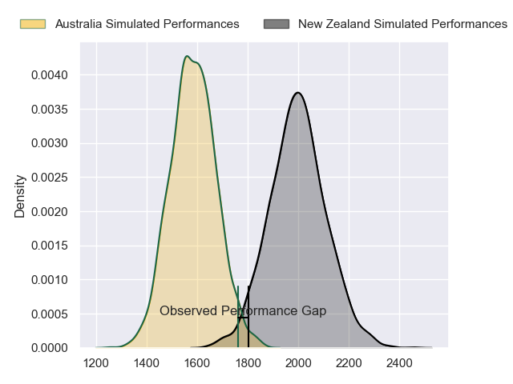
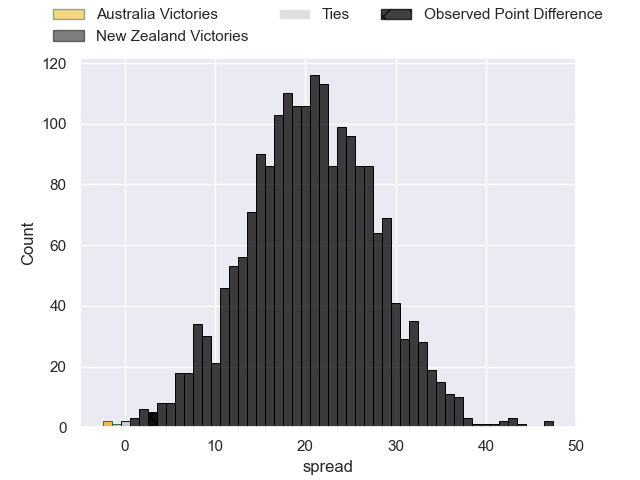
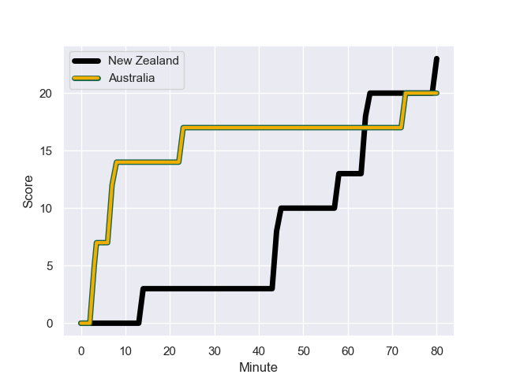
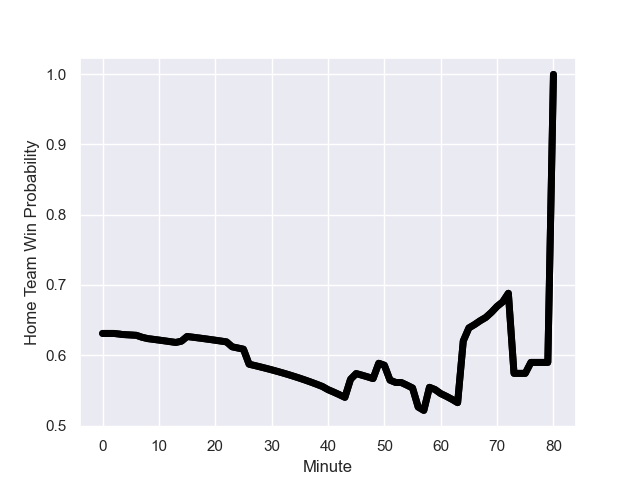

---  
layout: page  
title: Australia at New Zealand; 20.0-23.0  
date: 2023-08-04 18:00:00 -0500  
categories: match review  
---
# Australia at New Zealand; 20.0-23.0

# Club Level Predictions

The first set of predictions treats a club as the smallest object, as the club develops its members, organizes a gameplan, and deploys its players as needed for each match. This club model has a prediction of 0.907, which translates to predicting New Zealand to win by 20.6.

Each club has a rating and a rating deviation (simiar to a Glicko system), and expected performances can be generated. This allows for simulated matches and spreads like the ones below.
## Projected Performances

## Projected Spreads

## Projected Results

# Player Level Predictions - Version 1

Treating teams instead as an entity made up of the currently active players, I have ratings for each player in an altogether different system. These can be combined to form team ratings once teamsheets are announced, weighting starters a bit higher than the reserves. After the match is played, players can be weighted by their minutes on the field, allowing for an accurate measure of the team's composition. With these compiled team ratings, we can make predictions, measure inaccuracy, and update the individual player ratings.
## Prediction with Player Minutes: New Zealand by 27.3

New Zealand by 23.3 on a neutral field
## Prediction without Player Minutes: New Zealand by 28.7

New Zealand by 24.7 on a neutral pitch

## Scores over Time

## Win Probability over Time

There were 6 large changes in win probability in this match

|   Away Minutes | Away Player         |   Away elo |   Away Percentile |   Number |   Home Percentile |   Home elo | Home Player            |   Home Minutes |
|---------------:|:--------------------|-----------:|------------------:|---------:|------------------:|-----------:|:-----------------------|---------------:|
|             56 | Angus Bell          |      83.1  |                73 |        1 |                77 |      98.29 | Tamaiti Williams       |             49 |
|             15 | Dave Porecki        |      96.65 |                84 |        2 |                89 |     110.9  | Samisoni Taukei'aho    |             53 |
|             57 | Pone Fa'amausili    |      85.21 |                77 |        3 |                86 |     103.3  | Nepo Laulala           |             49 |
|             80 | Nick Frost          |      70.61 |                50 |        4 |                91 |     113.43 | Brodie Retallick       |             26 |
|             51 | Richie Arnold       |      79.58 |                62 |        5 |                83 |     109.29 | Sam Whitelock          |             80 |
|             80 | Tom Hooper          |      81.86 |                75 |        6 |                76 |     101.96 | Samipeni Finau         |             80 |
|             60 | Fraser McReight     |      70    |                46 |        7 |                97 |     135.64 | Sam Cane               |             71 |
|             80 | Rob Valetini        |      93.5  |                86 |        8 |                93 |     120.7  | Ardie Savea            |             80 |
|             65 | Tate McDermott      |     101.74 |                91 |        9 |                72 |      99.13 | Finlay Christie        |             53 |
|             65 | Carter Gordon       |      87.51 |                75 |       10 |                56 |      91.77 | Damian McKenzie        |             49 |
|             80 | Marika Koroibete    |      69.91 |                49 |       11 |                32 |      80.39 | Leicester Fainga'anuku |             80 |
|             76 | Samu Kerevi         |     108.34 |                95 |       12 |                85 |     113.38 | Anton Lienert-Brown    |             80 |
|             80 | Jordan Petaia       |     110.78 |                96 |       13 |                87 |     109.76 | Braydon Ennor          |             40 |
|             80 | Mark Nawaqanitawase |      91.27 |                84 |       14 |                53 |      91.31 | Shaun Stevenson        |             80 |
|             80 | Andrew Kellaway     |     107.84 |                92 |       15 |                90 |     123.3  | Will Jordan            |             80 |
|             65 | Matt Faessler       |      80.76 |                54 |       16 |                97 |     125.58 | Dane Coles             |             27 |
|             24 | James Slipper       |     131.64 |                99 |       17 |                89 |      99.55 | Ofa Tu'ungafasi        |             31 |
|             23 | Zane Nonggorr       |      88.46 |                65 |       18 |               nan |     102.27 | Fletcher Newell        |             31 |
|             29 | Will Skelton        |     116.3  |                94 |       19 |                31 |      73.49 | Tupou Vaa'i            |             54 |
|             20 | Rob Leota           |      74.4  |                38 |       20 |                98 |     127.72 | Luke Jacobson          |              9 |
|             15 | Nic White           |     111.28 |                90 |       21 |                70 |      91.18 | Aaron Smith            |             27 |
|             15 | Quade Cooper        |     123.37 |                95 |       22 |                99 |     140.94 | Richie Mo'unga         |             31 |
|              4 | Izaia Perese        |      76.8  |                41 |       23 |                91 |     107.35 | Dallas McLeod          |             40 |

# Player Level Predictions - Version 2

Treating teams instead as an entity made up of the currently active players, I have ratings for each player in an altogether different system. These can be combined to form team ratings once teamsheets are announced, weighting starters a bit higher than the reserves. After the match is played, players can be weighted by their minutes on the field, allowing for an accurate measure of the team's composition. With these compiled team ratings, we can make predictions, measure inaccuracy, and update the individual player ratings.
## Prediction with Player Minutes: New Zealand by 29.3

New Zealand by 25.7 on a neutral field
## Prediction without Player Minutes: New Zealand by 29.9

New Zealand by 26.3 on a neutral pitch

|   Away Minutes | Away Player         |   Away elo |   Away variance |   Number |   Home variance |   Home elo | Home Player            |   Home Minutes |
|---------------:|:--------------------|-----------:|----------------:|---------:|----------------:|-----------:|:-----------------------|---------------:|
|             56 | Angus Bell          |      56.08 |           49.84 |        1 |           48.09 |      80.41 | Tamaiti Williams       |             49 |
|             15 | Dave Porecki        |      45.19 |           48.24 |        2 |           48.26 |      90.13 | Samisoni Taukei'aho    |             53 |
|             57 | Pone Fa'amausili    |      40.87 |           49.06 |        3 |           48.61 |      90.02 | Nepo Laulala           |             49 |
|             80 | Nick Frost          |      36.44 |           47.68 |        4 |           47.84 |     140.52 | Brodie Retallick       |             26 |
|             51 | Richie Arnold       |      33.35 |           46.3  |        5 |           48.68 |      88.91 | Sam Whitelock          |             80 |
|             80 | Tom Hooper          |      33.03 |           48.95 |        6 |           50    |      66.15 | Samipeni Finau         |             80 |
|             60 | Fraser McReight     |      55.03 |           47.41 |        7 |           47.92 |     125.17 | Sam Cane               |             71 |
|             80 | Rob Valetini        |      87.97 |           47.48 |        8 |           47.68 |     124.27 | Ardie Savea            |             80 |
|             65 | Tate McDermott      |      49.72 |           47.88 |        9 |           48.12 |      64.09 | Finlay Christie        |             53 |
|             65 | Carter Gordon       |      33.38 |           47.51 |       10 |           47.68 |      95.78 | Damian McKenzie        |             49 |
|             80 | Marika Koroibete    |      49.57 |           49.5  |       11 |           50    |      97.45 | Leicester Fainga'anuku |             80 |
|             76 | Samu Kerevi         |      94.09 |           49.63 |       12 |           49.09 |      84.16 | Anton Lienert-Brown    |             80 |
|             80 | Jordan Petaia       |      65.21 |           49.87 |       13 |           47.76 |      89.6  | Braydon Ennor          |             40 |
|             80 | Mark Nawaqanitawase |      26.86 |           47.42 |       14 |           50    |      97.33 | Shaun Stevenson        |             80 |
|             80 | Andrew Kellaway     |      58.68 |           48.46 |       15 |           48.62 |     119.33 | Will Jordan            |             80 |
|             65 | Matt Faessler       |      37.06 |           50    |       16 |           49.68 |     133.27 | Dane Coles             |             27 |
|             24 | James Slipper       |      82.94 |           48.28 |       17 |           48.67 |      99.29 | Ofa Tu'ungafasi        |             31 |
|             23 | Zane Nonggorr       |      44.73 |           48.31 |       18 |           50    |      46.65 | Fletcher Newell        |             31 |
|             29 | Will Skelton        |     107.71 |           44.18 |       19 |           48.48 |      89.06 | Tupou Vaa'i            |             54 |
|             20 | Rob Leota           |      24.6  |           49.89 |       20 |           48.02 |      78.93 | Luke Jacobson          |              9 |
|             15 | Nic White           |     130.23 |           48.54 |       21 |           48.43 |     118    | Aaron Smith            |             27 |
|             15 | Quade Cooper        |     158.39 |           49.63 |       22 |           47.37 |     143.76 | Richie Mo'unga         |             31 |
|              4 | Izaia Perese        |      45.72 |           47.85 |       23 |           50    |      69.77 | Dallas McLeod          |             40 |

