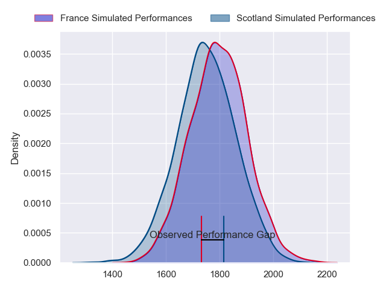
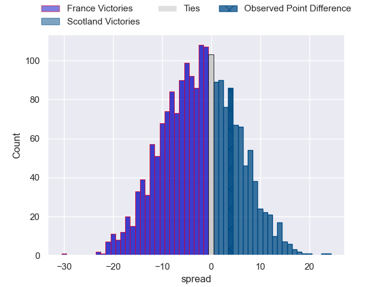
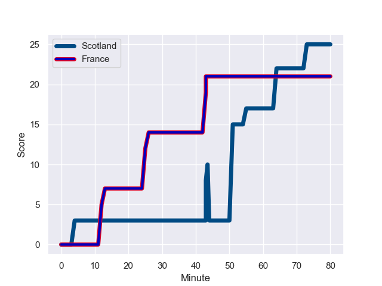
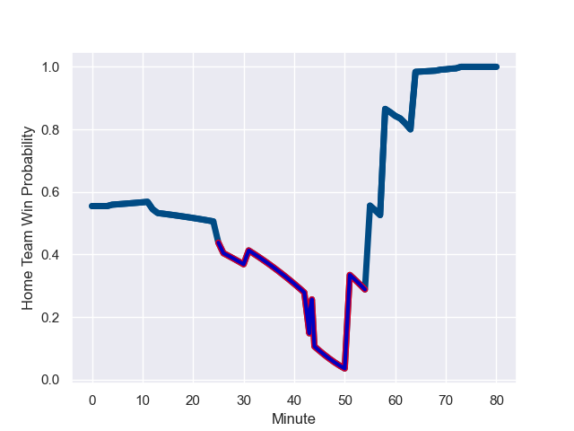

---  
layout: page  
title: France at Scotland; 21.0-25.0  
date: 2023-08-04 18:00:00 -0500  
categories: match review  
---
# France at Scotland; 21.0-25.0

# Club Level Predictions

The first set of predictions treats a club as the smallest object, as the club develops its members, organizes a gameplan, and deploys its players as needed for each match. This club model has a prediction of 0.446, which translates to predicting France to win by 2.0.

Each club has a rating and a rating deviation (simiar to a Glicko system), and expected performances can be generated. This allows for simulated matches and spreads like the ones below.
## Projected Performances

## Projected Spreads

## Projected Results

# Player Level Predictions - Version 1

Treating teams instead as an entity made up of the currently active players, I have ratings for each player in an altogether different system. These can be combined to form team ratings once teamsheets are announced, weighting starters a bit higher than the reserves. After the match is played, players can be weighted by their minutes on the field, allowing for an accurate measure of the team's composition. With these compiled team ratings, we can make predictions, measure inaccuracy, and update the individual player ratings.
## Prediction with Player Minutes: Scotland by 13.6

Scotland by 9.6 on a neutral field
## Prediction without Player Minutes: Scotland by 8.4

Scotland by 4.4 on a neutral pitch

## Scores over Time

## Win Probability over Time

There were 11 large changes in win probability in this match

|   Away Minutes | Away Player          |   Away elo |   Away Percentile |   Number |   Home Percentile |   Home elo | Home Player         |   Home Minutes |
|---------------:|:---------------------|-----------:|------------------:|---------:|------------------:|-----------:|:--------------------|---------------:|
|             55 | Jean-Baptiste Gros   |     106.99 |                95 |        1 |                25 |      72.61 | Pierre Schoeman     |             58 |
|             55 | Pierre Bourgarit     |      97.41 |                86 |        2 |                74 |      95.81 | Ewan Ashman         |             58 |
|             44 | Demba Bamba          |      93.42 |                85 |        3 |                56 |      89.07 | Zander Fagerson     |             80 |
|             80 | Cameron Woki         |      71.01 |                44 |        4 |                84 |     108.78 | Richie Gray         |             80 |
|             55 | Bastien Chalureau    |      93.64 |                80 |        5 |                89 |     114.52 | Grant Gilchrist     |             71 |
|             80 | Paul Boudehent       |      87.71 |                78 |        6 |                64 |      92.01 | Matt Fagerson       |             80 |
|             55 | Sekou Macalou        |     114.35 |                96 |        7 |                68 |      92.61 | Hamish Watson       |             58 |
|             80 | Yoan Tanga           |      84.31 |                69 |        8 |                 9 |      59.38 | Jack Dempsey        |             58 |
|             69 | Baptiste Couilloud   |      97.27 |                85 |        9 |                68 |      92.82 | Ben White           |             31 |
|             61 | Matthieu Jalibert    |      90.02 |                71 |       10 |                78 |     107.17 | Finn Russell        |             80 |
|             58 | Ethan Dumortier      |     100.12 |                88 |       11 |                57 |      90.91 | Duhan van der Merwe |             80 |
|             80 | Yoram Moefana        |      99.45 |                87 |       12 |                 6 |      55.47 | Sione Tuipulotu     |             58 |
|             80 | Emilien Gailleton    |      70.12 |                43 |       13 |                13 |      64.41 | Huw Jones           |             80 |
|             80 | Louis Bielle-Biarrey |     104.81 |                93 |       14 |                99 |     139.84 | Darcy Graham        |             80 |
|             80 | Brice Dulin          |      87.01 |                71 |       15 |                98 |     141.1  | Blair Kinghorn      |             80 |
|             25 | Peato Mauvaka        |      87.51 |               nan |       16 |               nan |      93.05 | Dave Cherry         |             22 |
|             25 | Reda Wardi           |      87.74 |               nan |       17 |                83 |      92.08 | Jamie Bhatti        |             22 |
|             36 | Sipili Falatea       |      87.98 |               nan |       18 |                98 |     121.34 | WP Nel              |             22 |
|             25 | Paul Willemse        |      88.24 |               nan |       19 |                96 |     121.44 | Scott Cummings      |              9 |
|             25 | Dylan Cretin         |      88.52 |               nan |       20 |                96 |     120.72 | Rory Darge          |             22 |
|             11 | Baptiste Serin       |      87.08 |               nan |       21 |                93 |     112.11 | George Horne        |             49 |
|             19 | Antoine Hastoy       |      86.88 |               nan |       22 |                61 |      83.97 | Cameron Redpath     |             22 |
|             22 | Arthur Vincent       |      87.29 |               nan |       23 |                40 |      76.12 | Ollie Smith         |              0 |

# Player Level Predictions - Version 2

Treating teams instead as an entity made up of the currently active players, I have ratings for each player in an altogether different system. These can be combined to form team ratings once teamsheets are announced, weighting starters a bit higher than the reserves. After the match is played, players can be weighted by their minutes on the field, allowing for an accurate measure of the team's composition. With these compiled team ratings, we can make predictions, measure inaccuracy, and update the individual player ratings.
## Prediction with Player Minutes: Scotland by 11.9

Scotland by 8.2 on a neutral field
## Prediction without Player Minutes: Scotland by 8.6

Scotland by 4.9 on a neutral pitch

|   Away Minutes | Away Player          |   Away elo |   Away variance |   Number |   Home variance |   Home elo | Home Player         |   Home Minutes |
|---------------:|:---------------------|-----------:|----------------:|---------:|----------------:|-----------:|:--------------------|---------------:|
|             55 | Jean-Baptiste Gros   |      88.07 |           50    |        1 |           50    |      52.11 | Pierre Schoeman     |             58 |
|             55 | Pierre Bourgarit     |      84.84 |           49.49 |        2 |           50    |      37.07 | Ewan Ashman         |             58 |
|             44 | Demba Bamba          |      46.65 |           50    |        3 |           50    |      46.65 | Zander Fagerson     |             80 |
|             80 | Cameron Woki         |      66.19 |           50    |        4 |           50    |      58.41 | Richie Gray         |             80 |
|             55 | Bastien Chalureau    |      67.37 |           50    |        5 |           50    |      89.27 | Grant Gilchrist     |             71 |
|             80 | Paul Boudehent       |      43    |           50    |        6 |           49.1  |      95.83 | Matt Fagerson       |             80 |
|             55 | Sekou Macalou        |      91.95 |           49.76 |        7 |           50    |      46.65 | Hamish Watson       |             58 |
|             80 | Yoan Tanga           |      46.65 |           50    |        8 |           50    |      30.9  | Jack Dempsey        |             58 |
|             69 | Baptiste Couilloud   |      46.65 |           50    |        9 |           50    |      46.65 | Ben White           |             31 |
|             61 | Matthieu Jalibert    |      46.65 |           50    |       10 |           48.47 |     123.13 | Finn Russell        |             80 |
|             58 | Ethan Dumortier      |      46.65 |           50    |       11 |           50    |      57.36 | Duhan van der Merwe |             80 |
|             80 | Yoram Moefana        |      46.65 |           50    |       12 |           50    |      32.95 | Sione Tuipulotu     |             58 |
|             80 | Emilien Gailleton    |      46.65 |           50    |       13 |           50    |      47.19 | Huw Jones           |             80 |
|             80 | Louis Bielle-Biarrey |      66.01 |           49.74 |       14 |           49.89 |      51.29 | Darcy Graham        |             80 |
|             80 | Brice Dulin          |      46.65 |           50    |       15 |           49.99 |     128.69 | Blair Kinghorn      |             80 |
|             25 | Peato Mauvaka        |      46.65 |           50    |       16 |           50    |      46.65 | Dave Cherry         |             22 |
|             25 | Reda Wardi           |      46.65 |           50    |       17 |           49.95 |      83.97 | Jamie Bhatti        |             22 |
|             36 | Sipili Falatea       |      46.65 |           50    |       18 |           50    |      91.47 | WP Nel              |             22 |
|             25 | Paul Willemse        |      46.65 |           50    |       19 |           49.9  |     111.11 | Scott Cummings      |              9 |
|             25 | Dylan Cretin         |      46.65 |           50    |       20 |           49.88 |      55.69 | Rory Darge          |             22 |
|             11 | Baptiste Serin       |      46.65 |           50    |       21 |           50    |     129.11 | George Horne        |             49 |
|             19 | Antoine Hastoy       |      46.65 |           50    |       22 |           49.96 |      54.96 | Cameron Redpath     |             22 |
|             22 | Arthur Vincent       |      46.65 |           50    |       23 |           49.88 |      73.12 | Ollie Smith         |              0 |

