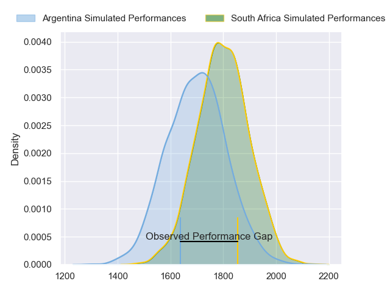
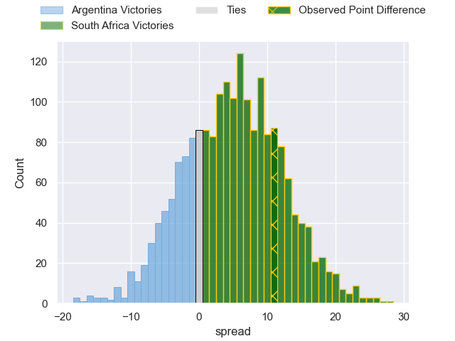
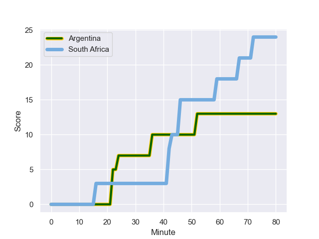
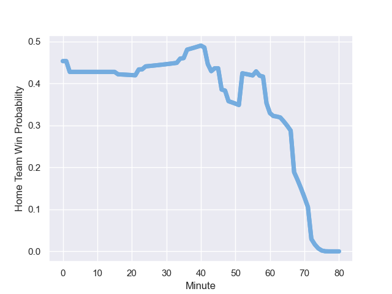

---  
layout: page  
title: Argentina at South Africa; 24.0-13.0  
date: 2023-08-04 18:00:00 -0500  
categories: match review  
---
# Argentina at South Africa; 24.0-13.0

# Club Level Predictions

The first set of predictions treats a club as the smallest object, as the club develops its members, organizes a gameplan, and deploys its players as needed for each match. This club model has a prediction of 0.631, which translates to predicting South Africa to win by 5.0.

Each club has a rating and a rating deviation (simiar to a Glicko system), and expected performances can be generated. This allows for simulated matches and spreads like the ones below.
## Projected Performances

## Projected Spreads

## Projected Results

# Player Level Predictions - Version 1

Treating teams instead as an entity made up of the currently active players, I have ratings for each player in an altogether different system. These can be combined to form team ratings once teamsheets are announced, weighting starters a bit higher than the reserves. After the match is played, players can be weighted by their minutes on the field, allowing for an accurate measure of the team's composition. With these compiled team ratings, we can make predictions, measure inaccuracy, and update the individual player ratings.
## Prediction with Player Minutes: South Africa by 4.1

South Africa by 8.1 on a neutral field
## Prediction without Player Minutes: South Africa by 2.0

South Africa by 6.0 on a neutral pitch

## Scores over Time

## Win Probability over Time

There were 8 large changes in win probability in this match

|   Away Minutes | Away Player        |   Away elo |   Away Percentile |   Number |   Home Percentile |   Home elo | Home Player            |   Home Minutes |
|---------------:|:-------------------|-----------:|------------------:|---------:|------------------:|-----------:|:-----------------------|---------------:|
|             54 | Trevor Nyakane     |     109.26 |                95 |        1 |                80 |      97.63 | Thomas Gallo           |             60 |
|             52 | Bongi Mbonambi     |     111.16 |                95 |        2 |                91 |     111.1  | Julian Montoya         |             72 |
|             52 | Thomas du Toit     |      91.53 |                82 |        3 |                96 |     118.91 | Francisco Gomez Kodela |             60 |
|             80 | Jean Kleyn         |      98.98 |                86 |        4 |                55 |      85.26 | Pedro Rubiolo          |             34 |
|             48 | Marvin Orie        |      75.43 |                45 |        5 |                97 |     133.52 | Tomas Lavanini         |             80 |
|             80 | Deon Fourie        |     123.55 |                98 |        6 |                96 |     123.96 | Pablo Matera           |             80 |
|             80 | Franco Mostert     |     124.66 |                98 |        7 |                69 |      91.29 | Santiago Grondona      |             52 |
|             57 | Jasper Wiese       |      98.6  |                85 |        8 |                71 |      96.36 | Juan Martin Gonzalez   |             80 |
|             56 | Cobus Reinach      |     115.56 |                96 |        9 |                83 |     105.3  | Gonzalo Bertranou      |             72 |
|             80 | Manie Libbok       |      90.78 |                75 |       10 |                98 |     136.97 | Santiago Carreras      |             80 |
|             80 | Makazole Mapimpi   |     114.1  |                96 |       11 |                26 |      72.02 | Santiago Cordero       |             80 |
|             80 | Andre Esterhuizen  |     135.84 |                99 |       12 |                93 |     112.59 | Santiago Chocobares    |              2 |
|             41 | Lukhanyo Am        |      99.52 |                84 |       13 |                40 |      80.15 | Lucio Cinti            |             80 |
|             80 | Canan Moodie       |     106.13 |                93 |       14 |                34 |      76.75 | Emiliano Boffelli      |             80 |
|             80 | Damian Willemse    |     102.02 |                85 |       15 |                70 |      96.51 | Martin Bogado          |             63 |
|             28 | Joseph Dweba       |     106.07 |                89 |       16 |                95 |     116.25 | Agustin Creevy         |              8 |
|             26 | Gerhard Steenekamp |     100.44 |               nan |       17 |                82 |      97.58 | Joel Sclavi            |             20 |
|             28 | Vincent Koch       |      59.22 |                15 |       18 |                80 |      95.11 | Eduardo Bello          |             20 |
|             32 | Jean-Luc du Preez  |     105.55 |                87 |       19 |               nan |      96.73 | Guido Petti            |             46 |
|             23 | Evan Roos          |     109.04 |                92 |       20 |                93 |     113.25 | Facundo Isa            |             28 |
|             24 | Herschel Jantjies  |     100.67 |               nan |       21 |                66 |      89.21 | Lautaro Bazan Velez    |              8 |
|             39 | Jesse Kriel        |     108.77 |                90 |       22 |                83 |     105.21 | Tomas Albornoz         |             17 |
|              0 | Kurt-Lee Arendse   |     139.52 |                99 |       23 |                40 |      79.77 | Matias Moroni          |             78 |

# Player Level Predictions - Version 2

Treating teams instead as an entity made up of the currently active players, I have ratings for each player in an altogether different system. These can be combined to form team ratings once teamsheets are announced, weighting starters a bit higher than the reserves. After the match is played, players can be weighted by their minutes on the field, allowing for an accurate measure of the team's composition. With these compiled team ratings, we can make predictions, measure inaccuracy, and update the individual player ratings.
## Prediction with Player Minutes: South Africa by 10.2

South Africa by 13.7 on a neutral field
## Prediction without Player Minutes: South Africa by 11.9

South Africa by 15.4 on a neutral pitch

|   Away Minutes | Away Player        |   Away elo |   Away variance |   Number |   Home variance |   Home elo | Home Player            |   Home Minutes |
|---------------:|:-------------------|-----------:|----------------:|---------:|----------------:|-----------:|:-----------------------|---------------:|
|             54 | Trevor Nyakane     |      56.57 |           47.04 |        1 |           47.32 |      54.92 | Thomas Gallo           |             60 |
|             52 | Bongi Mbonambi     |      92.65 |           49.71 |        2 |           45.77 |      69.26 | Julian Montoya         |             72 |
|             52 | Thomas du Toit     |      91.18 |           49.9  |        3 |           49.26 |      73.77 | Francisco Gomez Kodela |             60 |
|             80 | Jean Kleyn         |     102.17 |           49.31 |        4 |           49.94 |      37.2  | Pedro Rubiolo          |             34 |
|             48 | Marvin Orie        |      71.36 |           49.84 |        5 |           49.69 |      70.41 | Tomas Lavanini         |             80 |
|             80 | Deon Fourie        |     119.85 |           49.96 |        6 |           49.65 |     126.38 | Pablo Matera           |             80 |
|             80 | Franco Mostert     |     104.75 |           49.89 |        7 |           49.81 |      74.92 | Santiago Grondona      |             52 |
|             57 | Jasper Wiese       |      76    |           44.44 |        8 |           48.92 |      77.28 | Juan Martin Gonzalez   |             80 |
|             56 | Cobus Reinach      |      86.14 |           49.83 |        9 |           49.71 |      58.65 | Gonzalo Bertranou      |             72 |
|             80 | Manie Libbok       |      64.76 |           48.73 |       10 |           45.05 |      77.09 | Santiago Carreras      |             80 |
|             80 | Makazole Mapimpi   |     106.45 |           48.4  |       11 |           50    |      46.65 | Santiago Cordero       |             80 |
|             80 | Andre Esterhuizen  |     110.9  |           47.73 |       12 |           48.43 |      41.28 | Santiago Chocobares    |              2 |
|             41 | Lukhanyo Am        |      66.5  |           49.57 |       13 |           49.65 |      46.63 | Lucio Cinti            |             80 |
|             80 | Canan Moodie       |     105.47 |           49.79 |       14 |           49.7  |      49.52 | Emiliano Boffelli      |             80 |
|             80 | Damian Willemse    |      93.36 |           48.87 |       15 |           50    |      46.65 | Martin Bogado          |             63 |
|             28 | Joseph Dweba       |      53.71 |           49.91 |       16 |           49.96 |      94.25 | Agustin Creevy         |              8 |
|             26 | Gerhard Steenekamp |      46.65 |           50    |       17 |           48.04 |      57.05 | Joel Sclavi            |             20 |
|             28 | Vincent Koch       |      44.23 |           47.55 |       18 |           49.91 |      13.94 | Eduardo Bello          |             20 |
|             32 | Jean-Luc du Preez  |     123.55 |           50    |       19 |           50    |      46.65 | Guido Petti            |             46 |
|             23 | Evan Roos          |      71.25 |           49.96 |       20 |           46.27 |      84.37 | Facundo Isa            |             28 |
|             24 | Herschel Jantjies  |      46.65 |           50    |       21 |           49.94 |      47.7  | Lautaro Bazan Velez    |              8 |
|             39 | Jesse Kriel        |     135.56 |           49.62 |       22 |           49.99 |      63.3  | Tomas Albornoz         |             17 |
|              0 | Kurt-Lee Arendse   |     109.44 |           49.76 |       23 |           38.77 |     118.53 | Matias Moroni          |             78 |

