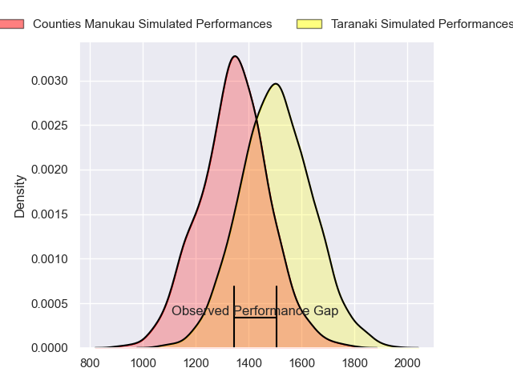
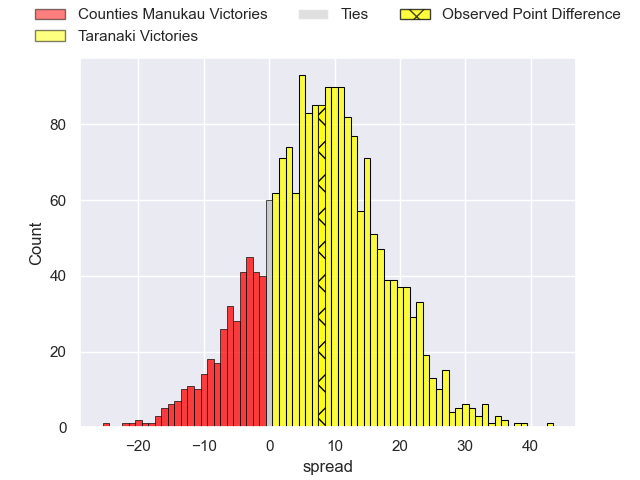
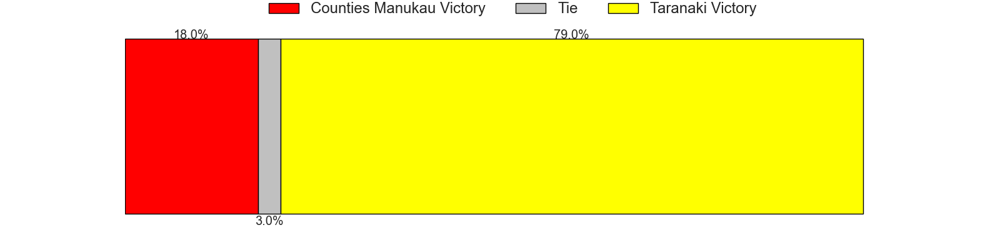
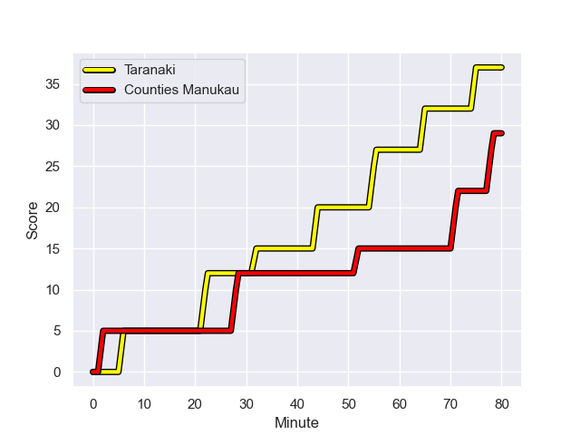
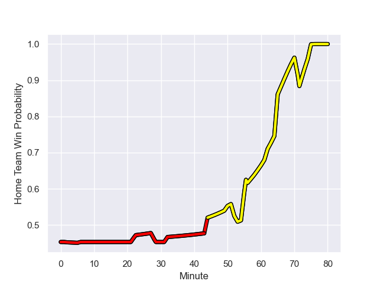

---  
layout: page  
title: Counties Manukau at Taranaki; 29-37  
date: 2023-08-04 18:00:00 -0500  
categories: match review  
---
# Counties Manukau at Taranaki; 29-37

# Club Level Predictions

The first set of predictions treats a club as the smallest object, as the club develops its members, organizes a gameplan, and deploys its players as needed for each match. This club model has a prediction of 0.7, which translates to predicting Taranaki to win by 7.9.

Each club has a rating and a rating deviation (simiar to a Glicko system), and expected performances can be generated. This allows for simulated matches and spreads like the ones below.
## Projected Performances

## Projected Spreads

## Projected Results

# Player Level Predictions - Version 1

Treating teams instead as an entity made up of the currently active players, I have ratings for each player in an altogether different system. These can be combined to form team ratings once teamsheets are announced, weighting starters a bit higher than the reserves. After the match is played, players can be weighted by their minutes on the field, allowing for an accurate measure of the team's composition. With these compiled team ratings, we can make predictions, measure inaccuracy, and update the individual player ratings.
## Prediction with Player Minutes: Counties Manukau by 4.2

Counties Manukau by 8.2 on a neutral field
## Prediction without Player Minutes: Counties Manukau by 3.9

Counties Manukau by 7.9 on a neutral pitch

## Scores over Time

## Win Probability over Time

There were 11 large changes in win probability in this match

|   Away Minutes | Away Player        |   Away elo |   Away Percentile |   Number |   Home Percentile |   Home elo | Home Player                   |   Home Minutes |
|---------------:|:-------------------|-----------:|------------------:|---------:|------------------:|-----------:|:------------------------------|---------------:|
|             67 | Kauvaka Kaivelata  |      79.73 |                38 |        1 |                63 |      81.53 | Jared Proffit                 |             58 |
|             60 | Ioane Moananu      |      83.42 |                49 |        2 |                92 |     104.41 | Bradley Slater                |             53 |
|             50 | Salesi Tuifua      |      81.65 |                45 |        3 |                43 |      72.57 | Michael Bent                  |             53 |
|             80 | Jimmy Tupou        |      71.96 |                22 |        4 |                23 |      62.11 | Jesse Parete                  |             50 |
|             58 | James Thompson     |      80.44 |                40 |        5 |                69 |      84.27 | Heiden Bedwell-Curtis         |             80 |
|             53 | Ma'amai Vaipulu    |      82.44 |                49 |        6 |                54 |      74.45 | Hemopo Cunningham             |             80 |
|             80 | Sean Reidy         |      82.9  |                44 |        7 |                 9 |      49.57 | Tom Florence                  |             62 |
|             80 | Hoskins Sotutu     |     115.07 |                95 |        8 |                46 |      72.74 | Kaylum Boshier                |             80 |
|             72 | Liam Daniela       |      80.19 |                38 |        9 |                43 |      72.91 | Logan Crowley                 |             53 |
|             80 | Riley Hohepa       |      81.31 |                37 |       10 |                62 |      82.79 | Jayson Potroz                 |             80 |
|             80 | Peniasi Malimali   |      81    |                39 |       11 |                94 |     110.63 | Kini Naholo                   |             56 |
|             58 | AJ Alatimu         |      65.71 |                18 |       12 |                10 |      49.9  | Teihorangi Walden             |             56 |
|             80 | Nikolai Foliaki    |      78.96 |                35 |       13 |                50 |      73.94 | Meihana Grindlay              |             80 |
|             63 | Josh Gray          |      79.52 |                38 |       14 |                49 |      73.71 | Jacob Ratumaitavuki-Kneepkens |             80 |
|             80 | Etene Nanai-Seturo |      92.05 |                58 |       15 |                85 |     104.18 | Stephen Perofeta              |             80 |
|             30 | Suetena Asomua     |      80.71 |               nan |       16 |                40 |      73.49 | Millenium Sanerivi            |             30 |
|             27 | Sam Tuifua         |      82.03 |               nan |       17 |                62 |      84.42 | Ricky Riccitelli              |             27 |
|             22 | Tevita Ofa         |      79.32 |               nan |       18 |               nan |      73.49 | Adam Lennox                   |             27 |
|             22 | Alex McRobbie      |      60.04 |                16 |       19 |                18 |      63.91 | Kyle Stewart                  |             27 |
|             20 | Ian West-Stevens   |      84.02 |               nan |       20 |               nan |      73.1  | Matty McKenzie                |             24 |
|             17 | Toni Pulu          |     125.84 |                97 |       21 |                27 |      67.63 | Vereniki Tikoisolomone        |             24 |
|             13 | Siate Taupaki      |      79.14 |               nan |       22 |               nan |      74.19 | Mitch O'Neill                 |             22 |
|              8 | Kanavale Helu      |      79.96 |               nan |       23 |               nan |      73.29 | Arese Poliko                  |             18 |

# Player Level Predictions - Version 2

Treating teams instead as an entity made up of the currently active players, I have ratings for each player in an altogether different system. These can be combined to form team ratings once teamsheets are announced, weighting starters a bit higher than the reserves. After the match is played, players can be weighted by their minutes on the field, allowing for an accurate measure of the team's composition. With these compiled team ratings, we can make predictions, measure inaccuracy, and update the individual player ratings.
## Prediction with Player Minutes: Taranaki by 5.6

Taranaki by 2.2 on a neutral field
## Prediction without Player Minutes: Taranaki by 6.0

Taranaki by 2.6 on a neutral pitch

|   Away Minutes | Away Player        |   Away elo |   Away variance |   Number |   Home variance |   Home elo | Home Player                   |   Home Minutes |
|---------------:|:-------------------|-----------:|----------------:|---------:|----------------:|-----------:|:------------------------------|---------------:|
|             67 | Kauvaka Kaivelata  |      46.65 |              50 |        1 |              50 |      46.49 | Jared Proffit                 |             58 |
|             60 | Ioane Moananu      |      46.65 |              50 |        2 |              50 |      72.54 | Bradley Slater                |             53 |
|             50 | Salesi Tuifua      |      46.65 |              50 |        3 |              50 |      46.65 | Michael Bent                  |             53 |
|             80 | Jimmy Tupou        |      46.65 |              50 |        4 |              50 |      46.65 | Jesse Parete                  |             50 |
|             58 | James Thompson     |      46.65 |              50 |        5 |              50 |      46.65 | Heiden Bedwell-Curtis         |             80 |
|             53 | Ma'amai Vaipulu    |      46.65 |              50 |        6 |              50 |      46.65 | Hemopo Cunningham             |             80 |
|             80 | Sean Reidy         |      46.65 |              50 |        7 |              50 |      46.65 | Tom Florence                  |             62 |
|             80 | Hoskins Sotutu     |      90.84 |              50 |        8 |              50 |      46.65 | Kaylum Boshier                |             80 |
|             72 | Liam Daniela       |      46.65 |              50 |        9 |              50 |      46.65 | Logan Crowley                 |             53 |
|             80 | Riley Hohepa       |      46.65 |              50 |       10 |              50 |      46.65 | Jayson Potroz                 |             80 |
|             80 | Peniasi Malimali   |      46.65 |              50 |       11 |              50 |      85.92 | Kini Naholo                   |             56 |
|             58 | AJ Alatimu         |      46.65 |              50 |       12 |              50 |      46.65 | Teihorangi Walden             |             56 |
|             80 | Nikolai Foliaki    |      46.65 |              50 |       13 |              50 |      46.65 | Meihana Grindlay              |             80 |
|             63 | Josh Gray          |      46.65 |              50 |       14 |              50 |      46.65 | Jacob Ratumaitavuki-Kneepkens |             80 |
|             80 | Etene Nanai-Seturo |      39.38 |              50 |       15 |              50 |      95.46 | Stephen Perofeta              |             80 |
|             30 | Suetena Asomua     |      46.65 |              50 |       16 |              50 |      46.65 | Millenium Sanerivi            |             30 |
|             27 | Sam Tuifua         |      46.65 |              50 |       17 |              50 |      44.59 | Ricky Riccitelli              |             27 |
|             22 | Tevita Ofa         |      46.65 |              50 |       18 |              50 |      46.65 | Adam Lennox                   |             27 |
|             22 | Alex McRobbie      |      22.63 |              50 |       19 |              50 |      46.65 | Kyle Stewart                  |             27 |
|             20 | Ian West-Stevens   |      46.65 |              50 |       20 |              50 |      46.65 | Matty McKenzie                |             24 |
|             17 | Toni Pulu          |      85.27 |              50 |       21 |              50 |      46.65 | Vereniki Tikoisolomone        |             24 |
|             13 | Siate Taupaki      |      46.65 |              50 |       22 |              50 |      46.65 | Mitch O'Neill                 |             22 |
|              8 | Kanavale Helu      |      46.65 |              50 |       23 |              50 |      46.65 | Arese Poliko                  |             18 |

