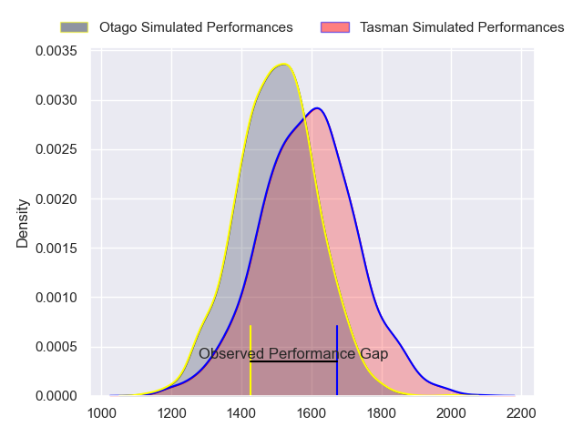
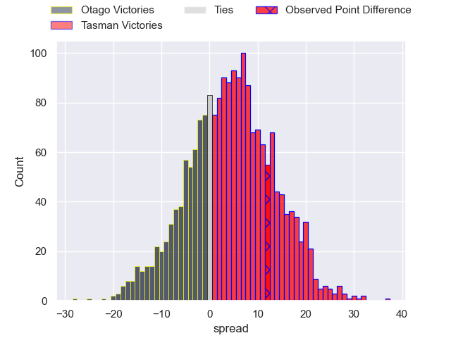
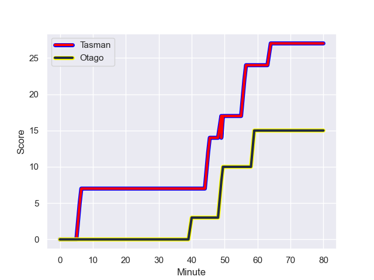
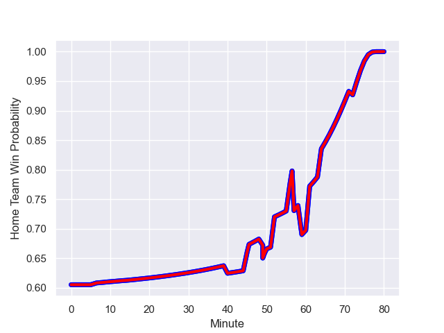

---  
layout: page  
title: Otago at Tasman; 15-27  
date: 2023-08-04 18:00:00 -0500  
categories: match review  
---
# Otago at Tasman; 15-27

# Club Level Predictions

The first set of predictions treats a club as the smallest object, as the club develops its members, organizes a gameplan, and deploys its players as needed for each match. This club model has a prediction of 0.618, which translates to predicting Tasman to win by 4.4.

Each club has a rating and a rating deviation (simiar to a Glicko system), and expected performances can be generated. This allows for simulated matches and spreads like the ones below.
## Projected Performances

## Projected Spreads

## Projected Results

# Player Level Predictions - Version 1

Treating teams instead as an entity made up of the currently active players, I have ratings for each player in an altogether different system. These can be combined to form team ratings once teamsheets are announced, weighting starters a bit higher than the reserves. After the match is played, players can be weighted by their minutes on the field, allowing for an accurate measure of the team's composition. With these compiled team ratings, we can make predictions, measure inaccuracy, and update the individual player ratings.
## Prediction with Player Minutes: Tasman by 22.5

Tasman by 18.5 on a neutral field
## Prediction without Player Minutes: Tasman by 24.5

Tasman by 20.5 on a neutral pitch

## Scores over Time

## Win Probability over Time

There were 7 large changes in win probability in this match

|   Away Minutes | Away Player                |   Away elo |   Away Percentile |   Number |   Home Percentile |   Home elo | Home Player           |   Home Minutes |
|---------------:|:---------------------------|-----------:|------------------:|---------:|------------------:|-----------:|:----------------------|---------------:|
|             56 | Rohan Wingham              |      72.01 |                34 |        1 |                83 |      94.33 | Kershawl Sykes-Martin |             57 |
|             52 | Henry Bell                 |      68.86 |                31 |        2 |                65 |      85.88 | Feleti Kaitu'u        |             57 |
|             52 | Saula Ma'u                 |      71.81 |                32 |        3 |                24 |      68    | Sam Matenga           |             72 |
|             61 | Fabian Holland             |      73.88 |                47 |        4 |                43 |      77.3  | Quinten Strange       |             80 |
|             80 | Will Tucker                |      71.27 |                32 |        5 |                98 |     132.31 | Pari Pari Parkinson   |             52 |
|             80 | Josh Dickson               |      72.69 |                38 |        6 |                61 |      83.99 | Max Hicks             |             80 |
|             80 | Sean Withy                 |      74.64 |                46 |        7 |                29 |      68.31 | Anton Segner          |             80 |
|             56 | Sam Fischli                |      70.01 |                27 |        8 |                 6 |      57.04 | Hugh Renton           |             78 |
|             56 | James Arscott              |      72.45 |                37 |        9 |                60 |      90.23 | Louie Chapman         |             50 |
|             80 | Sam Gilbert                |      82.38 |                47 |       10 |                50 |      84.84 | Taine Robinson        |             80 |
|             80 | Jona Nareki                |      91.27 |                70 |       11 |                75 |      95.85 | Macca Springer        |             80 |
|             80 | Jake Te Hiwi               |      72.22 |                37 |       12 |                66 |      93.45 | David Havili          |             40 |
|             80 | Josh Whaanga               |      72.95 |                38 |       13 |                96 |     119.75 | Levi Aumua            |             80 |
|             14 | Waisake Naholo             |      71.11 |                37 |       14 |                51 |      81.07 | Timoci Tavatavanawai  |             80 |
|             80 | Finn Hurley                |      73.54 |                38 |       15 |                53 |      84.2  | Tom Marshall          |              9 |
|             28 | Jermaine Ainsley           |      87.99 |                67 |       16 |               nan |      84.62 | Tim O'Malley          |             71 |
|             28 | Ricky Jackson              |      71.62 |               nan |       17 |                83 |     101.86 | Alex Nankivell        |             40 |
|             24 | Kieran McClea              |      61.1  |                18 |       18 |                88 |     102.09 | Noah Hotham           |             30 |
|             24 | Ben Lopas                  |      74.66 |               nan |       19 |                64 |      84.4  | Tim Sail              |             28 |
|             24 | Christian Lio-Willie       |      92.47 |                61 |       20 |               nan |      85.08 | Quentin MacDonald     |             23 |
|             19 | Harry Taylor               |      73.23 |               nan |       21 |               nan |      85.33 | Ryan Cameron Coxon    |             23 |
|             38 | Thomas Carlos Umaga-Jensen |      71.44 |                26 |       22 |               nan |      85.59 | Atunaisa Moli         |              8 |
|             28 | Caleb Leef                 |      74.25 |               nan |       23 |               nan |      84.01 | Seta Baker            |              2 |

# Player Level Predictions - Version 2

Treating teams instead as an entity made up of the currently active players, I have ratings for each player in an altogether different system. These can be combined to form team ratings once teamsheets are announced, weighting starters a bit higher than the reserves. After the match is played, players can be weighted by their minutes on the field, allowing for an accurate measure of the team's composition. With these compiled team ratings, we can make predictions, measure inaccuracy, and update the individual player ratings.
## Prediction with Player Minutes: Tasman by 7.4

Tasman by 4.1 on a neutral field
## Prediction without Player Minutes: Tasman by 7.2

Tasman by 3.9 on a neutral pitch

|   Away Minutes | Away Player                |   Away elo |   Away variance |   Number |   Home variance |   Home elo | Home Player           |   Home Minutes |
|---------------:|:---------------------------|-----------:|----------------:|---------:|----------------:|-----------:|:----------------------|---------------:|
|             56 | Rohan Wingham              |      46.65 |              50 |        1 |              50 |      59.71 | Kershawl Sykes-Martin |             57 |
|             52 | Henry Bell                 |      46.65 |              50 |        2 |              50 |      46.65 | Feleti Kaitu'u        |             57 |
|             52 | Saula Ma'u                 |      46.65 |              50 |        3 |              50 |      46.65 | Sam Matenga           |             72 |
|             61 | Fabian Holland             |      46.65 |              50 |        4 |              50 |      77.92 | Quinten Strange       |             80 |
|             80 | Will Tucker                |      46.65 |              50 |        5 |              50 |      99.22 | Pari Pari Parkinson   |             52 |
|             80 | Josh Dickson               |      46.65 |              50 |        6 |              50 |      53.07 | Max Hicks             |             80 |
|             80 | Sean Withy                 |      47.24 |              50 |        7 |              50 |      49.48 | Anton Segner          |             80 |
|             56 | Sam Fischli                |      46.65 |              50 |        8 |              50 |      27.11 | Hugh Renton           |             78 |
|             56 | James Arscott              |      46.65 |              50 |        9 |              50 |      46.65 | Louie Chapman         |             50 |
|             80 | Sam Gilbert                |      50.17 |              50 |       10 |              50 |      46.65 | Taine Robinson        |             80 |
|             80 | Jona Nareki                |      74.05 |              50 |       11 |              50 |      46.65 | Macca Springer        |             80 |
|             80 | Jake Te Hiwi               |      46.65 |              50 |       12 |              50 |      46.65 | David Havili          |             40 |
|             80 | Josh Whaanga               |      46.65 |              50 |       13 |              50 |      78.16 | Levi Aumua            |             80 |
|             14 | Waisake Naholo             |      46.65 |              50 |       14 |              50 |      58.8  | Timoci Tavatavanawai  |             80 |
|             80 | Finn Hurley                |      46.65 |              50 |       15 |              50 |      46.65 | Tom Marshall          |              9 |
|             28 | Jermaine Ainsley           |      51.38 |              50 |       16 |              50 |      46.65 | Tim O'Malley          |             71 |
|             28 | Ricky Jackson              |      46.65 |              50 |       17 |              50 |     101.22 | Alex Nankivell        |             40 |
|             24 | Kieran McClea              |      54.33 |              50 |       18 |              50 |      60.21 | Noah Hotham           |             30 |
|             24 | Ben Lopas                  |      46.65 |              50 |       19 |              50 |      46.65 | Tim Sail              |             28 |
|             24 | Christian Lio-Willie       |      66.99 |              50 |       20 |              50 |      46.65 | Quentin MacDonald     |             23 |
|             19 | Harry Taylor               |      46.65 |              50 |       21 |              50 |      46.65 | Ryan Cameron Coxon    |             23 |
|             38 | Thomas Carlos Umaga-Jensen |      46.65 |              50 |       22 |              50 |      46.65 | Atunaisa Moli         |              8 |
|             28 | Caleb Leef                 |      46.65 |              50 |       23 |              50 |      46.65 | Seta Baker            |              2 |

