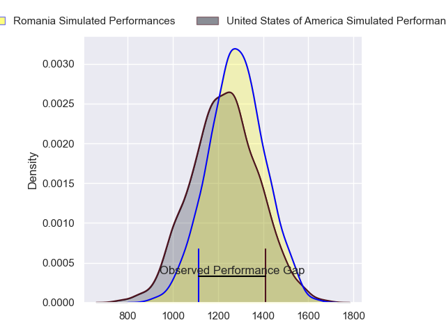
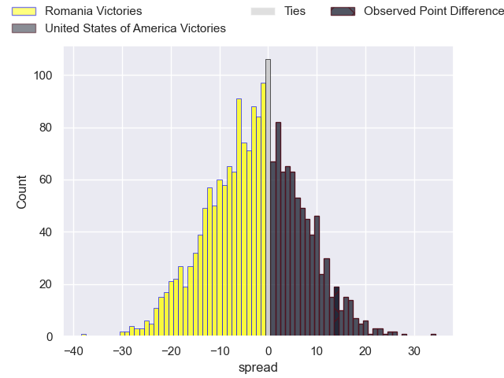
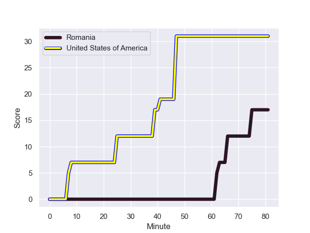
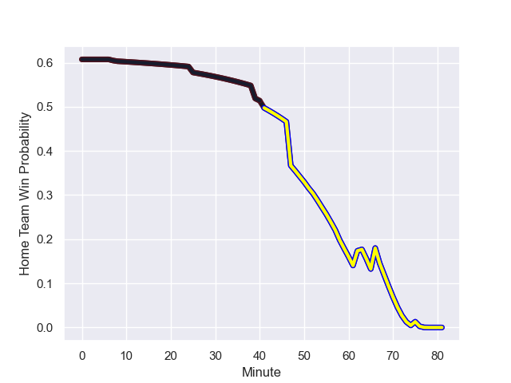

---  
layout: page  
title: Romania at United States of America; 31.0-17.0  
date: 2023-08-04 18:00:00 -0500  
categories: match review  
---
# Romania at United States of America; 31.0-17.0

# Club Level Predictions

The first set of predictions treats a club as the smallest object, as the club develops its members, organizes a gameplan, and deploys its players as needed for each match. This club model has a prediction of 0.431, which translates to predicting Romania to win by 2.6.

Each club has a rating and a rating deviation (simiar to a Glicko system), and expected performances can be generated. This allows for simulated matches and spreads like the ones below.
## Projected Performances

## Projected Spreads

## Projected Results

# Player Level Predictions - Version 1

Treating teams instead as an entity made up of the currently active players, I have ratings for each player in an altogether different system. These can be combined to form team ratings once teamsheets are announced, weighting starters a bit higher than the reserves. After the match is played, players can be weighted by their minutes on the field, allowing for an accurate measure of the team's composition. With these compiled team ratings, we can make predictions, measure inaccuracy, and update the individual player ratings.
## Prediction with Player Minutes: Romania by 23.0

Romania by 19.0 on a neutral field
## Prediction without Player Minutes: Romania by 23.3

Romania by 19.3 on a neutral pitch

## Scores over Time

## Win Probability over Time

There were 7 large changes in win probability in this match

|   Away Minutes | Away Player      |   Away elo |   Away Percentile |   Number |   Home Percentile |   Home elo | Home Player       |   Home Minutes |
|---------------:|:-----------------|-----------:|------------------:|---------:|------------------:|-----------:|:------------------|---------------:|
|             64 | Jack Iscaro      |      65.52 |                37 |        1 |                26 |      76.78 | Alexandru Savin   |             64 |
|             67 | Dylan Fawsitt    |      44.91 |                10 |        2 |                30 |      76.06 | Ovidiu Cojocaru   |             55 |
|             81 | Paul Mullen      |      62.98 |                36 |        3 |                50 |      87.39 | Gheorghe Gajion   |             58 |
|             81 | Cam Dolan        |      64.67 |                39 |        4 |                23 |      76.53 | Marius Iftimiciuc |             81 |
|             67 | Greg Peterson    |      62.86 |                31 |        5 |                26 |      75.11 | Andrei Mahu       |             52 |
|             81 | Sam Golla        |      59.63 |                30 |        6 |                26 |      77.06 | Mihai Macovei     |             73 |
|             81 | Paddy Ryan       |      55.1  |                23 |        7 |                29 |      77.36 | Cristi Boboc      |             60 |
|             67 | Luke White       |      63.13 |                34 |        8 |                25 |      77.68 | Cristian Chirica  |             81 |
|             67 | Nick McCarthy    |      80.46 |                66 |        9 |                33 |      75.85 | Alin Conache      |             40 |
|             76 | Luke Carty       |      57.8  |                23 |       10 |                29 |      75.48 | Gabriel Pop       |             41 |
|             81 | Nate Augspurger  |      66.25 |                43 |       11 |                24 |      75.65 | Taliauli Sikuea   |             81 |
|             64 | Tommaso Boni     |      63.01 |                32 |       12 |                22 |      75.46 | Tevita Manumua    |             81 |
|             81 | Mika Kruse       |      71.17 |                53 |       13 |                31 |      80.6  | Jason Tomane      |             74 |
|             81 | Christian Dyer   |      71.45 |                54 |       14 |                24 |      76.29 | Marius Simionescu |             81 |
|             81 | Mitch Wilson     |      84.7  |                74 |       15 |                30 |      81.42 | Hinckley Vaovasa  |             81 |
|             14 | Joe Taufete'e    |      63.9  |               nan |       16 |               nan |      78.03 | Florin Bardasu    |             26 |
|             17 | Jake Turnbull    |      63.17 |               nan |       17 |               nan |      78.43 | Iulian Hartig     |             25 |
|              0 | Takaji Young Yen |      63.51 |               nan |       18 |               nan |      78.86 | Alex Gordas       |             23 |
|             14 | Nate Brakeley    |      63.33 |               nan |       19 |               nan |      79.36 | Stefan Iancu      |             29 |
|             14 | Thomas Tu’avao   |      63.7  |               nan |       20 |               nan |      79.93 | Vlad Neculau      |             21 |
|             14 | Ruben de Haas    |      85.42 |                60 |       21 |               nan |      75.28 | Florin Surugiu    |             41 |
|              5 | Chris Mattina    |      75.72 |               nan |       22 |               nan |      75.65 | Mihai Muresan     |             41 |
|             17 | Tavite Lopeti    |      62.72 |               nan |       23 |                82 |     104.29 | Ionel Melinte     |              7 |

# Player Level Predictions - Version 2

Treating teams instead as an entity made up of the currently active players, I have ratings for each player in an altogether different system. These can be combined to form team ratings once teamsheets are announced, weighting starters a bit higher than the reserves. After the match is played, players can be weighted by their minutes on the field, allowing for an accurate measure of the team's composition. With these compiled team ratings, we can make predictions, measure inaccuracy, and update the individual player ratings.
## Prediction with Player Minutes: Romania by 3.5

Romania by 0.1 on a neutral field
## Prediction without Player Minutes: Romania by 3.5

Romania by 0.2 on a neutral pitch

|   Away Minutes | Away Player      |   Away elo |   Away variance |   Number |   Home variance |   Home elo | Home Player       |   Home Minutes |
|---------------:|:-----------------|-----------:|----------------:|---------:|----------------:|-----------:|:------------------|---------------:|
|             64 | Jack Iscaro      |      46.65 |              50 |        1 |              50 |      46.65 | Alexandru Savin   |             64 |
|             67 | Dylan Fawsitt    |      46.65 |              50 |        2 |              50 |      46.65 | Ovidiu Cojocaru   |             55 |
|             81 | Paul Mullen      |      46.65 |              50 |        3 |              50 |      46.65 | Gheorghe Gajion   |             58 |
|             81 | Cam Dolan        |      46.65 |              50 |        4 |              50 |      46.65 | Marius Iftimiciuc |             81 |
|             67 | Greg Peterson    |      46.65 |              50 |        5 |              50 |      46.65 | Andrei Mahu       |             52 |
|             81 | Sam Golla        |      46.65 |              50 |        6 |              50 |      46.65 | Mihai Macovei     |             73 |
|             81 | Paddy Ryan       |      46.65 |              50 |        7 |              50 |      46.65 | Cristi Boboc      |             60 |
|             67 | Luke White       |      46.65 |              50 |        8 |              50 |      46.65 | Cristian Chirica  |             81 |
|             67 | Nick McCarthy    |      46.65 |              50 |        9 |              50 |      46.65 | Alin Conache      |             40 |
|             76 | Luke Carty       |      46.65 |              50 |       10 |              50 |      46.65 | Gabriel Pop       |             41 |
|             81 | Nate Augspurger  |      46.65 |              50 |       11 |              50 |      46.65 | Taliauli Sikuea   |             81 |
|             64 | Tommaso Boni     |      46.65 |              50 |       12 |              50 |      46.65 | Tevita Manumua    |             81 |
|             81 | Mika Kruse       |      46.65 |              50 |       13 |              50 |      46.65 | Jason Tomane      |             74 |
|             81 | Christian Dyer   |      46.65 |              50 |       14 |              50 |      46.65 | Marius Simionescu |             81 |
|             81 | Mitch Wilson     |      46.65 |              50 |       15 |              50 |      46.65 | Hinckley Vaovasa  |             81 |
|             14 | Joe Taufete'e    |      46.65 |              50 |       16 |              50 |      46.65 | Florin Bardasu    |             26 |
|             17 | Jake Turnbull    |      46.65 |              50 |       17 |              50 |      46.65 | Iulian Hartig     |             25 |
|              0 | Takaji Young Yen |      46.65 |              50 |       18 |              50 |      46.65 | Alex Gordas       |             23 |
|             14 | Nate Brakeley    |      46.65 |              50 |       19 |              50 |      46.65 | Stefan Iancu      |             29 |
|             14 | Thomas Tu’avao   |      46.65 |              50 |       20 |              50 |      46.65 | Vlad Neculau      |             21 |
|             14 | Ruben de Haas    |      40.72 |              50 |       21 |              50 |      46.65 | Florin Surugiu    |             41 |
|              5 | Chris Mattina    |      46.65 |              50 |       22 |              50 |      46.65 | Mihai Muresan     |             41 |
|             17 | Tavite Lopeti    |      46.65 |              50 |       23 |              50 |      57.01 | Ionel Melinte     |              7 |

