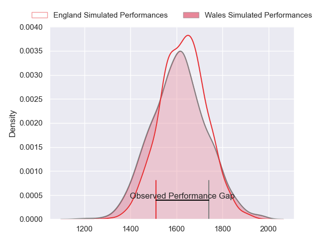
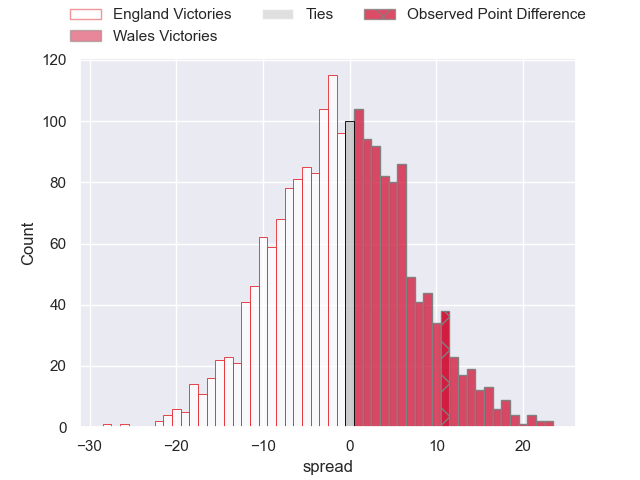
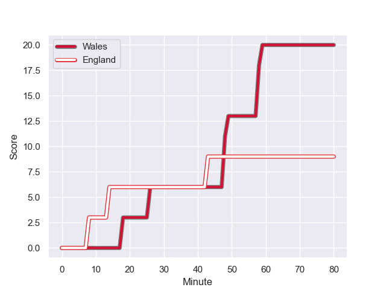
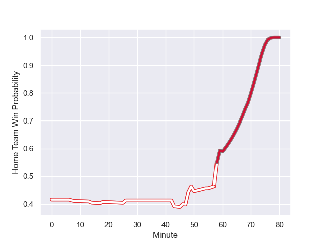

---  
layout: page  
title: England at Wales; 9.0-20.0  
date: 2023-08-04 18:00:00 -0500  
categories: match review  
---
# England at Wales; 9.0-20.0

# Club Level Predictions

The first set of predictions treats a club as the smallest object, as the club develops its members, organizes a gameplan, and deploys its players as needed for each match. This club model has a prediction of 0.482, which translates to predicting England to win by 0.7.

Each club has a rating and a rating deviation (simiar to a Glicko system), and expected performances can be generated. This allows for simulated matches and spreads like the ones below.
## Projected Performances

## Projected Spreads

## Projected Results

# Player Level Predictions - Version 1

Treating teams instead as an entity made up of the currently active players, I have ratings for each player in an altogether different system. These can be combined to form team ratings once teamsheets are announced, weighting starters a bit higher than the reserves. After the match is played, players can be weighted by their minutes on the field, allowing for an accurate measure of the team's composition. With these compiled team ratings, we can make predictions, measure inaccuracy, and update the individual player ratings.
## Prediction with Player Minutes: England by 10.7

England by 14.7 on a neutral field
## Prediction without Player Minutes: England by 10.3

England by 14.3 on a neutral pitch

## Scores over Time

## Win Probability over Time

There were 10 large changes in win probability in this match

|   Away Minutes | Away Player         |   Away elo |   Away Percentile |   Number |   Home Percentile |   Home elo | Home Player       |   Home Minutes |
|---------------:|:--------------------|-----------:|------------------:|---------:|------------------:|-----------:|:------------------|---------------:|
|             69 | Ellis Genge         |      91.1  |                60 |        1 |                83 |      90.25 | Corey Domachowski |             50 |
|             55 | Jamie Blamire       |      89.62 |                62 |        2 |                71 |      87.99 | Ryan Elias        |              7 |
|             55 | Will Stuart         |      89.83 |                60 |        3 |                76 |      86.53 | Keiron Assiratti  |             50 |
|             46 | David Ribbans       |     105.67 |                84 |        4 |                65 |      81.18 | Dafydd Jenkins    |             60 |
|             80 | George Martin       |      91.98 |                58 |        5 |                69 |      85.45 | Will Rowlands     |             50 |
|             80 | Lewis Ludlam        |      80.97 |                36 |        6 |                65 |      80.87 | Christ Tshiunza   |             50 |
|             80 | Tom Pearson         |      90.06 |                57 |        7 |                77 |      84.59 | Jac Morgan        |             80 |
|             55 | Alex Dombrandt      |      90.29 |                58 |        8 |                73 |      83.89 | Aaron Wainwright  |             80 |
|             50 | Danny Care          |      89.41 |                58 |        9 |                58 |      78.83 | Gareth Davies     |             55 |
|             60 | Marcus Smith        |      91.4  |                55 |       10 |                56 |      80.58 | Sam Costelow      |             55 |
|             69 | Joe Cokanasiga      |      91.73 |                59 |       11 |                87 |      95    | Rio Dyer          |             80 |
|             80 | Guy Porter          |     105.31 |                78 |       12 |                66 |      80.31 | Max Llewellyn     |             80 |
|             80 | Joe Marchant        |      92.47 |                58 |       13 |                65 |      80.06 | George North      |             80 |
|             80 | Max Malins          |      80.14 |                34 |       14 |                65 |      79.83 | Louis Rees-Zammit |             80 |
|             80 | Freddie Steward     |     105.11 |                77 |       15 |                62 |      79.61 | Leigh Halfpenny   |             80 |
|             25 | Theo Dan            |      91.78 |                69 |       16 |               nan |      83.29 | Elliot Dee        |             73 |
|             11 | Bevan Rodd          |     102.9  |                91 |       17 |               nan |      82.77 | Nicky Smith       |             30 |
|             25 | Kyle Sinckler       |      90.55 |               nan |       18 |               nan |      82.31 | Henry Thomas      |             30 |
|             34 | Jonny Hill          |      87.73 |                66 |       19 |               nan |      81.9  | Ben Carter        |             30 |
|             25 | Tom Willis          |      90.81 |               nan |       20 |               nan |      81.52 | Taine Plumtree    |             30 |
|             30 | Jack van Poortvliet |     104.49 |                87 |       21 |               nan |      79.4  | Tomos Williams    |             25 |
|             20 | George Ford         |     114.62 |                93 |       22 |               nan |      79.2  | Dan Biggar        |             25 |
|             11 | Henry Slade         |      92.08 |               nan |       23 |               nan |      79.01 | Mason Grady       |             20 |

# Player Level Predictions - Version 2

Treating teams instead as an entity made up of the currently active players, I have ratings for each player in an altogether different system. These can be combined to form team ratings once teamsheets are announced, weighting starters a bit higher than the reserves. After the match is played, players can be weighted by their minutes on the field, allowing for an accurate measure of the team's composition. With these compiled team ratings, we can make predictions, measure inaccuracy, and update the individual player ratings.
## Prediction with Player Minutes: England by 2.5

England by 6.3 on a neutral field
## Prediction without Player Minutes: England by 2.2

England by 6.0 on a neutral pitch

|   Away Minutes | Away Player         |   Away elo |   Away variance |   Number |   Home variance |   Home elo | Home Player       |   Home Minutes |
|---------------:|:--------------------|-----------:|----------------:|---------:|----------------:|-----------:|:------------------|---------------:|
|             69 | Ellis Genge         |      46.65 |           50    |        1 |              50 |      46.65 | Corey Domachowski |             50 |
|             55 | Jamie Blamire       |      46.65 |           50    |        2 |              50 |      46.65 | Ryan Elias        |              7 |
|             55 | Will Stuart         |      46.65 |           50    |        3 |              50 |      46.65 | Keiron Assiratti  |             50 |
|             46 | David Ribbans       |      73.09 |           50    |        4 |              50 |      46.65 | Dafydd Jenkins    |             60 |
|             80 | George Martin       |      83.37 |           50    |        5 |              50 |      46.65 | Will Rowlands     |             50 |
|             80 | Lewis Ludlam        |      64.05 |           50    |        6 |              50 |      46.65 | Christ Tshiunza   |             50 |
|             80 | Tom Pearson         |      46.65 |           50    |        7 |              50 |      46.65 | Jac Morgan        |             80 |
|             55 | Alex Dombrandt      |      46.65 |           50    |        8 |              50 |      46.65 | Aaron Wainwright  |             80 |
|             50 | Danny Care          |      46.65 |           50    |        9 |              50 |      46.65 | Gareth Davies     |             55 |
|             60 | Marcus Smith        |      46.65 |           50    |       10 |              50 |      46.65 | Sam Costelow      |             55 |
|             69 | Joe Cokanasiga      |      46.65 |           50    |       11 |              50 |      46.65 | Rio Dyer          |             80 |
|             80 | Guy Porter          |      73.69 |           50    |       12 |              50 |      46.65 | Max Llewellyn     |             80 |
|             80 | Joe Marchant        |      46.65 |           50    |       13 |              50 |      46.65 | George North      |             80 |
|             80 | Max Malins          |      64.89 |           50    |       14 |              50 |      46.65 | Louis Rees-Zammit |             80 |
|             80 | Freddie Steward     |      63.33 |           49.59 |       15 |              50 |      46.65 | Leigh Halfpenny   |             80 |
|             25 | Theo Dan            |      50.11 |           50    |       16 |              50 |      46.65 | Elliot Dee        |             73 |
|             11 | Bevan Rodd          |      69.21 |           50    |       17 |              50 |      46.65 | Nicky Smith       |             30 |
|             25 | Kyle Sinckler       |      46.65 |           50    |       18 |              50 |      46.65 | Henry Thomas      |             30 |
|             34 | Jonny Hill          |      45.75 |           50    |       19 |              50 |      46.65 | Ben Carter        |             30 |
|             25 | Tom Willis          |      46.65 |           50    |       20 |              50 |      46.65 | Taine Plumtree    |             30 |
|             30 | Jack van Poortvliet |      58.54 |           50    |       21 |              50 |      46.65 | Tomos Williams    |             25 |
|             20 | George Ford         |     101.37 |           50    |       22 |              50 |      46.65 | Dan Biggar        |             25 |
|             11 | Henry Slade         |      46.65 |           50    |       23 |              50 |      46.65 | Mason Grady       |             20 |

