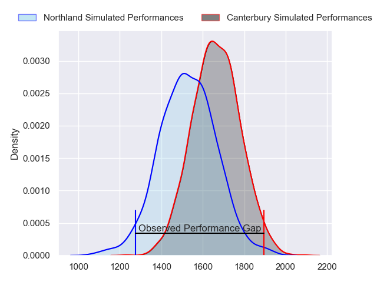
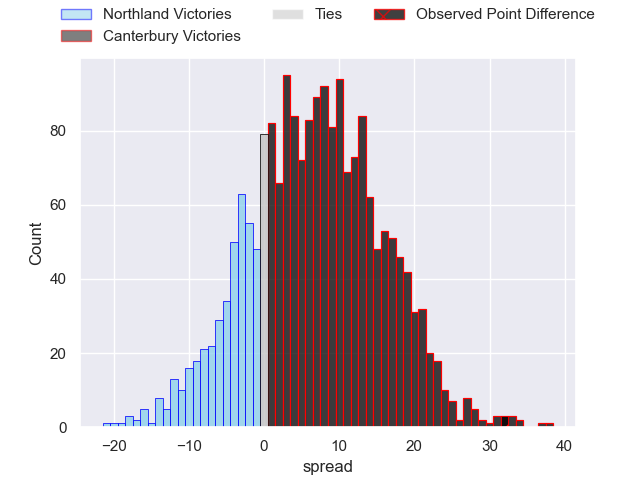
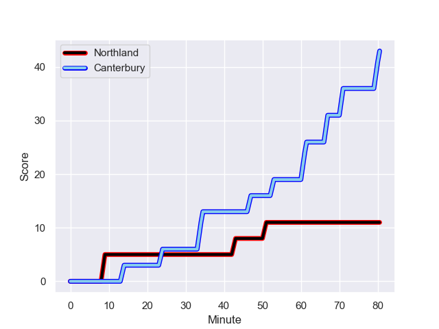
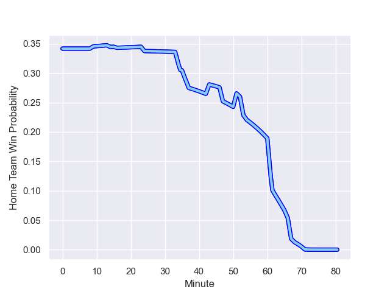

---  
layout: page  
title: Northland at Canterbury; 43-11  
date: 2023-08-05 18:00:00 -0500  
categories: match review  
---
# Northland at Canterbury; 43-11

# Club Level Predictions

The first set of predictions treats a club as the smallest object, as the club develops its members, organizes a gameplan, and deploys its players as needed for each match. This club model has a prediction of 0.674, which translates to predicting Canterbury to win by 6.9.

Each club has a rating and a rating deviation (simiar to a Glicko system), and expected performances can be generated. This allows for simulated matches and spreads like the ones below.
## Projected Performances

## Projected Spreads

## Projected Results

# Player Level Predictions - Version 1

Treating teams instead as an entity made up of the currently active players, I have ratings for each player in an altogether different system. These can be combined to form team ratings once teamsheets are announced, weighting starters a bit higher than the reserves. After the match is played, players can be weighted by their minutes on the field, allowing for an accurate measure of the team's composition. With these compiled team ratings, we can make predictions, measure inaccuracy, and update the individual player ratings.
## Prediction with Player Minutes: Canterbury by 24.5

Canterbury by 28.5 on a neutral field
## Prediction without Player Minutes: Canterbury by 22.4

Canterbury by 26.4 on a neutral pitch

## Scores over Time

## Win Probability over Time

There were 3 large changes in win probability in this match

|   Away Minutes | Away Player        |   Away elo |   Away Percentile |   Number |   Home Percentile |   Home elo | Home Player                   |   Home Minutes |
|---------------:|:-------------------|-----------:|------------------:|---------:|------------------:|-----------:|:------------------------------|---------------:|
|             66 | Dan Lienert-Brown  |      89.14 |                73 |        1 |                 3 |      55.05 | Jarred Adams                  |             69 |
|             62 | George Bell        |      89.29 |                76 |        2 |                27 |      69.25 | Matt Moulds                   |             54 |
|             72 | Seb Calder         |      87.44 |                74 |        3 |                24 |      74.77 | Chris Apoua                   |             54 |
|             52 | Luke Romano        |      87.89 |                69 |        4 |                18 |      70.71 | Sam Weir Caird                |             80 |
|             80 | Tahlor Cahill      |      87.66 |                71 |        5 |                25 |      69.08 | Allan Craig                   |             37 |
|             80 | Dom Gardiner       |      89.64 |                78 |        6 |                18 |      70.22 | Rob Rush                      |             80 |
|             66 | Corey Kellow       |      71.07 |                39 |        7 |                19 |      70    | Jonah Mau'u                   |             60 |
|             80 | Billy Harmon       |     108.31 |                93 |        8 |                18 |      69.42 | Matt Matich                   |             80 |
|             52 | Willi Heinz        |      88.4  |                70 |        9 |                74 |      95.21 | Sam Nock                      |             36 |
|             80 | Fergus Burke       |      88.52 |                70 |       10 |                24 |      71.28 | Rivez Reihana                 |             69 |
|             69 | Manasa Mataele     |     102.03 |                87 |       11 |                28 |      68.92 | Pisi Leilua                   |             14 |
|             80 | Rameka Poihipi     |      94    |                75 |       12 |                67 |      98.17 | Tamati Tua                    |             80 |
|             80 | Ryan Crotty        |      95.69 |                80 |       13 |                83 |     103.99 | Jack Goodhue                  |             80 |
|             16 | Ngatungane Punivai |      87.04 |                65 |       14 |                22 |      72.82 | Brady Rush                    |             80 |
|             80 | Chay Fihaki        |     117.06 |                93 |       15 |                21 |      71.61 | Heremaia Murray               |             80 |
|             18 | Ben Funnell        |      90.88 |               nan |       16 |               nan |      69.8  | Remsy Lemisio                 |             11 |
|             14 | Tom Heywood        |      88.68 |               nan |       17 |               nan |      72.37 | Bruce Kauika-Peterson         |             26 |
|              8 | Brook Toomalatai   |      90.01 |               nan |       18 |                18 |      63.72 | Rob Cobb                      |             26 |
|             28 | Mitchell Dunshea   |      87.24 |               nan |       19 |                 2 |      45.68 | Liam Hallam-Eames             |             43 |
|             14 | Joe Brial          |      88.97 |               nan |       20 |               nan |      70.46 | Saimoni Banuve Uluinakauvadra |             20 |
|             28 | Mitchell Drummond  |      95.11 |                75 |       21 |                22 |      70.98 | Lisati Milo-Harris            |             44 |
|             11 | Alex Harford       |      88.14 |               nan |       22 |                22 |      71.96 | Daniel Hawkins                |             11 |
|             64 | Blair Murray       |      90.42 |               nan |       23 |               nan |      69.6  | Rene Ranger                   |             66 |

# Player Level Predictions - Version 2

Treating teams instead as an entity made up of the currently active players, I have ratings for each player in an altogether different system. These can be combined to form team ratings once teamsheets are announced, weighting starters a bit higher than the reserves. After the match is played, players can be weighted by their minutes on the field, allowing for an accurate measure of the team's composition. With these compiled team ratings, we can make predictions, measure inaccuracy, and update the individual player ratings.
## Prediction with Player Minutes: Northland by 2.6

Canterbury by 0.7 on a neutral field
## Prediction without Player Minutes: Northland by 2.6

Canterbury by 0.7 on a neutral pitch

|   Away Minutes | Away Player        |   Away elo |   Away variance |   Number |   Home variance |   Home elo | Home Player                   |   Home Minutes |
|---------------:|:-------------------|-----------:|----------------:|---------:|----------------:|-----------:|:------------------------------|---------------:|
|             66 | Dan Lienert-Brown  |      39.76 |              50 |        1 |              50 |      46.65 | Jarred Adams                  |             69 |
|             62 | George Bell        |      46.65 |              50 |        2 |              50 |      46.65 | Matt Moulds                   |             54 |
|             72 | Seb Calder         |      46.65 |              50 |        3 |              50 |      20.17 | Chris Apoua                   |             54 |
|             52 | Luke Romano        |      46.65 |              50 |        4 |              50 |      46.65 | Sam Weir Caird                |             80 |
|             80 | Tahlor Cahill      |      46.65 |              50 |        5 |              50 |      46.65 | Allan Craig                   |             37 |
|             80 | Dom Gardiner       |      46.65 |              50 |        6 |              50 |      46.65 | Rob Rush                      |             80 |
|             66 | Corey Kellow       |      49.69 |              50 |        7 |              50 |      46.65 | Jonah Mau'u                   |             60 |
|             80 | Billy Harmon       |      68.11 |              50 |        8 |              50 |      46.65 | Matt Matich                   |             80 |
|             52 | Willi Heinz        |      46.65 |              50 |        9 |              50 |      54.76 | Sam Nock                      |             36 |
|             80 | Fergus Burke       |      55.64 |              50 |       10 |              50 |      46.65 | Rivez Reihana                 |             69 |
|             69 | Manasa Mataele     |      47.7  |              50 |       11 |              50 |      46.65 | Pisi Leilua                   |             14 |
|             80 | Rameka Poihipi     |      62.35 |              50 |       12 |              50 |      52.03 | Tamati Tua                    |             80 |
|             80 | Ryan Crotty        |      46.65 |              50 |       13 |              50 |     108.02 | Jack Goodhue                  |             80 |
|             16 | Ngatungane Punivai |      46.65 |              50 |       14 |              50 |      46.65 | Brady Rush                    |             80 |
|             80 | Chay Fihaki        |      64.97 |              50 |       15 |              50 |      46.65 | Heremaia Murray               |             80 |
|             18 | Ben Funnell        |      46.65 |              50 |       16 |              50 |      46.65 | Remsy Lemisio                 |             11 |
|             14 | Tom Heywood        |      46.65 |              50 |       17 |              50 |      46.65 | Bruce Kauika-Peterson         |             26 |
|              8 | Brook Toomalatai   |      46.65 |              50 |       18 |              50 |      46.65 | Rob Cobb                      |             26 |
|             28 | Mitchell Dunshea   |      46.65 |              50 |       19 |              50 |      46.65 | Liam Hallam-Eames             |             43 |
|             14 | Joe Brial          |      46.65 |              50 |       20 |              50 |      46.65 | Saimoni Banuve Uluinakauvadra |             20 |
|             28 | Mitchell Drummond  |      66.51 |              50 |       21 |              50 |      46.65 | Lisati Milo-Harris            |             44 |
|             11 | Alex Harford       |      46.65 |              50 |       22 |              50 |      46.65 | Daniel Hawkins                |             11 |
|             64 | Blair Murray       |      46.65 |              50 |       23 |              50 |      46.65 | Rene Ranger                   |             66 |

