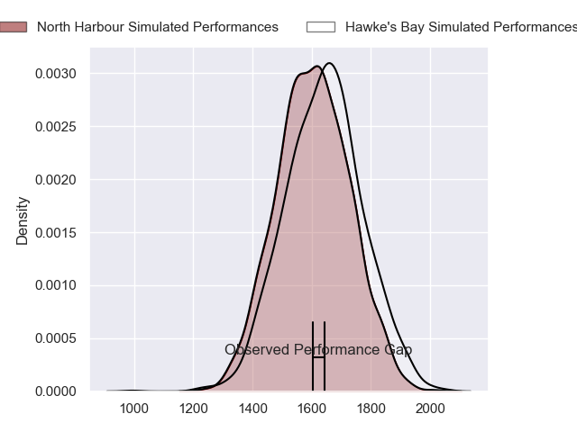
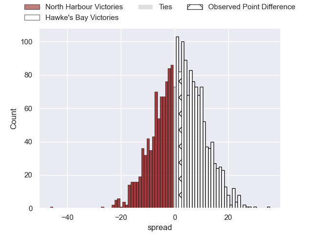
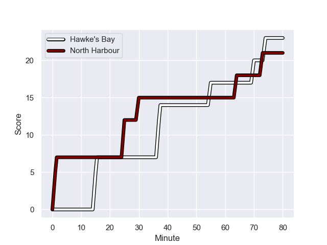
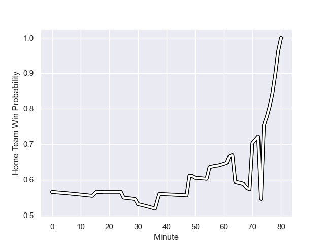

---  
layout: page  
title: North Harbour at Hawke's Bay; 21-23  
date: 2023-08-05 18:00:00 -0500  
categories: match review  
---
# North Harbour at Hawke's Bay; 21-23

# Club Level Predictions

The first set of predictions treats a club as the smallest object, as the club develops its members, organizes a gameplan, and deploys its players as needed for each match. This club model has a prediction of 0.545, which translates to predicting Hawke's Bay to win by 1.7.

Each club has a rating and a rating deviation (simiar to a Glicko system), and expected performances can be generated. This allows for simulated matches and spreads like the ones below.
## Projected Performances

## Projected Spreads

## Projected Results

# Player Level Predictions - Version 1

Treating teams instead as an entity made up of the currently active players, I have ratings for each player in an altogether different system. These can be combined to form team ratings once teamsheets are announced, weighting starters a bit higher than the reserves. After the match is played, players can be weighted by their minutes on the field, allowing for an accurate measure of the team's composition. With these compiled team ratings, we can make predictions, measure inaccuracy, and update the individual player ratings.
## Prediction with Player Minutes: Hawke's Bay by 15.5

Hawke's Bay by 11.5 on a neutral field
## Prediction without Player Minutes: Hawke's Bay by 12.5

Hawke's Bay by 8.5 on a neutral pitch

## Scores over Time

## Win Probability over Time

There were 12 large changes in win probability in this match

|   Away Minutes | Away Player           |   Away elo |   Away Percentile |   Number |   Home Percentile |   Home elo | Home Player                |   Home Minutes |
|---------------:|:----------------------|-----------:|------------------:|---------:|------------------:|-----------:|:---------------------------|---------------:|
|             50 | Tevita Langi          |      60.17 |                20 |        1 |                43 |      78.15 | Pouri Gordon Rakete-Stones |             66 |
|             68 | Shilo Klein           |      60.73 |                40 |        2 |                28 |      72.06 | Kianu Kereru-Symes         |             48 |
|             62 | Tevita Mafileo        |      98.05 |                95 |        3 |                28 |      70.54 | Joel Hintz                 |             55 |
|             80 | Ben Grant             |      98.18 |                93 |        4 |                46 |      78.89 | Frank Lochore              |             74 |
|             18 | James Fiebig          |      70.08 |                33 |        5 |                40 |      79.48 | Tom Parsons                |             80 |
|             58 | Tamarau McGahan       |      70.79 |                63 |        6 |                37 |      80.18 | Marino Mikaele Tu'u        |             80 |
|             62 | Jed Melvin            |      69.87 |                54 |        7 |                51 |      78.38 | Siosiua (Josh) Kaifa       |             58 |
|             80 | Cameron Suafoa        |     100.94 |                90 |        8 |                51 |      83.52 | Devan Flanders             |             80 |
|             72 | Jamie Booth           |      69.5  |                56 |        9 |                38 |      78.63 | Folau Fakatava             |             48 |
|             80 | Oscar Koller          |      70.3  |                55 |       10 |                38 |      77.73 | Lincoln McClutchie         |             80 |
|             80 | Alapati Leiua         |      72.45 |                65 |       11 |                55 |      83.38 | Jonah Lowe                 |             80 |
|             80 | Henry Taefu           |      52.92 |                12 |       12 |                54 |      84.62 | Chase Tiatia               |             80 |
|             80 | Tom Barham            |      71.36 |                63 |       13 |                64 |      89.19 | Ollie Sapsford             |             80 |
|             72 | Tika Lelenga          |      69    |                51 |       14 |                34 |      77.35 | Lolagi Visinia             |             64 |
|             80 | Kade Banks            |      69.32 |                58 |       15 |                42 |      79.81 | Harry Godfrey              |             80 |
|             12 | Bryn Gordon           |      70.53 |               nan |       16 |                72 |      88.95 | Jacob Devery               |             32 |
|             18 | Sione Mafileo         |      71.06 |               nan |       17 |               nan |      79.18 | Timothy John Farrell       |             14 |
|             30 | Nic Mayhew            |      66.19 |                37 |       18 |                 8 |      54.48 | Isaac Salmon               |             25 |
|             62 | Maetaki He Lotu Inisi |      69.16 |               nan |       19 |               nan |      80.58 | Hunter Morrison            |              6 |
|             18 | Karl Ruzich           |      72.9  |               nan |       20 |                58 |      77.54 | Sam Smith                  |             22 |
|              8 | Aisea Halo            |      72.04 |               nan |       21 |                99 |     136.68 | Brad Weber                 |             32 |
|             22 | Wallace Sititi        |      71.68 |               nan |       22 |                53 |      77.94 | Nicholas Grigg             |             16 |
|              8 | John Tapueluelu       |      69.68 |               nan |       23 |               nan |     nan    | nan                        |            nan |

# Player Level Predictions - Version 2

Treating teams instead as an entity made up of the currently active players, I have ratings for each player in an altogether different system. These can be combined to form team ratings once teamsheets are announced, weighting starters a bit higher than the reserves. After the match is played, players can be weighted by their minutes on the field, allowing for an accurate measure of the team's composition. With these compiled team ratings, we can make predictions, measure inaccuracy, and update the individual player ratings.
## Prediction with Player Minutes: Hawke's Bay by 4.8

Hawke's Bay by 1.5 on a neutral field
## Prediction without Player Minutes: Hawke's Bay by 4.3

Hawke's Bay by 0.9 on a neutral pitch

|   Away Minutes | Away Player           |   Away elo |   Away variance |   Number |   Home variance |   Home elo | Home Player                |   Home Minutes |
|---------------:|:----------------------|-----------:|----------------:|---------:|----------------:|-----------:|:---------------------------|---------------:|
|             50 | Tevita Langi          |      46.65 |           50    |        1 |              50 |      46.65 | Pouri Gordon Rakete-Stones |             66 |
|             68 | Shilo Klein           |      46.65 |           50    |        2 |              50 |      46.65 | Kianu Kereru-Symes         |             48 |
|             62 | Tevita Mafileo        |      60.42 |           50    |        3 |              50 |      46.65 | Joel Hintz                 |             55 |
|             80 | Ben Grant             |      72.7  |           47.89 |        4 |              50 |      46.65 | Frank Lochore              |             74 |
|             18 | James Fiebig          |      46.65 |           50    |        5 |              50 |      46.65 | Tom Parsons                |             80 |
|             58 | Tamarau McGahan       |      46.65 |           50    |        6 |              50 |      46.65 | Marino Mikaele Tu'u        |             80 |
|             62 | Jed Melvin            |      46.65 |           50    |        7 |              50 |      46.65 | Siosiua (Josh) Kaifa       |             58 |
|             80 | Cameron Suafoa        |      45.96 |           50    |        8 |              50 |      59.92 | Devan Flanders             |             80 |
|             72 | Jamie Booth           |      46.65 |           50    |        9 |              50 |      46.65 | Folau Fakatava             |             48 |
|             80 | Oscar Koller          |      46.65 |           50    |       10 |              50 |      46.65 | Lincoln McClutchie         |             80 |
|             80 | Alapati Leiua         |      46.65 |           50    |       11 |              50 |      46.03 | Jonah Lowe                 |             80 |
|             80 | Henry Taefu           |      29.01 |           50    |       12 |              50 |      55.23 | Chase Tiatia               |             80 |
|             80 | Tom Barham            |      46.65 |           50    |       13 |              50 |      51.82 | Ollie Sapsford             |             80 |
|             72 | Tika Lelenga          |      46.65 |           50    |       14 |              50 |      46.65 | Lolagi Visinia             |             64 |
|             80 | Kade Banks            |      46.65 |           50    |       15 |              50 |      46.65 | Harry Godfrey              |             80 |
|             12 | Bryn Gordon           |      46.65 |           50    |       16 |              50 |      60.13 | Jacob Devery               |             32 |
|             18 | Sione Mafileo         |      46.65 |           50    |       17 |              50 |      46.65 | Timothy John Farrell       |             14 |
|             30 | Nic Mayhew            |      46.65 |           50    |       18 |              50 |      46.65 | Isaac Salmon               |             25 |
|             62 | Maetaki He Lotu Inisi |      46.65 |           50    |       19 |              50 |      46.65 | Hunter Morrison            |              6 |
|             18 | Karl Ruzich           |      46.65 |           50    |       20 |              50 |      46.65 | Sam Smith                  |             22 |
|              8 | Aisea Halo            |      46.65 |           50    |       21 |              50 |     102.51 | Brad Weber                 |             32 |
|             22 | Wallace Sititi        |      46.65 |           50    |       22 |              50 |      46.65 | Nicholas Grigg             |             16 |
|              8 | John Tapueluelu       |      46.65 |           50    |       23 |             nan |     nan    | nan                        |            nan |

