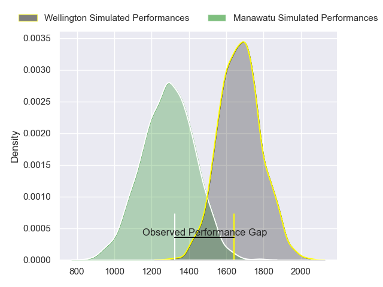
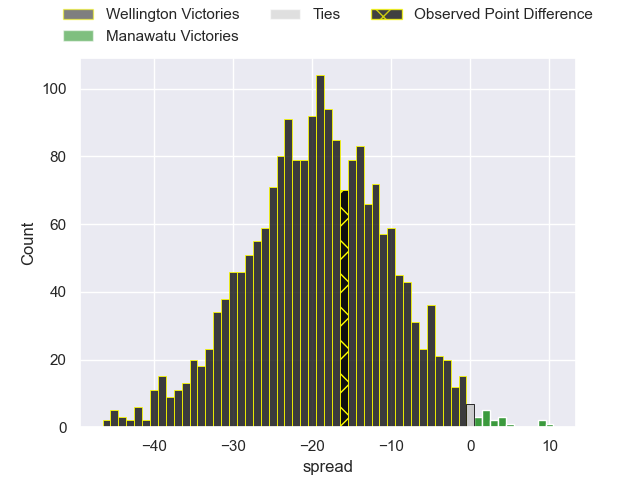
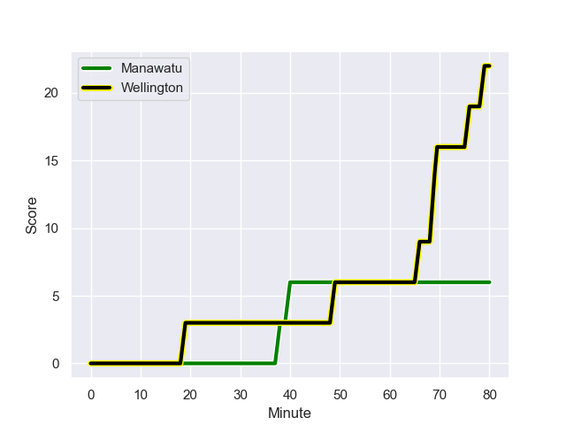
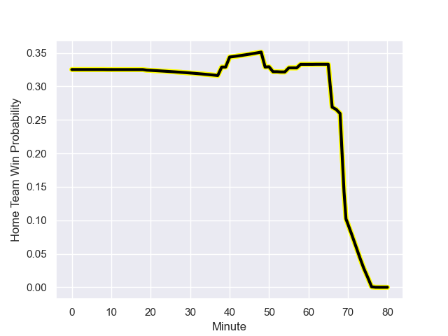

---  
layout: page  
title: Wellington at Manawatu; 22-6  
date: 2023-08-05 18:00:00 -0500  
categories: match review  
---
# Wellington at Manawatu; 22-6

# Club Level Predictions

The first set of predictions treats a club as the smallest object, as the club develops its members, organizes a gameplan, and deploys its players as needed for each match. This club model has a prediction of 0.112, which translates to predicting Wellington to win by 19.1.

Each club has a rating and a rating deviation (simiar to a Glicko system), and expected performances can be generated. This allows for simulated matches and spreads like the ones below.
## Projected Performances

## Projected Spreads

## Projected Results

# Player Level Predictions - Version 1

Treating teams instead as an entity made up of the currently active players, I have ratings for each player in an altogether different system. These can be combined to form team ratings once teamsheets are announced, weighting starters a bit higher than the reserves. After the match is played, players can be weighted by their minutes on the field, allowing for an accurate measure of the team's composition. With these compiled team ratings, we can make predictions, measure inaccuracy, and update the individual player ratings.
## Prediction with Player Minutes: Wellington by 27.7

Wellington by 31.7 on a neutral field
## Prediction without Player Minutes: Wellington by 28.5

Wellington by 32.5 on a neutral pitch

## Scores over Time

## Win Probability over Time

There were 3 large changes in win probability in this match

|   Away Minutes | Away Player                   |   Away elo |   Away Percentile |   Number |   Home Percentile |   Home elo | Home Player           |   Home Minutes |
|---------------:|:------------------------------|-----------:|------------------:|---------:|------------------:|-----------:|:----------------------|---------------:|
|             58 | Xavier Numia                  |      99.2  |                79 |        1 |                29 |      65.32 | Joseph Gavigan        |             51 |
|             76 | Josh Southall                 |      87.05 |                51 |        2 |                25 |      64.19 | Raymond Tuputupu      |              9 |
|             50 | PJ Sheck                      |      86.12 |                54 |        3 |                30 |      66.08 | Feleti Sae-Ta'ufo'ou  |             51 |
|             80 | Caleb Delany                  |      95.01 |                65 |        4 |                33 |      64.52 | Ofa Tauatevalu        |             80 |
|             53 | Hugo Plummer                  |      87.41 |                53 |        5 |                39 |      68.29 | Johannes Momsen       |             72 |
|             80 | Brad Shields                  |      93.25 |                64 |        6 |                33 |      63.9  | Te Kamaka Howden      |             80 |
|             80 | Du'Plessis Kirifi             |      89.68 |                57 |        7 |                63 |      77.63 | Slade McDowall        |             77 |
|             53 | Keelan Whitman                |      86.41 |                50 |        8 |                22 |      57.22 | Brayden Iose          |             80 |
|             67 | Kemara Henare Hauiti-Parapara |      89.31 |                56 |        9 |                15 |      53.46 | Luke Campbell         |             55 |
|             80 | Aidan Morgan                  |      85.2  |                40 |       10 |                78 |      95.2  | Brett Cameron         |             80 |
|             62 | Pepesana Patafilo             |      84.72 |                47 |       11 |                89 |     103.2  | Tima Fainga'anuku     |             80 |
|             80 | Peter Umaga-Jensen            |      85.58 |                56 |       12 |                34 |      64.7  | Kyle Brown            |             80 |
|             80 | Billy Proctor                 |     110.11 |                89 |       13 |                14 |      50.58 | Te Rangatira Waitokia |             80 |
|             76 | Losilosivale Filipo           |      85.85 |                47 |       14 |                33 |      64.36 | Nehe Milner-Skudder   |             72 |
|             80 | Ruben Love                    |      85.13 |                42 |       15 |                26 |      67.1  | Beaudein Waaka        |             19 |
|              4 | Penieli Poasa                 |      85.6  |               nan |       16 |               nan |      64.04 | Vernon Bason          |             71 |
|             22 | Cameron Orr                   |      88.75 |               nan |       17 |                 5 |      51    | Sean Bradley Paranihi |             29 |
|             30 | Siale Lauaki                  |      85.36 |               nan |       18 |               nan |      65.8  | Flyn Yates            |             29 |
|             27 | Akira Ieremia                 |      86.72 |               nan |       19 |               nan |      65.1  | Josh Taula            |              8 |
|             27 | Dominic Ropeti                |      87.81 |               nan |       20 |               nan |      64.9  | Elyjah Crosswell      |              3 |
|             13 | Kyle Preston                  |      84.92 |               nan |       21 |               nan |      65.55 | Jordi Viljoen         |             25 |
|             18 | Tjay Clarke                   |      84.53 |               nan |       22 |                26 |      66.81 | Taniela Filimone      |              8 |
|              4 | Chicago Doyle                 |      88.26 |               nan |       23 |                38 |      74.63 | Drew Wild             |             61 |

# Player Level Predictions - Version 2

Treating teams instead as an entity made up of the currently active players, I have ratings for each player in an altogether different system. These can be combined to form team ratings once teamsheets are announced, weighting starters a bit higher than the reserves. After the match is played, players can be weighted by their minutes on the field, allowing for an accurate measure of the team's composition. With these compiled team ratings, we can make predictions, measure inaccuracy, and update the individual player ratings.
## Prediction with Player Minutes: Wellington by 6.1

Wellington by 9.4 on a neutral field
## Prediction without Player Minutes: Wellington by 5.4

Wellington by 8.8 on a neutral pitch

|   Away Minutes | Away Player                   |   Away elo |   Away variance |   Number |   Home variance |   Home elo | Home Player           |   Home Minutes |
|---------------:|:------------------------------|-----------:|----------------:|---------:|----------------:|-----------:|:----------------------|---------------:|
|             58 | Xavier Numia                  |      78.87 |              50 |        1 |              50 |      46.65 | Joseph Gavigan        |             51 |
|             76 | Josh Southall                 |      46.65 |              50 |        2 |              50 |      46.65 | Raymond Tuputupu      |              9 |
|             50 | PJ Sheck                      |      46.65 |              50 |        3 |              50 |      46.65 | Feleti Sae-Ta'ufo'ou  |             51 |
|             80 | Caleb Delany                  |      56.11 |              50 |        4 |              50 |      46.65 | Ofa Tauatevalu        |             80 |
|             53 | Hugo Plummer                  |      46.65 |              50 |        5 |              50 |     -10.25 | Johannes Momsen       |             72 |
|             80 | Brad Shields                  |      46.65 |              50 |        6 |              50 |      46.65 | Te Kamaka Howden      |             80 |
|             80 | Du'Plessis Kirifi             |      82.13 |              50 |        7 |              50 |      46.65 | Slade McDowall        |             77 |
|             53 | Keelan Whitman                |      46.65 |              50 |        8 |              50 |      24.15 | Brayden Iose          |             80 |
|             67 | Kemara Henare Hauiti-Parapara |      46.65 |              50 |        9 |              50 |      46.65 | Luke Campbell         |             55 |
|             80 | Aidan Morgan                  |      47.53 |              50 |       10 |              50 |      32.31 | Brett Cameron         |             80 |
|             62 | Pepesana Patafilo             |      46.65 |              50 |       11 |              50 |       8.63 | Tima Fainga'anuku     |             80 |
|             80 | Peter Umaga-Jensen            |      44.78 |              50 |       12 |              50 |      46.65 | Kyle Brown            |             80 |
|             80 | Billy Proctor                 |      81.11 |              50 |       13 |              50 |      46.65 | Te Rangatira Waitokia |             80 |
|             76 | Losilosivale Filipo           |      46.65 |              50 |       14 |              50 |      46.65 | Nehe Milner-Skudder   |             72 |
|             80 | Ruben Love                    |      46.65 |              50 |       15 |              50 |      46.65 | Beaudein Waaka        |             19 |
|              4 | Penieli Poasa                 |      46.65 |              50 |       16 |              50 |      46.65 | Vernon Bason          |             71 |
|             22 | Cameron Orr                   |      46.65 |              50 |       17 |              50 |      46.65 | Sean Bradley Paranihi |             29 |
|             30 | Siale Lauaki                  |      46.65 |              50 |       18 |              50 |      46.65 | Flyn Yates            |             29 |
|             27 | Akira Ieremia                 |      46.65 |              50 |       19 |              50 |      46.65 | Josh Taula            |              8 |
|             27 | Dominic Ropeti                |      46.65 |              50 |       20 |              50 |      46.65 | Elyjah Crosswell      |              3 |
|             13 | Kyle Preston                  |      46.65 |              50 |       21 |              50 |      46.65 | Jordi Viljoen         |             25 |
|             18 | Tjay Clarke                   |      46.65 |              50 |       22 |              50 |      46.65 | Taniela Filimone      |              8 |
|              4 | Chicago Doyle                 |      46.65 |              50 |       23 |              50 |      46.65 | Drew Wild             |             61 |

