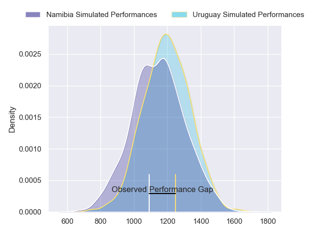
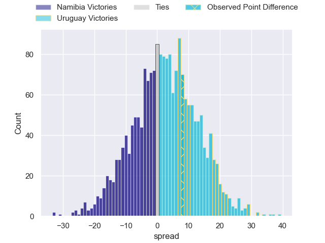
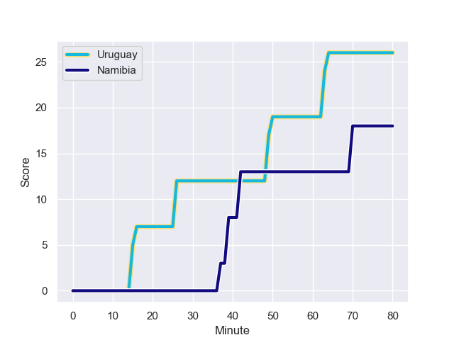
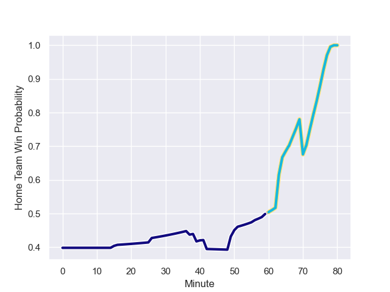

---  
layout: page  
title: Namibia at Uruguay; 18.0-26.0  
date: 2023-08-05 18:00:00 -0500  
categories: match review  
---
# Namibia at Uruguay; 18.0-26.0

# Club Level Predictions

The first set of predictions treats a club as the smallest object, as the club develops its members, organizes a gameplan, and deploys its players as needed for each match. This club model has a prediction of 0.569, which translates to predicting Uruguay to win by 2.7.

Each club has a rating and a rating deviation (simiar to a Glicko system), and expected performances can be generated. This allows for simulated matches and spreads like the ones below.
## Projected Performances

## Projected Spreads

## Projected Results

# Player Level Predictions - Version 1

Treating teams instead as an entity made up of the currently active players, I have ratings for each player in an altogether different system. These can be combined to form team ratings once teamsheets are announced, weighting starters a bit higher than the reserves. After the match is played, players can be weighted by their minutes on the field, allowing for an accurate measure of the team's composition. With these compiled team ratings, we can make predictions, measure inaccuracy, and update the individual player ratings.
## Prediction with Player Minutes: Namibia by 13.9

Namibia by 17.9 on a neutral field
## Prediction without Player Minutes: Namibia by 14.5

Namibia by 18.5 on a neutral pitch

## Scores over Time

## Win Probability over Time

There were 13 large changes in win probability in this match

|   Away Minutes | Away Player              |   Away elo |   Away Percentile |   Number |   Home Percentile |   Home elo | Home Player              |   Home Minutes |
|---------------:|:-------------------------|-----------:|------------------:|---------:|------------------:|-----------:|:-------------------------|---------------:|
|             59 | Des Sethie               |      75.64 |                37 |        1 |                27 |      63.57 | Matias Benitez           |             51 |
|             72 | Louis van der Westhuizen |     106.31 |                87 |        2 |                20 |      57.9  | Guillermo Pujadas        |             51 |
|             66 | Casper Viviers           |      75.93 |                27 |        3 |                18 |      59.89 | Diego Arbelo             |             40 |
|             56 | Adriaan Ludick           |      74.46 |                34 |        4 |                60 |      77.34 | Ignacio Dotti            |             80 |
|             80 | Tjiuee Uanivi            |      76.25 |                26 |        5 |                44 |      71.02 | Manuel Leindekar         |             67 |
|             80 | Wian Conradie            |      78.36 |                40 |        6 |                37 |      65.81 | Eric Dosantos            |             67 |
|             73 | Johan Retief             |      95.18 |                68 |        7 |                34 |      62.46 | Santiago Civetta         |             80 |
|             56 | Richard Hardwick         |      83.09 |                49 |        8 |                35 |      64.07 | Carlos Deus              |             80 |
|             80 | Damian Stevens           |      53.49 |                 4 |        9 |                52 |      74.43 | Agustín Ormaechea        |             66 |
|             80 | Tiaan Swanepoel          |      75.12 |                29 |       10 |                28 |      63.13 | Juan Zuccarino           |             74 |
|             80 | JC Greyling              |      74.89 |                33 |       11 |                34 |      63.12 | Ignacio Facciolo         |             80 |
|             80 | Danco Burger             |      77.9  |                37 |       12 |                29 |      60.98 | Andres Vilaseca          |             80 |
|             80 | Johan Deysel             |      74.67 |                31 |       13 |                30 |      63.26 | Felipe Arcos Perez       |             59 |
|             66 | Gerswin Mouton           |      74.26 |                28 |       14 |                25 |      57.29 | Bautista Basso           |             80 |
|             80 | Divan Rossouw            |      73.73 |                27 |       15 |                45 |      70.52 | Rodrigo Silva            |             80 |
|              8 | Gihard Visagie           |      74.08 |               nan |       16 |               nan |      72.28 | German Kessler           |             29 |
|             21 | Jason Benade             |      73.9  |               nan |       17 |               nan |      63.91 | Mateo Sanguinetti        |             29 |
|             14 | Shifuku Haitembu         |      78.46 |               nan |       18 |               nan |      63.74 | Reinaldo Piussi          |             40 |
|              7 | Ruan Ludick              |      76.6  |               nan |       19 |               nan |      71.75 | Diego Magno              |             13 |
|             24 | PJ van Lill              |      77.41 |               nan |       20 |               nan |      70.49 | Lucas Bianchi            |             13 |
|              0 | Jacques Theron           |      76.98 |               nan |       21 |               nan |      74.82 | Juan Manuel Tafernaberry |             14 |
|             24 | Prince Gaoseb            |      75.37 |               nan |       22 |               nan |      63.41 | Ignacio Alvarez          |              6 |
|             14 | Andre van der Berg       |      79.12 |               nan |       23 |               nan |      69.55 | Diego Ardao              |             21 |

# Player Level Predictions - Version 2

Treating teams instead as an entity made up of the currently active players, I have ratings for each player in an altogether different system. These can be combined to form team ratings once teamsheets are announced, weighting starters a bit higher than the reserves. After the match is played, players can be weighted by their minutes on the field, allowing for an accurate measure of the team's composition. With these compiled team ratings, we can make predictions, measure inaccuracy, and update the individual player ratings.
## Prediction with Player Minutes: Uruguay by 1.3

Namibia by 1.7 on a neutral field
## Prediction without Player Minutes: Uruguay by 1.3

Namibia by 1.8 on a neutral pitch

|   Away Minutes | Away Player              |   Away elo |   Away variance |   Number |   Home variance |   Home elo | Home Player              |   Home Minutes |
|---------------:|:-------------------------|-----------:|----------------:|---------:|----------------:|-----------:|:-------------------------|---------------:|
|             59 | Des Sethie               |      46.65 |              50 |        1 |           50    |      46.65 | Matias Benitez           |             51 |
|             72 | Louis van der Westhuizen |      46.65 |              50 |        2 |           49.94 |      46.07 | Guillermo Pujadas        |             51 |
|             66 | Casper Viviers           |      46.65 |              50 |        3 |           50    |      46.65 | Diego Arbelo             |             40 |
|             56 | Adriaan Ludick           |      46.65 |              50 |        4 |           50    |      44.64 | Ignacio Dotti            |             80 |
|             80 | Tjiuee Uanivi            |      46.65 |              50 |        5 |           49.86 |      45.3  | Manuel Leindekar         |             67 |
|             80 | Wian Conradie            |      46.65 |              50 |        6 |           50    |      46.65 | Eric Dosantos            |             67 |
|             73 | Johan Retief             |      46.65 |              50 |        7 |           49.96 |      46.24 | Santiago Civetta         |             80 |
|             56 | Richard Hardwick         |      61.57 |              50 |        8 |           50    |      46.65 | Carlos Deus              |             80 |
|             80 | Damian Stevens           |      46.65 |              50 |        9 |           50    |      41.24 | Agustín Ormaechea        |             66 |
|             80 | Tiaan Swanepoel          |      46.65 |              50 |       10 |           50    |      46.65 | Juan Zuccarino           |             74 |
|             80 | JC Greyling              |      46.65 |              50 |       11 |           50    |      46.65 | Ignacio Facciolo         |             80 |
|             80 | Danco Burger             |      46.65 |              50 |       12 |           49.8  |      36.63 | Andres Vilaseca          |             80 |
|             80 | Johan Deysel             |      46.65 |              50 |       13 |           50    |      46.65 | Felipe Arcos Perez       |             59 |
|             66 | Gerswin Mouton           |      46.65 |              50 |       14 |           49.84 |      45.08 | Bautista Basso           |             80 |
|             80 | Divan Rossouw            |      46.65 |              50 |       15 |           50    |      39.85 | Rodrigo Silva            |             80 |
|              8 | Gihard Visagie           |      46.65 |              50 |       16 |           50    |      40.94 | German Kessler           |             29 |
|             21 | Jason Benade             |      46.65 |              50 |       17 |           50    |      46.65 | Mateo Sanguinetti        |             29 |
|             14 | Shifuku Haitembu         |      46.65 |              50 |       18 |           50    |      46.65 | Reinaldo Piussi          |             40 |
|              7 | Ruan Ludick              |      46.65 |              50 |       19 |           50    |      40.15 | Diego Magno              |             13 |
|             24 | PJ van Lill              |      46.65 |              50 |       20 |           50    |      39.45 | Lucas Bianchi            |             13 |
|              0 | Jacques Theron           |      46.65 |              50 |       21 |           50    |      46.65 | Juan Manuel Tafernaberry |             14 |
|             24 | Prince Gaoseb            |      46.65 |              50 |       22 |           50    |      46.65 | Ignacio Alvarez          |              6 |
|             14 | Andre van der Berg       |      46.65 |              50 |       23 |           50    |      43.57 | Diego Ardao              |             21 |

