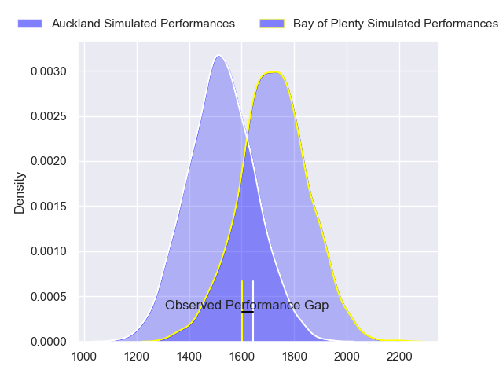
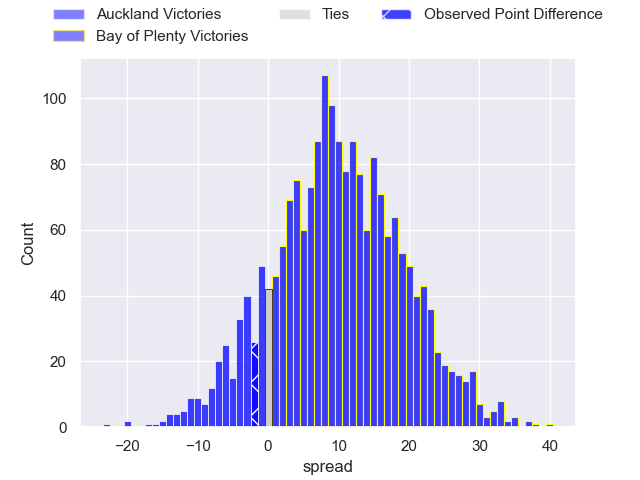
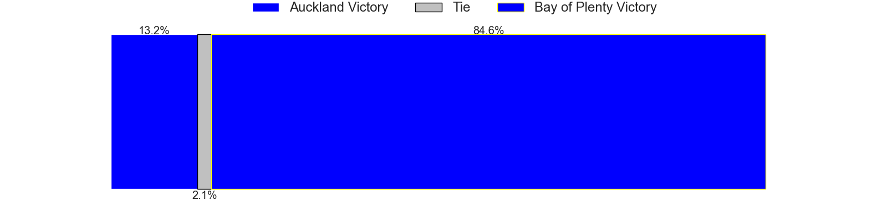
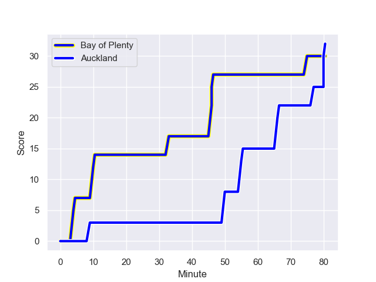
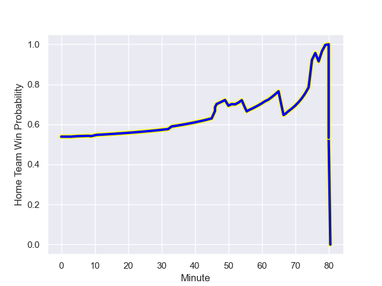

---  
layout: page  
title: Auckland at Bay of Plenty; 32-30  
date: 2023-08-06 18:00:00 -0500  
categories: match review  
---
# Auckland at Bay of Plenty; 32-30

# Club Level Predictions

The first set of predictions treats a club as the smallest object, as the club develops its members, organizes a gameplan, and deploys its players as needed for each match. This club model has a prediction of 0.739, which translates to predicting Bay of Plenty to win by 9.7.

Each club has a rating and a rating deviation (simiar to a Glicko system), and expected performances can be generated. This allows for simulated matches and spreads like the ones below.
## Projected Performances

## Projected Spreads

## Projected Results

# Player Level Predictions - Version 1

Treating teams instead as an entity made up of the currently active players, I have ratings for each player in an altogether different system. These can be combined to form team ratings once teamsheets are announced, weighting starters a bit higher than the reserves. After the match is played, players can be weighted by their minutes on the field, allowing for an accurate measure of the team's composition. With these compiled team ratings, we can make predictions, measure inaccuracy, and update the individual player ratings.
## Prediction with Player Minutes: Bay of Plenty by 10.8

Bay of Plenty by 6.8 on a neutral field
## Prediction without Player Minutes: Bay of Plenty by 14.9

Bay of Plenty by 10.9 on a neutral pitch

## Scores over Time

## Win Probability over Time

There were 13 large changes in win probability in this match

|   Away Minutes | Away Player                 |   Away elo |   Away Percentile |   Number |   Home Percentile |   Home elo | Home Player            |   Home Minutes |
|---------------:|:----------------------------|-----------:|------------------:|---------:|------------------:|-----------:|:-----------------------|---------------:|
|             62 | James Lay                   |      75.73 |                53 |        1 |                65 |      87.79 | Aidan Ross             |             62 |
|             47 | Leni Apisai                 |      78.08 |                56 |        2 |                57 |      84.31 | Kurt Eklund            |             69 |
|             80 | Angus Ta'avao-Matau         |      78.52 |                51 |        3 |                48 |      80.88 | John Afoa              |             54 |
|             80 | Hamish Dalzell              |      52.03 |                14 |        4 |                47 |      82.18 | Mana'aki Selby-Rickit  |             80 |
|             80 | Josh Beehre                 |      76.19 |                40 |        5 |                43 |      80.37 | Justin Sangster        |             80 |
|             80 | Adrian Choat                |      89.17 |                72 |        6 |                87 |     105.15 | Naitoa Ah Kuoi         |             80 |
|             80 | Blake Gibson                |      77.34 |                45 |        7 |                47 |      80.58 | Veveni Lasaqa          |             68 |
|             56 | Vaiolini Ekuasi             |      78.44 |                52 |        8 |                47 |      82.9  | Nikora Broughton       |             80 |
|             52 | Taufa Funaki                |      79.58 |                48 |        9 |                77 |      97.16 | Te Toiroa Tahuriorangi |             52 |
|             80 | Zarn Sullivan               |      89.09 |                59 |       10 |                44 |      82.52 | Lucas Cashmore         |             68 |
|             80 | Salesi Tuivuna Mauri Rayasi |      77.69 |                58 |       11 |                50 |      83.32 | Ngarohi McGarvey-Black |             80 |
|             80 | Harry Plummer               |     100.13 |                80 |       12 |                47 |      81.57 | Lalomilo Lalomilo      |             80 |
|             80 | Bryce Heem                  |      93.73 |                72 |       13 |                44 |      79.98 | Melani Nanai           |             80 |
|             80 | Caleb Tangitau              |      75.52 |                47 |       14 |                47 |      81.86 | Leroy Carter           |             80 |
|             77 | Corey Evans                 |      76.72 |                53 |       15 |                36 |      80.17 | Cole Forbes            |             69 |
|             33 | Soane Vikena                |      79.01 |                45 |       16 |               nan |      81.3  | Nathan Vella           |             11 |
|             18 | Josh Fusitua                |      76.45 |                31 |       17 |               nan |      81.05 | Benet Kumeroa          |             18 |
|             24 | Che Clark                   |      75.32 |               nan |       18 |               nan |      87.16 | Alex Johnston          |             26 |
|             28 | Kalani Thomas               |      77.02 |               nan |       19 |                65 |      89.31 | Semisi Paea            |             12 |
|              3 | Jock McKenzie               |      75.95 |               nan |       20 |                38 |      73.77 | Richard Judd           |             28 |
|            nan | nan                         |     nan    |               nan |       21 |                54 |      80.81 | Wharenui Hawera        |             12 |
|            nan | nan                         |     nan    |               nan |       22 |               nan |      83.78 | Seamus Bardoul         |             11 |

# Player Level Predictions - Version 2

Treating teams instead as an entity made up of the currently active players, I have ratings for each player in an altogether different system. These can be combined to form team ratings once teamsheets are announced, weighting starters a bit higher than the reserves. After the match is played, players can be weighted by their minutes on the field, allowing for an accurate measure of the team's composition. With these compiled team ratings, we can make predictions, measure inaccuracy, and update the individual player ratings.
## Prediction with Player Minutes: Bay of Plenty by 2.7

Bay of Plenty by 0.6 on a neutral field
## Prediction without Player Minutes: Bay of Plenty by 3.6

Bay of Plenty by 0.2 on a neutral pitch

|   Away Minutes | Away Player                 |   Away elo |   Away variance |   Number |   Home variance |   Home elo | Home Player            |   Home Minutes |
|---------------:|:----------------------------|-----------:|----------------:|---------:|----------------:|-----------:|:-----------------------|---------------:|
|             62 | James Lay                   |      46.65 |              50 |        1 |           50    |      94.75 | Aidan Ross             |             62 |
|             47 | Leni Apisai                 |      46.65 |              50 |        2 |           50    |      46.65 | Kurt Eklund            |             69 |
|             80 | Angus Ta'avao-Matau         |      46.65 |              50 |        3 |           50    |      46.65 | John Afoa              |             54 |
|             80 | Hamish Dalzell              |      46.65 |              50 |        4 |           50    |      46.65 | Mana'aki Selby-Rickit  |             80 |
|             80 | Josh Beehre                 |      46.65 |              50 |        5 |           50    |      46.65 | Justin Sangster        |             80 |
|             80 | Adrian Choat                |      48.16 |              50 |        6 |           50    |      80.6  | Naitoa Ah Kuoi         |             80 |
|             80 | Blake Gibson                |      46.65 |              50 |        7 |           50    |      46.65 | Veveni Lasaqa          |             68 |
|             56 | Vaiolini Ekuasi             |      34.96 |              50 |        8 |           50    |      46.65 | Nikora Broughton       |             80 |
|             52 | Taufa Funaki                |      46.65 |              50 |        9 |           50    |      46.65 | Te Toiroa Tahuriorangi |             52 |
|             80 | Zarn Sullivan               |      58.84 |              50 |       10 |           50    |      46.65 | Lucas Cashmore         |             68 |
|             80 | Salesi Tuivuna Mauri Rayasi |      46.65 |              50 |       11 |           50    |      46.65 | Ngarohi McGarvey-Black |             80 |
|             80 | Harry Plummer               |      77.37 |              50 |       12 |           50    |      46.65 | Lalomilo Lalomilo      |             80 |
|             80 | Bryce Heem                  |     106.9  |              50 |       13 |           50    |      46.65 | Melani Nanai           |             80 |
|             80 | Caleb Tangitau              |      46.65 |              50 |       14 |           50    |      46.65 | Leroy Carter           |             80 |
|             77 | Corey Evans                 |      46.65 |              50 |       15 |           50    |      46.65 | Cole Forbes            |             69 |
|             33 | Soane Vikena                |      46.65 |              50 |       16 |           50    |      46.65 | Nathan Vella           |             11 |
|             18 | Josh Fusitua                |      46.65 |              50 |       17 |           50    |      46.65 | Benet Kumeroa          |             18 |
|             24 | Che Clark                   |      46.65 |              50 |       18 |           50    |      60.15 | Alex Johnston          |             26 |
|             28 | Kalani Thomas               |      46.65 |              50 |       19 |           48.84 |      85.49 | Semisi Paea            |             12 |
|              3 | Jock McKenzie               |      46.65 |              50 |       20 |           50    |      46.65 | Richard Judd           |             28 |
|            nan | nan                         |     nan    |             nan |       21 |           50    |      46.65 | Wharenui Hawera        |             12 |
|            nan | nan                         |     nan    |             nan |       22 |           50    |      46.65 | Seamus Bardoul         |             11 |

