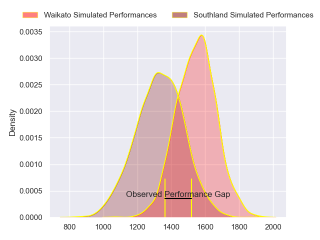
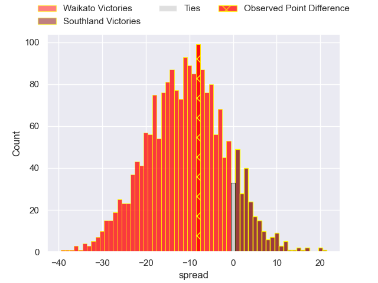
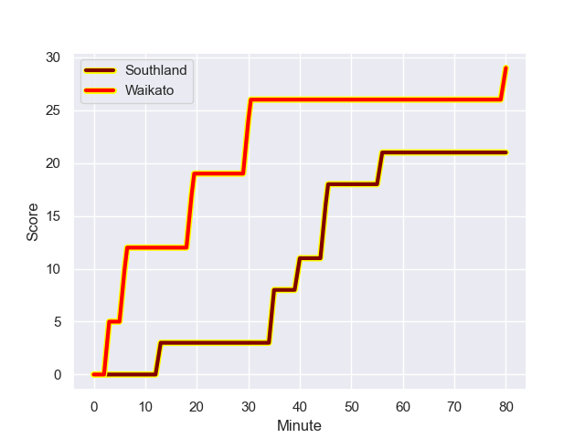
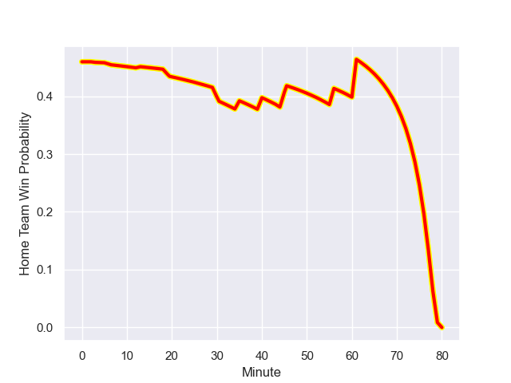

---  
layout: page  
title: Waikato at Southland; 29-21  
date: 2023-08-06 18:00:00 -0500  
categories: match review  
---
# Waikato at Southland; 29-21

# Club Level Predictions

The first set of predictions treats a club as the smallest object, as the club develops its members, organizes a gameplan, and deploys its players as needed for each match. This club model has a prediction of 0.232, which translates to predicting Waikato to win by 11.0.

Each club has a rating and a rating deviation (simiar to a Glicko system), and expected performances can be generated. This allows for simulated matches and spreads like the ones below.
## Projected Performances

## Projected Spreads

## Projected Results

# Player Level Predictions - Version 1

Treating teams instead as an entity made up of the currently active players, I have ratings for each player in an altogether different system. These can be combined to form team ratings once teamsheets are announced, weighting starters a bit higher than the reserves. After the match is played, players can be weighted by their minutes on the field, allowing for an accurate measure of the team's composition. With these compiled team ratings, we can make predictions, measure inaccuracy, and update the individual player ratings.
## Prediction with Player Minutes: Waikato by 3.0

Waikato by 7.0 on a neutral field
## Prediction without Player Minutes: Waikato by 5.3

Waikato by 9.3 on a neutral pitch

## Scores over Time

## Win Probability over Time

There were 10 large changes in win probability in this match

|   Away Minutes | Away Player                  |   Away elo |   Away Percentile |   Number |   Home Percentile |   Home elo | Home Player          |   Home Minutes |
|---------------:|:-----------------------------|-----------:|------------------:|---------:|------------------:|-----------:|:---------------------|---------------:|
|             51 | Colin Ayden Johnstone        |      74.47 |                45 |        1 |                17 |      71.03 | Joe Walsh            |             61 |
|             68 | Pita Alemania Jr Anae-Ah Sue |      76.82 |                48 |        2 |                30 |      70.8  | Jacob Payne          |             26 |
|             68 | George Dyer                  |      79.19 |                50 |        3 |                 6 |      61.17 | Morgan Mitchell      |             61 |
|             80 | James Tucker                 |      91.09 |                68 |        4 |                17 |      69.81 | Danny Drake          |             66 |
|             80 | Hamilton Burr                |      75.1  |                38 |        5 |                17 |      71.86 | Josh Bekhuis         |             80 |
|             51 | Malachi Wrampling-Alec       |      75.86 |                41 |        6 |                14 |      69.65 | Blair Ryall          |             80 |
|             63 | Mitchell Jacobson            |      80.02 |                60 |        7 |                17 |      70.37 | Hayden Michaels      |             63 |
|             80 | Simon Parker                 |      77.87 |                45 |        8 |                17 |      69.99 | Dylan Nel            |             80 |
|             56 | Cortez Lee Ratima            |      74.67 |                40 |        9 |                18 |      70.17 | Jay Renton           |             80 |
|             40 | Josh Ioane                   |      96.03 |                74 |       10 |                30 |      75.32 | Greg Dyer            |             56 |
|             80 | Daniel Sinkinson             |      58.04 |                16 |       11 |                19 |      72.55 | Michael Manson       |             80 |
|             44 | Mason Tupaea                 |      76.15 |                46 |       12 |                23 |      74.72 | Matt Whaanga         |             63 |
|             80 | Gideon Wrampling             |      73.94 |                37 |       13 |                37 |      85.44 | Scott Gregory        |             80 |
|             80 | Bailyn Sullivan              |      74.11 |                38 |       14 |                29 |      72.96 | Viliami Fine         |             80 |
|             80 | Tepaea Cook-Savage           |      74.88 |                38 |       15 |                23 |      71.56 | Rory van Vugt        |             80 |
|             29 | Ollie Norris                 |      93.41 |                77 |       16 |                19 |      70.58 | Jack Taylor          |             54 |
|             29 | Patrick McCurran             |      76.47 |                39 |       17 |               nan |      71.29 | Jonah Aoina          |             19 |
|             17 | Tai Cribb                    |      75.34 |               nan |       18 |               nan |      73.95 | Quinn Harrison-Jones |             19 |
|             24 | Xavier Roe                   |      77.21 |               nan |       19 |               nan |      95.81 | Shneil Singh         |             14 |
|             40 | Taha Kemara                  |      75.59 |                32 |       20 |               nan |      74.57 | Leroy Ferguson       |             17 |
|             36 | Tana Tuhakaraina             |      77.64 |               nan |       21 |                20 |      72.19 | Marty Banks          |             24 |
|             12 | Solomone Tukuafu             |      78.12 |               nan |       22 |                25 |      73.42 | Noah Foster          |             17 |
|             12 | Caleb Ralph                  |      74.29 |               nan |       23 |               nan |     nan    | nan                  |            nan |

# Player Level Predictions - Version 2

Treating teams instead as an entity made up of the currently active players, I have ratings for each player in an altogether different system. These can be combined to form team ratings once teamsheets are announced, weighting starters a bit higher than the reserves. After the match is played, players can be weighted by their minutes on the field, allowing for an accurate measure of the team's composition. With these compiled team ratings, we can make predictions, measure inaccuracy, and update the individual player ratings.
## Prediction with Player Minutes: Southland by 2.2

Waikato by 1.2 on a neutral field
## Prediction without Player Minutes: Southland by 2.1

Waikato by 1.2 on a neutral pitch

|   Away Minutes | Away Player                  |   Away elo |   Away variance |   Number |   Home variance |   Home elo | Home Player          |   Home Minutes |
|---------------:|:-----------------------------|-----------:|----------------:|---------:|----------------:|-----------:|:---------------------|---------------:|
|             51 | Colin Ayden Johnstone        |      46.65 |              50 |        1 |              50 |      46.65 | Joe Walsh            |             61 |
|             68 | Pita Alemania Jr Anae-Ah Sue |      46.65 |              50 |        2 |              50 |      46.65 | Jacob Payne          |             26 |
|             68 | George Dyer                  |      58.3  |              50 |        3 |              50 |      46.65 | Morgan Mitchell      |             61 |
|             80 | James Tucker                 |      66.26 |              50 |        4 |              50 |      46.65 | Danny Drake          |             66 |
|             80 | Hamilton Burr                |      46.65 |              50 |        5 |              50 |      46.65 | Josh Bekhuis         |             80 |
|             51 | Malachi Wrampling-Alec       |      46.65 |              50 |        6 |              50 |      46.65 | Blair Ryall          |             80 |
|             63 | Mitchell Jacobson            |      46.65 |              50 |        7 |              50 |      46.65 | Hayden Michaels      |             63 |
|             80 | Simon Parker                 |      36.65 |              50 |        8 |              50 |      46.65 | Dylan Nel            |             80 |
|             56 | Cortez Lee Ratima            |      46.65 |              50 |        9 |              50 |      46.65 | Jay Renton           |             80 |
|             40 | Josh Ioane                   |      59.17 |              50 |       10 |              50 |      46.65 | Greg Dyer            |             56 |
|             80 | Daniel Sinkinson             |      40.79 |              50 |       11 |              50 |      46.65 | Michael Manson       |             80 |
|             44 | Mason Tupaea                 |      46.65 |              50 |       12 |              50 |      34.11 | Matt Whaanga         |             63 |
|             80 | Gideon Wrampling             |      46.65 |              50 |       13 |              50 |      50.78 | Scott Gregory        |             80 |
|             80 | Bailyn Sullivan              |      46.65 |              50 |       14 |              50 |      46.65 | Viliami Fine         |             80 |
|             80 | Tepaea Cook-Savage           |      46.65 |              50 |       15 |              50 |      46.65 | Rory van Vugt        |             80 |
|             29 | Ollie Norris                 |      62.78 |              50 |       16 |              50 |      46.65 | Jack Taylor          |             54 |
|             29 | Patrick McCurran             |      46.65 |              50 |       17 |              50 |      46.65 | Jonah Aoina          |             19 |
|             17 | Tai Cribb                    |      46.65 |              50 |       18 |              50 |      46.65 | Quinn Harrison-Jones |             19 |
|             24 | Xavier Roe                   |      46.65 |              50 |       19 |              50 |      67.42 | Shneil Singh         |             14 |
|             40 | Taha Kemara                  |      46.65 |              50 |       20 |              50 |      46.65 | Leroy Ferguson       |             17 |
|             36 | Tana Tuhakaraina             |      46.65 |              50 |       21 |              50 |      46.65 | Marty Banks          |             24 |
|             12 | Solomone Tukuafu             |      46.65 |              50 |       22 |              50 |      46.65 | Noah Foster          |             17 |
|             12 | Caleb Ralph                  |      46.65 |              50 |       23 |             nan |     nan    | nan                  |            nan |

