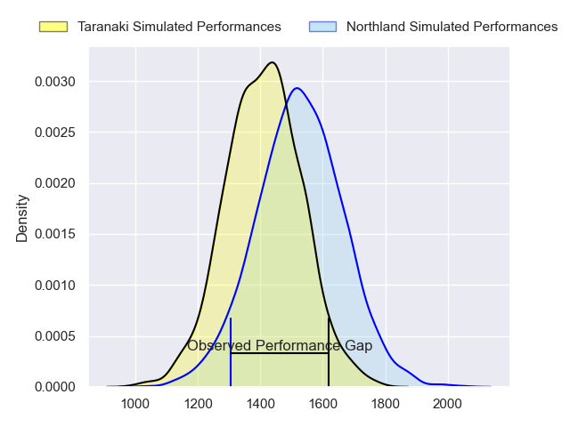
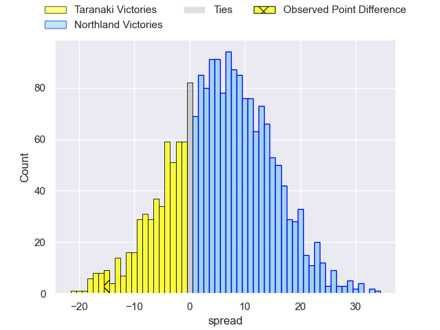
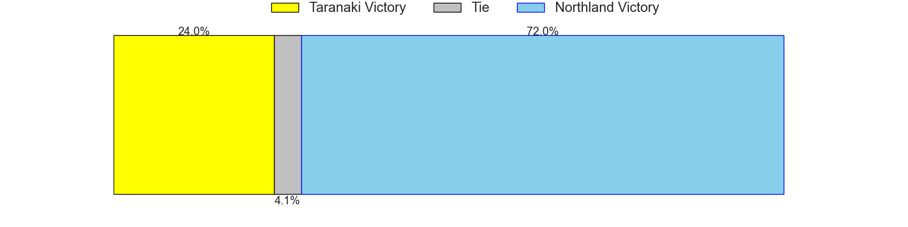
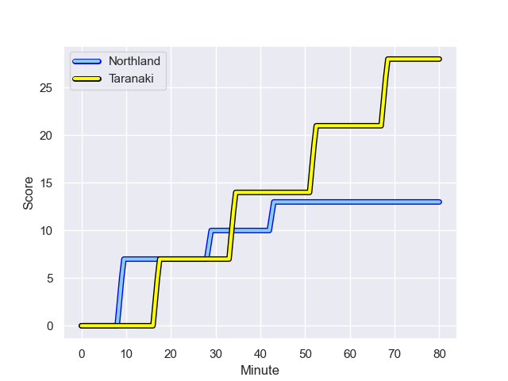
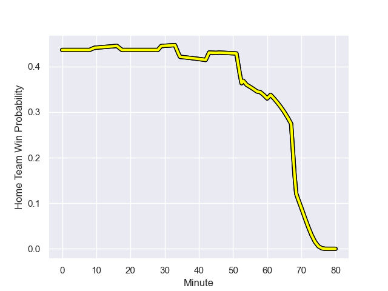

---  
layout: page  
title: Taranaki at Northland; 28-13  
date: 2023-08-09 18:00:00 -0500  
categories: match review  
---
# Taranaki at Northland; 28-13

# Club Level Predictions

The first set of predictions treats a club as the smallest object, as the club develops its members, organizes a gameplan, and deploys its players as needed for each match. This club model has a prediction of 0.654, which translates to predicting Northland to win by 5.9.

Each club has a rating and a rating deviation (simiar to a Glicko system), and expected performances can be generated. This allows for simulated matches and spreads like the ones below.
## Projected Performances

## Projected Spreads

## Projected Results

# Player Level Predictions - Version 1

Treating teams instead as an entity made up of the currently active players, I have ratings for each player in an altogether different system. These can be combined to form team ratings once teamsheets are announced, weighting starters a bit higher than the reserves. After the match is played, players can be weighted by their minutes on the field, allowing for an accurate measure of the team's composition. With these compiled team ratings, we can make predictions, measure inaccuracy, and update the individual player ratings.
## Prediction with Player Minutes: Taranaki by 7.1

Taranaki by 11.1 on a neutral field
## Prediction without Player Minutes: Taranaki by 8.1

Taranaki by 12.1 on a neutral pitch

## Scores over Time

## Win Probability over Time

There were 3 large changes in win probability in this match

|   Away Minutes | Away Player                   |   Away elo |   Away Percentile |   Number |   Home Percentile |   Home elo | Home Player        |   Home Minutes |
|---------------:|:------------------------------|-----------:|------------------:|---------:|------------------:|-----------:|:-------------------|---------------:|
|             58 | Jared Proffit                 |      75.45 |                43 |        1 |                 2 |      46.76 | Jarred Adams       |             53 |
|             58 | Ricky Riccitelli              |      85.29 |                63 |        2 |                17 |      64.82 | Jordan Olsen       |             46 |
|             58 | Reuben O'Neill                |      71.82 |                36 |        3 |                27 |      72.18 | Chris Apoua        |             53 |
|             58 | Jesse Parete                  |      66.5  |                25 |        4 |                19 |      66.43 | Sam Weir Caird     |             60 |
|             80 | Hemopo Cunningham             |      78.83 |                51 |        5 |                 3 |      41.73 | Liam Hallam-Eames  |             80 |
|             70 | Kaylum Boshier                |      78.21 |                52 |        6 |                32 |      68.52 | Rob Rush           |             70 |
|             80 | Tom Florence                  |      54.24 |                13 |        7 |                19 |      66.86 | Jonah Mau'u        |             69 |
|             80 | Pita Gus Sowakula             |      96.71 |                80 |        8 |                25 |      65.53 | Matt Matich        |             80 |
|             54 | Logan Crowley                 |      76.94 |                46 |        9 |                30 |      67.37 | Lisati Milo-Harris |             61 |
|             80 | Josh Jacomb                   |      71.99 |                38 |       10 |                19 |      69.33 | Daniel Hawkins     |             80 |
|             80 | Vereniki Tikoisolomone        |      71.39 |                42 |       11 |                30 |      68.07 | Heremaia Murray    |             80 |
|             54 | Teihorangi Walden             |      59.52 |                15 |       12 |                82 |     102.93 | Jack Goodhue       |             80 |
|             80 | Meihana Grindlay              |      78.4  |                49 |       13 |                74 |      94.27 | Tamati Tua         |             80 |
|             80 | Jacob Ratumaitavuki-Kneepkens |      77.69 |                47 |       14 |                29 |      67.32 | Brady Rush         |             80 |
|             61 | Stephen Perofeta              |     106.75 |                87 |       15 |                15 |      64.65 | Kobie Scutt        |             53 |
|             26 | Matty McKenzie                |      72.49 |                32 |       16 |                30 |      66.52 | Matt Moulds        |             34 |
|             26 | Adam Lennox                   |      73.53 |               nan |       17 |                25 |      65.24 | Rob Cobb           |             27 |
|             22 | Kyle Stewart                  |      69.89 |                23 |       18 |                27 |      65.16 | Rivez Reihana      |             27 |
|             22 | Bradley Slater                |      76.12 |                43 |       19 |                29 |      68.13 | Remsy Lemisio      |             27 |
|             22 | Mitch O'Neill                 |      71.2  |               nan |       20 |                25 |      64.49 | Sean Sweetman      |             20 |
|             22 | Millenium Sanerivi            |      73.69 |                31 |       21 |               nan |      64.19 | Trent Hape         |             19 |
|             19 | Willem Ratu                   |      71.66 |               nan |       22 |                26 |      64.33 | Sam McNamara       |             11 |
|             10 | Arese Poliko                  |      72.82 |                31 |       23 |               nan |      65.79 | Rene Ranger        |             10 |

# Player Level Predictions - Version 2

Treating teams instead as an entity made up of the currently active players, I have ratings for each player in an altogether different system. These can be combined to form team ratings once teamsheets are announced, weighting starters a bit higher than the reserves. After the match is played, players can be weighted by their minutes on the field, allowing for an accurate measure of the team's composition. With these compiled team ratings, we can make predictions, measure inaccuracy, and update the individual player ratings.
## Prediction with Player Minutes: Northland by 2.4

Taranaki by 0.9 on a neutral field
## Prediction without Player Minutes: Northland by 1.8

Taranaki by 1.5 on a neutral pitch

|   Away Minutes | Away Player                   |   Away elo |   Away variance |   Number |   Home variance |   Home elo | Home Player        |   Home Minutes |
|---------------:|:------------------------------|-----------:|----------------:|---------:|----------------:|-----------:|:-------------------|---------------:|
|             58 | Jared Proffit                 |      46.65 |              50 |        1 |              50 |      46.65 | Jarred Adams       |             53 |
|             58 | Ricky Riccitelli              |      44.59 |              50 |        2 |              50 |      46.65 | Jordan Olsen       |             46 |
|             58 | Reuben O'Neill                |      46.65 |              50 |        3 |              50 |      20.17 | Chris Apoua        |             53 |
|             58 | Jesse Parete                  |      46.65 |              50 |        4 |              50 |      46.65 | Sam Weir Caird     |             60 |
|             80 | Hemopo Cunningham             |      46.65 |              50 |        5 |              50 |      46.65 | Liam Hallam-Eames  |             80 |
|             70 | Kaylum Boshier                |      46.65 |              50 |        6 |              50 |      46.65 | Rob Rush           |             70 |
|             80 | Tom Florence                  |      46.65 |              50 |        7 |              50 |      46.65 | Jonah Mau'u        |             69 |
|             80 | Pita Gus Sowakula             |      82.43 |              50 |        8 |              50 |      46.65 | Matt Matich        |             80 |
|             54 | Logan Crowley                 |      46.65 |              50 |        9 |              50 |      46.65 | Lisati Milo-Harris |             61 |
|             80 | Josh Jacomb                   |      46.65 |              50 |       10 |              50 |      46.65 | Daniel Hawkins     |             80 |
|             80 | Vereniki Tikoisolomone        |      46.65 |              50 |       11 |              50 |      46.65 | Heremaia Murray    |             80 |
|             54 | Teihorangi Walden             |      46.65 |              50 |       12 |              50 |     108.02 | Jack Goodhue       |             80 |
|             80 | Meihana Grindlay              |      46.65 |              50 |       13 |              50 |      52.03 | Tamati Tua         |             80 |
|             80 | Jacob Ratumaitavuki-Kneepkens |      46.65 |              50 |       14 |              50 |      46.65 | Brady Rush         |             80 |
|             61 | Stephen Perofeta              |      95.46 |              50 |       15 |              50 |      46.65 | Kobie Scutt        |             53 |
|             26 | Matty McKenzie                |      46.65 |              50 |       16 |              50 |      46.65 | Matt Moulds        |             34 |
|             26 | Adam Lennox                   |      46.65 |              50 |       17 |              50 |      46.65 | Rob Cobb           |             27 |
|             22 | Kyle Stewart                  |      46.65 |              50 |       18 |              50 |      46.65 | Rivez Reihana      |             27 |
|             22 | Bradley Slater                |      46.65 |              50 |       19 |              50 |      46.65 | Remsy Lemisio      |             27 |
|             22 | Mitch O'Neill                 |      46.65 |              50 |       20 |              50 |      46.65 | Sean Sweetman      |             20 |
|             22 | Millenium Sanerivi            |      46.65 |              50 |       21 |              50 |      46.65 | Trent Hape         |             19 |
|             19 | Willem Ratu                   |      46.65 |              50 |       22 |              50 |      46.65 | Sam McNamara       |             11 |
|             10 | Arese Poliko                  |      46.65 |              50 |       23 |              50 |      46.65 | Rene Ranger        |             10 |

