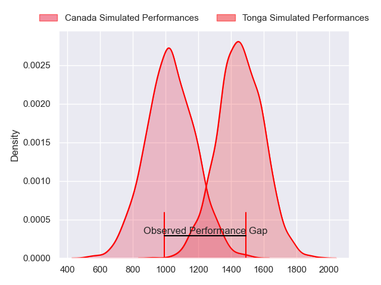
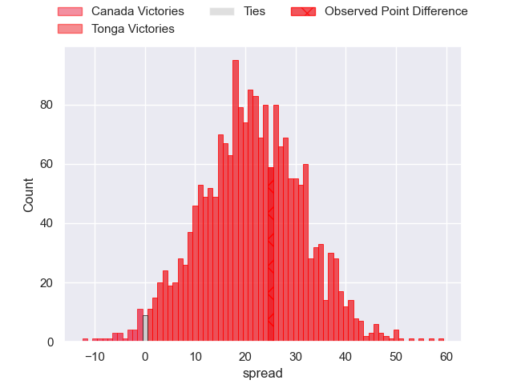
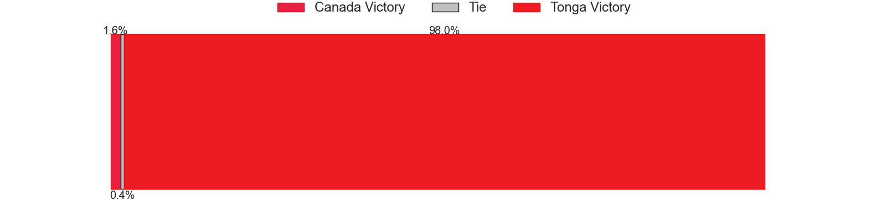
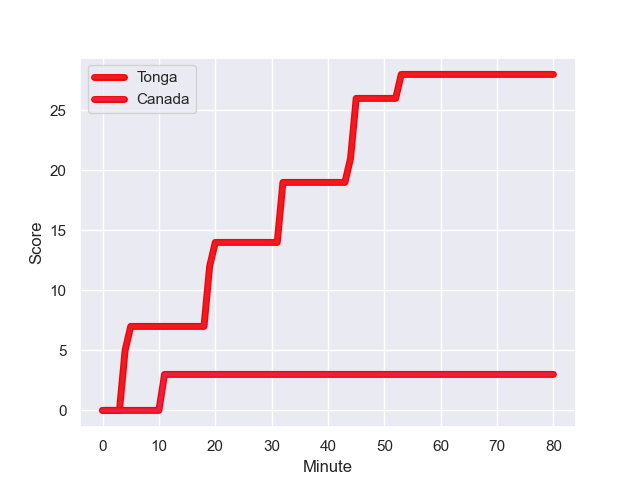
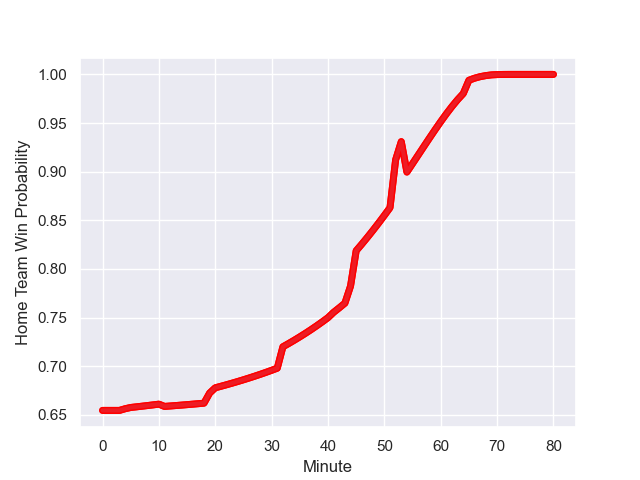

---  
layout: page  
title: Canada at Tonga; 3.0-28.0  
date: 2023-08-09 18:00:00 -0500  
categories: match review  
---
# Canada at Tonga; 3.0-28.0

# Club Level Predictions

The first set of predictions treats a club as the smallest object, as the club develops its members, organizes a gameplan, and deploys its players as needed for each match. This club model has a prediction of 0.901, which translates to predicting Tonga to win by 21.3.

Each club has a rating and a rating deviation (simiar to a Glicko system), and expected performances can be generated. This allows for simulated matches and spreads like the ones below.
## Projected Performances

## Projected Spreads

## Projected Results

# Player Level Predictions - Version 1

Treating teams instead as an entity made up of the currently active players, I have ratings for each player in an altogether different system. These can be combined to form team ratings once teamsheets are announced, weighting starters a bit higher than the reserves. After the match is played, players can be weighted by their minutes on the field, allowing for an accurate measure of the team's composition. With these compiled team ratings, we can make predictions, measure inaccuracy, and update the individual player ratings.
## Prediction with Player Minutes: Tonga by 31.8

Tonga by 27.8 on a neutral field
## Prediction without Player Minutes: Tonga by 30.1

Tonga by 26.1 on a neutral pitch

## Scores over Time

## Win Probability over Time

There were 3 large changes in win probability in this match

|   Away Minutes | Away Player         |   Away elo |   Away Percentile |   Number |   Home Percentile |   Home elo | Home Player         |   Home Minutes |
|---------------:|:--------------------|-----------:|------------------:|---------:|------------------:|-----------:|:--------------------|---------------:|
|             41 | Liam Murray         |      66.93 |                23 |        1 |                90 |     106.54 | Tau Koloamatangi    |             41 |
|             65 | Andrew Quattrin     |      61.18 |                20 |        2 |                48 |      85.65 | Sam Moli            |             80 |
|             41 | Conor Young         |      62.07 |                17 |        3 |                50 |      83.67 | David Lolohea       |             41 |
|             80 | Izzak Kelly         |      65.59 |                28 |        4 |                73 |      96.19 | Steve Mafi          |             69 |
|             80 | Conor Keys          |      65.53 |                28 |        5 |                46 |      85.81 | Tanginoa Halaifonua |             80 |
|             52 | Mason Flesch        |      41.75 |                 3 |        6 |                29 |      72.81 | Solomone Funaki     |             80 |
|             73 | Lucas Rumball       |      91.04 |                78 |        7 |                35 |      78.66 | Sione Havili        |             80 |
|             69 | Siaki Vikilani      |      59.88 |                19 |        8 |                32 |      75.9  | Sione Vailanu       |             54 |
|             74 | Ross Braude         |      74.51 |                52 |        9 |                43 |      79.94 | Sonatane Takulua    |             80 |
|             80 | Robbie Povey        |     100.37 |                82 |       10 |                37 |      83.87 | Patrick Pellegrini  |             80 |
|             80 | Isaac Olson         |      59.98 |                22 |       11 |                17 |      65    | Fine Inisi          |             80 |
|             80 | Spencer Jones       |      71.8  |                40 |       12 |                57 |      91.35 | George Moala        |             80 |
|             53 | Ben LeSage          |      76.25 |                51 |       13 |                88 |     113.35 | Malakai Fekitoa     |             80 |
|             80 | Kainoa Lloyd        |      72.52 |                42 |       14 |                60 |      88.54 | Kyren Taumoefolau   |             69 |
|             80 | Peter Nelson        |      96.39 |                81 |       15 |                42 |      83    | Afusipa Taumoepeau  |             64 |
|             15 | Foster Dewitt       |      64.77 |               nan |       16 |                62 |      83.9  | Paula Ngauamo       |             37 |
|             39 | Djustice Sears-Duru |      62.01 |                16 |       17 |                80 |      90.24 | Feao Fotuaika       |             39 |
|             39 | Cole Keith          |      71.04 |                30 |       18 |                93 |     105.95 | Ben Tameifuna       |             39 |
|             28 | Piers Von Dadelszen |      64.92 |               nan |       19 |                96 |     120.86 | Vaea Fifita         |             11 |
|              7 | Sion Parry          |      65.07 |                19 |       20 |                84 |      98.67 | Lopeti Timani       |             26 |
|             11 | Travis Larsen       |      65.23 |               nan |       21 |               nan |      85.46 | Johnny Ika          |              0 |
|              6 | Jason Higgins       |      40.44 |                 0 |       22 |                64 |      86.83 | Otumaka Mausia      |             11 |
|             27 | Mitchell Richardson |      65.41 |                21 |       23 |                85 |     102.27 | Solomone Kata       |             16 |

# Player Level Predictions - Version 2

Treating teams instead as an entity made up of the currently active players, I have ratings for each player in an altogether different system. These can be combined to form team ratings once teamsheets are announced, weighting starters a bit higher than the reserves. After the match is played, players can be weighted by their minutes on the field, allowing for an accurate measure of the team's composition. With these compiled team ratings, we can make predictions, measure inaccuracy, and update the individual player ratings.
## Prediction with Player Minutes: Tonga by 13.5

Tonga by 10.4 on a neutral field
## Prediction without Player Minutes: Tonga by 13.5

Tonga by 10.4 on a neutral pitch

|   Away Minutes | Away Player         |   Away elo |   Away variance |   Number |   Home variance |   Home elo | Home Player         |   Home Minutes |
|---------------:|:--------------------|-----------:|----------------:|---------:|----------------:|-----------:|:--------------------|---------------:|
|             41 | Liam Murray         |     -36.12 |           50    |        1 |           49.93 |      45.81 | Tau Koloamatangi    |             41 |
|             65 | Andrew Quattrin     |      45.83 |           50    |        2 |           50    |      46.65 | Sam Moli            |             80 |
|             41 | Conor Young         |      46.65 |           50    |        3 |           49.97 |      46.81 | David Lolohea       |             41 |
|             80 | Izzak Kelly         |      46.65 |           50    |        4 |           49.87 |      45.47 | Steve Mafi          |             69 |
|             80 | Conor Keys          |      71.62 |           47.95 |        5 |           45.38 |      53.55 | Tanginoa Halaifonua |             80 |
|             52 | Mason Flesch        |      46.65 |           50    |        6 |           48.07 |      45.4  | Solomone Funaki     |             80 |
|             73 | Lucas Rumball       |     -40.6  |           50    |        7 |           48.54 |      75.78 | Sione Havili        |             80 |
|             69 | Siaki Vikilani      |      26.74 |           50    |        8 |           49.94 |      51.83 | Sione Vailanu       |             54 |
|             74 | Ross Braude         |      64.1  |           50    |        9 |           49.84 |      47.63 | Sonatane Takulua    |             80 |
|             80 | Robbie Povey        |      77.83 |           50    |       10 |           50    |      46.65 | Patrick Pellegrini  |             80 |
|             80 | Isaac Olson         |      46.65 |           50    |       11 |           49.11 |       3    | Fine Inisi          |             80 |
|             80 | Spencer Jones       |      46.65 |           50    |       12 |           50    |      77.15 | George Moala        |             80 |
|             53 | Ben LeSage          |      46.65 |           50    |       13 |           49.75 |      82.68 | Malakai Fekitoa     |             80 |
|             80 | Kainoa Lloyd        |      40.63 |           50    |       14 |           49.85 |      47.57 | Kyren Taumoefolau   |             69 |
|             80 | Peter Nelson        |      26.92 |           50    |       15 |           49.6  |      76.89 | Afusipa Taumoepeau  |             64 |
|             15 | Foster Dewitt       |      46.65 |           50    |       16 |           49.97 |      63.62 | Paula Ngauamo       |             37 |
|             39 | Djustice Sears-Duru |     -25.34 |           50    |       17 |           49.35 |      43.5  | Feao Fotuaika       |             39 |
|             39 | Cole Keith          |     100.56 |           48.75 |       18 |           47.8  |      88.52 | Ben Tameifuna       |             39 |
|             28 | Piers Von Dadelszen |      46.65 |           50    |       19 |           49.66 |     108.26 | Vaea Fifita         |             11 |
|              7 | Sion Parry          |      46.65 |           50    |       20 |           49.89 |      65.46 | Lopeti Timani       |             26 |
|             11 | Travis Larsen       |      46.65 |           50    |       21 |           50    |      46.65 | Johnny Ika          |              0 |
|              6 | Jason Higgins       |      -7.11 |           50    |       22 |           49.77 |      36.74 | Otumaka Mausia      |             11 |
|             27 | Mitchell Richardson |      46.65 |           50    |       23 |           49.66 |      42.66 | Solomone Kata       |             16 |

