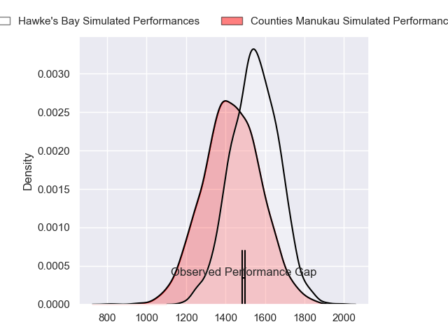
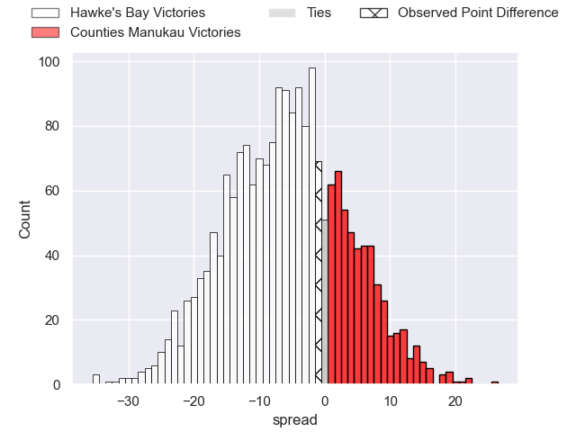
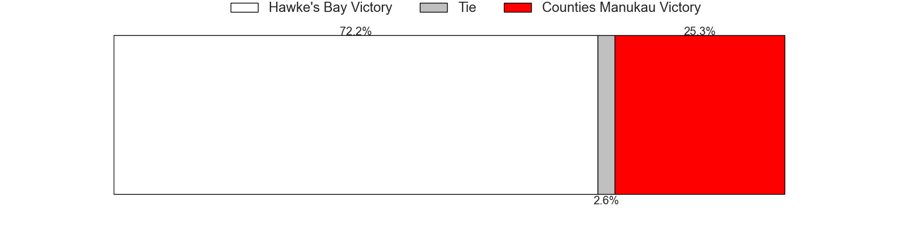
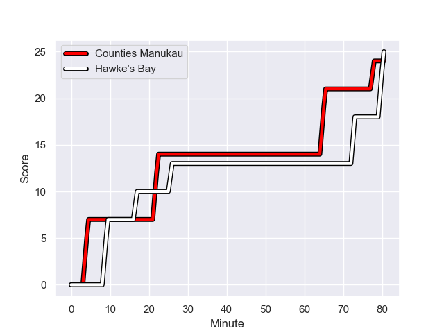
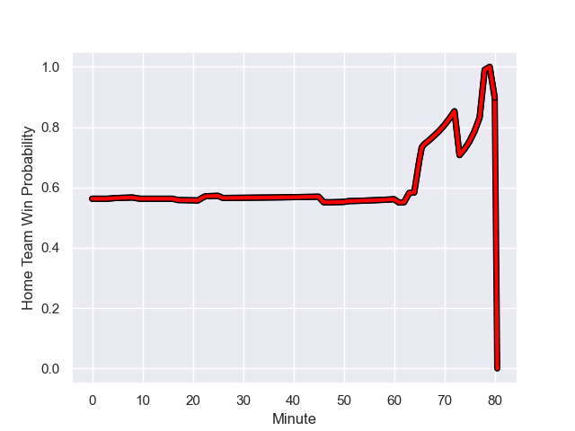

---  
layout: page  
title: Hawke's Bay at Counties Manukau; 25-24  
date: 2023-08-11 18:00:00 -0500  
categories: match review  
---
# Hawke's Bay at Counties Manukau; 25-24

# Club Level Predictions

The first set of predictions treats a club as the smallest object, as the club develops its members, organizes a gameplan, and deploys its players as needed for each match. This club model has a prediction of 0.345, which translates to predicting Hawke's Bay to win by 6.0.

Each club has a rating and a rating deviation (simiar to a Glicko system), and expected performances can be generated. This allows for simulated matches and spreads like the ones below.
## Projected Performances

## Projected Spreads

## Projected Results

# Player Level Predictions - Version 1

Treating teams instead as an entity made up of the currently active players, I have ratings for each player in an altogether different system. These can be combined to form team ratings once teamsheets are announced, weighting starters a bit higher than the reserves. After the match is played, players can be weighted by their minutes on the field, allowing for an accurate measure of the team's composition. With these compiled team ratings, we can make predictions, measure inaccuracy, and update the individual player ratings.
## Prediction with Player Minutes: Counties Manukau by 14.9

Counties Manukau by 10.9 on a neutral field
## Prediction without Player Minutes: Counties Manukau by 14.5

Counties Manukau by 10.5 on a neutral pitch

## Scores over Time

## Win Probability over Time

There were 10 large changes in win probability in this match

|   Away Minutes | Away Player                |   Away elo |   Away Percentile |   Number |   Home Percentile |   Home elo | Home Player        |   Home Minutes |
|---------------:|:---------------------------|-----------:|------------------:|---------:|------------------:|-----------:|:-------------------|---------------:|
|             51 | Pouri Gordon Rakete-Stones |      74.77 |       1.01675e+06 |        1 |       1.01661e+06 |      82.62 | Kauvaka Kaivelata  |             51 |
|             51 | Jacob Devery               |      86.24 |  878500           |        2 |       1.0166e+06  |      90.2  | Ian West-Stevens   |             63 |
|             51 | Joel Hintz                 |      66.04 |       1.01507e+06 |        3 |       1.01664e+06 |      83.57 | Suetena Asomua     |             47 |
|             80 | Frank Lochore              |      71.9  |       1.01678e+06 |        4 |       1.0166e+06  |      82.08 | Jimmy Tupou        |             80 |
|             46 | Tom Parsons                |      70.55 |       1.01679e+06 |        5 |       1.01658e+06 |      87.2  | James Thompson     |             63 |
|             69 | Siosiua (Josh) Kaifa       |      72.6  |       1.01679e+06 |        6 |       1.01663e+06 |      82.45 | Ma'amai Vaipulu    |             51 |
|             80 | Sam Smith                  |      76.8  |       1.01677e+06 |        7 |       1.01663e+06 |      78.8  | Sean Reidy         |             80 |
|             80 | Devan Flanders             |      76.75 |  915193           |        8 |  894055           |     112.14 | Hoskins Sotutu     |             80 |
|             63 | Brad Weber                 |     135.9  |  696458           |        9 |       1.01664e+06 |      78.78 | Liam Daniela       |             66 |
|             80 | Lincoln McClutchie         |      72.18 |       1.01676e+06 |       10 |       1.01663e+06 |      78.52 | Riley Hohepa       |             80 |
|             80 | Anzelo Tuitavuki           |      74.95 |       1.01708e+06 |       11 |  643611           |     125.27 | Toni Pulu          |             80 |
|             80 | Ollie Sapsford             |      82.45 |  944071           |       12 |       1.01663e+06 |      79.76 | Nikolai Foliaki    |             61 |
|             63 | Nicholas Grigg             |      78.59 |       1.01675e+06 |       13 |       1.01664e+06 |      84.37 | Tevita Ofa         |             80 |
|             80 | Jonah Lowe                 |      81.34 |  797353           |       14 |       1.01663e+06 |      79.41 | Peniasi Malimali   |             71 |
|             63 | Harry Godfrey              |      71.16 |       1.01678e+06 |       15 |  920052           |      82.07 | Etene Nanai-Seturo |             80 |
|             29 | Timothy John Farrell       |      75.94 |     nan           |       16 |       1.01664e+06 |      81.99 | Salesi Tuifua      |             33 |
|             29 | Isaac Salmon               |      48.97 |       1.01617e+06 |       17 |  921972           |      75.08 | Ezekiel Lindenmuth |             29 |
|             29 | Tyrone Thompson            |      88.49 |  987098           |       18 |     nan           |      80.82 | Nicholas Muli      |             17 |
|             34 | Isaia Walker-Leawere       |     104.77 |  828229           |       19 |     nan           |      90.73 | Alex McRobbie      |             17 |
|             11 | Patrick Tuifua             |      75.12 |     nan           |       20 |     nan           |      80.45 | Viliami Taulani    |             29 |
|             17 | Folau Fakatava             |      73.65 |       1.01678e+06 |       21 |       1.01489e+06 |      57.36 | AJ Alatimu         |             19 |
|             17 | Chase Tiatia               |      82.63 |  741034           |       22 |     nan           |      80.63 | Blake Makiri       |              9 |
|             17 | Caleb Makene               |      68.91 |       1.01477e+06 |       23 |     nan           |      89.08 | Kanavale Helu      |             14 |

# Player Level Predictions - Version 2

Treating teams instead as an entity made up of the currently active players, I have ratings for each player in an altogether different system. These can be combined to form team ratings once teamsheets are announced, weighting starters a bit higher than the reserves. After the match is played, players can be weighted by their minutes on the field, allowing for an accurate measure of the team's composition. With these compiled team ratings, we can make predictions, measure inaccuracy, and update the individual player ratings.
## Prediction with Player Minutes: Counties Manukau by 2.3

Hawke's Bay by 1.0 on a neutral field
## Prediction without Player Minutes: Counties Manukau by 2.1

Hawke's Bay by 1.2 on a neutral pitch

|   Away Minutes | Away Player                |   Away elo |   Away variance |   Number |   Home variance |   Home elo | Home Player        |   Home Minutes |
|---------------:|:---------------------------|-----------:|----------------:|---------:|----------------:|-----------:|:-------------------|---------------:|
|             51 | Pouri Gordon Rakete-Stones |      46.65 |              50 |        1 |              50 |      46.65 | Kauvaka Kaivelata  |             51 |
|             51 | Jacob Devery               |      60.13 |              50 |        2 |              50 |      46.65 | Ian West-Stevens   |             63 |
|             51 | Joel Hintz                 |      46.65 |              50 |        3 |              50 |      46.65 | Suetena Asomua     |             47 |
|             80 | Frank Lochore              |      46.65 |              50 |        4 |              50 |      46.65 | Jimmy Tupou        |             80 |
|             46 | Tom Parsons                |      46.65 |              50 |        5 |              50 |      46.65 | James Thompson     |             63 |
|             69 | Siosiua (Josh) Kaifa       |      46.65 |              50 |        6 |              50 |      46.65 | Ma'amai Vaipulu    |             51 |
|             80 | Sam Smith                  |      46.65 |              50 |        7 |              50 |      46.65 | Sean Reidy         |             80 |
|             80 | Devan Flanders             |      59.92 |              50 |        8 |              50 |      90.84 | Hoskins Sotutu     |             80 |
|             63 | Brad Weber                 |     102.51 |              50 |        9 |              50 |      46.65 | Liam Daniela       |             66 |
|             80 | Lincoln McClutchie         |      46.65 |              50 |       10 |              50 |      46.65 | Riley Hohepa       |             80 |
|             80 | Anzelo Tuitavuki           |      46.65 |              50 |       11 |              50 |      85.27 | Toni Pulu          |             80 |
|             80 | Ollie Sapsford             |      51.82 |              50 |       12 |              50 |      46.65 | Nikolai Foliaki    |             61 |
|             63 | Nicholas Grigg             |      46.65 |              50 |       13 |              50 |      46.65 | Tevita Ofa         |             80 |
|             80 | Jonah Lowe                 |      46.03 |              50 |       14 |              50 |      46.65 | Peniasi Malimali   |             71 |
|             63 | Harry Godfrey              |      46.65 |              50 |       15 |              50 |      39.38 | Etene Nanai-Seturo |             80 |
|             29 | Timothy John Farrell       |      46.65 |              50 |       16 |              50 |      46.65 | Salesi Tuifua      |             33 |
|             29 | Isaac Salmon               |      46.65 |              50 |       17 |              50 |      15.56 | Ezekiel Lindenmuth |             29 |
|             29 | Tyrone Thompson            |      42.66 |              50 |       18 |              50 |      46.65 | Nicholas Muli      |             17 |
|             34 | Isaia Walker-Leawere       |      88.27 |              50 |       19 |              50 |      46.65 | Alex McRobbie      |             17 |
|             11 | Patrick Tuifua             |      46.65 |              50 |       20 |              50 |      46.65 | Viliami Taulani    |             29 |
|             17 | Folau Fakatava             |      46.65 |              50 |       21 |              50 |      46.65 | AJ Alatimu         |             19 |
|             17 | Chase Tiatia               |      55.23 |              50 |       22 |              50 |      46.65 | Blake Makiri       |              9 |
|             17 | Caleb Makene               |      46.65 |              50 |       23 |              50 |      46.65 | Kanavale Helu      |             14 |

