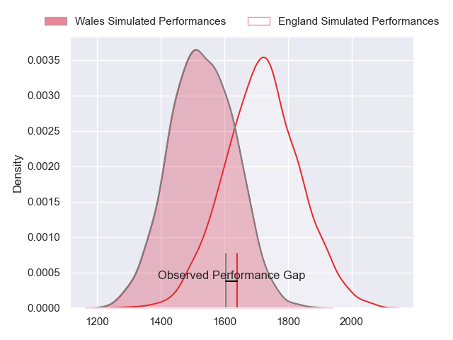
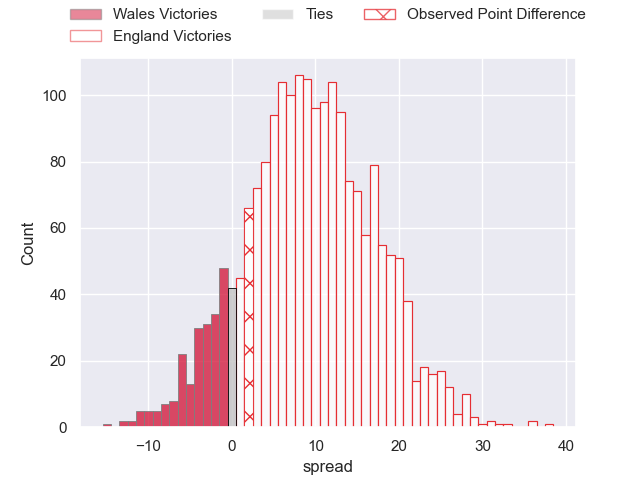
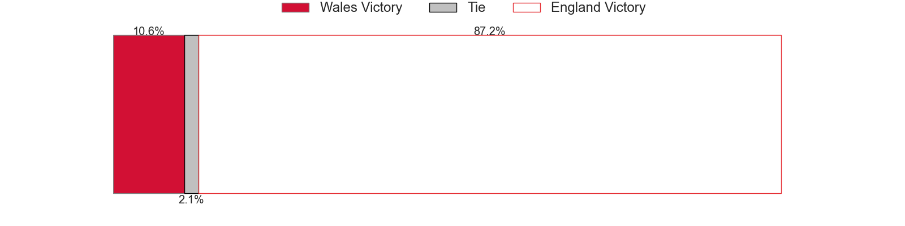
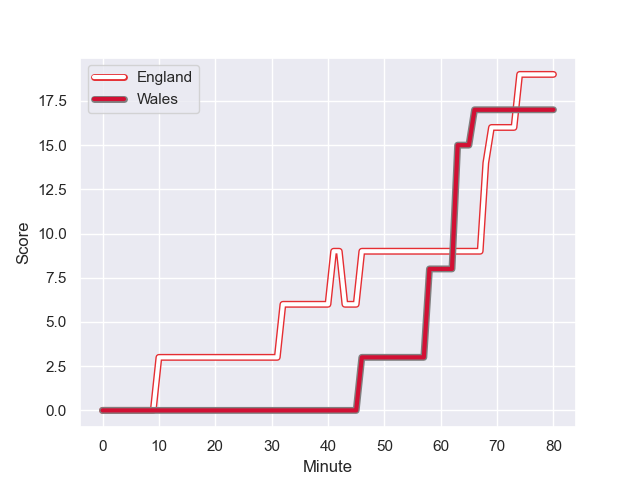
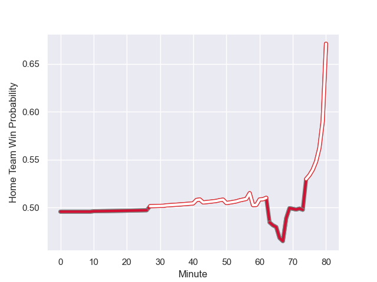

---  
layout: page  
title: Wales at England; 17.0-19.0  
date: 2023-08-11 18:00:00 -0500  
categories: match review  
---
# Wales at England; 17.0-19.0

# Club Level Predictions

The first set of predictions treats a club as the smallest object, as the club develops its members, organizes a gameplan, and deploys its players as needed for each match. This club model has a prediction of 0.743, which translates to predicting England to win by 9.7.

Each club has a rating and a rating deviation (simiar to a Glicko system), and expected performances can be generated. This allows for simulated matches and spreads like the ones below.
## Projected Performances

## Projected Spreads

## Projected Results

# Player Level Predictions - Version 1

Treating teams instead as an entity made up of the currently active players, I have ratings for each player in an altogether different system. These can be combined to form team ratings once teamsheets are announced, weighting starters a bit higher than the reserves. After the match is played, players can be weighted by their minutes on the field, allowing for an accurate measure of the team's composition. With these compiled team ratings, we can make predictions, measure inaccuracy, and update the individual player ratings.
## Prediction with Player Minutes: England by 3.2

Wales by 0.8 on a neutral field
## Prediction without Player Minutes: England by 0.5

Wales by 3.5 on a neutral pitch

## Scores over Time

## Win Probability over Time

There were 4 large changes in win probability in this match

|   Away Minutes | Away Player     |   Away elo |   Away Percentile |   Number |   Home Percentile |   Home elo | Home Player         |   Home Minutes |
|---------------:|:----------------|-----------:|------------------:|---------:|------------------:|-----------:|:--------------------|---------------:|
|             50 | Gareth Thomas   |      92.2  |       1.01709e+06 |        1 |   439468          |      78.46 | Joe Marler          |             54 |
|             27 | Dewi Lake       |      94.28 |       1.01709e+06 |        2 |   437550          |     134.44 | Jamie George        |             80 |
|             50 | Tomas Francis   |      92.7  |       1.01709e+06 |        3 |   854112          |      63.52 | Will Stuart         |             57 |
|             66 | Rhys Davies     |      94.67 |       1.01709e+06 |        4 |   669313          |      98.51 | Maro Itoje          |             80 |
|             80 | Adam Beard      |      92.45 |       1.01709e+06 |        5 |   960687          |      84.76 | George Martin       |             80 |
|             80 | Dan Lydiate     |     129.82 |  318444           |        6 |   376232          |      86.02 | Courtney Lawes      |             80 |
|             80 | Tommy Reffell   |      91.54 |       1.0171e+06  |        7 |   855694          |     104.58 | Ben Earl            |             80 |
|             48 | Taine Plumtree  |      86.01 |  979536           |        8 |   539605          |     102.9  | Billy Vunipola      |             62 |
|             72 | Tomos Williams  |     105.99 |  712555           |        9 |   959331          |     101.81 | Jack van Poortvliet |             32 |
|             50 | Owen Williams   |      93.92 |       1.01709e+06 |       10 |   378425          |     135.49 | Owen Farrell        |             80 |
|             80 | Tom Rogers      |      91.75 |       1.0171e+06  |       11 |   527631          |     103.02 | Elliot Daly         |             80 |
|             60 | Nick Tompkins   |     144.11 |  660698           |       12 |   898254          |      79.56 | Ollie Lawrence      |             72 |
|             80 | Joe Roberts     |      93.27 |       1.01709e+06 |       13 |   779024          |      86.9  | Joe Marchant        |             80 |
|             80 | Josh Adams      |      93.58 |       1.01709e+06 |       14 |        1.0171e+06 |      90.28 | Henry Arundell      |             57 |
|             80 | Liam Williams   |      92.98 |       1.01709e+06 |       15 |   934615          |      97.89 | Freddie Steward     |             80 |
|             53 | Sam Parry       |      54.91 |  595407           |       16 |   991650          |      86.88 | Theo Dan            |              0 |
|             30 | Kemsley Mathias |      95.1  |     nan           |       17 |   814131          |      82.17 | Ellis Genge         |             26 |
|             30 | Dillon Lewis    |      95.58 |     nan           |       18 |      nan          |      90.08 | Dan Cole            |             23 |
|             30 | Christ Tshiunza |      84.5  |  989010           |       19 |   709445          |      83.67 | Jonny Hill          |              0 |
|             16 | Taine Basham    |      82.49 |  903739           |       20 |   854213          |     114.94 | Jack Willis         |             18 |
|              8 | Gareth Davies   |      80.79 |  411784           |       21 |   302402          |      85.74 | Ben Youngs          |             48 |
|             30 | Dan Biggar      |     136.9  |  367304           |       22 |   434886          |     111.86 | George Ford         |             23 |
|             20 | Keiran Williams |      91.97 |     nan           |       23 |   771993          |      72.65 | Max Malins          |              8 |

# Player Level Predictions - Version 2

Treating teams instead as an entity made up of the currently active players, I have ratings for each player in an altogether different system. These can be combined to form team ratings once teamsheets are announced, weighting starters a bit higher than the reserves. After the match is played, players can be weighted by their minutes on the field, allowing for an accurate measure of the team's composition. With these compiled team ratings, we can make predictions, measure inaccuracy, and update the individual player ratings.
## Prediction with Player Minutes: England by 25.1

England by 21.4 on a neutral field
## Prediction without Player Minutes: England by 23.2

England by 19.5 on a neutral pitch

|   Away Minutes | Away Player     |   Away elo |   Away variance |   Number |   Home variance |   Home elo | Home Player         |   Home Minutes |
|---------------:|:----------------|-----------:|----------------:|---------:|----------------:|-----------:|:--------------------|---------------:|
|             50 | Gareth Thomas   |      46.65 |              50 |        1 |           50    |     107.79 | Joe Marler          |             54 |
|             27 | Dewi Lake       |      46.65 |              50 |        2 |           50    |     115.23 | Jamie George        |             80 |
|             50 | Tomas Francis   |      46.65 |              50 |        3 |           50    |      38.48 | Will Stuart         |             57 |
|             66 | Rhys Davies     |      46.65 |              50 |        4 |           50    |     114.52 | Maro Itoje          |             80 |
|             80 | Adam Beard      |      46.65 |              50 |        5 |           50    |      83.37 | George Martin       |             80 |
|             80 | Dan Lydiate     |      51.53 |              50 |        6 |           50    |     102.76 | Courtney Lawes      |             80 |
|             80 | Tommy Reffell   |      46.65 |              50 |        7 |           50    |      95.95 | Ben Earl            |             80 |
|             48 | Taine Plumtree  |      61.29 |              50 |        8 |           50    |     127.83 | Billy Vunipola      |             62 |
|             72 | Tomos Williams  |      74.76 |              50 |        9 |           50    |      58.54 | Jack van Poortvliet |             32 |
|             50 | Owen Williams   |      46.65 |              50 |       10 |           50    |     141.24 | Owen Farrell        |             80 |
|             80 | Tom Rogers      |      46.65 |              50 |       11 |           50    |      63.83 | Elliot Daly         |             80 |
|             60 | Nick Tompkins   |     101.98 |              50 |       12 |           50    |      60.29 | Ollie Lawrence      |             72 |
|             80 | Joe Roberts     |      46.65 |              50 |       13 |           50    |      93.18 | Joe Marchant        |             80 |
|             80 | Josh Adams      |      46.65 |              50 |       14 |           50    |      46.65 | Henry Arundell      |             57 |
|             80 | Liam Williams   |      46.65 |              50 |       15 |           49.59 |      63.33 | Freddie Steward     |             80 |
|             53 | Sam Parry       |      40.01 |              50 |       16 |           50    |      50.11 | Theo Dan            |              0 |
|             30 | Kemsley Mathias |      46.65 |              50 |       17 |           50    |      51.82 | Ellis Genge         |             26 |
|             30 | Dillon Lewis    |      46.65 |              50 |       18 |           50    |      46.65 | Dan Cole            |             23 |
|             30 | Christ Tshiunza |      38.82 |              50 |       19 |           50    |      45.75 | Jonny Hill          |              0 |
|             16 | Taine Basham    |      45.68 |              50 |       20 |           49.92 |      91.51 | Jack Willis         |             18 |
|              8 | Gareth Davies   |      34.79 |              50 |       21 |           50    |      80.28 | Ben Youngs          |             48 |
|             30 | Dan Biggar      |     122.8  |              50 |       22 |           50    |     101.37 | George Ford         |             23 |
|             20 | Keiran Williams |      46.65 |              50 |       23 |           50    |      64.89 | Max Malins          |              8 |

