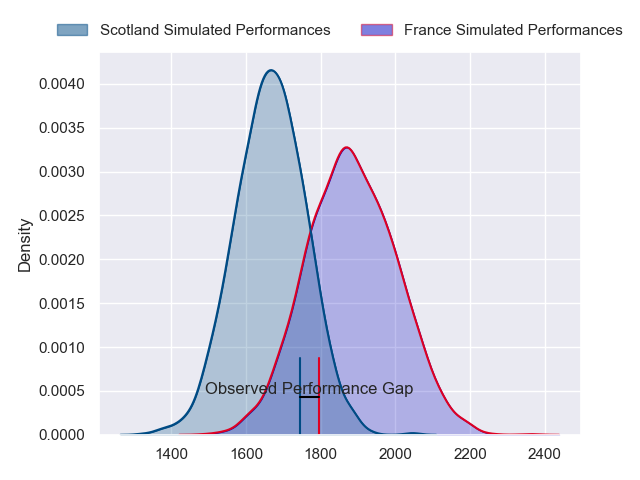
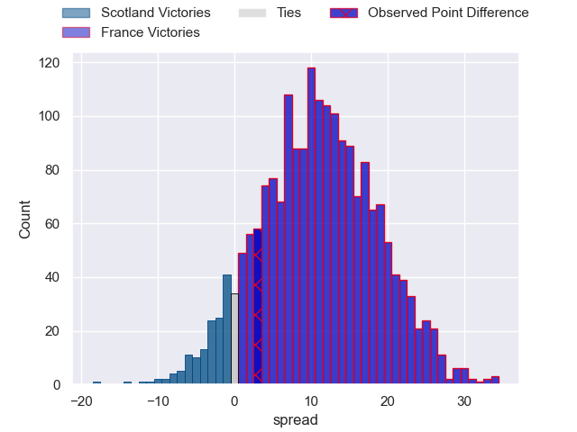
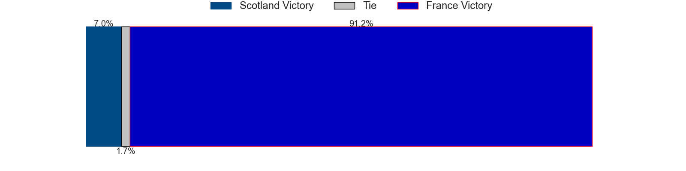
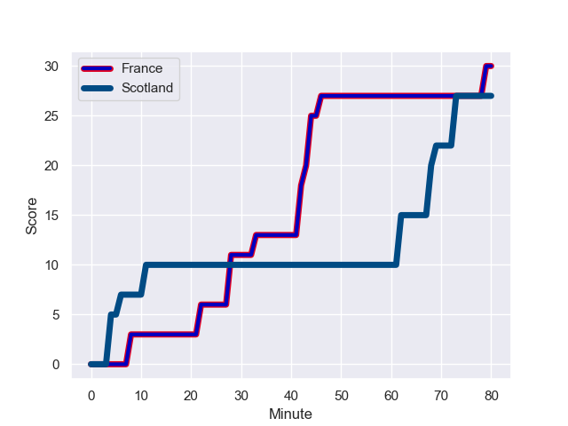
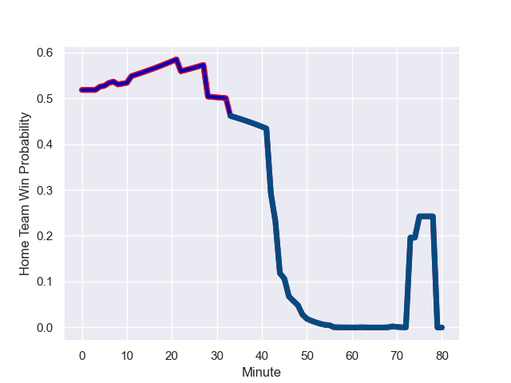

---  
layout: page  
title: Scotland at France; 27.0-30.0  
date: 2023-08-11 18:00:00 -0500  
categories: match review  
---
# Scotland at France; 27.0-30.0

# Club Level Predictions

The first set of predictions treats a club as the smallest object, as the club develops its members, organizes a gameplan, and deploys its players as needed for each match. This club model has a prediction of 0.771, which translates to predicting France to win by 11.0.

Each club has a rating and a rating deviation (simiar to a Glicko system), and expected performances can be generated. This allows for simulated matches and spreads like the ones below.
## Projected Performances

## Projected Spreads

## Projected Results

# Player Level Predictions - Version 1

Treating teams instead as an entity made up of the currently active players, I have ratings for each player in an altogether different system. These can be combined to form team ratings once teamsheets are announced, weighting starters a bit higher than the reserves. After the match is played, players can be weighted by their minutes on the field, allowing for an accurate measure of the team's composition. With these compiled team ratings, we can make predictions, measure inaccuracy, and update the individual player ratings.
## Prediction with Player Minutes: France by 7.1

France by 3.1 on a neutral field
## Prediction without Player Minutes: France by 6.1

France by 2.1 on a neutral pitch

## Scores over Time

## Win Probability over Time

There were 10 large changes in win probability in this match

|   Away Minutes | Away Player         |   Away elo |   Away Percentile |   Number |   Home Percentile |   Home elo | Home Player          |   Home Minutes |
|---------------:|:--------------------|-----------:|------------------:|---------:|------------------:|-----------:|:---------------------|---------------:|
|             55 | Pierre Schoeman     |      67.5  |            794640 |        1 |       1.01673e+06 |      90.26 | Cyril Baille         |             49 |
|             55 | George Turner       |     109.2  |            717286 |        2 |       1.01611e+06 |      93.12 | Julien Marchand      |             50 |
|             56 | WP Nel              |     119.4  |            429020 |        3 |       1.01673e+06 |      90.01 | Dorian Aldegheri     |             50 |
|             65 | Richie Gray         |     101.22 |            403907 |        4 |  894637           |      77.94 | Cameron Woki         |             80 |
|             56 | Grant Gilchrist     |     108.26 |            523843 |        5 |       1.01674e+06 |      85.51 | Thibaud Flament      |             64 |
|             80 | Jamie Ritchie       |      85.47 |           1017984 |        6 |  930405           |     105.05 | Paul Boudehent       |             80 |
|             80 | Rory Darge          |     119.36 |            969920 |        7 |       1.0162e+06  |      90.8  | Charles Ollivon      |             80 |
|             75 | Jack Dempsey        |      51.51 |            755743 |        8 |       1.01679e+06 |      88.55 | Gregory Alldritt     |             67 |
|             55 | Ali Price           |      85.31 |            664208 |        9 |       1.01612e+06 |      96.93 | Antoine Dupont       |             69 |
|             80 | Finn Russell        |     100.02 |            670536 |       10 |       1.01608e+06 |     100.53 | Romain Ntamack       |             56 |
|             64 | Duhan van der Merwe |      83.87 |            863575 |       11 |       1.01798e+06 |      89.88 | Gabin Villiere       |             80 |
|             80 | Sione Tuipulotu     |      47.61 |            793708 |       12 |       1.01681e+06 |      86.27 | Jonathan Danty       |             64 |
|             80 | Huw Jones           |      54.6  |            773707 |       13 |       1.01581e+06 |      81.24 | Gael Fickou          |             80 |
|             80 | Kyle Steyn          |      93.91 |            878671 |       14 |       1.01583e+06 |      81.93 | Damian Penaud        |             80 |
|             80 | Blair Kinghorn      |     134.25 |            803397 |       15 |       1.01614e+06 |      96.89 | Thomas Ramos         |             80 |
|             25 | Stuart McInally     |      66.73 |            513057 |       16 |  887355           |     104.14 | Pierre Bourgarit     |             30 |
|             25 | Rory Sutherland     |     101.15 |            748016 |       17 |  903797           |     113.23 | Jean-Baptiste Gros   |             31 |
|             24 | Javan Sebastian     |      57.92 |            767414 |       18 |     nan           |      90.08 | Uini Atonio          |             30 |
|             15 | Scott Cummings      |     119.82 |            795878 |       19 |     nan           |      90.3  | Florian Verhaeghe    |             13 |
|             24 | Sam Skinner         |     101.23 |            763756 |       20 |  797237           |      98.46 | Bastien Chalureau    |             16 |
|              5 | Josh Bayliss        |      74.34 |            854063 |       21 |  747148           |     119.31 | Sekou Macalou        |             16 |
|             25 | George Horne        |     107.01 |            861755 |       22 |     nan           |      90.52 | Maxime Lucu          |             11 |
|             16 | Ollie Smith         |      75.15 |            972810 |       23 |  994691           |     110.27 | Louis Bielle-Biarrey |             24 |

# Player Level Predictions - Version 2

Treating teams instead as an entity made up of the currently active players, I have ratings for each player in an altogether different system. These can be combined to form team ratings once teamsheets are announced, weighting starters a bit higher than the reserves. After the match is played, players can be weighted by their minutes on the field, allowing for an accurate measure of the team's composition. With these compiled team ratings, we can make predictions, measure inaccuracy, and update the individual player ratings.
## Prediction with Player Minutes: Scotland by 8.9

Scotland by 12.6 on a neutral field
## Prediction without Player Minutes: Scotland by 9.8

Scotland by 13.4 on a neutral pitch

|   Away Minutes | Away Player         |   Away elo |   Away variance |   Number |   Home variance |   Home elo | Home Player          |   Home Minutes |
|---------------:|:--------------------|-----------:|----------------:|---------:|----------------:|-----------:|:---------------------|---------------:|
|             55 | Pierre Schoeman     |      52.11 |           50    |        1 |           50    |      46.65 | Cyril Baille         |             49 |
|             55 | George Turner       |     108.52 |           49.93 |        2 |           50    |      46.65 | Julien Marchand      |             50 |
|             56 | WP Nel              |      91.47 |           50    |        3 |           50    |      46.65 | Dorian Aldegheri     |             50 |
|             65 | Richie Gray         |      58.41 |           50    |        4 |           50    |      66.19 | Cameron Woki         |             80 |
|             56 | Grant Gilchrist     |      89.27 |           50    |        5 |           50    |      46.65 | Thibaud Flament      |             64 |
|             80 | Jamie Ritchie       |      46.65 |           50    |        6 |           50    |      43    | Paul Boudehent       |             80 |
|             80 | Rory Darge          |      55.69 |           49.88 |        7 |           50    |      46.65 | Charles Ollivon      |             80 |
|             75 | Jack Dempsey        |      30.9  |           50    |        8 |           50    |      46.65 | Gregory Alldritt     |             67 |
|             55 | Ali Price           |      68.87 |           49.91 |        9 |           50    |      46.65 | Antoine Dupont       |             69 |
|             80 | Finn Russell        |     123.13 |           48.47 |       10 |           50    |      46.65 | Romain Ntamack       |             56 |
|             64 | Duhan van der Merwe |      57.36 |           50    |       11 |           50    |      46.65 | Gabin Villiere       |             80 |
|             80 | Sione Tuipulotu     |      32.95 |           50    |       12 |           50    |      46.65 | Jonathan Danty       |             64 |
|             80 | Huw Jones           |      47.19 |           50    |       13 |           50    |      46.65 | Gael Fickou          |             80 |
|             80 | Kyle Steyn          |      86.45 |           49.48 |       14 |           50    |      46.65 | Damian Penaud        |             80 |
|             80 | Blair Kinghorn      |     128.69 |           49.99 |       15 |           50    |      46.65 | Thomas Ramos         |             80 |
|             25 | Stuart McInally     |      46.81 |           49.95 |       16 |           49.49 |      84.84 | Pierre Bourgarit     |             30 |
|             25 | Rory Sutherland     |      49.19 |           49.93 |       17 |           50    |      88.07 | Jean-Baptiste Gros   |             31 |
|             24 | Javan Sebastian     |      46.89 |           49.95 |       18 |           50    |      46.65 | Uini Atonio          |             30 |
|             15 | Scott Cummings      |     111.11 |           49.9  |       19 |           50    |      46.65 | Florian Verhaeghe    |             13 |
|             24 | Sam Skinner         |      66.31 |           49.88 |       20 |           50    |      67.37 | Bastien Chalureau    |             16 |
|              5 | Josh Bayliss        |      50.62 |           49.98 |       21 |           49.76 |      91.95 | Sekou Macalou        |             16 |
|             25 | George Horne        |     129.11 |           50    |       22 |           50    |      46.65 | Maxime Lucu          |             11 |
|             16 | Ollie Smith         |      73.12 |           49.88 |       23 |           49.74 |      66.01 | Louis Bielle-Biarrey |             24 |

