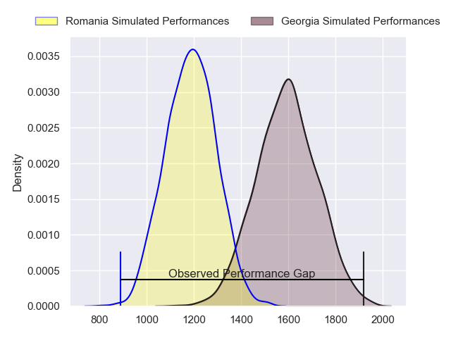
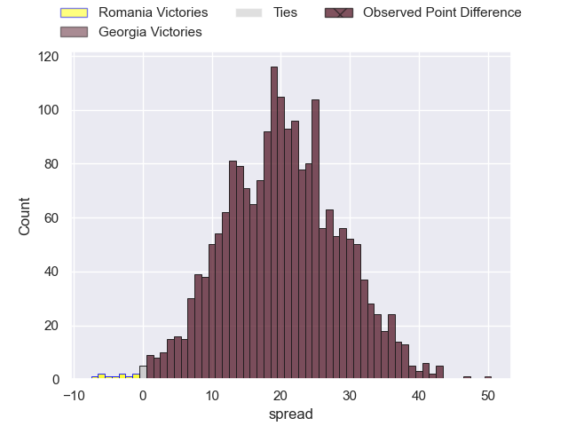

---  
layout: page  
title: Romania at Georgia; 6.0-56.0  
date: 2023-08-11 18:00:00 -0500  
categories: match review  
---
# Romania at Georgia; 6.0-56.0

# Club Level Predictions

The first set of predictions treats a club as the smallest object, as the club develops its members, organizes a gameplan, and deploys its players as needed for each match. This club model has a prediction of 0.9, which translates to predicting Georgia to win by 20.1.

Each club has a rating and a rating deviation (simiar to a Glicko system), and expected performances can be generated. This allows for simulated matches and spreads like the ones below.
## Projected Performances

## Projected Spreads

## Projected Results

# Player Level Predictions - Version 1

Treating teams instead as an entity made up of the currently active players, I have ratings for each player in an altogether different system. These can be combined to form team ratings once teamsheets are announced, weighting starters a bit higher than the reserves. After the match is played, players can be weighted by their minutes on the field, allowing for an accurate measure of the team's composition. With these compiled team ratings, we can make predictions, measure inaccuracy, and update the individual player ratings.
## Prediction with Player Minutes: Romania by 10.9

Romania by 14.9 on a neutral field
## Prediction without Player Minutes: Romania by 11.2

Romania by 15.2 on a neutral pitch

|   Away Minutes | Away Player       |   Away elo |   Away Percentile |   Number |   Home Percentile |   Home elo | Home Player           |   Home Minutes |
|---------------:|:------------------|-----------:|------------------:|---------:|------------------:|-----------:|:----------------------|---------------:|
|             80 | Vasile Balan      |      71.24 |       1.01712e+06 |        1 |       1.01713e+06 |      61.97 | Mikheil Nariashvili   |             80 |
|             80 | Tudor Butnariu    |      71.97 |       1.01711e+06 |        2 |       1.01713e+06 |      61.01 | Giorgi Chkoidze       |             80 |
|             80 | Costel Burtila    |      79.9  |  992854           |        3 |       1.01713e+06 |      61.3  | Luka Japaridze        |             80 |
|             80 | Adrian Motoc      |      89.99 |  901488           |        4 |       1.01712e+06 |      63.7  | Nodar Cheishvili      |             80 |
|             80 | Stefan Iancu      |      70.82 |       1.00384e+06 |        5 |       1.01712e+06 |      64.06 | Lado Chachanidze      |             80 |
|             80 | Florian Rosu      |      72.19 |       1.01711e+06 |        6 |       1.01712e+06 |      64.46 | Otar Giorgadze        |             80 |
|             80 | Dragos Ser        |      51.81 |  957577           |        7 |       1.01713e+06 |      61.78 | Mikheil Gachechiladze |             80 |
|             80 | Andre Gorin       |      72.91 |       1.0171e+06  |        8 |       1.01713e+06 |      61.15 | Luka Ivanishvili      |             80 |
|             80 | Gabriel Rupanu    |      71.07 |       1.01712e+06 |        9 |       1.01713e+06 |      61.45 | Gela Aprasidze        |             80 |
|             80 | Vladut Popa       |      72.65 |       1.0171e+06  |       10 |       1.01712e+06 |      63.39 | Luka Matkava          |             80 |
|             80 | Sioeli Lama       |      71.77 |       1.01711e+06 |       11 |       1.01711e+06 |      66.13 | Otar Lashkhi          |             80 |
|             80 | Taylor Gontineac  |      73.84 |       1.0171e+06  |       12 |       1.01712e+06 |      63.1  | Merab Sharikadze      |             80 |
|             80 | Fonovai Tangimana |      72.41 |       1.01711e+06 |       13 |       1.01712e+06 |      62.83 | Demur Tapladze        |             80 |
|             80 | Nicolas Onutu     |      89.02 |  932849           |       14 |       1.00356e+06 |      73.53 | Aka Tabutsadze        |             80 |
|             80 | Ionel Melinte     |      69.54 |       1.01674e+06 |       15 |       1.01713e+06 |      62.37 | Mirian Modebadze      |             80 |
|              0 | Rob Irimescu      |      73.2  |     nan           |       16 |     nan           |      64.93 | Shalva Mamukashvili   |              0 |
|              0 | Iulian Hartig     |      65.08 |     nan           |       17 |     nan           |      65.47 | Nika Abuladze         |              0 |
|              0 | Thomas Cretu      |      71.41 |     nan           |       18 |     nan           |      69.85 | Guram Papidze         |              0 |
|              0 | Andrei Mahu       |     106.18 |  774232           |       19 |     nan           |      61.61 | Lasha Jaiani          |              0 |
|              0 | Damian Stratila   |      76.44 |  992288           |       20 |     nan           |      68.11 | Giorgi Tsutskiridze   |              0 |
|              0 | Vladu Bocanet     |      73.5  |     nan           |       21 |     nan           |      66.97 | Vasil Lobzhanidze     |              0 |
|              0 | Tudor Boldor      |      71.58 |     nan           |       22 |     nan           |      62.16 | Lasha Khmaladze       |              0 |
|              0 | Paul Popoaia      |      78.47 |     nan           |       23 |     nan           |      62.59 | Giorgi Kveseladze     |              0 |

# Player Level Predictions - Version 2

Treating teams instead as an entity made up of the currently active players, I have ratings for each player in an altogether different system. These can be combined to form team ratings once teamsheets are announced, weighting starters a bit higher than the reserves. After the match is played, players can be weighted by their minutes on the field, allowing for an accurate measure of the team's composition. With these compiled team ratings, we can make predictions, measure inaccuracy, and update the individual player ratings.
## Prediction with Player Minutes: Romania by nan

Georgia by nan on a neutral field
## Prediction without Player Minutes: Georgia by 4.4

Georgia by 1.1 on a neutral pitch

|   Away Minutes | Away Player       |   Away elo |   Away variance |   Number |   Home variance |   Home elo | Home Player           |   Home Minutes |
|---------------:|:------------------|-----------:|----------------:|---------:|----------------:|-----------:|:----------------------|---------------:|
|            nan | Vasile Balan      |      46.65 |              50 |        1 |              50 |      46.65 | Mikheil Nariashvili   |            nan |
|            nan | Tudor Butnariu    |      46.65 |              50 |        2 |              50 |      46.65 | Giorgi Chkoidze       |            nan |
|            nan | Costel Burtila    |      48.29 |              50 |        3 |              50 |      46.65 | Luka Japaridze        |            nan |
|            nan | Adrian Motoc      |      26.69 |              50 |        4 |              50 |      46.65 | Nodar Cheishvili      |            nan |
|            nan | Stefan Iancu      |      48.27 |              50 |        5 |              50 |      46.65 | Lado Chachanidze      |            nan |
|            nan | Florian Rosu      |      46.65 |              50 |        6 |              50 |      46.65 | Otar Giorgadze        |            nan |
|            nan | Dragos Ser        |      25.43 |              50 |        7 |              50 |      46.65 | Mikheil Gachechiladze |            nan |
|            nan | Andre Gorin       |      46.65 |              50 |        8 |              50 |      46.65 | Luka Ivanishvili      |            nan |
|            nan | Gabriel Rupanu    |      46.65 |              50 |        9 |              50 |      46.65 | Gela Aprasidze        |            nan |
|            nan | Vladut Popa       |      46.65 |              50 |       10 |              50 |      46.65 | Luka Matkava          |            nan |
|            nan | Sioeli Lama       |      46.65 |              50 |       11 |              50 |      46.65 | Otar Lashkhi          |            nan |
|            nan | Taylor Gontineac  |      46.65 |              50 |       12 |              50 |      46.65 | Merab Sharikadze      |            nan |
|            nan | Fonovai Tangimana |      46.65 |              50 |       13 |              50 |      46.65 | Demur Tapladze        |            nan |
|            nan | Nicolas Onutu     |      62.6  |              50 |       14 |              50 |      46.65 | Aka Tabutsadze        |            nan |
|            nan | Ionel Melinte     |      46.65 |              50 |       15 |              50 |      46.65 | Mirian Modebadze      |            nan |
|            nan | Rob Irimescu      |      46.65 |              50 |       16 |              50 |      46.65 | Shalva Mamukashvili   |            nan |
|            nan | Iulian Hartig     |      42.09 |              50 |       17 |              50 |      46.65 | Nika Abuladze         |            nan |
|            nan | Thomas Cretu      |      46.65 |              50 |       18 |              50 |      46.65 | Guram Papidze         |            nan |
|            nan | Andrei Mahu       |      15.7  |              50 |       19 |              50 |      46.65 | Lasha Jaiani          |            nan |
|            nan | Damian Stratila   |      52.72 |              50 |       20 |              50 |      46.65 | Giorgi Tsutskiridze   |            nan |
|            nan | Vladu Bocanet     |      46.65 |              50 |       21 |              50 |      46.65 | Vasil Lobzhanidze     |            nan |
|            nan | Tudor Boldor      |      46.65 |              50 |       22 |              50 |      46.65 | Lasha Khmaladze       |            nan |
|            nan | Paul Popoaia      |      46.84 |              50 |       23 |              50 |      46.65 | Giorgi Kveseladze     |            nan |

