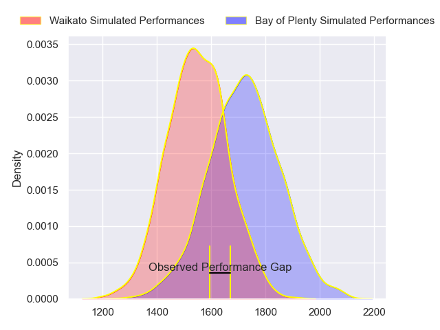
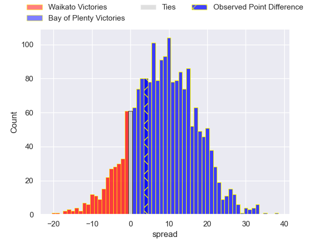
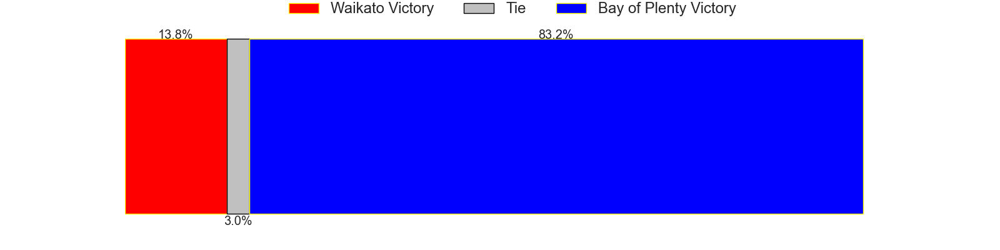
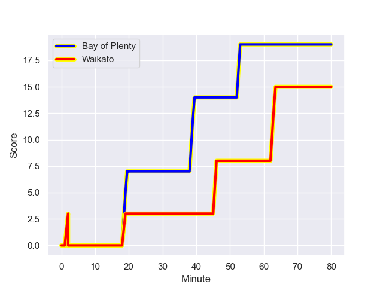
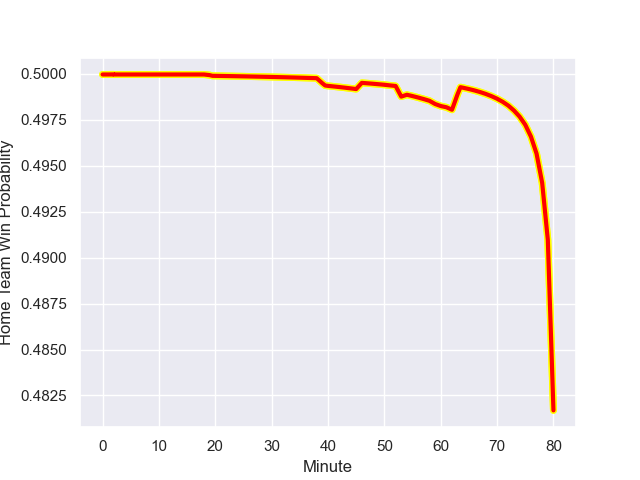

---  
layout: page  
title: Waikato at Bay of Plenty; 15-19  
date: 2023-08-12 18:00:00 -0500  
categories: match review  
---
# Waikato at Bay of Plenty; 15-19

# Club Level Predictions

The first set of predictions treats a club as the smallest object, as the club develops its members, organizes a gameplan, and deploys its players as needed for each match. This club model has a prediction of 0.717, which translates to predicting Bay of Plenty to win by 8.6.

Each club has a rating and a rating deviation (simiar to a Glicko system), and expected performances can be generated. This allows for simulated matches and spreads like the ones below.
## Projected Performances

## Projected Spreads

## Projected Results

# Player Level Predictions - Version 1

Treating teams instead as an entity made up of the currently active players, I have ratings for each player in an altogether different system. These can be combined to form team ratings once teamsheets are announced, weighting starters a bit higher than the reserves. After the match is played, players can be weighted by their minutes on the field, allowing for an accurate measure of the team's composition. With these compiled team ratings, we can make predictions, measure inaccuracy, and update the individual player ratings.
## Prediction with Player Minutes: Bay of Plenty by 4.0

Waikato by 0.0 on a neutral field
## Prediction without Player Minutes: Bay of Plenty by 5.2

Bay of Plenty by 1.2 on a neutral pitch

## Scores over Time

## Win Probability over Time

|   Away Minutes | Away Player                  |   Away elo |   Away Percentile |   Number |   Home Percentile |   Home elo | Home Player            |   Home Minutes |
|---------------:|:-----------------------------|-----------:|------------------:|---------:|------------------:|-----------:|:-----------------------|---------------:|
|             80 | Ollie Norris                 |      92.93 |  944454           |        1 |  788662           |      86.15 | Aidan Ross             |             61 |
|             40 | Pita Alemania Jr Anae-Ah Sue |      75.92 |       1.01782e+06 |        2 |       1.01774e+06 |      75.9  | Kurt Eklund            |             78 |
|             61 | George Dyer                  |      76.59 |  986837           |        3 |       1.01648e+06 |      87.43 | John Afoa              |             54 |
|             80 | James Tucker                 |      90.15 |  785358           |        4 |       1.01772e+06 |      76.63 | Mana'aki Selby-Rickit  |             80 |
|             80 | Hamilton Burr                |      73.99 |       1.01786e+06 |        5 |       1.01775e+06 |      74.65 | Justin Sangster        |             73 |
|             76 | Malachi Wrampling-Alec       |      78.54 |       1.01779e+06 |        6 |  945415           |      97.05 | Naitoa Ah Kuoi         |             80 |
|             80 | Patrick McCurran             |      78.01 |       1.0178e+06  |        7 |       1.01773e+06 |      77.06 | Veveni Lasaqa          |             59 |
|             80 | Simon Parker                 |      95.05 |       1.0165e+06  |        8 |       1.01771e+06 |      77.91 | Nikora Broughton       |             80 |
|             51 | Cortez Lee Ratima            |      79.31 |       1.01778e+06 |        9 |       1.01651e+06 |      91.29 | Te Toiroa Tahuriorangi |             80 |
|             80 | Taha Kemara                  |      76.79 |       1.01782e+06 |       10 |       1.01774e+06 |      76.23 | Lucas Cashmore         |             80 |
|             54 | Daniel Sinkinson             |      54.93 |  992531           |       11 |       1.01773e+06 |      75.66 | Ngarohi McGarvey-Black |             76 |
|             80 | Gideon Wrampling             |      77.84 |       1.01778e+06 |       12 |       1.01772e+06 |      77.01 | Melani Nanai           |             80 |
|             76 | Bailyn Sullivan              |      74.35 |       1.01785e+06 |       13 |       1.01777e+06 |      74.04 | Lalomilo Lalomilo      |             80 |
|             80 | Liam Coombes-Fabling         |      97.74 |       1.0165e+06  |       14 |       1.01772e+06 |      76.28 | Leroy Carter           |             80 |
|             80 | Tepaea Cook-Savage           |      75.7  |       1.01781e+06 |       15 |       1.01773e+06 |      81.67 | Wharenui Hawera        |             80 |
|             40 | Rhys Marshall                |      75.08 |       1.01799e+06 |       16 |     nan           |      79.96 | Benet Kumeroa          |             26 |
|             19 | Solomone Tukuafu             |      76.87 |       1.01785e+06 |       17 |     nan           |      76.97 | Josh Bartlett          |             19 |
|              4 | Jack Lam                     |      75.27 |     nan           |       18 |     nan           |      83.81 | Nathan Vella           |              2 |
|             29 | Xavier Roe                   |      78.52 |       1.0178e+06  |       19 |     nan           |      76.58 | Etonia Waqa            |              7 |
|             26 | Tana Tuhakaraina             |      76.71 |       1.01783e+06 |       20 |       1.01235e+06 |      89.75 | Semisi Paea            |             21 |
|              4 | Austin Anderson              |      75.47 |       1.01799e+06 |       21 |       1.01799e+06 |      76.77 | Cody Vai               |              4 |

# Player Level Predictions - Version 2

Treating teams instead as an entity made up of the currently active players, I have ratings for each player in an altogether different system. These can be combined to form team ratings once teamsheets are announced, weighting starters a bit higher than the reserves. After the match is played, players can be weighted by their minutes on the field, allowing for an accurate measure of the team's composition. With these compiled team ratings, we can make predictions, measure inaccuracy, and update the individual player ratings.
## Prediction with Player Minutes: Bay of Plenty by 5.0

Bay of Plenty by 1.7 on a neutral field
## Prediction without Player Minutes: Bay of Plenty by 5.3

Bay of Plenty by 2.0 on a neutral pitch

|   Away Minutes | Away Player                  |   Away elo |   Away variance |   Number |   Home variance |   Home elo | Home Player            |   Home Minutes |
|---------------:|:-----------------------------|-----------:|----------------:|---------:|----------------:|-----------:|:-----------------------|---------------:|
|             80 | Ollie Norris                 |      62.78 |              50 |        1 |           50    |      94.75 | Aidan Ross             |             61 |
|             40 | Pita Alemania Jr Anae-Ah Sue |      46.65 |              50 |        2 |           50    |      46.65 | Kurt Eklund            |             78 |
|             61 | George Dyer                  |      58.3  |              50 |        3 |           50    |      46.65 | John Afoa              |             54 |
|             80 | James Tucker                 |      66.26 |              50 |        4 |           50    |      46.65 | Mana'aki Selby-Rickit  |             80 |
|             80 | Hamilton Burr                |      46.65 |              50 |        5 |           50    |      46.65 | Justin Sangster        |             73 |
|             76 | Malachi Wrampling-Alec       |      46.65 |              50 |        6 |           50    |      80.6  | Naitoa Ah Kuoi         |             80 |
|             80 | Patrick McCurran             |      46.65 |              50 |        7 |           50    |      46.65 | Veveni Lasaqa          |             59 |
|             80 | Simon Parker                 |      46.65 |              50 |        8 |           50    |      46.65 | Nikora Broughton       |             80 |
|             51 | Cortez Lee Ratima            |      46.65 |              50 |        9 |           50    |      46.65 | Te Toiroa Tahuriorangi |             80 |
|             80 | Taha Kemara                  |      46.65 |              50 |       10 |           50    |      46.65 | Lucas Cashmore         |             80 |
|             54 | Daniel Sinkinson             |      40.79 |              50 |       11 |           50    |      46.65 | Ngarohi McGarvey-Black |             76 |
|             80 | Gideon Wrampling             |      46.65 |              50 |       12 |           50    |      46.65 | Melani Nanai           |             80 |
|             76 | Bailyn Sullivan              |      46.65 |              50 |       13 |           50    |      46.65 | Lalomilo Lalomilo      |             80 |
|             80 | Liam Coombes-Fabling         |      46.65 |              50 |       14 |           50    |      46.65 | Leroy Carter           |             80 |
|             80 | Tepaea Cook-Savage           |      46.65 |              50 |       15 |           50    |      46.65 | Wharenui Hawera        |             80 |
|             40 | Rhys Marshall                |      46.65 |              50 |       16 |           50    |      46.65 | Benet Kumeroa          |             26 |
|             19 | Solomone Tukuafu             |      46.65 |              50 |       17 |           50    |      46.65 | Josh Bartlett          |             19 |
|              4 | Jack Lam                     |      46.65 |              50 |       18 |           50    |      46.65 | Nathan Vella           |              2 |
|             29 | Xavier Roe                   |      46.65 |              50 |       19 |           50    |      46.65 | Etonia Waqa            |              7 |
|             26 | Tana Tuhakaraina             |      46.65 |              50 |       20 |           48.84 |      85.49 | Semisi Paea            |             21 |
|              4 | Austin Anderson              |      46.65 |              50 |       21 |           50    |      46.65 | Cody Vai               |              4 |

