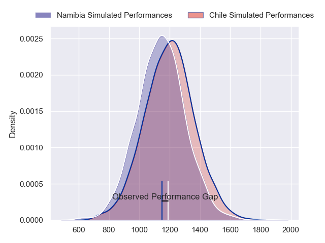
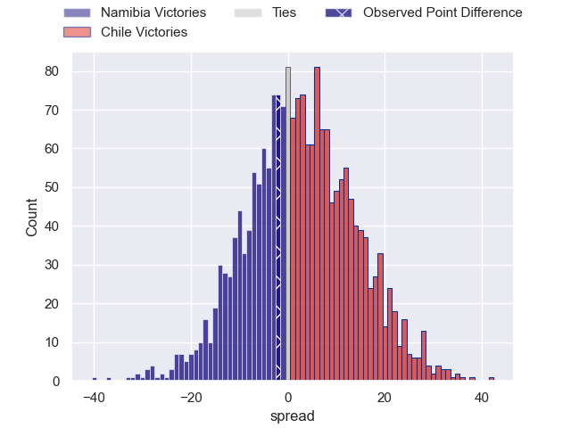
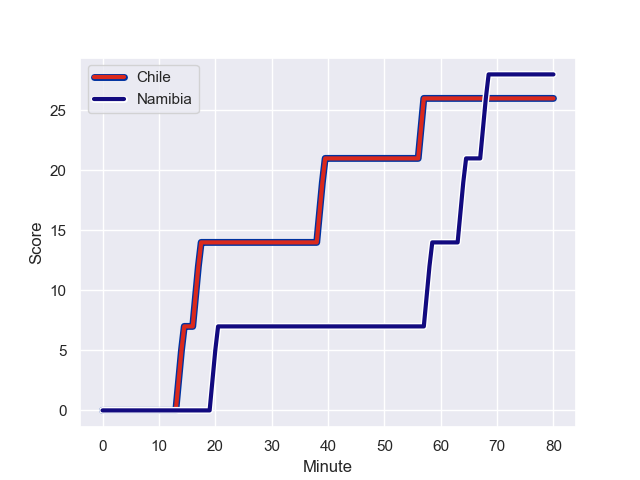
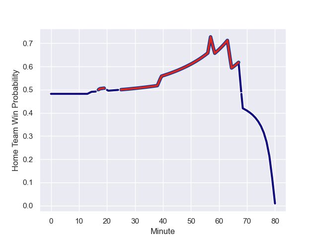

---  
layout: page  
title: Namibia at Chile; 28-26  
date: 2023-08-12 18:00:00 -0500  
categories: match review  
---
# Namibia at Chile; 28-26

# Club Level Predictions

The first set of predictions treats a club as the smallest object, as the club develops its members, organizes a gameplan, and deploys its players as needed for each match. This club model has a prediction of 0.579, which translates to predicting Chile to win by 3.1.

Each club has a rating and a rating deviation (simiar to a Glicko system), and expected performances can be generated. This allows for simulated matches and spreads like the ones below.
## Projected Performances

## Projected Spreads

## Projected Results

# Player Level Predictions - Version 1

Treating teams instead as an entity made up of the currently active players, I have ratings for each player in an altogether different system. These can be combined to form team ratings once teamsheets are announced, weighting starters a bit higher than the reserves. After the match is played, players can be weighted by their minutes on the field, allowing for an accurate measure of the team's composition. With these compiled team ratings, we can make predictions, measure inaccuracy, and update the individual player ratings.
## Prediction with Player Minutes: Chile by 0.9

Namibia by 3.1 on a neutral field
## Prediction without Player Minutes: Chile by 0.9

Namibia by 3.1 on a neutral pitch

## Scores over Time

## Win Probability over Time

There were 12 large changes in win probability in this match

|   Away Minutes | Away Player               |   Away elo |   Away Percentile |   Number |   Home Percentile |   Home elo | Home Player             |   Home Minutes |
|---------------:|:--------------------------|-----------:|------------------:|---------:|------------------:|-----------:|:------------------------|---------------:|
|             80 | Des Sethie                |      69.55 |                37 |        1 |                 7 |      58.27 | Salvador Lues           |             80 |
|             80 | Louis van der Westhuizen  |      98.88 |                87 |        2 |                25 |      69.84 | Augusto Bohme           |             80 |
|             80 | Johannes (Aranos) Coetzee |      65.77 |                29 |        3 |                11 |      61.76 | Matias Dittus           |             80 |
|             80 | Adriaan Ludick            |      68.68 |                34 |        4 |                17 |      65.54 | Pablo Huete             |             80 |
|             80 | Ruan Ludick               |      65.52 |                29 |        5 |                16 |      64.09 | Javier Eissmann         |             80 |
|             80 | Wian Conradie             |      70.1  |                40 |        6 |                20 |      67.23 | Martin Sigren Molina    |             80 |
|             80 | Muharua Wilhelm Katjijeko |      66.04 |                32 |        7 |                20 |      67.49 | Clemente Saavedra       |             80 |
|             80 | Richard Hardwick          |      77.3  |                49 |        8 |                30 |      74.06 | Alfonso Escobar Alvarez |             80 |
|             80 | Damian Stevens            |      45.23 |                 4 |        9 |                24 |      69.7  | Marcelo Torrealba       |             80 |
|             80 | Tiaan Swanepoel           |      66.86 |                29 |       10 |                23 |      71.49 | Rodrigo Fernandez       |             80 |
|             80 | JC Greyling               |      66.62 |                33 |       11 |                15 |      63.32 | Nicolas Garafulic Schar |             80 |
|             80 | Danco Burger              |      69.64 |                37 |       12 |                32 |      75.67 | Domingo Saavedra        |             80 |
|             80 | Johan Deysel              |      66.4  |                31 |       13 |                16 |      64.48 | Matias Garafulic        |             80 |
|             80 | Chad Zavier Plato         |      65.28 |                31 |       14 |                12 |      59.9  | Santiago Videla         |             80 |
|             80 | Divan Rossouw             |      65.47 |                27 |       15 |                13 |      63.6  | Inaki Ayarza Saporta    |             80 |

# Player Level Predictions - Version 2

Treating teams instead as an entity made up of the currently active players, I have ratings for each player in an altogether different system. These can be combined to form team ratings once teamsheets are announced, weighting starters a bit higher than the reserves. After the match is played, players can be weighted by their minutes on the field, allowing for an accurate measure of the team's composition. With these compiled team ratings, we can make predictions, measure inaccuracy, and update the individual player ratings.
## Prediction with Player Minutes: Chile by 4.1

Chile by 1.0 on a neutral field
## Prediction without Player Minutes: Chile by 4.1

Chile by 1.0 on a neutral pitch

|   Away Minutes | Away Player               |   Away elo |   Away variance |   Number |   Home variance |   Home elo | Home Player             |   Home Minutes |
|---------------:|:--------------------------|-----------:|----------------:|---------:|----------------:|-----------:|:------------------------|---------------:|
|             80 | Des Sethie                |      46.65 |              50 |        1 |           49.94 |      47.24 | Salvador Lues           |             80 |
|             80 | Louis van der Westhuizen  |      46.65 |              50 |        2 |           49.86 |      48.02 | Augusto Bohme           |             80 |
|             80 | Johannes (Aranos) Coetzee |      46.65 |              50 |        3 |           49.86 |      47.99 | Matias Dittus           |             80 |
|             80 | Adriaan Ludick            |      46.65 |              50 |        4 |           49.86 |      47.99 | Pablo Huete             |             80 |
|             80 | Ruan Ludick               |      46.65 |              50 |        5 |           49.8  |      48.6  | Javier Eissmann         |             80 |
|             80 | Wian Conradie             |      46.65 |              50 |        6 |           50    |      52.8  | Martin Sigren Molina    |             80 |
|             80 | Muharua Wilhelm Katjijeko |      46.65 |              50 |        7 |           49.8  |      48.6  | Clemente Saavedra       |             80 |
|             80 | Richard Hardwick          |      61.57 |              50 |        8 |           49.8  |      48.6  | Alfonso Escobar Alvarez |             80 |
|             80 | Damian Stevens            |      46.65 |              50 |        9 |           49.8  |      48.6  | Marcelo Torrealba       |             80 |
|             80 | Tiaan Swanepoel           |      46.65 |              50 |       10 |           49.8  |      48.6  | Rodrigo Fernandez       |             80 |
|             80 | JC Greyling               |      46.65 |              50 |       11 |           50    |      46.65 | Nicolas Garafulic Schar |             80 |
|             80 | Danco Burger              |      46.65 |              50 |       12 |           50    |      59.04 | Domingo Saavedra        |             80 |
|             80 | Johan Deysel              |      46.65 |              50 |       13 |           49.8  |      48.6  | Matias Garafulic        |             80 |
|             80 | Chad Zavier Plato         |      46.65 |              50 |       14 |           49.8  |      48.6  | Santiago Videla         |             80 |
|             80 | Divan Rossouw             |      46.65 |              50 |       15 |           49.8  |      48.6  | Inaki Ayarza Saporta    |             80 |

