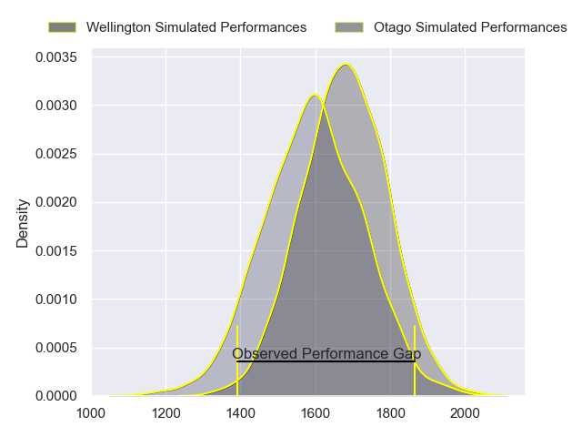
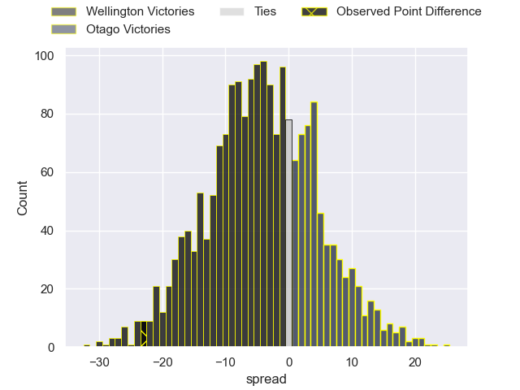
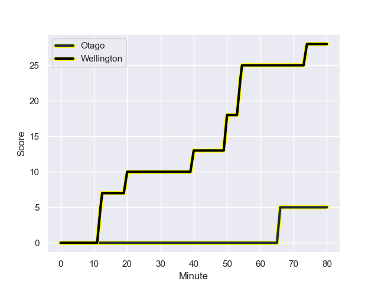
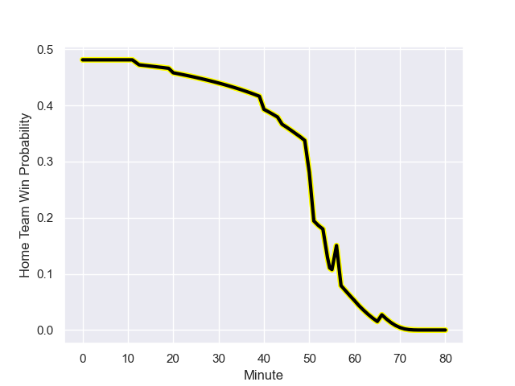

---  
layout: page  
title: Wellington at Otago; 28-5  
date: 2023-08-12 18:00:00 -0500  
categories: match review  
---
# Wellington at Otago; 28-5

# Club Level Predictions

The first set of predictions treats a club as the smallest object, as the club develops its members, organizes a gameplan, and deploys its players as needed for each match. This club model has a prediction of 0.39, which translates to predicting Wellington to win by 4.1.

Each club has a rating and a rating deviation (simiar to a Glicko system), and expected performances can be generated. This allows for simulated matches and spreads like the ones below.
## Projected Performances

## Projected Spreads

## Projected Results

# Player Level Predictions - Version 1

Treating teams instead as an entity made up of the currently active players, I have ratings for each player in an altogether different system. These can be combined to form team ratings once teamsheets are announced, weighting starters a bit higher than the reserves. After the match is played, players can be weighted by their minutes on the field, allowing for an accurate measure of the team's composition. With these compiled team ratings, we can make predictions, measure inaccuracy, and update the individual player ratings.
## Prediction with Player Minutes: Otago by 0.7

Wellington by 3.3 on a neutral field
## Prediction without Player Minutes: Otago by 0.4

Wellington by 3.6 on a neutral pitch

## Scores over Time

## Win Probability over Time

There were 5 large changes in win probability in this match

|   Away Minutes | Away Player                   |   Away elo |   Away Percentile |   Number |   Home Percentile |   Home elo | Home Player                |   Home Minutes |
|---------------:|:------------------------------|-----------:|------------------:|---------:|------------------:|-----------:|:---------------------------|---------------:|
|             53 | Xavier Numia                  |      93.8  |  916352           |        1 |       1.01656e+06 |      76.48 | Rohan Wingham              |             51 |
|             48 | James O'Reilly                |      79.5  |       1.01715e+06 |        2 |       1.01479e+06 |      73.69 | Henry Bell                 |             44 |
|             53 | Siale Lauaki                  |      80.85 |       1.01685e+06 |        3 |       1.01657e+06 |      75.8  | Saula Ma'u                 |             51 |
|             80 | Caleb Delany                  |      87.57 |  985385           |        4 |       1.01655e+06 |      79.07 | Josh Dickson               |             53 |
|             53 | Hugo Plummer                  |      81.37 |       1.01682e+06 |        5 |       1.01657e+06 |      78.29 | Will Tucker                |             80 |
|             80 | Brad Shields                  |      72.04 |       1.01613e+06 |        6 |       1.01504e+06 |      74.63 | Sam Fischli                |             80 |
|             80 | Du'Plessis Kirifi             |      82.28 |  878259           |        7 |  990153           |      81.22 | Sean Withy                 |             55 |
|             53 | Peter Lakai                   |      79.31 |       1.01715e+06 |        8 |  985535           |      94.37 | Christian Lio-Willie       |             80 |
|             56 | Kemara Henare Hauiti-Parapara |      77.82 |       1.01685e+06 |        9 |       1.01655e+06 |      77.31 | James Arscott              |             44 |
|             80 | Aidan Morgan                  |      77.81 |  988585           |       10 |  944280           |      88.89 | Sam Gilbert                |             80 |
|             80 | Pepesana Patafilo             |      78.51 |       1.01684e+06 |       11 |  880937           |      97.75 | Jona Nareki                |             80 |
|             48 | Peter Umaga-Jensen            |      83.45 |       1.01413e+06 |       12 |       1.01657e+06 |      74.48 | Thomas Carlos Umaga-Jensen |             80 |
|             80 | Billy Proctor                 |     107.94 |  890344           |       13 |       1.01655e+06 |      79.54 | Jake Te Hiwi               |             61 |
|             56 | Losilosivale Filipo           |      78.54 |       1.01683e+06 |       14 |       1.01655e+06 |      78.86 | Josh Whaanga               |             80 |
|             80 | Ruben Love                    |      76.4  |       1.01685e+06 |       15 |       1.01654e+06 |      80.08 | Finn Hurley                |             57 |
|             32 | Josh Southall                 |      78.87 |       1.01683e+06 |       16 |  787976           |      88.64 | Jermaine Ainsley           |             29 |
|             27 | Cameron Orr                   |      85.58 |     nan           |       17 |  985602           |      87.75 | Abraham Pole               |             29 |
|             27 | PJ Sheck                      |      80.11 |       1.01684e+06 |       18 |     nan           |      74.35 | Ricky Jackson              |             36 |
|             27 | Akira Ieremia                 |      82.51 |     nan           |       19 |       1.01654e+06 |      78.82 | Fabian Holland             |             27 |
|             27 | Dominic Ropeti                |      84.62 |     nan           |       20 |     nan           |      74.75 | Harry Taylor               |             25 |
|             24 | Kyle Preston                  |      84.1  |     nan           |       21 |       1.01253e+06 |      64.94 | Kieran McClea              |             36 |
|             24 | Connor Garden-Bachop          |      99.48 |  924188           |       22 |     nan           |      75.81 | Jack Leslie                |             19 |
|             32 | Riley Higgins                 |      79.13 |     nan           |       23 |     nan           |      75.99 | Cameron Millar             |             23 |

# Player Level Predictions - Version 2

Treating teams instead as an entity made up of the currently active players, I have ratings for each player in an altogether different system. These can be combined to form team ratings once teamsheets are announced, weighting starters a bit higher than the reserves. After the match is played, players can be weighted by their minutes on the field, allowing for an accurate measure of the team's composition. With these compiled team ratings, we can make predictions, measure inaccuracy, and update the individual player ratings.
## Prediction with Player Minutes: Otago by 1.7

Wellington by 1.7 on a neutral field
## Prediction without Player Minutes: Otago by 1.4

Wellington by 2.0 on a neutral pitch

|   Away Minutes | Away Player                   |   Away elo |   Away variance |   Number |   Home variance |   Home elo | Home Player                |   Home Minutes |
|---------------:|:------------------------------|-----------:|----------------:|---------:|----------------:|-----------:|:---------------------------|---------------:|
|             53 | Xavier Numia                  |      78.87 |              50 |        1 |              50 |      46.65 | Rohan Wingham              |             51 |
|             48 | James O'Reilly                |      46.65 |              50 |        2 |              50 |      46.65 | Henry Bell                 |             44 |
|             53 | Siale Lauaki                  |      46.65 |              50 |        3 |              50 |      46.65 | Saula Ma'u                 |             51 |
|             80 | Caleb Delany                  |      56.11 |              50 |        4 |              50 |      46.65 | Josh Dickson               |             53 |
|             53 | Hugo Plummer                  |      46.65 |              50 |        5 |              50 |      46.65 | Will Tucker                |             80 |
|             80 | Brad Shields                  |      46.65 |              50 |        6 |              50 |      46.65 | Sam Fischli                |             80 |
|             80 | Du'Plessis Kirifi             |      82.13 |              50 |        7 |              50 |      47.24 | Sean Withy                 |             55 |
|             53 | Peter Lakai                   |      46.65 |              50 |        8 |              50 |      66.99 | Christian Lio-Willie       |             80 |
|             56 | Kemara Henare Hauiti-Parapara |      46.65 |              50 |        9 |              50 |      46.65 | James Arscott              |             44 |
|             80 | Aidan Morgan                  |      47.53 |              50 |       10 |              50 |      50.17 | Sam Gilbert                |             80 |
|             80 | Pepesana Patafilo             |      46.65 |              50 |       11 |              50 |      74.05 | Jona Nareki                |             80 |
|             48 | Peter Umaga-Jensen            |      46.65 |              50 |       12 |              50 |      46.65 | Thomas Carlos Umaga-Jensen |             80 |
|             80 | Billy Proctor                 |      81.11 |              50 |       13 |              50 |      46.65 | Jake Te Hiwi               |             61 |
|             56 | Losilosivale Filipo           |      46.65 |              50 |       14 |              50 |      46.65 | Josh Whaanga               |             80 |
|             80 | Ruben Love                    |      46.65 |              50 |       15 |              50 |      46.65 | Finn Hurley                |             57 |
|             32 | Josh Southall                 |      46.65 |              50 |       16 |              50 |      51.38 | Jermaine Ainsley           |             29 |
|             27 | Cameron Orr                   |      46.65 |              50 |       17 |              50 |      55.95 | Abraham Pole               |             29 |
|             27 | PJ Sheck                      |      46.65 |              50 |       18 |              50 |      46.65 | Ricky Jackson              |             36 |
|             27 | Akira Ieremia                 |      46.65 |              50 |       19 |              50 |      46.65 | Fabian Holland             |             27 |
|             27 | Dominic Ropeti                |      46.65 |              50 |       20 |              50 |      46.65 | Harry Taylor               |             25 |
|             24 | Kyle Preston                  |      46.65 |              50 |       21 |              50 |      54.33 | Kieran McClea              |             36 |
|             24 | Connor Garden-Bachop          |      47.17 |              50 |       22 |              50 |      46.65 | Jack Leslie                |             19 |
|             32 | Riley Higgins                 |      46.65 |              50 |       23 |              50 |      46.65 | Cameron Millar             |             23 |

