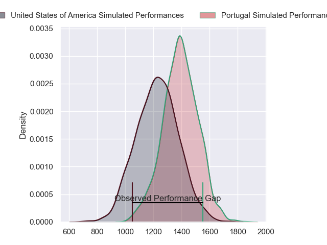
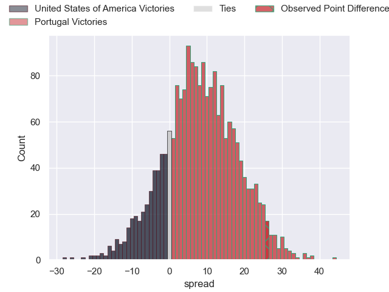
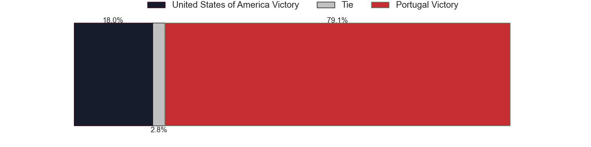
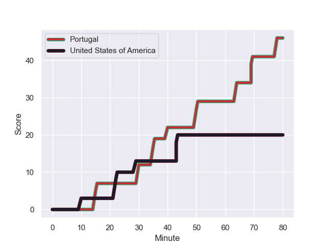
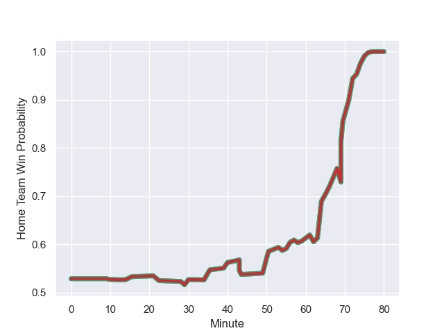

---  
layout: page  
title: United States of America at Portugal; 20-46  
date: 2023-08-12 18:00:00 -0500  
categories: match review  
---
# United States of America at Portugal; 20-46

# Club Level Predictions

The first set of predictions treats a club as the smallest object, as the club develops its members, organizes a gameplan, and deploys its players as needed for each match. This club model has a prediction of 0.707, which translates to predicting Portugal to win by 8.4.

Each club has a rating and a rating deviation (simiar to a Glicko system), and expected performances can be generated. This allows for simulated matches and spreads like the ones below.
## Projected Performances

## Projected Spreads

## Projected Results

# Player Level Predictions - Version 1

Treating teams instead as an entity made up of the currently active players, I have ratings for each player in an altogether different system. These can be combined to form team ratings once teamsheets are announced, weighting starters a bit higher than the reserves. After the match is played, players can be weighted by their minutes on the field, allowing for an accurate measure of the team's composition. With these compiled team ratings, we can make predictions, measure inaccuracy, and update the individual player ratings.
## Prediction with Player Minutes: Portugal by 9.0

Portugal by 5.0 on a neutral field
## Prediction without Player Minutes: Portugal by 8.4

Portugal by 4.4 on a neutral pitch

## Scores over Time

## Win Probability over Time

There were 7 large changes in win probability in this match

|   Away Minutes | Away Player     |   Away elo |   Away Percentile |   Number |   Home Percentile |   Home elo | Home Player                    |   Home Minutes |
|---------------:|:----------------|-----------:|------------------:|---------:|------------------:|-----------:|:-------------------------------|---------------:|
|             67 | Jack Iscaro     |      78.5  |                36 |        1 |                54 |      77.79 | Francisco Fernandes            |             58 |
|             72 | Dylan Fawsitt   |      58.43 |                 9 |        2 |                40 |      70.03 | Mike Tadjer                    |             56 |
|             40 | Kaleb Geiger    |      76.01 |                35 |        3 |                74 |      86.5  | Anthony Alves                  |             59 |
|             77 | Cam Dolan       |      72.42 |                25 |        4 |                53 |      76.96 | José Duarte Madeira            |             80 |
|             80 | Greg Peterson   |      69.41 |                20 |        5 |                46 |      77.43 | Steevy Cerqueira               |             23 |
|             80 | Sam Golla       |      72.25 |                24 |        6 |                54 |      74.88 | Joao Granate                   |             80 |
|             80 | Paddy Ryan      |      66.48 |                16 |        7 |                57 |      76.45 | Nicolas Martins                |             80 |
|             62 | Luke White      |      65.03 |                16 |        8 |                45 |      76.54 | Thibault De Freitas            |             14 |
|             62 | Nick McCarthy   |      69.72 |                23 |        9 |                51 |      75.61 | Samuel Marques                 |             73 |
|             80 | Luke Carty      |      63.74 |                11 |       10 |                86 |     101.95 | Joris Moura                    |             54 |
|             80 | Nate Augspurger |      82.01 |                42 |       11 |                54 |      76.93 | Rodrigo Marta                  |             80 |
|             80 | Tevita Lopeti   |      70.91 |                23 |       12 |                53 |      76.29 | Tomas Appleton                 |             80 |
|             58 | Mika Kruse      |      81.94 |                45 |       13 |                51 |      75.05 | José Lima                      |             80 |
|             80 | Christian Dyer  |      82.02 |                42 |       14 |                51 |      76.05 | Vincent Pinto                  |             69 |
|             59 | Mitch Wilson    |      91.76 |                61 |       15 |                50 |      75.82 | Nuno Sousa Guedes              |             80 |
|             13 | Jake Turnbull   |      86.69 |                61 |       16 |               nan |      76.81 | David Costa                    |             22 |
|             40 | Paul Mullen     |      77.69 |                46 |       17 |                77 |      93.17 | Lionel Campergue               |             24 |
|              8 | Peter Malcolm   |      72.57 |                41 |       18 |                53 |      81.78 | Diogo Hasse Ferreira           |             21 |
|             18 | Thomas Tu'avao  |      73.4  |                31 |       19 |               nan |      77.11 | David Wallis De Carvalho       |             57 |
|              3 | Vili Helu       |     111.91 |                92 |       20 |               nan |      78.18 | Rafael Simoes                  |             66 |
|             18 | Ruben de Haas   |      75.46 |               nan |       21 |                43 |      76.88 | Pedro Lucas                    |              7 |
|             21 | Chris Mattina   |     116.41 |                92 |       22 |               nan |      75.41 | Miguel Jeronimo Portela Morais |             26 |
|             22 | Lauina Futi     |     108.18 |                91 |       23 |               nan |      75.23 | Manuel Cardoso Pinto           |             11 |

# Player Level Predictions - Version 2

Treating teams instead as an entity made up of the currently active players, I have ratings for each player in an altogether different system. These can be combined to form team ratings once teamsheets are announced, weighting starters a bit higher than the reserves. After the match is played, players can be weighted by their minutes on the field, allowing for an accurate measure of the team's composition. With these compiled team ratings, we can make predictions, measure inaccuracy, and update the individual player ratings.
## Prediction with Player Minutes: Portugal by 3.3

United States of America by 0.0 on a neutral field
## Prediction without Player Minutes: Portugal by 3.1

United States of America by 0.2 on a neutral pitch

|   Away Minutes | Away Player     |   Away elo |   Away variance |   Number |   Home variance |   Home elo | Home Player                    |   Home Minutes |
|---------------:|:----------------|-----------:|----------------:|---------:|----------------:|-----------:|:-------------------------------|---------------:|
|             67 | Jack Iscaro     |      46.65 |           50    |        1 |              50 |      46.65 | Francisco Fernandes            |             58 |
|             72 | Dylan Fawsitt   |      46.65 |           50    |        2 |              50 |      46.65 | Mike Tadjer                    |             56 |
|             40 | Kaleb Geiger    |      51.86 |           50    |        3 |              50 |      46.65 | Anthony Alves                  |             59 |
|             77 | Cam Dolan       |      46.65 |           50    |        4 |              50 |      46.65 | José Duarte Madeira            |             80 |
|             80 | Greg Peterson   |      46.65 |           50    |        5 |              50 |      46.65 | Steevy Cerqueira               |             23 |
|             80 | Sam Golla       |      46.65 |           50    |        6 |              50 |      46.65 | Joao Granate                   |             80 |
|             80 | Paddy Ryan      |      46.65 |           50    |        7 |              50 |      56.62 | Nicolas Martins                |             80 |
|             62 | Luke White      |      46.65 |           50    |        8 |              50 |      46.65 | Thibault De Freitas            |             14 |
|             62 | Nick McCarthy   |      46.65 |           50    |        9 |              50 |      46.65 | Samuel Marques                 |             73 |
|             80 | Luke Carty      |      46.65 |           50    |       10 |              50 |      72.12 | Joris Moura                    |             54 |
|             80 | Nate Augspurger |      46.65 |           50    |       11 |              50 |      46.65 | Rodrigo Marta                  |             80 |
|             80 | Tevita Lopeti   |      46.65 |           50    |       12 |              50 |      46.65 | Tomas Appleton                 |             80 |
|             58 | Mika Kruse      |      46.65 |           50    |       13 |              50 |      46.65 | José Lima                      |             80 |
|             80 | Christian Dyer  |      46.65 |           50    |       14 |              50 |      46.65 | Vincent Pinto                  |             69 |
|             59 | Mitch Wilson    |      46.65 |           50    |       15 |              50 |      46.65 | Nuno Sousa Guedes              |             80 |
|             13 | Jake Turnbull   |      85.3  |           48.72 |       16 |              50 |      46.65 | David Costa                    |             22 |
|             40 | Paul Mullen     |      46.65 |           50    |       17 |              50 |      41.17 | Lionel Campergue               |             24 |
|              8 | Peter Malcolm   |      46.65 |           50    |       18 |              50 |      29.89 | Diogo Hasse Ferreira           |             21 |
|             18 | Thomas Tu'avao  |      43.35 |           50    |       19 |              50 |      46.65 | David Wallis De Carvalho       |             57 |
|              3 | Vili Helu       |      93.62 |           50    |       20 |              50 |      46.65 | Rafael Simoes                  |             66 |
|             18 | Ruben de Haas   |      46.65 |           50    |       21 |              50 |      63.48 | Pedro Lucas                    |              7 |
|             21 | Chris Mattina   |      70.64 |           50    |       22 |              50 |      46.65 | Miguel Jeronimo Portela Morais |             26 |
|             22 | Lauina Futi     |      70.94 |           47.55 |       23 |              50 |      46.65 | Manuel Cardoso Pinto           |             11 |

