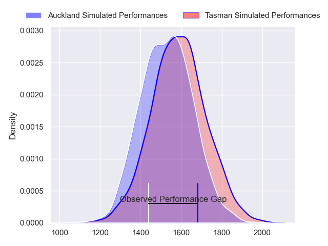
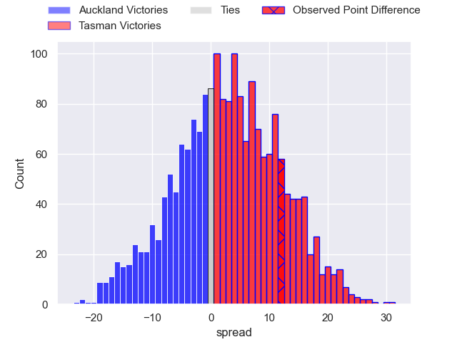
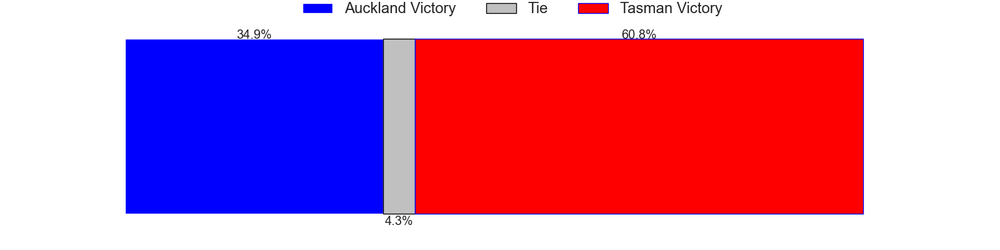
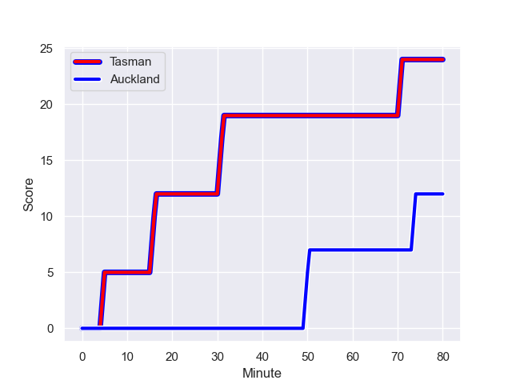
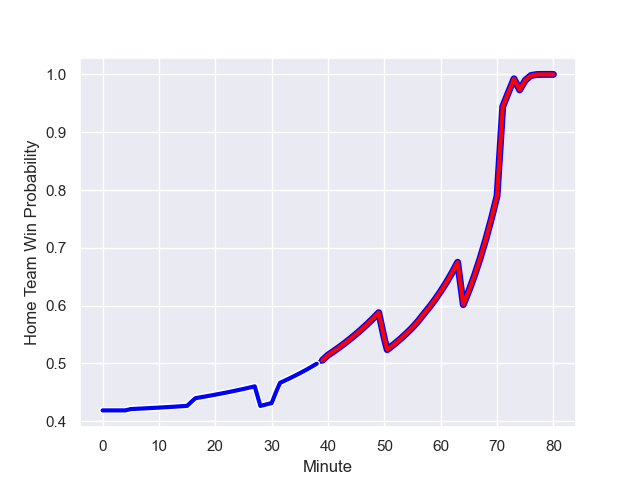

---  
layout: page  
title: Auckland at Tasman; 12-24  
date: 2023-08-12 18:00:00 -0500  
categories: match review  
---
# Auckland at Tasman; 12-24

# Club Level Predictions

The first set of predictions treats a club as the smallest object, as the club develops its members, organizes a gameplan, and deploys its players as needed for each match. This club model has a prediction of 0.584, which translates to predicting Tasman to win by 3.2.

Each club has a rating and a rating deviation (simiar to a Glicko system), and expected performances can be generated. This allows for simulated matches and spreads like the ones below.
## Projected Performances

## Projected Spreads

## Projected Results

# Player Level Predictions - Version 1

Treating teams instead as an entity made up of the currently active players, I have ratings for each player in an altogether different system. These can be combined to form team ratings once teamsheets are announced, weighting starters a bit higher than the reserves. After the match is played, players can be weighted by their minutes on the field, allowing for an accurate measure of the team's composition. With these compiled team ratings, we can make predictions, measure inaccuracy, and update the individual player ratings.
## Prediction with Player Minutes: Auckland by 10.2

Auckland by 14.2 on a neutral field
## Prediction without Player Minutes: Auckland by 4.0

Auckland by 8.0 on a neutral pitch

## Scores over Time

## Win Probability over Time

There were 9 large changes in win probability in this match

|   Away Minutes | Away Player                 |   Away elo |   Away Percentile |   Number |   Home Percentile |   Home elo | Home Player            |   Home Minutes |
|---------------:|:----------------------------|-----------:|------------------:|---------:|------------------:|-----------:|:-----------------------|---------------:|
|             73 | Josh Fusitua                |      78.37 |       1.01694e+06 |        1 |       1.00442e+06 |      89.55 | Kershawl Sykes-Martin  |             75 |
|             56 | Soane Vikena                |      78.47 |       1.01697e+06 |        2 |       1.01654e+06 |      79.51 | Feleti Kaitu'u         |             57 |
|             56 | Angus Ta'avao-Matau         |      85.11 |       1.01694e+06 |        3 |       1.01493e+06 |      62.48 | Sam Matenga            |             64 |
|             80 | Patrick Tuipulotu           |     128.47 |  689525           |        4 |  829781           |      75.36 | Quinten Strange        |             80 |
|             75 | Josh Beehre                 |      84.04 |       1.01694e+06 |        5 |  852357           |     131.01 | Pari Pari Parkinson    |             28 |
|             64 | Adrian Choat                |      96.03 |  923512           |        6 |  988955           |      77.24 | Max Hicks              |             80 |
|             80 | Blake Gibson                |      86.04 |       1.01693e+06 |        7 |  986087           |      61.61 | Anton Segner           |             80 |
|             80 | Akira Ioane                 |     111.51 |  773217           |        8 |       1.01658e+06 |      79.78 | Tim Sail               |             77 |
|             56 | Taufa Funaki                |      79.92 |       1.01698e+06 |        9 |       1.01656e+06 |      80.9  | Noah Hotham            |             71 |
|             80 | Zarn Sullivan               |      95.91 |  979796           |       10 |       1.01657e+06 |      75.86 | Taine Robinson         |             77 |
|             40 | Caleb Tangitau              |      86.61 |       1.01693e+06 |       11 |       1.01656e+06 |      77.02 | Macca Springer         |             80 |
|             80 | Harry Plummer               |     106.94 |  891866           |       12 |  785011           |     100.88 | Alex Nankivell         |             80 |
|             80 | Bryce Heem                  |     100.61 |  495630           |       13 |  770070           |     113.25 | Levi Aumua             |             73 |
|             80 | AJ Lam                      |      73.63 |  946493           |       14 |  986151           |      74.51 | Timoci Tavatavanawai   |             80 |
|             80 | Roger Tuivasa-Scheck        |      83.3  |       1.01715e+06 |       15 |       1.01715e+06 |      79.51 | Tomasi Alosio Logotuli |             80 |
|             24 | Leni Apisai                 |      80.12 |       1.01695e+06 |       16 |     nan           |      81.24 | Quentin MacDonald      |             23 |
|             24 | Sione Ahio                  |      83.5  |     nan           |       17 |     nan           |      83.89 | Atunaisa Moli          |             16 |
|              7 | Ben Ake                     |      83.71 |     nan           |       18 |     nan           |      79.11 | Matt Graham-Williams   |              5 |
|              5 | Hamish Dalzell              |      59.94 |       1.01598e+06 |       19 |     nan           |      78.74 | Angus Fletcher         |              3 |
|             16 | Che Clark                   |      80.69 |     nan           |       20 |     nan           |      78.92 | Antonio Shalfoon       |             52 |
|             24 | Kalani Thomas               |      78.96 |     nan           |       21 |       1.01607e+06 |      86.05 | Louie Chapman          |              9 |
|             40 | Salesi Tuivuna Mauri Rayasi |      82.76 |       1.01697e+06 |       22 |     nan           |      76.41 | Tim O'Malley           |              3 |
|            nan | nan                         |     nan    |     nan           |       23 |     nan           |      79.3  | Will Gualter           |              7 |

# Player Level Predictions - Version 2

Treating teams instead as an entity made up of the currently active players, I have ratings for each player in an altogether different system. These can be combined to form team ratings once teamsheets are announced, weighting starters a bit higher than the reserves. After the match is played, players can be weighted by their minutes on the field, allowing for an accurate measure of the team's composition. With these compiled team ratings, we can make predictions, measure inaccuracy, and update the individual player ratings.
## Prediction with Player Minutes: Tasman by 1.6

Auckland by 1.7 on a neutral field
## Prediction without Player Minutes: Tasman by 3.2

Auckland by 0.1 on a neutral pitch

|   Away Minutes | Away Player                 |   Away elo |   Away variance |   Number |   Home variance |   Home elo | Home Player            |   Home Minutes |
|---------------:|:----------------------------|-----------:|----------------:|---------:|----------------:|-----------:|:-----------------------|---------------:|
|             73 | Josh Fusitua                |      46.65 |              50 |        1 |              50 |      59.71 | Kershawl Sykes-Martin  |             75 |
|             56 | Soane Vikena                |      46.65 |              50 |        2 |              50 |      46.65 | Feleti Kaitu'u         |             57 |
|             56 | Angus Ta'avao-Matau         |      46.65 |              50 |        3 |              50 |      46.65 | Sam Matenga            |             64 |
|             80 | Patrick Tuipulotu           |      92.61 |              50 |        4 |              50 |      77.92 | Quinten Strange        |             80 |
|             75 | Josh Beehre                 |      46.65 |              50 |        5 |              50 |      99.22 | Pari Pari Parkinson    |             28 |
|             64 | Adrian Choat                |      48.16 |              50 |        6 |              50 |      53.07 | Max Hicks              |             80 |
|             80 | Blake Gibson                |      46.65 |              50 |        7 |              50 |      49.48 | Anton Segner           |             80 |
|             80 | Akira Ioane                 |     102.53 |              50 |        8 |              50 |      46.65 | Tim Sail               |             77 |
|             56 | Taufa Funaki                |      46.65 |              50 |        9 |              50 |      46.65 | Noah Hotham            |             71 |
|             80 | Zarn Sullivan               |      58.84 |              50 |       10 |              50 |      46.65 | Taine Robinson         |             77 |
|             40 | Caleb Tangitau              |      46.65 |              50 |       11 |              50 |      46.65 | Macca Springer         |             80 |
|             80 | Harry Plummer               |      77.37 |              50 |       12 |              50 |     101.22 | Alex Nankivell         |             80 |
|             80 | Bryce Heem                  |     106.9  |              50 |       13 |              50 |      78.16 | Levi Aumua             |             73 |
|             80 | AJ Lam                      |      47.82 |              50 |       14 |              50 |      58.8  | Timoci Tavatavanawai   |             80 |
|             80 | Roger Tuivasa-Scheck        |      46.65 |              50 |       15 |              50 |      46.65 | Tomasi Alosio Logotuli |             80 |
|             24 | Leni Apisai                 |      46.65 |              50 |       16 |              50 |      46.65 | Quentin MacDonald      |             23 |
|             24 | Sione Ahio                  |      46.65 |              50 |       17 |              50 |      46.65 | Atunaisa Moli          |             16 |
|              7 | Ben Ake                     |      46.65 |              50 |       18 |              50 |      46.65 | Matt Graham-Williams   |              5 |
|              5 | Hamish Dalzell              |      46.65 |              50 |       19 |              50 |      46.65 | Angus Fletcher         |              3 |
|             16 | Che Clark                   |      46.65 |              50 |       20 |              50 |      46.65 | Antonio Shalfoon       |             52 |
|             24 | Kalani Thomas               |      46.65 |              50 |       21 |              50 |      46.65 | Louie Chapman          |              9 |
|             40 | Salesi Tuivuna Mauri Rayasi |      46.65 |              50 |       22 |              50 |      46.65 | Tim O'Malley           |              3 |
|            nan | nan                         |     nan    |             nan |       23 |              50 |      46.65 | Will Gualter           |              7 |

