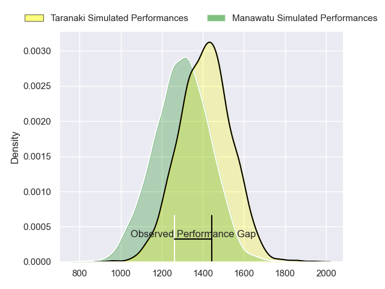
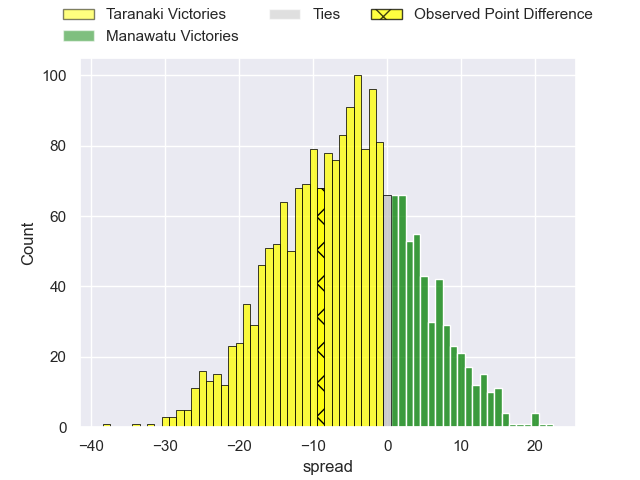
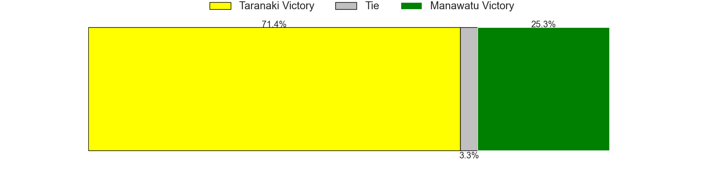
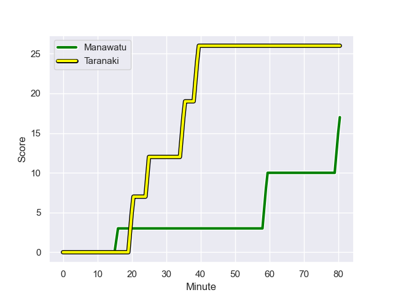
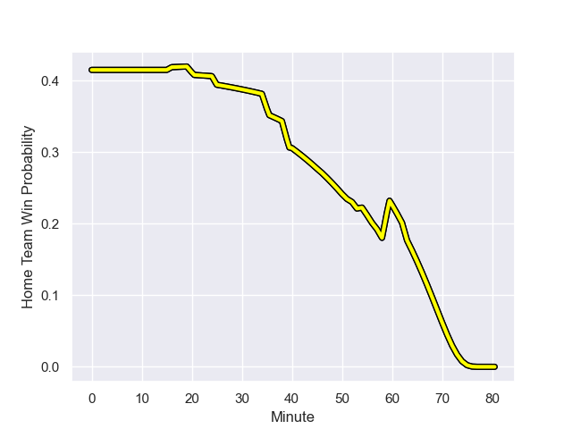

---  
layout: page  
title: Taranaki at Manawatu; 26-17  
date: 2023-08-13 18:00:00 -0500  
categories: match review  
---
# Taranaki at Manawatu; 26-17

# Club Level Predictions

The first set of predictions treats a club as the smallest object, as the club develops its members, organizes a gameplan, and deploys its players as needed for each match. This club model has a prediction of 0.349, which translates to predicting Taranaki to win by 5.8.

Each club has a rating and a rating deviation (simiar to a Glicko system), and expected performances can be generated. This allows for simulated matches and spreads like the ones below.
## Projected Performances

## Projected Spreads

## Projected Results

# Player Level Predictions - Version 1

Treating teams instead as an entity made up of the currently active players, I have ratings for each player in an altogether different system. These can be combined to form team ratings once teamsheets are announced, weighting starters a bit higher than the reserves. After the match is played, players can be weighted by their minutes on the field, allowing for an accurate measure of the team's composition. With these compiled team ratings, we can make predictions, measure inaccuracy, and update the individual player ratings.
## Prediction with Player Minutes: Taranaki by 10.9

Taranaki by 14.9 on a neutral field
## Prediction without Player Minutes: Taranaki by 11.1

Taranaki by 15.1 on a neutral pitch

## Scores over Time

## Win Probability over Time

There were 2 large changes in win probability in this match

|   Away Minutes | Away Player                   |   Away elo |   Away Percentile |   Number |   Home Percentile |   Home elo | Home Player           |   Home Minutes |
|---------------:|:------------------------------|-----------:|------------------:|---------:|------------------:|-----------:|:----------------------|---------------:|
|             46 | Jared Proffit                 |      79.32 |                44 |        1 |                 4 |      46.68 | Sean Bradley Paranihi |             73 |
|             80 | Ricky Riccitelli              |      86.32 |                63 |        2 |                38 |      71.2  | Vernon Bason          |             46 |
|             40 | Reuben O'Neill                |      75.42 |                36 |        3 |                29 |      68.48 | Feleti Sae-Ta'ufo'ou  |             46 |
|             54 | Jesse Parete                  |      71.62 |                28 |        4 |                41 |      72.69 | Ofa Tauatevalu        |             80 |
|             54 | Hemopo Cunningham             |      84.86 |                52 |        5 |                30 |      67.59 | Stan van den Hoven    |             60 |
|             54 | Kaylum Boshier                |      82.67 |                52 |        6 |                50 |      74.96 | Johannes Momsen       |             80 |
|             80 | Arese Poliko                  |      72.7  |                30 |        7 |                70 |      85.68 | Slade McDowall        |             73 |
|             80 | Pita Gus Sowakula             |      98.11 |                79 |        8 |                27 |      64.7  | Brayden Iose          |             80 |
|             51 | Logan Crowley                 |      78.34 |                42 |        9 |                 9 |      53.19 | Luke Campbell         |             52 |
|             80 | Jayson Potroz                 |      92    |                58 |       10 |                76 |      97.39 | Brett Cameron         |             63 |
|             80 | Kini Naholo                   |     116.83 |                93 |       11 |                89 |     105.32 | Tima Fainga'anuku     |             80 |
|             57 | Teihorangi Walden             |      61.77 |                15 |       12 |                 9 |      51.02 | Jason Emery           |             57 |
|             80 | Meihana Grindlay              |      82.51 |                47 |       13 |                41 |      72.24 | Kyle Brown            |             80 |
|             80 | Jacob Ratumaitavuki-Kneepkens |      83.48 |                49 |       14 |                35 |      68.2  | Taniela Filimone      |             80 |
|             52 | Matty McKenzie                |      73.29 |                30 |       15 |                50 |      77.98 | Drew Wild             |             80 |
|             34 | Mitch O'Neill                 |      72.49 |               nan |       16 |               nan |      66.58 | Flyn Yates            |             34 |
|             40 | Kyle Stewart                  |      71.38 |                23 |       17 |               nan |      67.43 | Leif Schwenke         |             34 |
|             26 | Millenium Sanerivi            |      74.34 |                31 |       18 |               nan |      67.77 | Terrell Peita         |             20 |
|             26 | Tom Florence                  |      59.33 |                14 |       19 |               nan |      66.37 | Jordi Viljoen         |             28 |
|             26 | Bradley Slater                |      77.52 |                43 |       20 |                37 |      72.47 | Nehe Milner-Skudder   |             23 |
|             29 | Adam Lennox                   |      75.17 |               nan |       21 |               nan |      67.11 | Isaiah Ravula         |             17 |
|             23 | Josh Jacomb                   |      76.56 |                37 |       22 |               nan |      67.27 | Julian Goerke         |              7 |
|             28 | Vereniki Tikoisolomone        |      75.58 |                41 |       23 |                27 |      68.96 | Joseph Gavigan        |              7 |

# Player Level Predictions - Version 2

Treating teams instead as an entity made up of the currently active players, I have ratings for each player in an altogether different system. These can be combined to form team ratings once teamsheets are announced, weighting starters a bit higher than the reserves. After the match is played, players can be weighted by their minutes on the field, allowing for an accurate measure of the team's composition. With these compiled team ratings, we can make predictions, measure inaccuracy, and update the individual player ratings.
## Prediction with Player Minutes: Taranaki by 5.0

Taranaki by 8.3 on a neutral field
## Prediction without Player Minutes: Taranaki by 4.1

Taranaki by 7.4 on a neutral pitch

|   Away Minutes | Away Player                   |   Away elo |   Away variance |   Number |   Home variance |   Home elo | Home Player           |   Home Minutes |
|---------------:|:------------------------------|-----------:|----------------:|---------:|----------------:|-----------:|:----------------------|---------------:|
|             46 | Jared Proffit                 |      46.65 |              50 |        1 |              50 |      46.65 | Sean Bradley Paranihi |             73 |
|             80 | Ricky Riccitelli              |      44.59 |              50 |        2 |              50 |      46.65 | Vernon Bason          |             46 |
|             40 | Reuben O'Neill                |      46.65 |              50 |        3 |              50 |      46.65 | Feleti Sae-Ta'ufo'ou  |             46 |
|             54 | Jesse Parete                  |      46.65 |              50 |        4 |              50 |      46.65 | Ofa Tauatevalu        |             80 |
|             54 | Hemopo Cunningham             |      46.65 |              50 |        5 |              50 |      46.65 | Stan van den Hoven    |             60 |
|             54 | Kaylum Boshier                |      46.65 |              50 |        6 |              50 |     -10.25 | Johannes Momsen       |             80 |
|             80 | Arese Poliko                  |      46.65 |              50 |        7 |              50 |      46.65 | Slade McDowall        |             73 |
|             80 | Pita Gus Sowakula             |      82.43 |              50 |        8 |              50 |      24.15 | Brayden Iose          |             80 |
|             51 | Logan Crowley                 |      46.65 |              50 |        9 |              50 |      46.65 | Luke Campbell         |             52 |
|             80 | Jayson Potroz                 |      46.65 |              50 |       10 |              50 |      32.31 | Brett Cameron         |             63 |
|             80 | Kini Naholo                   |      85.92 |              50 |       11 |              50 |       8.63 | Tima Fainga'anuku     |             80 |
|             57 | Teihorangi Walden             |      46.65 |              50 |       12 |              50 |      46.65 | Jason Emery           |             57 |
|             80 | Meihana Grindlay              |      46.65 |              50 |       13 |              50 |      46.65 | Kyle Brown            |             80 |
|             80 | Jacob Ratumaitavuki-Kneepkens |      46.65 |              50 |       14 |              50 |      46.65 | Taniela Filimone      |             80 |
|             52 | Matty McKenzie                |      46.65 |              50 |       15 |              50 |      46.65 | Drew Wild             |             80 |
|             34 | Mitch O'Neill                 |      46.65 |              50 |       16 |              50 |      46.65 | Flyn Yates            |             34 |
|             40 | Kyle Stewart                  |      46.65 |              50 |       17 |              50 |      46.65 | Leif Schwenke         |             34 |
|             26 | Millenium Sanerivi            |      46.65 |              50 |       18 |              50 |      46.65 | Terrell Peita         |             20 |
|             26 | Tom Florence                  |      46.65 |              50 |       19 |              50 |      46.65 | Jordi Viljoen         |             28 |
|             26 | Bradley Slater                |      46.65 |              50 |       20 |              50 |      46.65 | Nehe Milner-Skudder   |             23 |
|             29 | Adam Lennox                   |      46.65 |              50 |       21 |              50 |      46.65 | Isaiah Ravula         |             17 |
|             23 | Josh Jacomb                   |      46.65 |              50 |       22 |              50 |      46.65 | Julian Goerke         |              7 |
|             28 | Vereniki Tikoisolomone        |      46.65 |              50 |       23 |              50 |      46.65 | Joseph Gavigan        |              7 |

