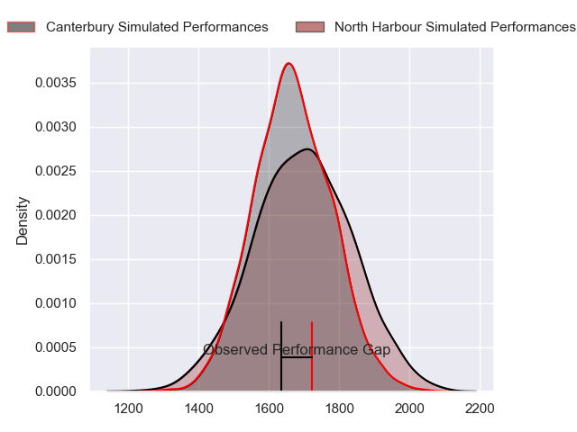
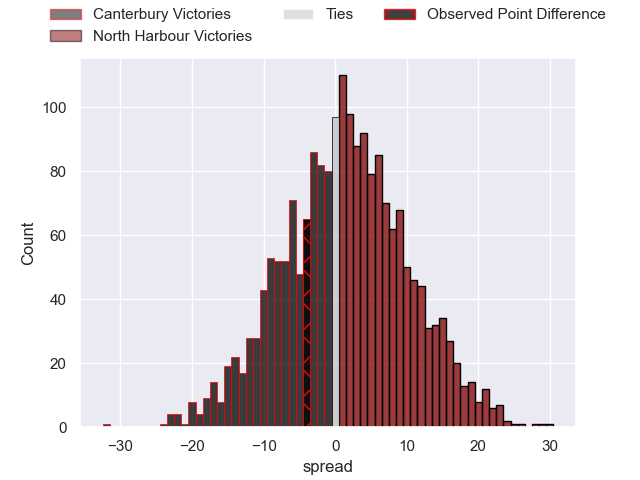
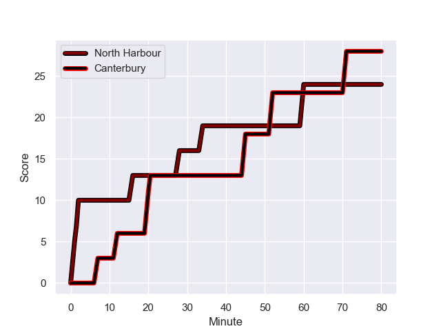
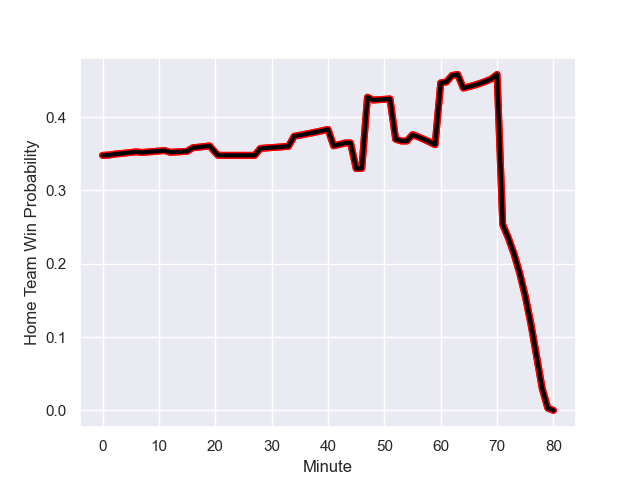

---  
layout: page  
title: Canterbury at North Harbour; 28-24  
date: 2023-08-13 18:00:00 -0500  
categories: match review  
---
# Canterbury at North Harbour; 28-24

# Club Level Predictions

The first set of predictions treats a club as the smallest object, as the club develops its members, organizes a gameplan, and deploys its players as needed for each match. This club model has a prediction of 0.542, which translates to predicting North Harbour to win by 1.6.

Each club has a rating and a rating deviation (simiar to a Glicko system), and expected performances can be generated. This allows for simulated matches and spreads like the ones below.
## Projected Performances

## Projected Spreads

## Projected Results

# Player Level Predictions - Version 1

Treating teams instead as an entity made up of the currently active players, I have ratings for each player in an altogether different system. These can be combined to form team ratings once teamsheets are announced, weighting starters a bit higher than the reserves. After the match is played, players can be weighted by their minutes on the field, allowing for an accurate measure of the team's composition. With these compiled team ratings, we can make predictions, measure inaccuracy, and update the individual player ratings.
## Prediction with Player Minutes: Canterbury by 23.3

Canterbury by 27.3 on a neutral field
## Prediction without Player Minutes: Canterbury by 21.7

Canterbury by 25.7 on a neutral pitch

## Scores over Time

## Win Probability over Time

There were 11 large changes in win probability in this match

|   Away Minutes | Away Player          |   Away elo |   Away Percentile |   Number |   Home Percentile |   Home elo | Home Player             |   Home Minutes |
|---------------:|:---------------------|-----------:|------------------:|---------:|------------------:|-----------:|:------------------------|---------------:|
|             54 | Daniel Lienert-Brown |      92.29 |                63 |        1 |                34 |      68.05 | Nic Mayhew              |             44 |
|             64 | Ben Funnell          |      91.23 |                60 |        2 |                47 |      70.74 | Shilo Klein             |             64 |
|             47 | Seb Calder           |      91.67 |                63 |        3 |                95 |     103.65 | Tevita Mafileo          |             64 |
|             41 | Luke Romano          |      90.5  |                60 |        4 |                94 |     107.48 | Ben Grant               |             80 |
|             80 | Tahlor Cahill        |      90.67 |                52 |        5 |                48 |      75.13 | Mike McKee              |             47 |
|             41 | Corey Kellow         |      74.22 |                31 |        6 |                64 |      76.97 | Tamarau McGahan         |             80 |
|             80 | Tom Christie         |     111.82 |                88 |        7 |                55 |      76.13 | Jed Melvin              |             47 |
|             80 | Billy Harmon         |     109.3  |                90 |        8 |                90 |     103.06 | Cameron Suafoa          |             80 |
|             48 | Willi Heinz          |      89.6  |                58 |        9 |                57 |      77.24 | Jamie Booth             |             64 |
|             80 | Fergus Burke         |      92.59 |                49 |       10 |                54 |      77.03 | Oscar Koller            |             80 |
|             80 | Blair Murray         |      92.54 |                56 |       11 |                56 |      78.86 | Tika Lelenga            |             47 |
|             70 | Rameka Poihipi       |      95.05 |                70 |       12 |                12 |      55.04 | Henry Taefu             |             55 |
|             80 | Dallas McLeod        |     102.8  |                80 |       13 |                64 |      79.95 | Tom Barham              |             80 |
|             62 | Manasa Mataele       |     103    |                83 |       14 |                62 |      78.42 | Alapati Leiua           |             80 |
|             80 | Chay Fihaki          |     121.13 |                90 |       15 |                59 |      77.37 | Kade Banks              |             80 |
|             16 | James Mullan         |      92.11 |               nan |       16 |               nan |      73.12 | Bryn Gordon             |             16 |
|             26 | Tom Heywood          |      88.07 |               nan |       17 |               nan |      73.09 | Sione Mafileo           |             16 |
|             33 | Oli Jager            |     107.09 |                93 |       18 |                19 |      64.69 | Tevita Langi            |             36 |
|             39 | Mitchell Dunshea     |      88.93 |               nan |       19 |               nan |      75.13 | Wallace Sititi          |             33 |
|             39 | Cullen Grace         |     115.62 |                95 |       20 |               nan |      75.58 | Maetaki He Lotu Inisi   |             33 |
|             32 | Mitchell Drummond    |      96.53 |                75 |       21 |               nan |      74.32 | Aisea Halo              |             16 |
|             18 | Alex Harford         |      91.37 |               nan |       22 |               nan |      71.07 | John Tapueluelu         |             33 |
|             10 | Jone Rova            |      91.9  |               nan |       23 |               nan |      73.93 | Danyon Morgan-Puterangi |             25 |

# Player Level Predictions - Version 2

Treating teams instead as an entity made up of the currently active players, I have ratings for each player in an altogether different system. These can be combined to form team ratings once teamsheets are announced, weighting starters a bit higher than the reserves. After the match is played, players can be weighted by their minutes on the field, allowing for an accurate measure of the team's composition. With these compiled team ratings, we can make predictions, measure inaccuracy, and update the individual player ratings.
## Prediction with Player Minutes: Canterbury by 4.5

Canterbury by 7.8 on a neutral field
## Prediction without Player Minutes: Canterbury by 4.0

Canterbury by 7.4 on a neutral pitch

|   Away Minutes | Away Player          |   Away elo |   Away variance |   Number |   Home variance |   Home elo | Home Player             |   Home Minutes |
|---------------:|:---------------------|-----------:|----------------:|---------:|----------------:|-----------:|:------------------------|---------------:|
|             54 | Daniel Lienert-Brown |      46.65 |              50 |        1 |           50    |      46.65 | Nic Mayhew              |             44 |
|             64 | Ben Funnell          |      46.65 |              50 |        2 |           50    |      46.65 | Shilo Klein             |             64 |
|             47 | Seb Calder           |      46.65 |              50 |        3 |           50    |      60.42 | Tevita Mafileo          |             64 |
|             41 | Luke Romano          |      46.65 |              50 |        4 |           47.89 |      72.7  | Ben Grant               |             80 |
|             80 | Tahlor Cahill        |      46.65 |              50 |        5 |           50    |      -7.59 | Mike McKee              |             47 |
|             41 | Corey Kellow         |      49.69 |              50 |        6 |           50    |      46.65 | Tamarau McGahan         |             80 |
|             80 | Tom Christie         |     103.08 |              50 |        7 |           50    |      46.65 | Jed Melvin              |             47 |
|             80 | Billy Harmon         |      68.11 |              50 |        8 |           50    |      45.96 | Cameron Suafoa          |             80 |
|             48 | Willi Heinz          |      46.65 |              50 |        9 |           50    |      46.65 | Jamie Booth             |             64 |
|             80 | Fergus Burke         |      55.64 |              50 |       10 |           50    |      46.65 | Oscar Koller            |             80 |
|             80 | Blair Murray         |      46.65 |              50 |       11 |           50    |      46.65 | Tika Lelenga            |             47 |
|             70 | Rameka Poihipi       |      62.35 |              50 |       12 |           50    |      29.01 | Henry Taefu             |             55 |
|             80 | Dallas McLeod        |      69.77 |              50 |       13 |           50    |      46.65 | Tom Barham              |             80 |
|             62 | Manasa Mataele       |      47.7  |              50 |       14 |           50    |      46.65 | Alapati Leiua           |             80 |
|             80 | Chay Fihaki          |      64.97 |              50 |       15 |           50    |      46.65 | Kade Banks              |             80 |
|             16 | James Mullan         |      46.65 |              50 |       16 |           50    |      46.65 | Bryn Gordon             |             16 |
|             26 | Tom Heywood          |      46.65 |              50 |       17 |           50    |      46.65 | Sione Mafileo           |             16 |
|             33 | Oli Jager            |      82.9  |              50 |       18 |           50    |      46.65 | Tevita Langi            |             36 |
|             39 | Mitchell Dunshea     |      46.65 |              50 |       19 |           50    |      46.65 | Wallace Sititi          |             33 |
|             39 | Cullen Grace         |      76.75 |              50 |       20 |           50    |      46.65 | Maetaki He Lotu Inisi   |             33 |
|             32 | Mitchell Drummond    |      66.51 |              50 |       21 |           50    |      46.65 | Aisea Halo              |             16 |
|             18 | Alex Harford         |      46.65 |              50 |       22 |           50    |      46.65 | John Tapueluelu         |             33 |
|             10 | Jone Rova            |      46.65 |              50 |       23 |           50    |      46.65 | Danyon Morgan-Puterangi |             25 |

