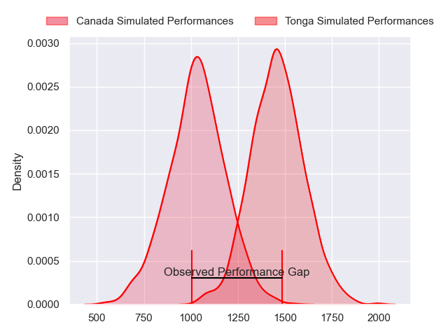
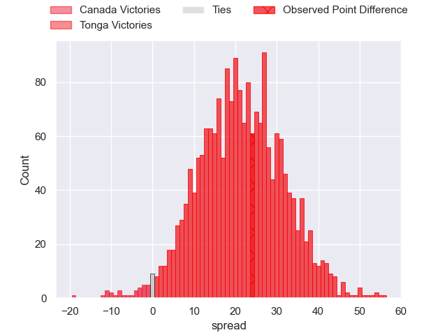
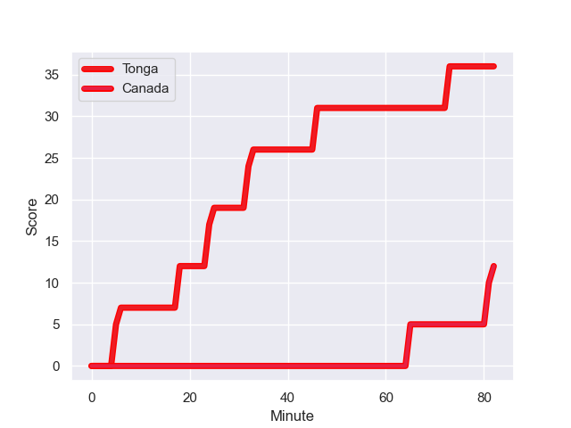
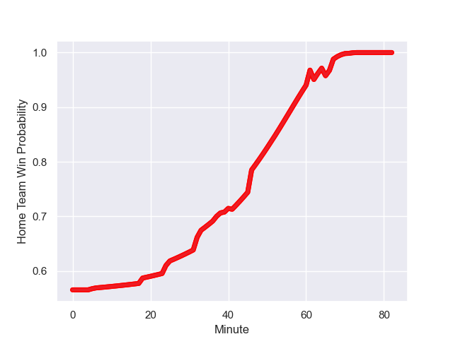

---  
layout: page  
title: Canada at Tonga; 12.0-36.0  
date: 2023-08-14 18:00:00 -0500  
categories: match review  
---
# Canada at Tonga; 12.0-36.0

# Club Level Predictions

The first set of predictions treats a club as the smallest object, as the club develops its members, organizes a gameplan, and deploys its players as needed for each match. This club model has a prediction of 0.901, which translates to predicting Tonga to win by 21.3.

Each club has a rating and a rating deviation (simiar to a Glicko system), and expected performances can be generated. This allows for simulated matches and spreads like the ones below.
## Projected Performances

## Projected Spreads

## Projected Results

# Player Level Predictions - Version 1

Treating teams instead as an entity made up of the currently active players, I have ratings for each player in an altogether different system. These can be combined to form team ratings once teamsheets are announced, weighting starters a bit higher than the reserves. After the match is played, players can be weighted by their minutes on the field, allowing for an accurate measure of the team's composition. With these compiled team ratings, we can make predictions, measure inaccuracy, and update the individual player ratings.
## Prediction with Player Minutes: Tonga by 15.5

Tonga by 11.5 on a neutral field
## Prediction without Player Minutes: Tonga by 15.1

Tonga by 11.1 on a neutral pitch

## Scores over Time

## Win Probability over Time

There were 2 large changes in win probability in this match

|   Away Minutes | Away Player         |   Away elo |   Away Percentile |   Number |   Home Percentile |   Home elo | Home Player           |   Home Minutes |
|---------------:|:--------------------|-----------:|------------------:|---------:|------------------:|-----------:|:----------------------|---------------:|
|             37 | Liam Murray         |      70.48 |  982950           |        1 |  943077           |      48.67 | Ziggy Fisi'ihoi       |             82 |
|             67 | Andrew Quattrin     |      67.06 |  946078           |        2 |       1.01719e+06 |      78.01 | Sosefo Sakalia        |             52 |
|             39 | Conor Young         |      65.57 |       1.0154e+06  |        3 |  574467           |     102.65 | Ben Tameifuna         |             41 |
|             82 | Izzak Kelly         |      72.86 |       1.01707e+06 |        4 |  462905           |      90.21 | Steve Mafi            |             66 |
|             71 | Conor Keys          |      72.83 |  872380           |        5 |  691971           |     120    | Vaea Fifita           |             82 |
|             82 | Lucas Rumball       |      96.41 |  823264           |        6 |  895005           |      59    | Samiuela Moli         |             82 |
|             77 | Sion Parry          |      65.99 |       1.01707e+06 |        7 |       1.0172e+06  |      77.78 | Sione Tupou           |             66 |
|             67 | Siaki Vikilani      |      65.87 |  981090           |        8 |  924308           |      66.02 | Solomone Funaki       |             82 |
|             61 | Jason Higgins       |      40.96 |  978033           |        9 |       1.01648e+06 |      73.11 | Sonatane Takulua      |             62 |
|             82 | Robbie Povey        |     107.46 |  959644           |       10 |  990474           |     112.06 | William Havili        |             62 |
|             82 | Isaac Olson         |      67.71 |       1.01538e+06 |       11 |  943989           |      85.09 | John Ika              |             82 |
|             67 | Spencer Jones       |      78.99 |       1.01503e+06 |       12 |  575329           |      85.81 | Pita Ahki             |             71 |
|             82 | Mitchell Richardson |      67.58 |       1.01708e+06 |       13 |  945412           |      58.15 | Fine Inisi            |             82 |
|             82 | Kainoa Lloyd        |      79.48 |  901642           |       14 |       1.01648e+06 |      82.03 | Kyren Taumoefolau     |             82 |
|             82 | Peter Nelson        |     102.47 |  579864           |       15 |  877639           |      85.96 | Otumaka Mausia        |             82 |
|             15 | Foster Dewitt       |      67.03 |     nan           |       16 |  525940           |      80.68 | Paula Ngauamo         |             30 |
|             45 | Djustice Sears-Duru |      65.4  |  793326           |       17 |  788119           |      86.9  | Feao Fotuaika         |             41 |
|             43 | Cole Keith          |      74.43 |  911939           |       18 |     nan           |      77.36 | Paula Latu            |             41 |
|             11 | Piers Von Dadelszen |      67.98 |     nan           |       19 |     nan           |      77.57 | Vutulongo Puloka      |             16 |
|              5 | Mason Flesch        |      49.43 |       1.01544e+06 |       20 |     nan           |      77.17 | Christopher Hala'ufia |             16 |
|             15 | Travis Larsen       |      66.04 |     nan           |       21 |     nan           |      76.99 | Feleti Inoke          |             11 |
|             21 | Ross Braude         |      80.76 |  978391           |       22 |       1.01647e+06 |      77.58 | Patrick Pellegrini    |             20 |
|             15 | Gabe Casey          |      68.78 |     nan           |       23 |     nan           |      76.81 | Tasi Feke             |             20 |

# Player Level Predictions - Version 2

Treating teams instead as an entity made up of the currently active players, I have ratings for each player in an altogether different system. These can be combined to form team ratings once teamsheets are announced, weighting starters a bit higher than the reserves. After the match is played, players can be weighted by their minutes on the field, allowing for an accurate measure of the team's composition. With these compiled team ratings, we can make predictions, measure inaccuracy, and update the individual player ratings.
## Prediction with Player Minutes: Tonga by 11.4

Tonga by 8.4 on a neutral field
## Prediction without Player Minutes: Tonga by 12.3

Tonga by 9.2 on a neutral pitch

|   Away Minutes | Away Player         |   Away elo |   Away variance |   Number |   Home variance |   Home elo | Home Player           |   Home Minutes |
|---------------:|:--------------------|-----------:|----------------:|---------:|----------------:|-----------:|:----------------------|---------------:|
|             37 | Liam Murray         |     -36.12 |           50    |        1 |           49.79 |      36.15 | Ziggy Fisi'ihoi       |             82 |
|             67 | Andrew Quattrin     |      45.83 |           50    |        2 |           50    |      46.65 | Sosefo Sakalia        |             52 |
|             39 | Conor Young         |      46.65 |           50    |        3 |           47.8  |      88.57 | Ben Tameifuna         |             41 |
|             82 | Izzak Kelly         |      46.65 |           50    |        4 |           49.87 |      45.51 | Steve Mafi            |             66 |
|             71 | Conor Keys          |      71.62 |           47.95 |        5 |           49.66 |     108.33 | Vaea Fifita           |             82 |
|             82 | Lucas Rumball       |     -40.6  |           50    |        6 |           48.69 |      30.51 | Samiuela Moli         |             82 |
|             77 | Sion Parry          |      46.65 |           50    |        7 |           50    |      46.65 | Sione Tupou           |             66 |
|             67 | Siaki Vikilani      |      26.74 |           50    |        8 |           48.07 |      45.42 | Solomone Funaki       |             82 |
|             61 | Jason Higgins       |      -7.11 |           50    |        9 |           49.84 |      47.68 | Sonatane Takulua      |             62 |
|             82 | Robbie Povey        |      77.83 |           50    |       10 |           48.26 |      52.51 | William Havili        |             62 |
|             82 | Isaac Olson         |      46.65 |           50    |       11 |           50    |      46.65 | John Ika              |             82 |
|             67 | Spencer Jones       |      46.65 |           50    |       12 |           47.64 |      54.38 | Pita Ahki             |             71 |
|             82 | Mitchell Richardson |      46.65 |           50    |       13 |           49.11 |       3    | Fine Inisi            |             82 |
|             82 | Kainoa Lloyd        |      40.63 |           50    |       14 |           49.85 |      47.62 | Kyren Taumoefolau     |             82 |
|             82 | Peter Nelson        |      26.92 |           50    |       15 |           49.77 |      36.74 | Otumaka Mausia        |             82 |
|             15 | Foster Dewitt       |      46.65 |           50    |       16 |           49.97 |      63.63 | Paula Ngauamo         |             30 |
|             45 | Djustice Sears-Duru |     -25.34 |           50    |       17 |           49.35 |      43.51 | Feao Fotuaika         |             41 |
|             43 | Cole Keith          |     100.56 |           48.75 |       18 |           50    |      46.65 | Paula Latu            |             41 |
|             11 | Piers Von Dadelszen |      46.65 |           50    |       19 |           50    |      46.65 | Vutulongo Puloka      |             16 |
|              5 | Mason Flesch        |      46.65 |           50    |       20 |           50    |      46.65 | Christopher Hala'ufia |             16 |
|             15 | Travis Larsen       |      46.65 |           50    |       21 |           50    |      46.65 | Feleti Inoke          |             11 |
|             21 | Ross Braude         |      64.1  |           50    |       22 |           50    |      46.65 | Patrick Pellegrini    |             20 |
|             15 | Gabe Casey          |      46.65 |           50    |       23 |           50    |      46.65 | Tasi Feke             |             20 |

