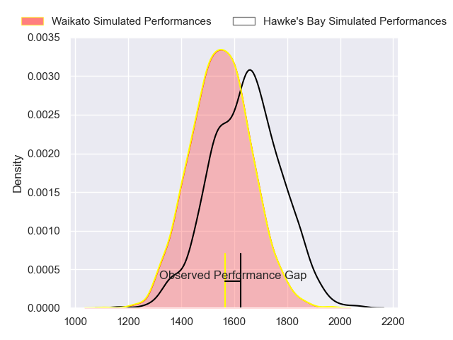
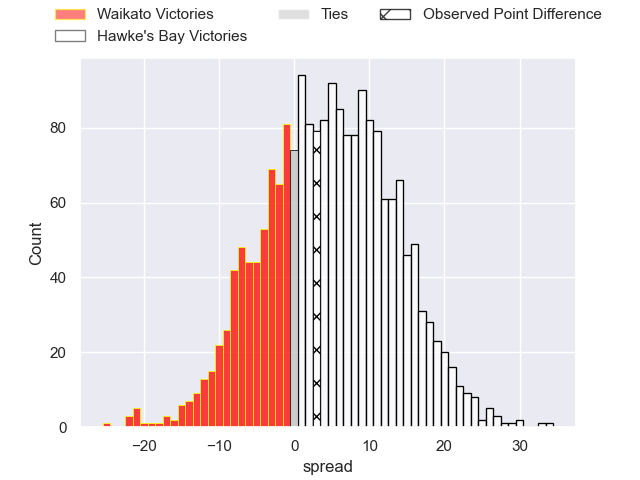
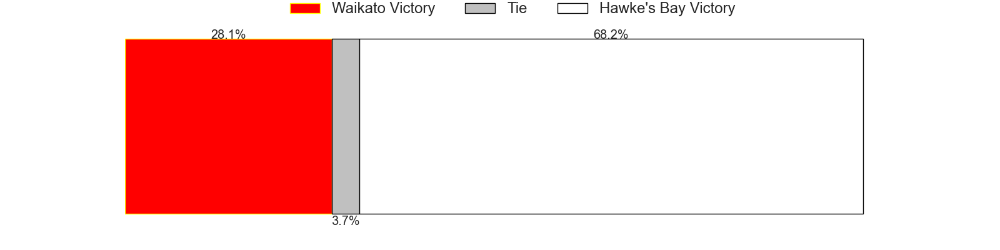
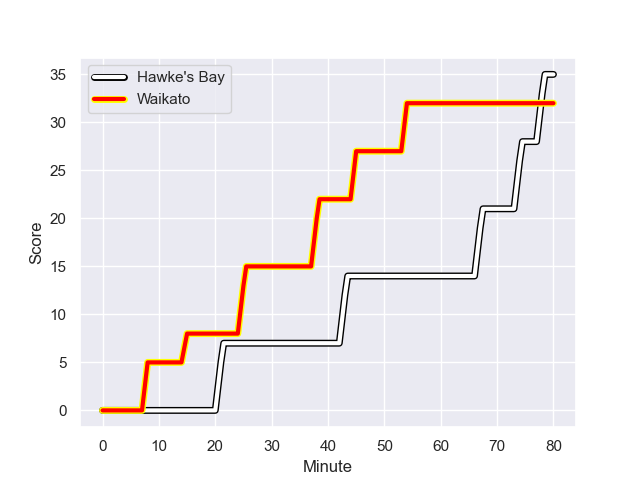
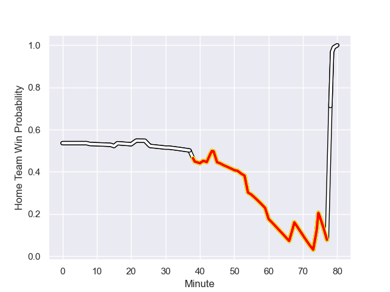

---  
layout: page  
title: Waikato at Hawke's Bay; 32-35  
date: 2023-08-16 18:00:00 -0500  
categories: match review  
---
# Waikato at Hawke's Bay; 32-35

# Club Level Predictions

The first set of predictions treats a club as the smallest object, as the club develops its members, organizes a gameplan, and deploys its players as needed for each match. This club model has a prediction of 0.619, which translates to predicting Hawke's Bay to win by 4.5.

Each club has a rating and a rating deviation (simiar to a Glicko system), and expected performances can be generated. This allows for simulated matches and spreads like the ones below.
## Projected Performances

## Projected Spreads

## Projected Results

# Player Level Predictions - Version 1

Treating teams instead as an entity made up of the currently active players, I have ratings for each player in an altogether different system. These can be combined to form team ratings once teamsheets are announced, weighting starters a bit higher than the reserves. After the match is played, players can be weighted by their minutes on the field, allowing for an accurate measure of the team's composition. With these compiled team ratings, we can make predictions, measure inaccuracy, and update the individual player ratings.
## Prediction with Player Minutes: Hawke's Bay by 10.2

Hawke's Bay by 6.2 on a neutral field
## Prediction without Player Minutes: Hawke's Bay by 8.8

Hawke's Bay by 4.8 on a neutral pitch

## Scores over Time

## Win Probability over Time

There were 13 large changes in win probability in this match

|   Away Minutes | Away Player          |   Away elo |   Away Percentile |   Number |   Home Percentile |   Home elo | Home Player                |   Home Minutes |
|---------------:|:---------------------|-----------:|------------------:|---------:|------------------:|-----------:|:---------------------------|---------------:|
|             69 | Ollie Norris         |      92.65 |  943987           |        1 |       1.01675e+06 |      79.72 | Pouri Gordon Rakete-Stones |             55 |
|             51 | Rhys Marshall        |      74.97 |       1.01714e+06 |        2 |       1.01541e+06 |      69.01 | Kianu Kereru-Symes         |             41 |
|             69 | Solomone Tukuafu     |      74.41 |       1.01704e+06 |        3 |       1.01617e+06 |      51.78 | Isaac Salmon               |             16 |
|             31 | Tai Cribb            |      76.08 |       1.01703e+06 |        4 |       1.01678e+06 |      79.67 | Frank Lochore              |             80 |
|             80 | Hamilton Burr        |      77.53 |       1.01699e+06 |        5 |       1.0172e+06  |      76.72 | Tom Allen                  |             80 |
|             80 | Xavier Saifoloi      |      73.32 |       1.01721e+06 |        6 |       1.01721e+06 |      76.36 | Josh Gimblett              |             39 |
|             52 | Patrick McCurran     |      72.94 |       1.01703e+06 |        7 |       1.01679e+06 |      79.3  | Siosiua (Josh) Kaifa       |             51 |
|             80 | Te Rama Reuben       |      74.07 |       1.0172e+06  |        8 |       1.01675e+06 |      72.82 | Marino Mikaele Tu'u        |             80 |
|             69 | Xavier Roe           |      76.43 |       1.01702e+06 |        9 |  696458           |     137.7  | Brad Weber                 |             60 |
|             80 | Taha Kemara          |      72.93 |       1.01704e+06 |       10 |       1.01676e+06 |      79.95 | Lincoln McClutchie         |             80 |
|             80 | Tana Tuhakaraina     |      75.04 |       1.01705e+06 |       11 |  797353           |      83.62 | Jonah Lowe                 |             80 |
|             64 | Austin Anderson      |      76.48 |       1.01714e+06 |       12 |  741034           |      83.11 | Chase Tiatia               |             80 |
|             47 | Bailyn Sullivan      |      76.25 |       1.01702e+06 |       13 |       1.01675e+06 |      84.71 | Nicholas Grigg             |             60 |
|             80 | Cody Nordstrom       |      73.67 |       1.01721e+06 |       14 |       1.01511e+06 |      82.2  | Paul Balekana              |             80 |
|             80 | Liam Coombes-Fabling |      93.63 |       1.01608e+06 |       15 |       1.01477e+06 |      70.56 | Caleb Makene               |             55 |
|             11 | Mason Tupaea         |      80.15 |       1.01699e+06 |       16 |     nan           |      78.76 | Timothy John Farrell       |             25 |
|             29 | Sean Ralph           |      73.87 |     nan           |       17 |  987098           |      91.31 | Tyrone Thompson            |             39 |
|             11 | Tolu Fahamokioa      |      74.29 |     nan           |       18 |       1.01507e+06 |      71    | Joel Hintz                 |             64 |
|             49 | Zinzan Hansen        |      73.49 |     nan           |       19 |     nan           |      76.53 | Geoffrey Cridge            |             41 |
|             28 | Simon Parker         |      78.11 |  943906           |       20 |       1.01677e+06 |      84.57 | Sam Smith                  |             29 |
|             11 | Nui Muriwai          |      73.15 |     nan           |       21 |       1.01678e+06 |      75.3  | Folau Fakatava             |             20 |
|             16 | Tepaea Cook-Savage   |      74.81 |       1.01705e+06 |       22 |       1.01708e+06 |      82.73 | Anzelo Tuitavuki           |             20 |
|             33 | Gideon Wrampling     |      78.84 |       1.01698e+06 |       23 |       1.01678e+06 |      77.28 | Harry Godfrey              |             25 |

# Player Level Predictions - Version 2

Treating teams instead as an entity made up of the currently active players, I have ratings for each player in an altogether different system. These can be combined to form team ratings once teamsheets are announced, weighting starters a bit higher than the reserves. After the match is played, players can be weighted by their minutes on the field, allowing for an accurate measure of the team's composition. With these compiled team ratings, we can make predictions, measure inaccuracy, and update the individual player ratings.
## Prediction with Player Minutes: Hawke's Bay by 4.9

Hawke's Bay by 1.5 on a neutral field
## Prediction without Player Minutes: Hawke's Bay by 5.1

Hawke's Bay by 1.8 on a neutral pitch

|   Away Minutes | Away Player          |   Away elo |   Away variance |   Number |   Home variance |   Home elo | Home Player                |   Home Minutes |
|---------------:|:---------------------|-----------:|----------------:|---------:|----------------:|-----------:|:---------------------------|---------------:|
|             69 | Ollie Norris         |      62.78 |              50 |        1 |              50 |      46.65 | Pouri Gordon Rakete-Stones |             55 |
|             51 | Rhys Marshall        |      46.65 |              50 |        2 |              50 |      46.65 | Kianu Kereru-Symes         |             41 |
|             69 | Solomone Tukuafu     |      46.65 |              50 |        3 |              50 |      46.65 | Isaac Salmon               |             16 |
|             31 | Tai Cribb            |      46.65 |              50 |        4 |              50 |      46.65 | Frank Lochore              |             80 |
|             80 | Hamilton Burr        |      46.65 |              50 |        5 |              50 |      46.65 | Tom Allen                  |             80 |
|             80 | Xavier Saifoloi      |      46.65 |              50 |        6 |              50 |      46.65 | Josh Gimblett              |             39 |
|             52 | Patrick McCurran     |      46.65 |              50 |        7 |              50 |      46.65 | Siosiua (Josh) Kaifa       |             51 |
|             80 | Te Rama Reuben       |      46.65 |              50 |        8 |              50 |      46.65 | Marino Mikaele Tu'u        |             80 |
|             69 | Xavier Roe           |      46.65 |              50 |        9 |              50 |     102.51 | Brad Weber                 |             60 |
|             80 | Taha Kemara          |      46.65 |              50 |       10 |              50 |      46.65 | Lincoln McClutchie         |             80 |
|             80 | Tana Tuhakaraina     |      46.65 |              50 |       11 |              50 |      46.03 | Jonah Lowe                 |             80 |
|             64 | Austin Anderson      |      46.65 |              50 |       12 |              50 |      55.23 | Chase Tiatia               |             80 |
|             47 | Bailyn Sullivan      |      46.65 |              50 |       13 |              50 |      46.65 | Nicholas Grigg             |             60 |
|             80 | Cody Nordstrom       |      46.65 |              50 |       14 |              50 |      46.65 | Paul Balekana              |             80 |
|             80 | Liam Coombes-Fabling |      46.65 |              50 |       15 |              50 |      46.65 | Caleb Makene               |             55 |
|             11 | Mason Tupaea         |      46.65 |              50 |       16 |              50 |      46.65 | Timothy John Farrell       |             25 |
|             29 | Sean Ralph           |      46.65 |              50 |       17 |              50 |      42.66 | Tyrone Thompson            |             39 |
|             11 | Tolu Fahamokioa      |      46.65 |              50 |       18 |              50 |      46.65 | Joel Hintz                 |             64 |
|             49 | Zinzan Hansen        |      46.65 |              50 |       19 |              50 |      46.65 | Geoffrey Cridge            |             41 |
|             28 | Simon Parker         |      36.65 |              50 |       20 |              50 |      46.65 | Sam Smith                  |             29 |
|             11 | Nui Muriwai          |      46.65 |              50 |       21 |              50 |      46.65 | Folau Fakatava             |             20 |
|             16 | Tepaea Cook-Savage   |      46.65 |              50 |       22 |              50 |      46.65 | Anzelo Tuitavuki           |             20 |
|             33 | Gideon Wrampling     |      46.65 |              50 |       23 |              50 |      46.65 | Harry Godfrey              |             25 |

