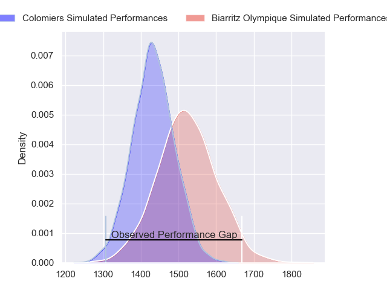
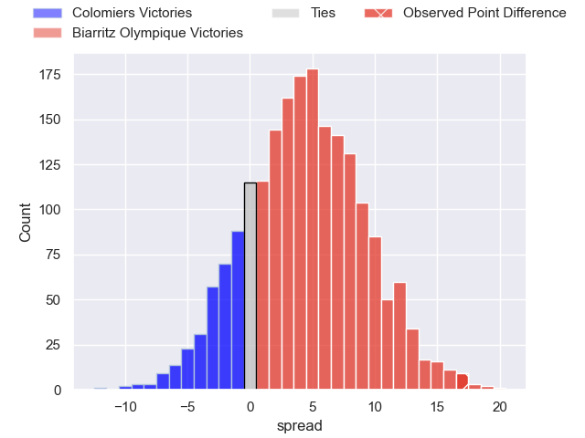
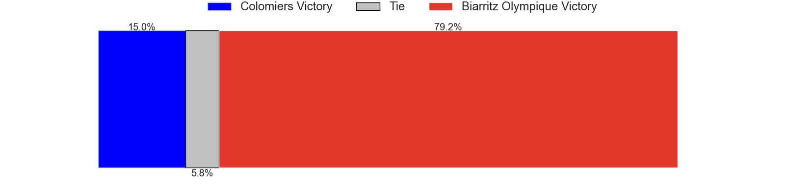
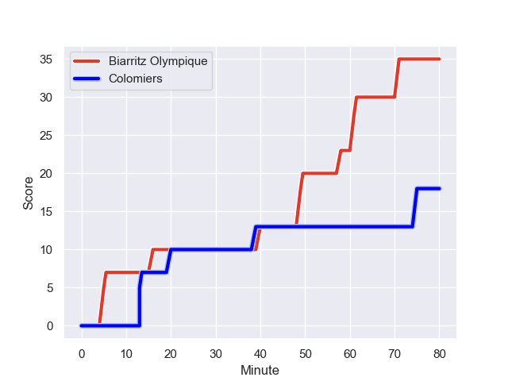
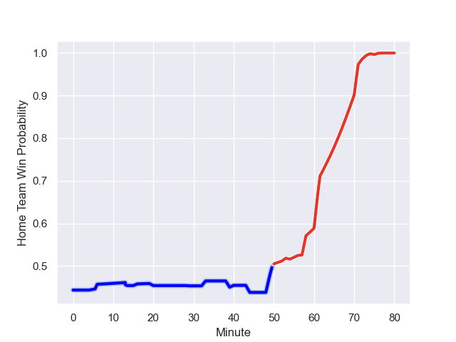

---  
layout: page  
title: Colomiers at Biarritz Olympique; 18-35  
date: 2023-08-17 18:00:00 -0500  
categories: match review  
---
# Colomiers at Biarritz Olympique; 18-35

# Club Level Predictions

The first set of predictions treats a club as the smallest object, as the club develops its members, organizes a gameplan, and deploys its players as needed for each match. This club model has a prediction of 0.624, which translates to predicting Biarritz Olympique to win by 4.5.

Each club has a rating and a rating deviation (simiar to a Glicko system), and expected performances can be generated. This allows for simulated matches and spreads like the ones below.
## Projected Performances

## Projected Spreads

## Projected Results

# Player Level Predictions - Version 1

Treating teams instead as an entity made up of the currently active players, I have ratings for each player in an altogether different system. These can be combined to form team ratings once teamsheets are announced, weighting starters a bit higher than the reserves. After the match is played, players can be weighted by their minutes on the field, allowing for an accurate measure of the team's composition. With these compiled team ratings, we can make predictions, measure inaccuracy, and update the individual player ratings.
## Prediction with Player Minutes: Colomiers by 5.9

Colomiers by 9.9 on a neutral field
## Prediction without Player Minutes: Colomiers by 6.6

Colomiers by 10.6 on a neutral pitch

## Scores over Time

## Win Probability over Time

There were 7 large changes in win probability in this match

|   Away Minutes | Away Player           |   Away elo |   Away Percentile |   Number |   Home Percentile |   Home elo | Home Player              |   Home Minutes |
|---------------:|:----------------------|-----------:|------------------:|---------:|------------------:|-----------:|:-------------------------|---------------:|
|             53 | Guillaume Tartas      |      74.02 |  953157           |        1 |       1.01812e+06 |      68.7  | Zakaria El Fakir         |             40 |
|             44 | Thomas Larrieu        |      59.01 |  605664           |        2 |       1.01812e+06 |      68.87 | Brendan Le Brun          |             50 |
|             44 | Hugo Pirlet           |      63.68 |  876990           |        3 |       1.01812e+06 |      69.04 | Mohamed Haouas           |             57 |
|             53 | Louis Descoux         |      86.32 |       1.01202e+06 |        4 |       1.01812e+06 |      69.22 | Johan Aliouat            |             50 |
|             80 | Maxime Granouillet    |     103.38 |  746082           |        5 |       1.01812e+06 |      69.41 | Charlie Matthews         |             80 |
|             80 | Robert Harley         |      75.81 |       1.0181e+06  |        6 |       1.01812e+06 |      69.62 | John Dyer                |             80 |
|             80 | Aldric Lescure        |      93.99 |  659199           |        7 |       1.0055e+06  |      79.08 | Thomas Hebert            |             57 |
|              6 | Romain Bezian         |      95.96 |  679042           |        8 |       1.00991e+06 |      87.88 | Temo Matiu               |             80 |
|             54 | Ugo Seguela           |      64.96 |  967893           |        9 |       1.01811e+06 |      70.07 | Rhys Webb                |             63 |
|             80 | Brett Herron          |      75.44 |       1.0181e+06  |       10 |       1.01812e+06 |      68.55 | Ilian Perraux            |             80 |
|             80 | Martin Dulon          |      72.24 |  964594           |       11 |       1.01811e+06 |      72.42 | Vincent Martin           |             29 |
|             80 | Dorian Laborde        |      77.81 |       1.0166e+06  |       12 |       1.01594e+06 |      79.2  | Yann David               |             40 |
|             80 | Enzo Salles           |      75.27 |       1.01812e+06 |       13 |       1.01811e+06 |      70.59 | Tyler Morgan             |             80 |
|             33 | Paul Pimienta         |     104.45 |  876605           |       14 |       1.01457e+06 |      77.96 | Zach Kibirige            |             80 |
|             54 | Ugo Pacome            |      75.62 |       1.0181e+06  |       15 |       1.01811e+06 |      70.89 | Joe Jonas                |             80 |
|             74 | Jeremy Bechu          |      76.01 |     nan           |       16 |     nan           |      71.21 | Gervais Cordin           |             51 |
|             47 | Fabien Perrin         |      82.68 |  619164           |       17 |       1.01567e+06 |      56.82 | Christopher Hilsenbeck   |             40 |
|             36 | Pablo Dimcheff        |      77.22 |     nan           |       18 |     nan           |      71.57 | Guy Millar               |             40 |
|             36 | Marco Fepulea'i       |      76.94 |     nan           |       19 |     nan           |      71.97 | Tiaan Jacobs             |             30 |
|             27 | Pierre-Samuel Pacheco |      78.13 |  991247           |       20 |       1.01016e+06 |      79.75 | Killian Taofifenua       |             30 |
|             27 | Jack Whetton          |      76.68 |     nan           |       21 |     nan           |      69.84 | Kevin Tougne             |             23 |
|             26 | Edoardo Gori          |      76.44 |     nan           |       22 |     nan           |      70.32 | Pieter Jansen van Vuuren |             23 |
|             26 | Maxime Javaux         |      76.22 |     nan           |       23 |     nan           |      72.94 | Antoine Domercq          |             17 |

# Player Level Predictions - Version 2

Treating teams instead as an entity made up of the currently active players, I have ratings for each player in an altogether different system. These can be combined to form team ratings once teamsheets are announced, weighting starters a bit higher than the reserves. After the match is played, players can be weighted by their minutes on the field, allowing for an accurate measure of the team's composition. With these compiled team ratings, we can make predictions, measure inaccuracy, and update the individual player ratings.
## Prediction with Player Minutes: Biarritz Olympique by 3.4

Colomiers by 1.6 on a neutral field
## Prediction without Player Minutes: Biarritz Olympique by 3.4

Colomiers by 1.6 on a neutral pitch

|   Away Minutes | Away Player           |   Away elo |   Away variance |   Number |   Home variance |   Home elo | Home Player              |   Home Minutes |
|---------------:|:----------------------|-----------:|----------------:|---------:|----------------:|-----------:|:-------------------------|---------------:|
|             53 | Guillaume Tartas      |      50.82 |              50 |        1 |              50 |      46.65 | Zakaria El Fakir         |             40 |
|             44 | Thomas Larrieu        |      21.66 |              50 |        2 |              50 |      46.65 | Brendan Le Brun          |             50 |
|             44 | Hugo Pirlet           |      27.86 |              50 |        3 |              50 |      46.65 | Mohamed Haouas           |             57 |
|             53 | Louis Descoux         |      47.63 |              50 |        4 |              50 |      46.65 | Johan Aliouat            |             50 |
|             80 | Maxime Granouillet    |      64.51 |              50 |        5 |              50 |      46.65 | Charlie Matthews         |             80 |
|             80 | Robert Harley         |      46.65 |              50 |        6 |              50 |      46.65 | John Dyer                |             80 |
|             80 | Aldric Lescure        |      74.66 |              50 |        7 |              50 |      42.8  | Thomas Hebert            |             57 |
|              6 | Romain Bezian         |      66.92 |              50 |        8 |              50 |      43.03 | Temo Matiu               |             80 |
|             54 | Ugo Seguela           |      39.55 |              50 |        9 |              50 |      46.65 | Rhys Webb                |             63 |
|             80 | Brett Herron          |      46.65 |              50 |       10 |              50 |      46.65 | Ilian Perraux            |             80 |
|             80 | Martin Dulon          |      43    |              50 |       11 |              50 |      46.65 | Vincent Martin           |             29 |
|             80 | Dorian Laborde        |      46.65 |              50 |       12 |              50 |      46.65 | Yann David               |             40 |
|             80 | Enzo Salles           |      46.65 |              50 |       13 |              50 |      46.65 | Tyler Morgan             |             80 |
|             33 | Paul Pimienta         |      62.97 |              50 |       14 |              50 |      46.65 | Zach Kibirige            |             80 |
|             54 | Ugo Pacome            |      46.65 |              50 |       15 |              50 |      46.65 | Joe Jonas                |             80 |
|             74 | Jeremy Bechu          |      46.65 |              50 |       16 |              50 |      46.65 | Gervais Cordin           |             51 |
|             47 | Fabien Perrin         |      61.61 |              50 |       17 |              50 |      46.65 | Christopher Hilsenbeck   |             40 |
|             36 | Pablo Dimcheff        |      46.65 |              50 |       18 |              50 |      46.65 | Guy Millar               |             40 |
|             36 | Marco Fepulea'i       |      46.65 |              50 |       19 |              50 |      46.65 | Tiaan Jacobs             |             30 |
|             27 | Pierre-Samuel Pacheco |      42.2  |              50 |       20 |              50 |      43.6  | Killian Taofifenua       |             30 |
|             27 | Jack Whetton          |      46.65 |              50 |       21 |              50 |      46.65 | Kevin Tougne             |             23 |
|             26 | Edoardo Gori          |      46.65 |              50 |       22 |              50 |      46.65 | Pieter Jansen van Vuuren |             23 |
|             26 | Maxime Javaux         |      46.65 |              50 |       23 |              50 |      46.65 | Antoine Domercq          |             17 |

