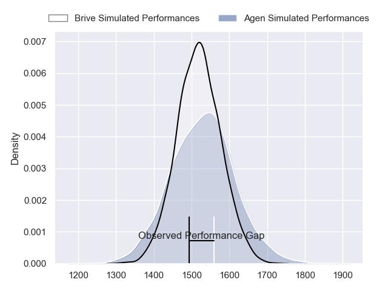
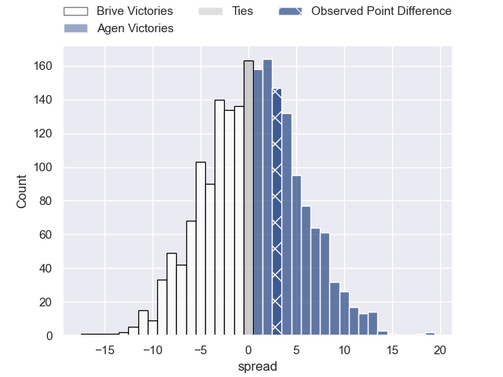
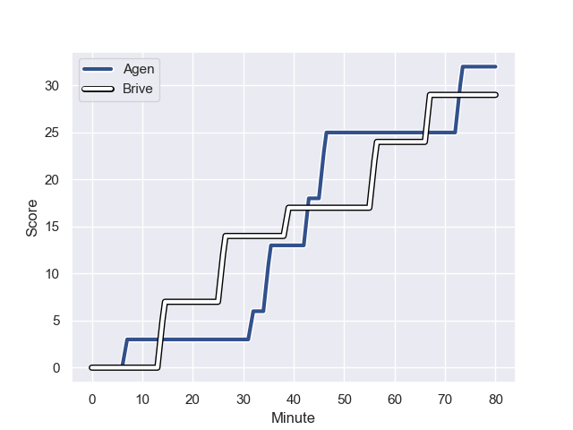
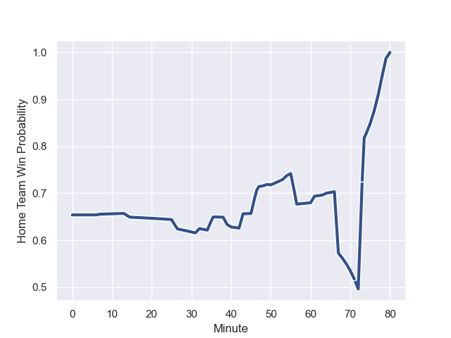

---  
layout: page  
title: Brive at Agen; 29-32  
date: 2023-08-18 18:00:00 -0500  
categories: match review  
---
# Brive at Agen; 29-32

# Club Level Predictions

The first set of predictions treats a club as the smallest object, as the club develops its members, organizes a gameplan, and deploys its players as needed for each match. This club model has a prediction of 0.51, which translates to predicting Agen to win by 0.4.

Each club has a rating and a rating deviation (simiar to a Glicko system), and expected performances can be generated. This allows for simulated matches and spreads like the ones below.
## Projected Performances

## Projected Spreads

## Projected Results

# Player Level Predictions - Version 1

Treating teams instead as an entity made up of the currently active players, I have ratings for each player in an altogether different system. These can be combined to form team ratings once teamsheets are announced, weighting starters a bit higher than the reserves. After the match is played, players can be weighted by their minutes on the field, allowing for an accurate measure of the team's composition. With these compiled team ratings, we can make predictions, measure inaccuracy, and update the individual player ratings.
## Prediction with Player Minutes: Agen by 31.6

Agen by 27.6 on a neutral field
## Prediction without Player Minutes: Agen by 30.5

Agen by 26.5 on a neutral pitch

## Scores over Time

## Win Probability over Time

There were 10 large changes in win probability in this match

|   Away Minutes | Away Player               |   Away elo |   Away Percentile |   Number |   Home Percentile |   Home elo | Home Player        |   Home Minutes |
|---------------:|:--------------------------|-----------:|------------------:|---------:|------------------:|-----------:|:-------------------|---------------:|
|             50 | Daniel Brennan            |      62.42 |       1.01617e+06 |        1 |       1.01817e+06 |      82.18 | Hans Lombard-Buret |             54 |
|             61 | Issam Hamel               |      85.82 |  967738           |        2 |       1.01817e+06 |      83.58 | Mike Sosene-Feagai |             47 |
|             50 | Marcel van der Merwe      |      62.24 |       1.01617e+06 |        3 |       1.01818e+06 |      79.88 | Alex Burin         |             47 |
|             47 | Retief Marais             |      63.23 |       1.01817e+06 |        4 |       1.01816e+06 |      84.89 | Joe Maksymiw       |             47 |
|             56 | Sitakeli Timani           |      83.79 |       1.01594e+06 |        5 |       1.01818e+06 |      80.11 | Evan Olmstead      |             47 |
|             80 | Sasha Gue                 |      63.55 |       1.00171e+06 |        6 |       1.01817e+06 |      83.06 | Arnaud Duputs      |             40 |
|             40 | Mathieu Voisin            |      63.64 |       1.01817e+06 |        7 |  963071           |     120.37 | Matthieu Bonnet    |             80 |
|             80 | Ross Moriarty             |      62.97 |       1.01614e+06 |        8 |       1.01819e+06 |      79.29 | Fotu Lokotui       |             80 |
|             54 | Julien Blanc              |      71.13 |       1.01571e+06 |        9 |       1.01818e+06 |      81.47 | Theo Idjellidaine  |             48 |
|             51 | Jackson Garden-Bachop     |      63.43 |       1.01817e+06 |       10 |       1.01818e+06 |      81.15 | Thomas Vincent     |             80 |
|             80 | Asaeli Tuivuaka           |      62.55 |       1.01818e+06 |       11 |       1.01817e+06 |      82.59 | Iban Etcheverry    |             80 |
|             80 | Paula Walisolio           |      62.25 |       1.01819e+06 |       12 |  964453           |      74.3  | Kolinio Ramoka     |             64 |
|             80 | Sam Johnson               |      63.04 |       1.01818e+06 |       13 |       1.01819e+06 |      79.67 | Clément Garrigues  |             80 |
|             80 | Benjamin Lefranc          |      62.4  |       1.01819e+06 |       14 |       1.01818e+06 |      80.86 | Timilai Rokoduru   |             80 |
|             80 | Arthur Bonneval           |      60.54 |       1.01616e+06 |       15 |       1.01817e+06 |      84.18 | Loris Tolot        |             80 |
|             40 | Saïd Hireche              |      66.78 |     nan           |       16 |     nan           |      79.1  | Antoine Erbani     |             40 |
|             33 | Renger Van Eerten         |      59.21 |  971523           |       17 |     nan           |      79.89 | Pierre Jouvin      |             33 |
|             30 | Wesley Tapueluelu         |      65.56 |     nan           |       18 |     nan           |      80.59 | William Demotte    |             33 |
|             30 | Francisco Coria Marchetti |      67.47 |       1.01043e+06 |       19 |     nan           |      80.34 | Martin Devergie    |             33 |
|             29 | Stuart Olding             |      62.87 |     nan           |       20 |  968463           |      94.05 | Théo Sauzaret      |             33 |
|             26 | Léo Carbonneau            |      62.7  |     nan           |       21 |  991232           |      78.16 | Dorian Bellot      |             32 |
|             24 | Julien Delannoy           |      64.95 |       1.0161e+06  |       22 |     nan           |      81.81 | Richard Barrington |             26 |
|             19 | Lucas Da Silva            |      61.42 |     nan           |       23 |     nan           |      79.47 | Dorian Jones       |             16 |

# Player Level Predictions - Version 2

Treating teams instead as an entity made up of the currently active players, I have ratings for each player in an altogether different system. These can be combined to form team ratings once teamsheets are announced, weighting starters a bit higher than the reserves. After the match is played, players can be weighted by their minutes on the field, allowing for an accurate measure of the team's composition. With these compiled team ratings, we can make predictions, measure inaccuracy, and update the individual player ratings.
## Prediction with Player Minutes: Agen by 5.8

Agen by 1.0 on a neutral field
## Prediction without Player Minutes: Agen by 5.5

Agen by 0.7 on a neutral pitch

|   Away Minutes | Away Player               |   Away elo |   Away variance |   Number |   Home variance |   Home elo | Home Player        |   Home Minutes |
|---------------:|:--------------------------|-----------:|----------------:|---------:|----------------:|-----------:|:-------------------|---------------:|
|             50 | Daniel Brennan            |      46.65 |              50 |        1 |              50 |      46.65 | Hans Lombard-Buret |             54 |
|             61 | Issam Hamel               |      62.12 |              50 |        2 |              50 |      46.65 | Mike Sosene-Feagai |             47 |
|             50 | Marcel van der Merwe      |      46.65 |              50 |        3 |              50 |      46.65 | Alex Burin         |             47 |
|             47 | Retief Marais             |      46.65 |              50 |        4 |              50 |      46.65 | Joe Maksymiw       |             47 |
|             56 | Sitakeli Timani           |      46.65 |              50 |        5 |              50 |      46.65 | Evan Olmstead      |             47 |
|             80 | Sasha Gue                 |      34.65 |              50 |        6 |              50 |      46.65 | Arnaud Duputs      |             40 |
|             40 | Mathieu Voisin            |      46.65 |              50 |        7 |              50 |      52.36 | Matthieu Bonnet    |             80 |
|             80 | Ross Moriarty             |      46.65 |              50 |        8 |              50 |      46.65 | Fotu Lokotui       |             80 |
|             54 | Julien Blanc              |      46.65 |              50 |        9 |              50 |      46.65 | Theo Idjellidaine  |             48 |
|             51 | Jackson Garden-Bachop     |      46.65 |              50 |       10 |              50 |      46.65 | Thomas Vincent     |             80 |
|             80 | Asaeli Tuivuaka           |      46.65 |              50 |       11 |              50 |      46.65 | Iban Etcheverry    |             80 |
|             80 | Paula Walisolio           |      46.65 |              50 |       12 |              50 |      55.68 | Kolinio Ramoka     |             64 |
|             80 | Sam Johnson               |      46.65 |              50 |       13 |              50 |      46.65 | Clément Garrigues  |             80 |
|             80 | Benjamin Lefranc          |      46.65 |              50 |       14 |              50 |      46.65 | Timilai Rokoduru   |             80 |
|             80 | Arthur Bonneval           |      46.65 |              50 |       15 |              50 |      46.65 | Loris Tolot        |             80 |
|             40 | Saïd Hireche              |      46.65 |              50 |       16 |              50 |      46.65 | Antoine Erbani     |             40 |
|             33 | Renger Van Eerten         |      39.57 |              50 |       17 |              50 |      45.5  | Pierre Jouvin      |             33 |
|             30 | Wesley Tapueluelu         |      46.65 |              50 |       18 |              50 |      46.65 | William Demotte    |             33 |
|             30 | Francisco Coria Marchetti |      36.28 |              50 |       19 |              50 |      46.65 | Martin Devergie    |             33 |
|             29 | Stuart Olding             |      46.65 |              50 |       20 |              50 |      54.81 | Théo Sauzaret      |             33 |
|             26 | Léo Carbonneau            |      46.65 |              50 |       21 |              50 |      51.29 | Dorian Bellot      |             32 |
|             24 | Julien Delannoy           |      46.65 |              50 |       22 |              50 |      46.65 | Richard Barrington |             26 |
|             19 | Lucas Da Silva            |      46.65 |              50 |       23 |              50 |      46.65 | Dorian Jones       |             16 |

