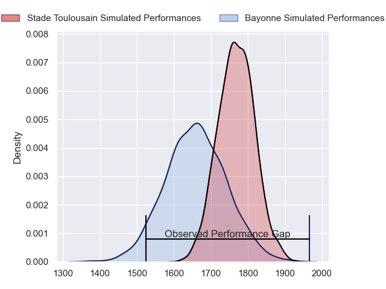
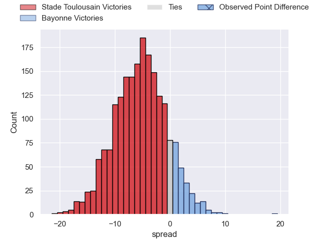
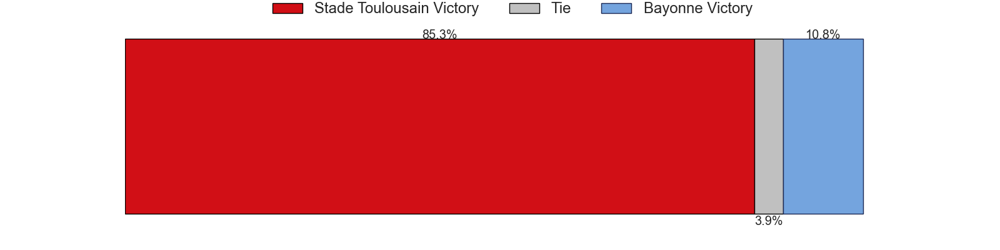
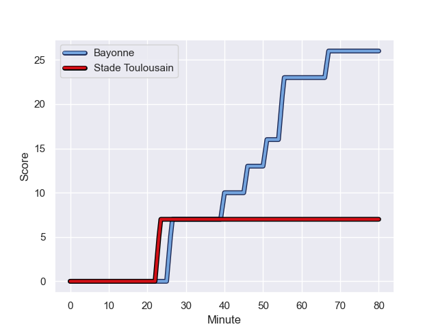
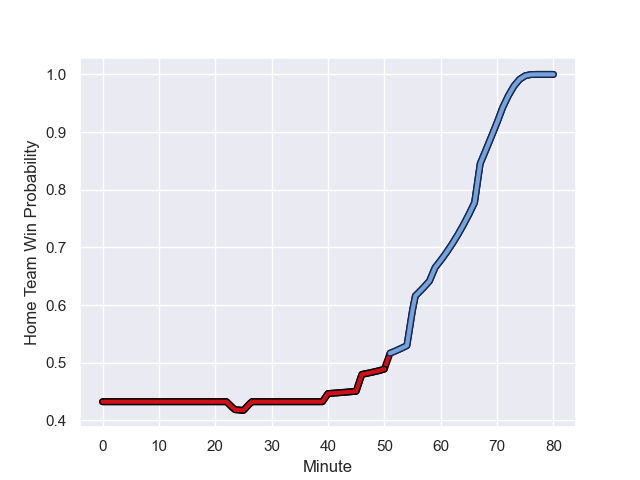

---  
layout: page  
title: Stade Toulousain at Bayonne; 7-26  
date: 2023-08-18 18:00:00 -0500  
categories: match review  
---
# Stade Toulousain at Bayonne; 7-26

# Club Level Predictions

The first set of predictions treats a club as the smallest object, as the club develops its members, organizes a gameplan, and deploys its players as needed for each match. This club model has a prediction of 0.347, which translates to predicting Stade Toulousain to win by 5.6.

Each club has a rating and a rating deviation (simiar to a Glicko system), and expected performances can be generated. This allows for simulated matches and spreads like the ones below.
## Projected Performances

## Projected Spreads

## Projected Results

# Player Level Predictions - Version 1

Treating teams instead as an entity made up of the currently active players, I have ratings for each player in an altogether different system. These can be combined to form team ratings once teamsheets are announced, weighting starters a bit higher than the reserves. After the match is played, players can be weighted by their minutes on the field, allowing for an accurate measure of the team's composition. With these compiled team ratings, we can make predictions, measure inaccuracy, and update the individual player ratings.
## Prediction with Player Minutes: Stade Toulousain by 7.8

Stade Toulousain by 11.8 on a neutral field
## Prediction without Player Minutes: Stade Toulousain by 8.4

Stade Toulousain by 12.4 on a neutral pitch

## Scores over Time

## Win Probability over Time

There were 5 large changes in win probability in this match

|   Away Minutes | Away Player          |   Away elo |   Away Percentile |   Number |   Home Percentile |   Home elo | Home Player          |   Home Minutes |
|---------------:|:---------------------|-----------:|------------------:|---------:|------------------:|-----------:|:---------------------|---------------:|
|             59 | Rodrigue Neti        |      92.77 |       1.0161e+06  |        1 |       1.01591e+06 |      80.36 | Quentin Béthune      |             46 |
|             50 | Ian Boubila          |      84.77 |       1.01846e+06 |        2 |       1.01845e+06 |      79.1  | Vincent Giudicelli   |             59 |
|             46 | Owen Franks          |      84.56 |       1.01846e+06 |        3 |       1.01845e+06 |      78.65 | Pieter Ernst Scholtz |             46 |
|             80 | Piula Fa'asalele     |      73.18 |       1.01567e+06 |        4 |       1.01598e+06 |      77.24 | Denis Marchois       |             80 |
|             59 | Joshua Brennan       |      93.79 |       1.0068e+06  |        5 |  803683           |     117.97 | Thomas Ceyte         |             80 |
|             59 | Alban Placines       |      96.13 |       1.01607e+06 |        6 |  868782           |      84.52 | Pierre Huguet        |             50 |
|             46 | Theo Ntamack         |      85.7  |       1.00827e+06 |        7 |       1.01597e+06 |      79.65 | Baptiste Heguy       |             50 |
|             80 | Alexandre Roumat     |      90.53 |       1.01607e+06 |        8 |       1.01595e+06 |      80.73 | Uzair Cassiem        |             80 |
|             80 | Paul Graou           |     106.42 |  914947           |        9 |       1.01846e+06 |      78.06 | Guillaume Rouet      |             59 |
|             69 | Baptiste Germain     |      84.36 |       1.01846e+06 |       10 |       1.01597e+06 |      79.47 | Camille Lopez        |             80 |
|             55 | Arthur Retière       |      93.81 |       1.01604e+06 |       11 |       1.01591e+06 |      82.24 | Rémy Baget           |             80 |
|             80 | Sofiane Guitoune     |      95.92 |       1.01608e+06 |       12 |  965078           |      69.3  | Guillaume Martocq    |             80 |
|             80 | Pierre-Louis Barassi |      95.93 |       1.01703e+06 |       13 |       1.01591e+06 |      80.58 | Peyo Muscarditz      |             59 |
|             80 | Lucas Tauzin         |      95.51 |       1.01689e+06 |       14 |       1.00971e+06 |      88.44 | Kaminieli Rasaku     |             80 |
|             80 | Matthis Lebel        |      89.4  |       1.01608e+06 |       15 |       1.00629e+06 |      67.64 | Tom Spring           |             71 |
|             34 | Joel Merkler         |      84.99 |     nan           |       16 |     nan           |      78.87 | Swan Cormenier       |             34 |
|             34 | Léo Banos            |      80.02 |  975666           |       17 |  993979           |      93.36 | Tevita Tatafu        |             34 |
|             30 | Malachi Hawkes       |      84.17 |     nan           |       18 |       1.01586e+06 |      84.12 | Rémi Bourdeau        |             30 |
|             25 | Paul Costes          |      82.47 |     nan           |       19 |       1.01582e+06 |      80.33 | Arthur Iturria       |             30 |
|             21 | Clement Verge        |      78.29 |       1.01006e+06 |       20 |     nan           |      78.44 | Thomas Acquier       |             21 |
|             11 | Billy Searle         |      85.23 |     nan           |       21 |     nan           |      77.88 | Cheikh Tiberghien    |             21 |
|             21 | Rynhard Elstadt      |      94.41 |     nan           |       22 |     nan           |      78.25 | Maxime Machenaud     |             21 |
|             21 | Maxime Duprat        |      80.9  |  988976           |       23 |  989250           |      86.29 | Thomas Dolhagaray    |              9 |

# Player Level Predictions - Version 2

Treating teams instead as an entity made up of the currently active players, I have ratings for each player in an altogether different system. These can be combined to form team ratings once teamsheets are announced, weighting starters a bit higher than the reserves. After the match is played, players can be weighted by their minutes on the field, allowing for an accurate measure of the team's composition. With these compiled team ratings, we can make predictions, measure inaccuracy, and update the individual player ratings.
## Prediction with Player Minutes: Bayonne by 2.3

Stade Toulousain by 2.5 on a neutral field
## Prediction without Player Minutes: Bayonne by 2.5

Stade Toulousain by 2.3 on a neutral pitch

|   Away Minutes | Away Player          |   Away elo |   Away variance |   Number |   Home variance |   Home elo | Home Player          |   Home Minutes |
|---------------:|:---------------------|-----------:|----------------:|---------:|----------------:|-----------:|:---------------------|---------------:|
|             59 | Rodrigue Neti        |      46.65 |              50 |        1 |              50 |      46.65 | Quentin Béthune      |             46 |
|             50 | Ian Boubila          |      46.65 |              50 |        2 |              50 |      46.65 | Vincent Giudicelli   |             59 |
|             46 | Owen Franks          |      46.65 |              50 |        3 |              50 |      46.65 | Pieter Ernst Scholtz |             46 |
|             80 | Piula Fa'asalele     |      46.65 |              50 |        4 |              50 |      46.65 | Denis Marchois       |             80 |
|             59 | Joshua Brennan       |      47.31 |              50 |        5 |              50 |      50.6  | Thomas Ceyte         |             80 |
|             59 | Alban Placines       |      46.65 |              50 |        6 |              50 |      34.97 | Pierre Huguet        |             50 |
|             46 | Theo Ntamack         |      46.41 |              50 |        7 |              50 |      46.65 | Baptiste Heguy       |             50 |
|             80 | Alexandre Roumat     |      46.65 |              50 |        8 |              50 |      46.65 | Uzair Cassiem        |             80 |
|             80 | Paul Graou           |      56.29 |              50 |        9 |              50 |      46.65 | Guillaume Rouet      |             59 |
|             69 | Baptiste Germain     |      46.65 |              50 |       10 |              50 |      46.65 | Camille Lopez        |             80 |
|             55 | Arthur Retière       |      46.65 |              50 |       11 |              50 |      46.65 | Rémy Baget           |             80 |
|             80 | Sofiane Guitoune     |      46.65 |              50 |       12 |              50 |      29.69 | Guillaume Martocq    |             80 |
|             80 | Pierre-Louis Barassi |      46.65 |              50 |       13 |              50 |      46.65 | Peyo Muscarditz      |             59 |
|             80 | Lucas Tauzin         |      46.65 |              50 |       14 |              50 |      51.37 | Kaminieli Rasaku     |             80 |
|             80 | Matthis Lebel        |      46.65 |              50 |       15 |              50 |      19.65 | Tom Spring           |             71 |
|             34 | Joel Merkler         |      46.65 |              50 |       16 |              50 |      46.65 | Swan Cormenier       |             34 |
|             34 | Léo Banos            |      67.07 |              50 |       17 |              50 |      43.61 | Tevita Tatafu        |             34 |
|             30 | Malachi Hawkes       |      46.65 |              50 |       18 |              50 |      46.65 | Rémi Bourdeau        |             30 |
|             25 | Paul Costes          |      44.82 |              50 |       19 |              50 |      46.65 | Arthur Iturria       |             30 |
|             21 | Clement Verge        |      42.96 |              50 |       20 |              50 |      46.65 | Thomas Acquier       |             21 |
|             11 | Billy Searle         |      46.65 |              50 |       21 |              50 |      46.65 | Cheikh Tiberghien    |             21 |
|             21 | Rynhard Elstadt      |      46.65 |              50 |       22 |              50 |      46.65 | Maxime Machenaud     |             21 |
|             21 | Maxime Duprat        |      52.88 |              50 |       23 |              50 |      45.86 | Thomas Dolhagaray    |              9 |

