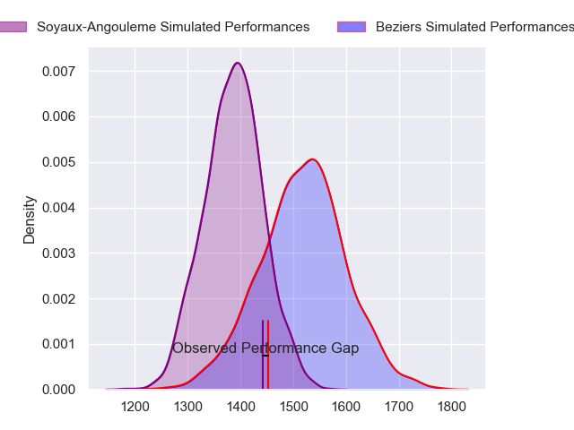
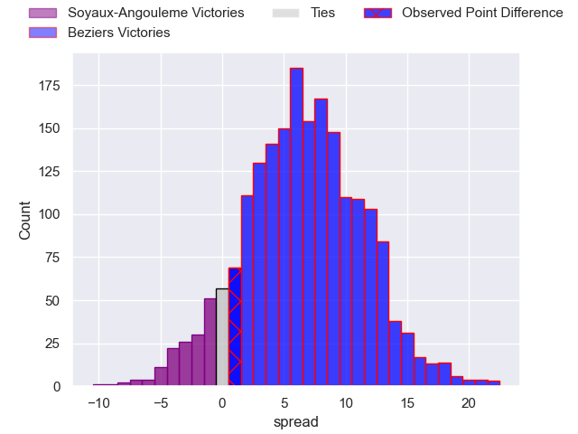
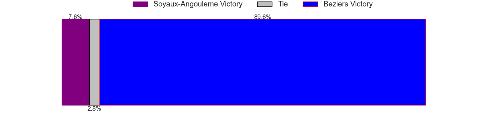
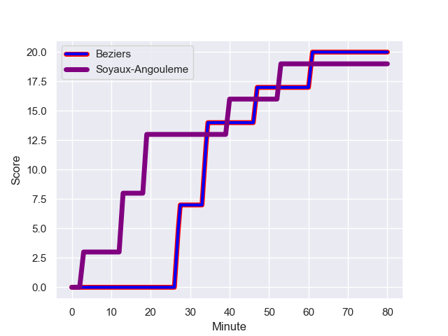
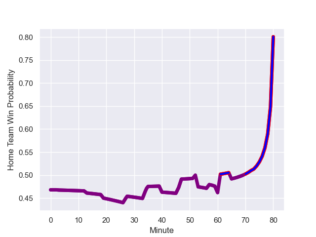

---  
layout: page  
title: Soyaux-Angouleme at Beziers; 19-20  
date: 2023-08-18 18:00:00 -0500  
categories: match review  
---
# Soyaux-Angouleme at Beziers; 19-20

# Club Level Predictions

The first set of predictions treats a club as the smallest object, as the club develops its members, organizes a gameplan, and deploys its players as needed for each match. This club model has a prediction of 0.674, which translates to predicting Beziers to win by 6.4.

Each club has a rating and a rating deviation (simiar to a Glicko system), and expected performances can be generated. This allows for simulated matches and spreads like the ones below.
## Projected Performances

## Projected Spreads

## Projected Results

# Player Level Predictions - Version 1

Treating teams instead as an entity made up of the currently active players, I have ratings for each player in an altogether different system. These can be combined to form team ratings once teamsheets are announced, weighting starters a bit higher than the reserves. After the match is played, players can be weighted by their minutes on the field, allowing for an accurate measure of the team's composition. With these compiled team ratings, we can make predictions, measure inaccuracy, and update the individual player ratings.
## Prediction with Player Minutes: Soyaux-Angouleme by 1.5

Soyaux-Angouleme by 5.5 on a neutral field
## Prediction without Player Minutes: Soyaux-Angouleme by 4.1

Soyaux-Angouleme by 8.1 on a neutral pitch

## Scores over Time

## Win Probability over Time

There were 5 large changes in win probability in this match

|   Away Minutes | Away Player                      |   Away elo |   Away Percentile |   Number |   Home Percentile |   Home elo | Home Player         |   Home Minutes |
|---------------:|:---------------------------------|-----------:|------------------:|---------:|------------------:|-----------:|:--------------------|---------------:|
|             35 | Khatchik Vartan                  |      78.49 |       1.0182e+06  |        1 |       1.0182e+06  |      75.73 | Yannick Arroyo      |             50 |
|             52 | Rayne Barka                      |      77.73 |       1.01821e+06 |        2 |       1.01819e+06 |      75.98 | Wilmar Arnoldi      |             57 |
|             60 | Yassin Boutemani                 |      77.91 |       1.01821e+06 |        3 |       1.01819e+06 |      76.26 | Jon Zabala Arrieta  |             65 |
|             80 | Ian Kitwanga                     |      77.4  |       1.00527e+06 |        4 |       1.01819e+06 |      76.55 | Hans Nkinsi         |             80 |
|             59 | Matthew Dalton                   |      78.09 |       1.01821e+06 |        5 |       1.01819e+06 |      76.87 | John Madigan        |             60 |
|             80 | Germain Burgaud                  |     100.8  |  963770           |        6 |  933313           |      56.35 | William van Bost    |             80 |
|             46 | Léo Morand-Bruyat                |      78.29 |       1.01821e+06 |        7 |       1.0182e+06  |      74.87 | Clément Ancely      |             80 |
|             80 | Yassine Jarmouni                 |      87.65 |  865529           |        8 |       1.01819e+06 |      77.22 | Sias Koen           |             65 |
|             65 | Emmanuel Saubusse                |      78.71 |       1.0182e+06  |        9 |       1.01819e+06 |      77.61 | Jean Victor Goillot |             57 |
|             80 | Benjamin Botica                  |      78.95 |       1.0182e+06  |       10 |  871322           |      81.35 | Victor Dreuille     |             80 |
|             80 | Marvin Lestremau                 |      79.19 |       1.0182e+06  |       11 |  995915           |      97.46 | Gabin Lorre         |             80 |
|             65 | Mathis Lafon                     |      80.39 |       1.01818e+06 |       12 |       1.0182e+06  |      74.68 | Taleta Tupuola      |             80 |
|             80 | Ledua Mau                        |      85.14 |  794805           |       13 |       1.0182e+06  |      75.06 | Branden Holder      |             73 |
|             80 | Matthys Gratien                  |     113.63 |  946624           |       14 |  928066           |     110.32 | Maxime Espeut       |             80 |
|             65 | Pierre Lafitte                   |      79.39 |  587183           |       15 |       1.0182e+06  |      75.49 | Charly Malié        |             80 |
|             45 | Sami Zouhair                     |      70.14 |  960405           |       16 |  962633           |      75.81 | Giorgi Akhaladze    |             30 |
|             34 | Gautier Gibouin                  |      49.51 |  454783           |       17 |  997277           |      80.17 | Yvann Lalevee       |             23 |
|             28 | Patxi Bidart                     |      62.79 |  973353           |       18 |     nan           |      93.63 | Liam Rimet          |             23 |
|             21 | Matt Va'ai                       |      79.46 |     nan           |       19 |     nan           |      75.27 | Pierrick Gunther    |             20 |
|             20 | Michael Masimba Tingini Kumbirai |     103.38 |  888938           |       20 |     nan           |      74.5  | Pauta Otunuku       |             15 |
|             15 | Alexis Levron                    |      80.05 |     nan           |       21 |  996158           |      71.19 | Paul Recor          |              7 |
|             15 | Corentin Glenat                  |      79.74 |     nan           |       22 |     nan           |      68.98 | Julien Rasamoelina  |             15 |
|             15 | Nasoni Naqiri Kunavore           |     100.95 |  722739           |       23 |     nan           |     nan    | nan                 |            nan |

# Player Level Predictions - Version 2

Treating teams instead as an entity made up of the currently active players, I have ratings for each player in an altogether different system. These can be combined to form team ratings once teamsheets are announced, weighting starters a bit higher than the reserves. After the match is played, players can be weighted by their minutes on the field, allowing for an accurate measure of the team's composition. With these compiled team ratings, we can make predictions, measure inaccuracy, and update the individual player ratings.
## Prediction with Player Minutes: Beziers by 4.1

Soyaux-Angouleme by 0.5 on a neutral field
## Prediction without Player Minutes: Beziers by 4.4

Soyaux-Angouleme by 0.2 on a neutral pitch

|   Away Minutes | Away Player                      |   Away elo |   Away variance |   Number |   Home variance |   Home elo | Home Player         |   Home Minutes |
|---------------:|:---------------------------------|-----------:|----------------:|---------:|----------------:|-----------:|:--------------------|---------------:|
|             35 | Khatchik Vartan                  |      46.65 |              50 |        1 |              50 |      46.65 | Yannick Arroyo      |             50 |
|             52 | Rayne Barka                      |      46.65 |              50 |        2 |              50 |      46.65 | Wilmar Arnoldi      |             57 |
|             60 | Yassin Boutemani                 |      46.65 |              50 |        3 |              50 |      46.65 | Jon Zabala Arrieta  |             65 |
|             80 | Ian Kitwanga                     |      43.76 |              50 |        4 |              50 |      46.65 | Hans Nkinsi         |             80 |
|             59 | Matthew Dalton                   |      46.65 |              50 |        5 |              50 |      46.65 | John Madigan        |             60 |
|             80 | Germain Burgaud                  |      37.83 |              50 |        6 |              50 |      31.28 | William van Bost    |             80 |
|             46 | Léo Morand-Bruyat                |      46.65 |              50 |        7 |              50 |      46.65 | Clément Ancely      |             80 |
|             80 | Yassine Jarmouni                 |      32.86 |              50 |        8 |              50 |      46.65 | Sias Koen           |             65 |
|             65 | Emmanuel Saubusse                |      46.65 |              50 |        9 |              50 |      46.65 | Jean Victor Goillot |             57 |
|             80 | Benjamin Botica                  |      46.65 |              50 |       10 |              50 |      39.55 | Victor Dreuille     |             80 |
|             80 | Marvin Lestremau                 |      46.65 |              50 |       11 |              50 |      75.76 | Gabin Lorre         |             80 |
|             65 | Mathis Lafon                     |      46.65 |              50 |       12 |              50 |      46.65 | Taleta Tupuola      |             80 |
|             80 | Ledua Mau                        |      65.93 |              50 |       13 |              50 |      46.65 | Branden Holder      |             73 |
|             80 | Matthys Gratien                  |      65.2  |              50 |       14 |              50 |      58.47 | Maxime Espeut       |             80 |
|             65 | Pierre Lafitte                   |      46.44 |              50 |       15 |              50 |      46.65 | Charly Malié        |             80 |
|             45 | Sami Zouhair                     |      89.69 |              50 |       16 |              50 |      45.39 | Giorgi Akhaladze    |             30 |
|             34 | Gautier Gibouin                  |      16.1  |              50 |       17 |              50 |      53.8  | Yvann Lalevee       |             23 |
|             28 | Patxi Bidart                     |      48.13 |              50 |       18 |              50 |      49.58 | Liam Rimet          |             23 |
|             21 | Matt Va'ai                       |      46.65 |              50 |       19 |              50 |      46.65 | Pierrick Gunther    |             20 |
|             20 | Michael Masimba Tingini Kumbirai |      72.3  |              50 |       20 |              50 |      46.65 | Pauta Otunuku       |             15 |
|             15 | Alexis Levron                    |      46.65 |              50 |       21 |              50 |      47.52 | Paul Recor          |              7 |
|             15 | Corentin Glenat                  |      46.65 |              50 |       22 |              50 |      48.05 | Julien Rasamoelina  |             15 |
|             15 | Nasoni Naqiri Kunavore           |      67.12 |              50 |       23 |             nan |     nan    | nan                 |            nan |

