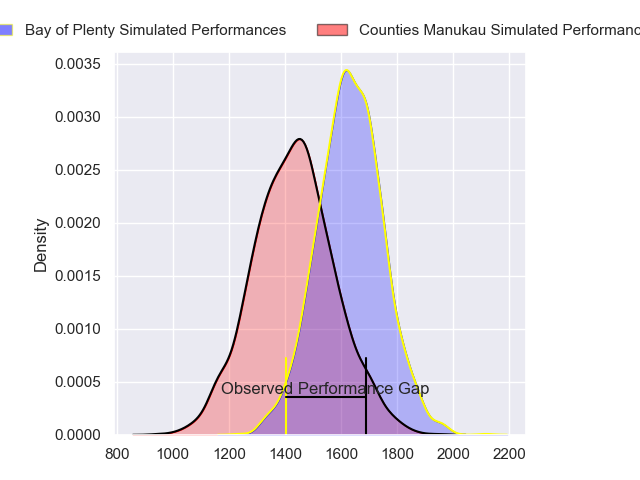
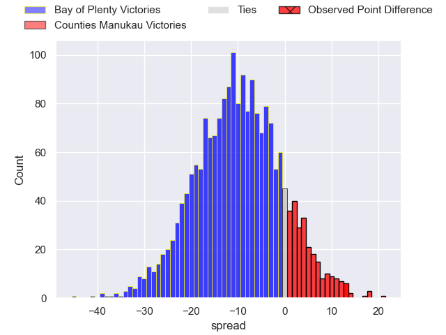
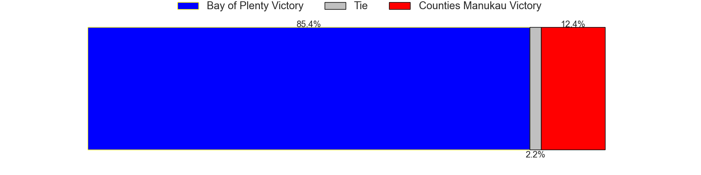
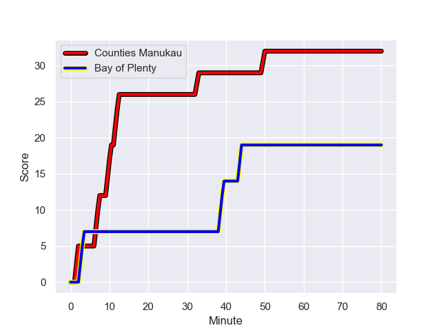
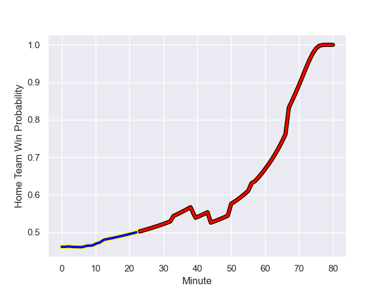

---  
layout: page  
title: Bay of Plenty at Counties Manukau; 19-32  
date: 2023-08-18 18:00:00 -0500  
categories: match review  
---
# Bay of Plenty at Counties Manukau; 19-32

# Club Level Predictions

The first set of predictions treats a club as the smallest object, as the club develops its members, organizes a gameplan, and deploys its players as needed for each match. This club model has a prediction of 0.252, which translates to predicting Bay of Plenty to win by 10.1.

Each club has a rating and a rating deviation (simiar to a Glicko system), and expected performances can be generated. This allows for simulated matches and spreads like the ones below.
## Projected Performances

## Projected Spreads

## Projected Results

# Player Level Predictions - Version 1

Treating teams instead as an entity made up of the currently active players, I have ratings for each player in an altogether different system. These can be combined to form team ratings once teamsheets are announced, weighting starters a bit higher than the reserves. After the match is played, players can be weighted by their minutes on the field, allowing for an accurate measure of the team's composition. With these compiled team ratings, we can make predictions, measure inaccuracy, and update the individual player ratings.
## Prediction with Player Minutes: Bay of Plenty by 2.8

Bay of Plenty by 6.8 on a neutral field
## Prediction without Player Minutes: Bay of Plenty by 3.6

Bay of Plenty by 7.6 on a neutral pitch

## Scores over Time

## Win Probability over Time

There were 3 large changes in win probability in this match

|   Away Minutes | Away Player            |   Away elo |   Away Percentile |   Number |   Home Percentile |   Home elo | Home Player         |   Home Minutes |
|---------------:|:-----------------------|-----------:|------------------:|---------:|------------------:|-----------:|:--------------------|---------------:|
|             56 | Aidan Ross             |      85.54 |  788665           |        1 |       1.01725e+06 |      73.03 | Kauvaka Kaivelata   |             60 |
|             67 | Kurt Eklund            |      75.17 |       1.01775e+06 |        2 |       1.01726e+06 |      74.79 | Ian West-Stevens    |             54 |
|             50 | John Afoa              |      85.61 |       1.0165e+06  |        3 |       1.01734e+06 |      70.92 | Suetena Asomua      |             40 |
|             80 | Mana'aki Selby-Rickit  |      72.33 |       1.01778e+06 |        4 |       1.01731e+06 |      74.55 | Alex McRobbie       |             67 |
|             67 | Justin Sangster        |      76.13 |       1.01772e+06 |        5 |       1.01725e+06 |      72.54 | James Thompson      |             80 |
|             80 | Naitoa Ah Kuoi         |      94.36 |  945421           |        6 |       1.01733e+06 |      74.07 | Sam Tuifua          |             51 |
|             56 | Semisi Paea            |      89.11 |       1.01236e+06 |        7 |       1.01733e+06 |      65.25 | Sean Reidy          |             80 |
|             80 | Nikora Broughton       |      71.88 |       1.01778e+06 |        8 |  894418           |     111.87 | Hoskins Sotutu      |             80 |
|             76 | Te Toiroa Tahuriorangi |      88.61 |       1.01652e+06 |        9 |       1.01729e+06 |      68.89 | Liam Daniela        |             77 |
|             70 | Lucas Cashmore         |      73.69 |       1.01777e+06 |       10 |       1.01726e+06 |      68.24 | Riley Hohepa        |             80 |
|             80 | Ngarohi McGarvey-Black |      71.62 |       1.0178e+06  |       11 |       1.0165e+06  |      71.53 | Toni Pulu           |             67 |
|             57 | Lalomilo Lalomilo      |      73.73 |       1.01776e+06 |       12 |       1.01732e+06 |      67.03 | Nikolai Foliaki     |             51 |
|             80 | Melani Nanai           |      72.1  |       1.01778e+06 |       13 |       1.01732e+06 |      70.94 | Tevita Ofa          |             80 |
|             80 | Cody Vai               |      76.99 |       1.01801e+06 |       14 |       1.01816e+06 |      69.78 | Sione Molia         |             80 |
|             80 | Cole Forbes            |      78.57 |       1.01774e+06 |       15 |  920470           |      80.34 | Etene Nanai-Seturo  |             80 |
|             30 | Benet Kumeroa          |      82.91 |     nan           |       16 |       1.01732e+06 |      70.61 | Salesi Tuifua       |             40 |
|             24 | Veveni Lasaqa          |      74.92 |       1.01776e+06 |       17 |     nan           |      69.94 | Ah See Tuala        |             29 |
|             24 | Josh Bartlett          |      76.09 |     nan           |       18 |     nan           |      70.11 | Adam Brash          |             29 |
|             23 | Seamus Bardoul         |      80.74 |     nan           |       19 |       1.01726e+06 |      74.93 | Ioane Moananu       |             26 |
|             13 | Etonia Waqa            |      76.68 |     nan           |       20 |  922392           |      74.65 | Ezekiel Lindenmuth  |             20 |
|             13 | Nathan Vella           |      82.4  |     nan           |       21 |     nan           |      71.05 | Blake Makiri        |             13 |
|             10 | Wharenui Hawera        |      80.78 |       1.01774e+06 |       22 |     nan           |      70.47 | Jadin Kingi         |             13 |
|              4 | Carlos Price           |      75.14 |     nan           |       23 |     nan           |      70.28 | Cohen Brady-Leathem |              3 |

# Player Level Predictions - Version 2

Treating teams instead as an entity made up of the currently active players, I have ratings for each player in an altogether different system. These can be combined to form team ratings once teamsheets are announced, weighting starters a bit higher than the reserves. After the match is played, players can be weighted by their minutes on the field, allowing for an accurate measure of the team's composition. With these compiled team ratings, we can make predictions, measure inaccuracy, and update the individual player ratings.
## Prediction with Player Minutes: Counties Manukau by 0.6

Bay of Plenty by 2.7 on a neutral field
## Prediction without Player Minutes: Bay of Plenty by 0.0

Bay of Plenty by 3.3 on a neutral pitch

|   Away Minutes | Away Player            |   Away elo |   Away variance |   Number |   Home variance |   Home elo | Home Player         |   Home Minutes |
|---------------:|:-----------------------|-----------:|----------------:|---------:|----------------:|-----------:|:--------------------|---------------:|
|             56 | Aidan Ross             |      94.75 |           50    |        1 |              50 |      46.65 | Kauvaka Kaivelata   |             60 |
|             67 | Kurt Eklund            |      46.65 |           50    |        2 |              50 |      46.65 | Ian West-Stevens    |             54 |
|             50 | John Afoa              |      46.65 |           50    |        3 |              50 |      46.65 | Suetena Asomua      |             40 |
|             80 | Mana'aki Selby-Rickit  |      46.65 |           50    |        4 |              50 |      46.65 | Alex McRobbie       |             67 |
|             67 | Justin Sangster        |      46.65 |           50    |        5 |              50 |      46.65 | James Thompson      |             80 |
|             80 | Naitoa Ah Kuoi         |      80.6  |           50    |        6 |              50 |      46.65 | Sam Tuifua          |             51 |
|             56 | Semisi Paea            |      85.49 |           48.84 |        7 |              50 |      46.65 | Sean Reidy          |             80 |
|             80 | Nikora Broughton       |      46.65 |           50    |        8 |              50 |      90.84 | Hoskins Sotutu      |             80 |
|             76 | Te Toiroa Tahuriorangi |      46.65 |           50    |        9 |              50 |      46.65 | Liam Daniela        |             77 |
|             70 | Lucas Cashmore         |      46.65 |           50    |       10 |              50 |      46.65 | Riley Hohepa        |             80 |
|             80 | Ngarohi McGarvey-Black |      46.65 |           50    |       11 |              50 |      46.65 | Toni Pulu           |             67 |
|             57 | Lalomilo Lalomilo      |      46.65 |           50    |       12 |              50 |      46.65 | Nikolai Foliaki     |             51 |
|             80 | Melani Nanai           |      46.65 |           50    |       13 |              50 |      46.65 | Tevita Ofa          |             80 |
|             80 | Cody Vai               |      46.65 |           50    |       14 |              50 |      46.65 | Sione Molia         |             80 |
|             80 | Cole Forbes            |      46.65 |           50    |       15 |              50 |      39.38 | Etene Nanai-Seturo  |             80 |
|             30 | Benet Kumeroa          |      46.65 |           50    |       16 |              50 |      46.65 | Salesi Tuifua       |             40 |
|             24 | Veveni Lasaqa          |      46.65 |           50    |       17 |              50 |      46.65 | Ah See Tuala        |             29 |
|             24 | Josh Bartlett          |      46.65 |           50    |       18 |              50 |      46.65 | Adam Brash          |             29 |
|             23 | Seamus Bardoul         |      46.65 |           50    |       19 |              50 |      46.65 | Ioane Moananu       |             26 |
|             13 | Etonia Waqa            |      46.65 |           50    |       20 |              50 |      15.56 | Ezekiel Lindenmuth  |             20 |
|             13 | Nathan Vella           |      46.65 |           50    |       21 |              50 |      46.65 | Blake Makiri        |             13 |
|             10 | Wharenui Hawera        |      46.65 |           50    |       22 |              50 |      46.65 | Jadin Kingi         |             13 |
|              4 | Carlos Price           |      46.65 |           50    |       23 |              50 |      46.65 | Cohen Brady-Leathem |              3 |

