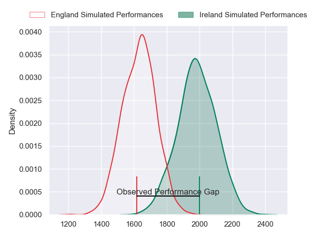
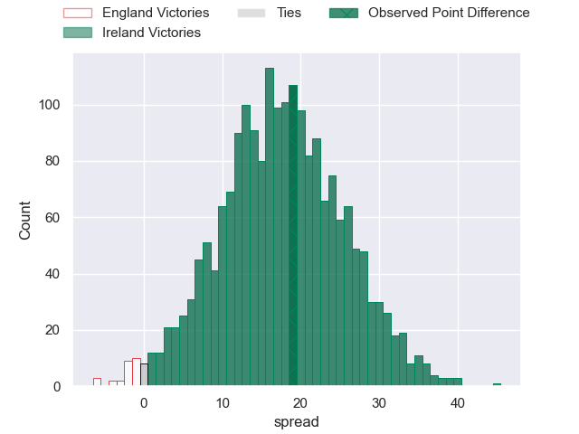
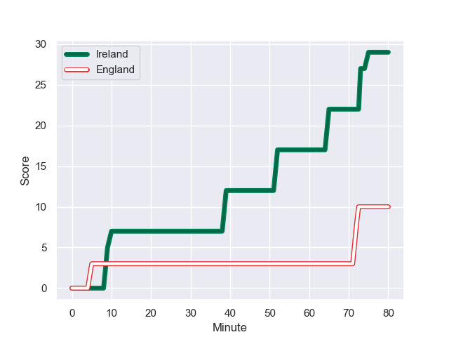
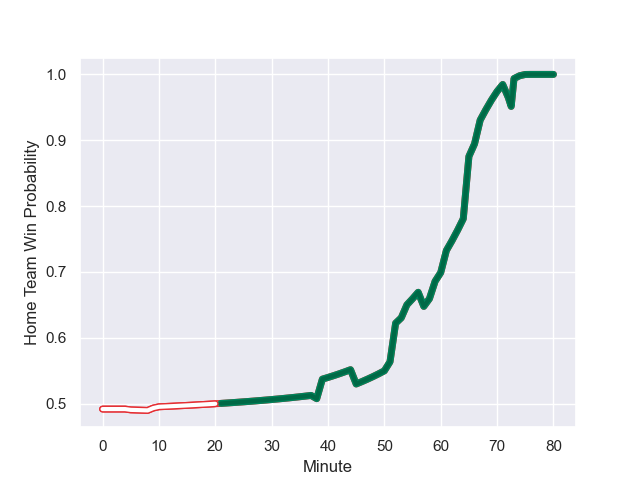

---  
layout: page  
title: England at Ireland; 10.0-29.0  
date: 2023-08-18 18:00:00 -0500  
categories: match review  
---
# England at Ireland; 10.0-29.0

# Club Level Predictions

The first set of predictions treats a club as the smallest object, as the club develops its members, organizes a gameplan, and deploys its players as needed for each match. This club model has a prediction of 0.869, which translates to predicting Ireland to win by 17.3.

Each club has a rating and a rating deviation (simiar to a Glicko system), and expected performances can be generated. This allows for simulated matches and spreads like the ones below.
## Projected Performances

## Projected Spreads

## Projected Results

# Player Level Predictions - Version 1

Treating teams instead as an entity made up of the currently active players, I have ratings for each player in an altogether different system. These can be combined to form team ratings once teamsheets are announced, weighting starters a bit higher than the reserves. After the match is played, players can be weighted by their minutes on the field, allowing for an accurate measure of the team's composition. With these compiled team ratings, we can make predictions, measure inaccuracy, and update the individual player ratings.
## Prediction with Player Minutes: Ireland by 2.6

England by 1.4 on a neutral field
## Prediction without Player Minutes: Ireland by 3.7

England by 0.3 on a neutral pitch

## Scores over Time

## Win Probability over Time

There were 7 large changes in win probability in this match

|   Away Minutes | Away Player     |   Away elo |   Away Percentile |   Number |   Home Percentile |   Home elo | Home Player         |   Home Minutes |
|---------------:|:----------------|-----------:|------------------:|---------:|------------------:|-----------:|:--------------------|---------------:|
|             57 | Ellis Genge     |      80.29 |            814540 |        1 |           1018269 |      91.6  | Andrew Porter       |             73 |
|             67 | Jamie George    |     128.1  |            437592 |        2 |           1018268 |      91.85 | Dan Sheehan         |             38 |
|             45 | Will Stuart     |      58.93 |            854580 |        3 |            707436 |     105.01 | Tadhg Furlong       |             57 |
|             80 | Maro Itoje      |      95.46 |            669503 |        4 |            798022 |     146.17 | Tadhg Beirne        |             80 |
|             51 | David Ribbans   |     100.48 |            864898 |        5 |            873090 |      97.01 | James Ryan          |             70 |
|             75 | Courtney Lawes  |      79.21 |            376257 |        6 |            443351 |      64.18 | Peter O'Mahony      |             54 |
|             80 | Ben Earl        |     101.53 |            856169 |        7 |            757420 |     110.31 | Josh van der Flier  |             80 |
|             80 | Billy Vunipola  |      97.62 |            539677 |        8 |            969348 |      73.27 | Cian Prendergast    |             80 |
|             57 | Ben Youngs      |      81.66 |            302412 |        9 |           1018270 |      91.36 | Jamison Gibson-Park |             67 |
|             80 | George Ford     |     108.2  |            434929 |       10 |            794354 |      90.5  | Ross Byrne          |             70 |
|             80 | Elliot Daly     |      99.03 |            527698 |       11 |           1018271 |      91.13 | James Lowe          |             59 |
|             61 | Manu Tuilagi    |     110.47 |            512373 |       12 |           1018272 |      90.91 | Bundee Aki          |             69 |
|             80 | Joe Marchant    |      80.47 |            779349 |       13 |            794521 |      80.43 | Garry Ringrose      |             80 |
|             70 | Anthony Watson  |      89.68 |           1018273 |       14 |            923630 |      74.93 | Mack Hansen         |             80 |
|             80 | Freddie Steward |      91.46 |            935294 |       15 |           1018274 |      90.71 | Hugo Keenan         |             80 |
|             13 | Theo Dan        |      89.3  |            992574 |       16 |            460796 |      82.21 | Rob Herring         |             42 |
|             23 | Joe Marler      |      73.87 |            439511 |       17 |            811135 |     104.36 | Jeremy Loughman     |              7 |
|             35 | Kyle Sinckler   |      99.81 |            589369 |       18 |            617133 |      85.25 | Finlay Bealham      |             23 |
|             29 | Ollie Chessum   |      85.8  |            956053 |       19 |            996642 |      83.47 | Joe McCarthy        |             26 |
|              5 | Jack Willis     |     113.41 |            854681 |       20 |            910232 |     111.89 | Caelan Doris        |             10 |
|             23 | Danny Care      |     124.98 |            248847 |       21 |            410762 |     127.79 | Conor Murray        |             13 |
|             10 | Marcus Smith    |     103.33 |            884562 |       22 |            968244 |     110.7  | Jack Crowley        |             21 |
|             19 | Ollie Lawrence  |      73.43 |            898824 |       23 |            359616 |      96.24 | Keith Earls         |             21 |

# Player Level Predictions - Version 2

Treating teams instead as an entity made up of the currently active players, I have ratings for each player in an altogether different system. These can be combined to form team ratings once teamsheets are announced, weighting starters a bit higher than the reserves. After the match is played, players can be weighted by their minutes on the field, allowing for an accurate measure of the team's composition. With these compiled team ratings, we can make predictions, measure inaccuracy, and update the individual player ratings.
## Prediction with Player Minutes: England by 1.3

England by 5.0 on a neutral field
## Prediction without Player Minutes: England by 0.6

England by 4.2 on a neutral pitch

|   Away Minutes | Away Player     |   Away elo |   Away variance |   Number |   Home variance |   Home elo | Home Player         |   Home Minutes |
|---------------:|:----------------|-----------:|----------------:|---------:|----------------:|-----------:|:--------------------|---------------:|
|             57 | Ellis Genge     |      51.82 |           50    |        1 |              50 |      46.65 | Andrew Porter       |             73 |
|             67 | Jamie George    |     115.23 |           50    |        2 |              50 |      46.65 | Dan Sheehan         |             38 |
|             45 | Will Stuart     |      38.48 |           50    |        3 |              50 |      88.8  | Tadhg Furlong       |             57 |
|             80 | Maro Itoje      |     114.52 |           50    |        4 |              50 |     138.93 | Tadhg Beirne        |             80 |
|             51 | David Ribbans   |      73.09 |           50    |        5 |              50 |      90.68 | James Ryan          |             70 |
|             75 | Courtney Lawes  |     102.76 |           50    |        6 |              50 |     101.09 | Peter O'Mahony      |             54 |
|             80 | Ben Earl        |      95.95 |           50    |        7 |              50 |     117.33 | Josh van der Flier  |             80 |
|             80 | Billy Vunipola  |     127.83 |           50    |        8 |              50 |      46    | Cian Prendergast    |             80 |
|             57 | Ben Youngs      |      80.28 |           50    |        9 |              50 |      46.65 | Jamison Gibson-Park |             67 |
|             80 | George Ford     |     101.37 |           50    |       10 |              50 |      95.37 | Ross Byrne          |             70 |
|             80 | Elliot Daly     |      63.83 |           50    |       11 |              50 |      46.65 | James Lowe          |             59 |
|             61 | Manu Tuilagi    |     109.81 |           50    |       12 |              50 |      46.65 | Bundee Aki          |             69 |
|             80 | Joe Marchant    |      93.18 |           50    |       13 |              50 |     116.71 | Garry Ringrose      |             80 |
|             70 | Anthony Watson  |      46.65 |           50    |       14 |              50 |      79.33 | Mack Hansen         |             80 |
|             80 | Freddie Steward |      63.33 |           49.59 |       15 |              50 |      46.65 | Hugo Keenan         |             80 |
|             13 | Theo Dan        |      50.11 |           50    |       16 |              50 |      79.88 | Rob Herring         |             42 |
|             23 | Joe Marler      |     107.79 |           50    |       17 |              50 |      92.48 | Jeremy Loughman     |              7 |
|             35 | Kyle Sinckler   |      68.28 |           50    |       18 |              50 |      99.25 | Finlay Bealham      |             23 |
|             29 | Ollie Chessum   |      59.86 |           50    |       19 |              50 |      57.47 | Joe McCarthy        |             26 |
|              5 | Jack Willis     |      91.51 |           49.92 |       20 |              50 |     113.08 | Caelan Doris        |             10 |
|             23 | Danny Care      |     140.05 |           50    |       21 |              50 |     125.08 | Conor Murray        |             13 |
|             10 | Marcus Smith    |      77.71 |           50    |       22 |              50 |      57.47 | Jack Crowley        |             21 |
|             19 | Ollie Lawrence  |      60.29 |           50    |       23 |              50 |      60.86 | Keith Earls         |             21 |

