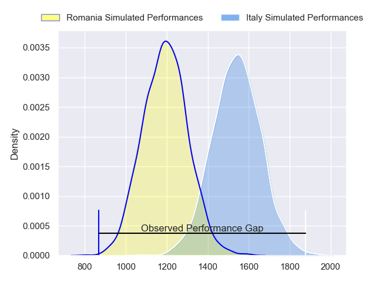
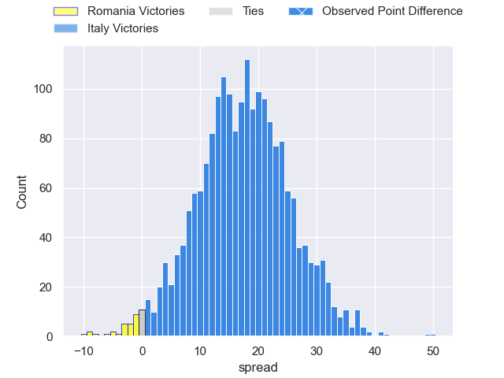
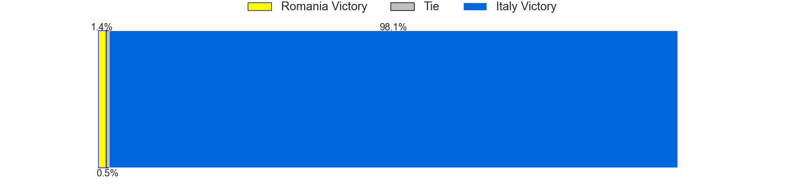
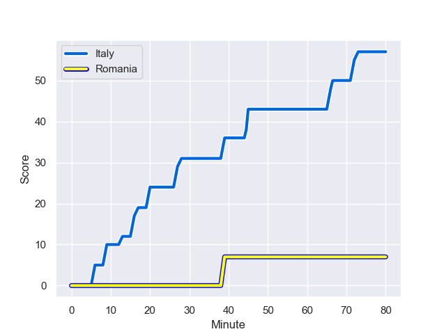
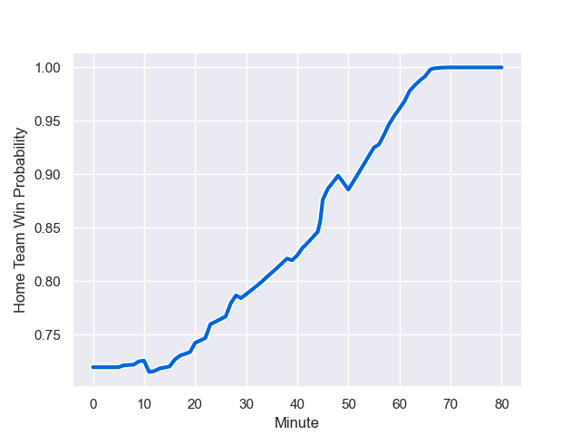

---  
layout: page  
title: Romania at Italy; 7.0-57.0  
date: 2023-08-18 18:00:00 -0500  
categories: match review  
---
# Romania at Italy; 7.0-57.0

# Club Level Predictions

The first set of predictions treats a club as the smallest object, as the club develops its members, organizes a gameplan, and deploys its players as needed for each match. This club model has a prediction of 0.871, which translates to predicting Italy to win by 17.5.

Each club has a rating and a rating deviation (simiar to a Glicko system), and expected performances can be generated. This allows for simulated matches and spreads like the ones below.
## Projected Performances

## Projected Spreads

## Projected Results

# Player Level Predictions - Version 1

Treating teams instead as an entity made up of the currently active players, I have ratings for each player in an altogether different system. These can be combined to form team ratings once teamsheets are announced, weighting starters a bit higher than the reserves. After the match is played, players can be weighted by their minutes on the field, allowing for an accurate measure of the team's composition. With these compiled team ratings, we can make predictions, measure inaccuracy, and update the individual player ratings.
## Prediction with Player Minutes: Italy by 45.0

Italy by 41.0 on a neutral field
## Prediction without Player Minutes: Italy by 46.0

Italy by 42.0 on a neutral pitch

## Scores over Time

## Win Probability over Time

|   Away Minutes | Away Player       |   Away elo |   Away Percentile |   Number |   Home Percentile |   Home elo | Home Player        |   Home Minutes |
|---------------:|:------------------|-----------:|------------------:|---------:|------------------:|-----------:|:-------------------|---------------:|
|             46 | Iulian Hartig     |      65.63 |       1.00529e+06 |        1 |            962164 |      87.69 | Ivan Nemer         |             41 |
|             63 | Ovidiu Cojocaru   |      74.51 |  901744           |        2 |            957017 |     125.48 | Giacomo Nicotera   |             50 |
|             34 | Alex Gordas       |      66.39 |  901769           |        3 |            705195 |      73.9  | Simone Ferrari     |             56 |
|             80 | Adrian Motoc      |      85.5  |  902673           |        4 |            929121 |      60.21 | Niccolo Cannone    |             80 |
|             80 | Stefan Iancu      |      66.98 |       1.00584e+06 |        5 |            893186 |     114.73 | Dino Lamb          |             80 |
|             46 | Damian Stratila   |      76.44 |  994196           |        6 |            882715 |      83.08 | Sebastian Negri    |             60 |
|             70 | Vlad Neculau      |      62.17 |  927136           |        7 |            926230 |     102.99 | Michele Lamaro     |             68 |
|             80 | Cristian Chirica  |      49.17 |  902590           |        8 |            746759 |     116.01 | Toa Halafihi       |             80 |
|             80 | Alin Conache      |      66.21 |       1.01824e+06 |        9 |            970890 |      64.87 | Alessandro Garbisi |             62 |
|             29 | Mihai Muresan     |      65.43 |       1.01825e+06 |       10 |            950755 |      83.01 | Paolo Garbisi      |             80 |
|             46 | Nicolas Onutu     |      84.54 |  934208           |       11 |            746084 |     122.26 | Monty Ioane        |             67 |
|             80 | Tevita Manumua    |      51.69 |  852230           |       12 |            581414 |     117.03 | Luca Morisi        |             56 |
|             57 | Jason Tomane      |      70.22 |  994221           |       13 |            622573 |     106.37 | Juan Ignacio Brex  |             80 |
|             80 | Marius Simionescu |      47.53 |  863510           |       14 |            803014 |      97.26 | Paolo Odogwu       |             56 |
|             80 | Hinckley Vaovasa  |      75.87 |  994261           |       15 |            938807 |     100.04 | Ange Capuozzo      |             70 |
|             17 | Florin Bardasu    |      88.19 |     nan           |       16 |            703621 |      82.17 | Hame Faiva         |             30 |
|             34 | Alexandru Savin   |      62.02 |       1.00528e+06 |       17 |            812293 |      93.36 | Federico Zani      |             39 |
|             46 | Gheorghe Gajion   |      65.07 |       1.01824e+06 |       18 |            796765 |      95.58 | Pietro Ceccarelli  |             24 |
|             34 | Cristi Boboc      |      82.28 |  979838           |       19 |            774816 |     100.03 | Federico Ruzza     |             10 |
|             10 | Dragos Ser        |      47.33 |  959121           |       20 |            972363 |      77.27 | Lorenzo Cannone    |             32 |
|             23 | Florin Surugiu    |      64.9  |  465551           |       21 |            952388 |      68.42 | Alessandro Fusco   |             31 |
|             34 | Gabriel Pop       |      65.93 |       1.01825e+06 |       22 |            699731 |      86.57 | Tommaso Allan      |             24 |
|             51 | Tudor Boldor      |      80.93 |  939606           |       23 |            995585 |      77.15 | Lorenzo Pani       |             24 |

# Player Level Predictions - Version 2

Treating teams instead as an entity made up of the currently active players, I have ratings for each player in an altogether different system. These can be combined to form team ratings once teamsheets are announced, weighting starters a bit higher than the reserves. After the match is played, players can be weighted by their minutes on the field, allowing for an accurate measure of the team's composition. With these compiled team ratings, we can make predictions, measure inaccuracy, and update the individual player ratings.
## Prediction with Player Minutes: Italy by 18.0

Italy by 14.4 on a neutral field
## Prediction without Player Minutes: Italy by 18.9

Italy by 15.3 on a neutral pitch

|   Away Minutes | Away Player       |   Away elo |   Away variance |   Number |   Home variance |   Home elo | Home Player        |   Home Minutes |
|---------------:|:------------------|-----------:|----------------:|---------:|----------------:|-----------:|:-------------------|---------------:|
|             46 | Iulian Hartig     |      42.09 |              50 |        1 |           50    |      60.92 | Ivan Nemer         |             41 |
|             63 | Ovidiu Cojocaru   |      38.32 |              50 |        2 |           50    |      88.03 | Giacomo Nicotera   |             50 |
|             34 | Alex Gordas       |      67.58 |              50 |        3 |           50    |      87.64 | Simone Ferrari     |             56 |
|             80 | Adrian Motoc      |      26.69 |              50 |        4 |           50    |      32.68 | Niccolo Cannone    |             80 |
|             80 | Stefan Iancu      |      48.27 |              50 |        5 |           50    |      61.9  | Dino Lamb          |             80 |
|             46 | Damian Stratila   |      52.72 |              50 |        6 |           50    |      54.95 | Sebastian Negri    |             60 |
|             70 | Vlad Neculau      |      36.53 |              50 |        7 |           50    |      90.08 | Michele Lamaro     |             68 |
|             80 | Cristian Chirica  |      39.69 |              50 |        8 |           49.88 |      72.64 | Toa Halafihi       |             80 |
|             80 | Alin Conache      |      46.65 |              50 |        9 |           49.95 |      56.37 | Alessandro Garbisi |             62 |
|             29 | Mihai Muresan     |      46.65 |              50 |       10 |           50    |      48.61 | Paolo Garbisi      |             80 |
|             46 | Nicolas Onutu     |      62.6  |              50 |       11 |           49.88 |      87.77 | Monty Ioane        |             67 |
|             80 | Tevita Manumua    |      22.69 |              50 |       12 |           49.91 |      84.68 | Luca Morisi        |             56 |
|             57 | Jason Tomane      |      43.56 |              50 |       13 |           50    |      87.58 | Juan Ignacio Brex  |             80 |
|             80 | Marius Simionescu |      18.6  |              50 |       14 |           50    |      74.88 | Paolo Odogwu       |             56 |
|             80 | Hinckley Vaovasa  |      63.47 |              50 |       15 |           50    |      80.66 | Ange Capuozzo      |             70 |
|             17 | Florin Bardasu    |      47.62 |              50 |       16 |           49.91 |      23.69 | Hame Faiva         |             30 |
|             34 | Alexandru Savin   |      42.33 |              50 |       17 |           49.92 |      38.54 | Federico Zani      |             39 |
|             46 | Gheorghe Gajion   |      46.65 |              50 |       18 |           49.91 |      41.34 | Pietro Ceccarelli  |             24 |
|             34 | Cristi Boboc      |      60.03 |              50 |       19 |           49.88 |      97.45 | Federico Ruzza     |             10 |
|             10 | Dragos Ser        |      25.43 |              50 |       20 |           49.95 |      75.04 | Lorenzo Cannone    |             32 |
|             23 | Florin Surugiu    |      19.87 |              50 |       21 |           50    |      28.56 | Alessandro Fusco   |             31 |
|             34 | Gabriel Pop       |      46.65 |              50 |       22 |           49.88 |      48.03 | Tommaso Allan      |             24 |
|             51 | Tudor Boldor      |      42.87 |              50 |       23 |           49.88 |      18.18 | Lorenzo Pani       |             24 |

