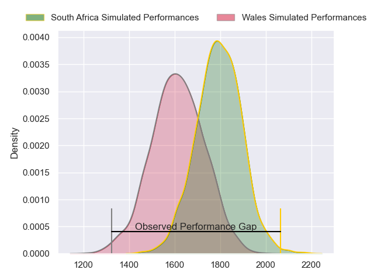
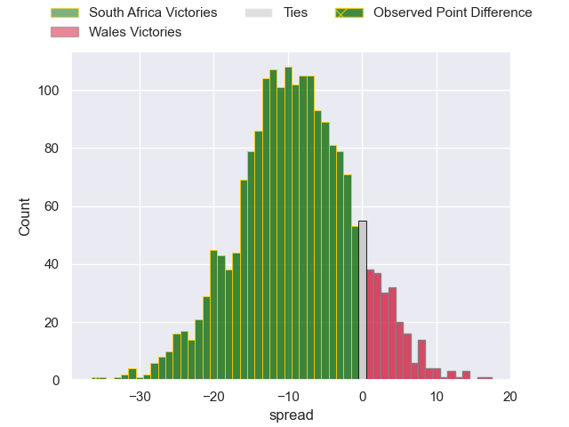
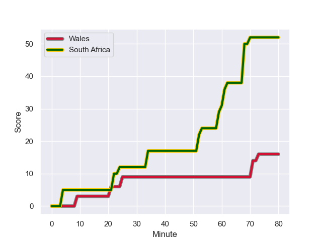
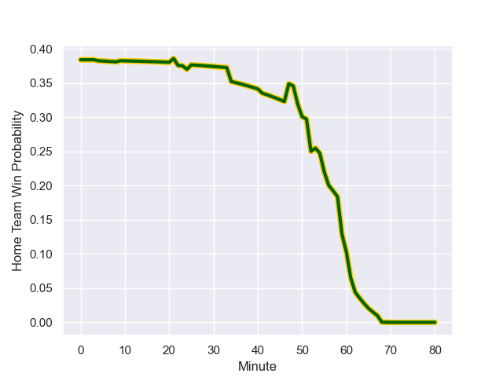

---  
layout: page  
title: South Africa at Wales; 52.0-16.0  
date: 2023-08-18 18:00:00 -0500  
categories: match review  
---
# South Africa at Wales; 52.0-16.0

# Club Level Predictions

The first set of predictions treats a club as the smallest object, as the club develops its members, organizes a gameplan, and deploys its players as needed for each match. This club model has a prediction of 0.272, which translates to predicting South Africa to win by 9.0.

Each club has a rating and a rating deviation (simiar to a Glicko system), and expected performances can be generated. This allows for simulated matches and spreads like the ones below.
## Projected Performances

## Projected Spreads

## Projected Results

# Player Level Predictions - Version 1

Treating teams instead as an entity made up of the currently active players, I have ratings for each player in an altogether different system. These can be combined to form team ratings once teamsheets are announced, weighting starters a bit higher than the reserves. After the match is played, players can be weighted by their minutes on the field, allowing for an accurate measure of the team's composition. With these compiled team ratings, we can make predictions, measure inaccuracy, and update the individual player ratings.
## Prediction with Player Minutes: South Africa by 16.5

South Africa by 20.5 on a neutral field
## Prediction without Player Minutes: South Africa by 15.7

South Africa by 19.7 on a neutral pitch

## Scores over Time

## Win Probability over Time

There were 7 large changes in win probability in this match

|   Away Minutes | Away Player          |   Away elo |   Away Percentile |   Number |   Home Percentile |   Home elo | Home Player       |   Home Minutes |
|---------------:|:---------------------|-----------:|------------------:|---------:|------------------:|-----------:|:------------------|---------------:|
|             47 | Steven Kitshoff      |      97.47 |            560706 |        1 |  814065           |     115.26 | Corey Domachowski |             49 |
|             47 | Malcolm Marx         |      97.85 |            721776 |        2 |  705071           |      86.87 | Elliot Dee        |             56 |
|             47 | Frans Malherbe       |     121.86 |            542775 |        3 |  864412           |      90.7  | Keiron Assiratti  |             49 |
|             50 | Jean Kleyn           |     104.55 |            724461 |        4 |  969278           |      81.16 | Ben Carter        |             61 |
|             80 | RG Snyman            |     106.27 |            792877 |        5 |  668445           |      76.15 | Will Rowlands     |             80 |
|             41 | Siya Kolisi          |      90.92 |            567583 |        6 |  318453           |     136.2  | Dan Lydiate       |             80 |
|             80 | Pieter-Steph du Toit |      73.16 |            621566 |        7 |  953771           |      86.68 | Jac Morgan        |             80 |
|             50 | Jasper Wiese         |     102.5  |            875816 |        8 |  893024           |     110.47 | Aaron Wainwright  |             55 |
|             62 | Jaden Hendrikse      |      97.23 |           1018164 |        9 |       1.01816e+06 |      85.31 | Kieran Hardy      |             53 |
|             80 | Manie Libbok         |      97.45 |            875925 |       10 |  952383           |      73.64 | Sam Costelow      |             66 |
|             80 | Cheslin Kolbe        |     128.6  |            676317 |       11 |  905254           |      65.47 | Rio Dyer          |             71 |
|             80 | Damian de Allende    |     106.12 |            644362 |       12 |       1.01816e+06 |      85.92 | Johnny Williams   |             80 |
|             80 | Jesse Kriel          |     111.77 |            731162 |       13 |  970799           |      83.63 | Mason Grady       |             62 |
|             80 | Canan Moodie         |     111.4  |            995901 |       14 |  900534           |      73.6  | Tom Rogers        |             80 |
|             55 | Willie Le Roux       |      90.99 |           1017068 |       15 |       1.01816e+06 |      85.5  | Cai Evans         |             75 |
|             33 | Bongi Mbonambi       |     114.5  |            617843 |       16 |  595464           |      59.13 | Sam Parry         |             24 |
|             33 | Ox Nche              |      87.4  |            812840 |       17 |  660479           |      71.48 | Nicky Smith       |             31 |
|             33 | Vincent Koch         |      61.07 |            644872 |       18 |  524148           |      90.8  | Henry Thomas      |             31 |
|             30 | Franco Mostert       |     129.94 |            650404 |       19 |     nan           |      85.7  | Teddy Williams    |             19 |
|             39 | Marco van Staden     |      98.54 |            896995 |       20 |  904121           |      83.76 | Taine Basham      |             25 |
|             30 | Duane Vermeulen      |     106.86 |            299636 |       21 |  712689           |     111.1  | Tomos Williams    |             27 |
|             18 | Grant Williams       |     104.08 |            906338 |       22 |  900805           |     118.74 | Max Llewellyn     |             27 |
|             25 | Damian Willemse      |     108.25 |            867499 |       23 |  936702           |     103.53 | Louis Rees-Zammit |             19 |

# Player Level Predictions - Version 2

Treating teams instead as an entity made up of the currently active players, I have ratings for each player in an altogether different system. These can be combined to form team ratings once teamsheets are announced, weighting starters a bit higher than the reserves. After the match is played, players can be weighted by their minutes on the field, allowing for an accurate measure of the team's composition. With these compiled team ratings, we can make predictions, measure inaccuracy, and update the individual player ratings.
## Prediction with Player Minutes: South Africa by 24.2

South Africa by 28.0 on a neutral field
## Prediction without Player Minutes: South Africa by 23.2

South Africa by 27.0 on a neutral pitch

|   Away Minutes | Away Player          |   Away elo |   Away variance |   Number |   Home variance |   Home elo | Home Player       |   Home Minutes |
|---------------:|:---------------------|-----------:|----------------:|---------:|----------------:|-----------:|:------------------|---------------:|
|             47 | Steven Kitshoff      |      90.74 |           49.45 |        1 |              50 |      53.95 | Corey Domachowski |             49 |
|             47 | Malcolm Marx         |     121.34 |           49.88 |        2 |              50 |      64.01 | Elliot Dee        |             56 |
|             47 | Frans Malherbe       |      70.74 |           49.65 |        3 |              50 |      41.87 | Keiron Assiratti  |             49 |
|             50 | Jean Kleyn           |     102.17 |           49.31 |        4 |              50 |      41.59 | Ben Carter        |             61 |
|             80 | RG Snyman            |     120.66 |           49.81 |        5 |              50 |      41.1  | Will Rowlands     |             80 |
|             41 | Siya Kolisi          |      98.34 |           50    |        6 |              50 |      51.53 | Dan Lydiate       |             80 |
|             80 | Pieter-Steph du Toit |      67.25 |           49.65 |        7 |              50 |      57.18 | Jac Morgan        |             80 |
|             50 | Jasper Wiese         |      76    |           44.44 |        8 |              50 |      69.95 | Aaron Wainwright  |             55 |
|             62 | Jaden Hendrikse      |      46.65 |           50    |        9 |              50 |      46.65 | Kieran Hardy      |             53 |
|             80 | Manie Libbok         |      64.76 |           48.73 |       10 |              50 |      39.83 | Sam Costelow      |             66 |
|             80 | Cheslin Kolbe        |     146.49 |           49.44 |       11 |              50 |      10.66 | Rio Dyer          |             71 |
|             80 | Damian de Allende    |     114.38 |           49.75 |       12 |              50 |      46.65 | Johnny Williams   |             80 |
|             80 | Jesse Kriel          |     135.56 |           49.62 |       13 |              50 |      64.24 | Mason Grady       |             62 |
|             80 | Canan Moodie         |     105.47 |           49.79 |       14 |              50 |      48.72 | Tom Rogers        |             80 |
|             55 | Willie Le Roux       |      41.72 |           49.58 |       15 |              50 |      46.65 | Cai Evans         |             75 |
|             33 | Bongi Mbonambi       |      92.65 |           49.71 |       16 |              50 |      40.01 | Sam Parry         |             24 |
|             33 | Ox Nche              |     103.35 |           50    |       17 |              50 |      40.69 | Nicky Smith       |             31 |
|             33 | Vincent Koch         |      44.23 |           47.55 |       18 |              50 |      50.74 | Henry Thomas      |             31 |
|             30 | Franco Mostert       |     104.75 |           49.89 |       19 |              50 |      46.65 | Teddy Williams    |             19 |
|             39 | Marco van Staden     |      69.73 |           49.02 |       20 |              50 |      45.68 | Taine Basham      |             25 |
|             30 | Duane Vermeulen      |     139.58 |           49.07 |       21 |              50 |      74.76 | Tomos Williams    |             27 |
|             18 | Grant Williams       |      47.29 |           49.88 |       22 |              50 |      73.15 | Max Llewellyn     |             27 |
|             25 | Damian Willemse      |      93.36 |           48.87 |       23 |              50 |      67.9  | Louis Rees-Zammit |             19 |

