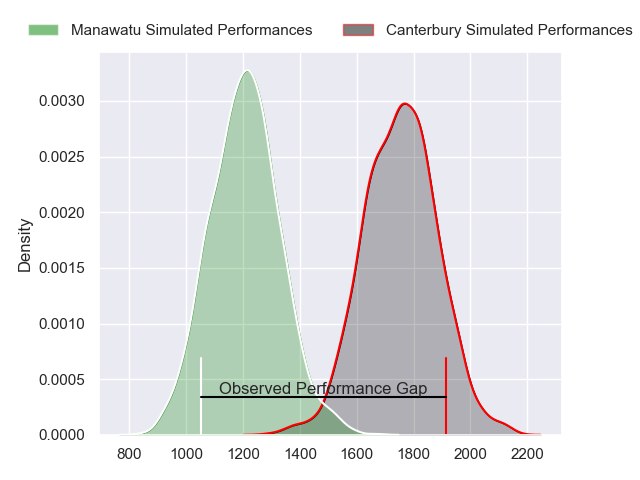
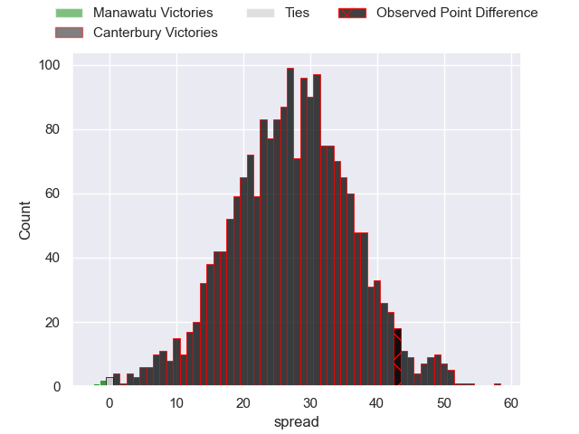
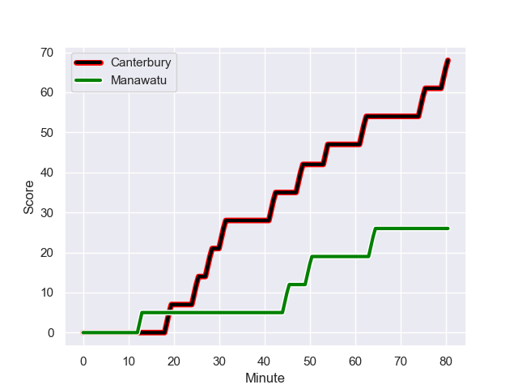
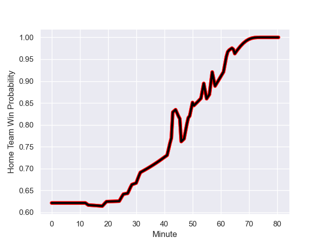

---  
layout: page  
title: Manawatu at Canterbury; 26-69  
date: 2023-08-19 18:00:00 -0500  
categories: match review  
---
# Manawatu at Canterbury; 26-69

# Club Level Predictions

The first set of predictions treats a club as the smallest object, as the club develops its members, organizes a gameplan, and deploys its players as needed for each match. This club model has a prediction of 0.951, which translates to predicting Canterbury to win by 27.6.

Each club has a rating and a rating deviation (simiar to a Glicko system), and expected performances can be generated. This allows for simulated matches and spreads like the ones below.
## Projected Performances

## Projected Spreads

## Projected Results

# Player Level Predictions - Version 1

Treating teams instead as an entity made up of the currently active players, I have ratings for each player in an altogether different system. These can be combined to form team ratings once teamsheets are announced, weighting starters a bit higher than the reserves. After the match is played, players can be weighted by their minutes on the field, allowing for an accurate measure of the team's composition. With these compiled team ratings, we can make predictions, measure inaccuracy, and update the individual player ratings.
## Prediction with Player Minutes: Canterbury by 25.5

Canterbury by 21.5 on a neutral field
## Prediction without Player Minutes: Canterbury by 26.9

Canterbury by 22.9 on a neutral pitch

## Scores over Time

## Win Probability over Time

There were 10 large changes in win probability in this match

|   Away Minutes | Away Player           |   Away elo |   Away Percentile |   Number |   Home Percentile |   Home elo | Home Player          |   Home Minutes |
|---------------:|:----------------------|-----------:|------------------:|---------:|------------------:|-----------:|:---------------------|---------------:|
|             43 | Joseph Gavigan        |      70.26 |       1.01766e+06 |        1 |       1.01847e+06 |      82.5  | Joe Moody            |             41 |
|             43 | Leif Schwenke         |      67.23 |       1.0182e+06  |        2 |       1.01774e+06 |      81.37 | Ben Funnell          |             46 |
|             43 | Flyn Yates            |      66.34 |       1.01768e+06 |        3 |  829436           |     106.24 | Oli Jager            |              2 |
|             50 | Ofa Tauatevalu        |      69.96 |       1.0177e+06  |        4 |       1.01778e+06 |      80.09 | Mitchell Dunshea     |             65 |
|             80 | Johannes Momsen       |      72.86 |  940674           |        5 |       1.01782e+06 |      79.41 | Tahlor Cahill        |             80 |
|             64 | Terrell Peita         |      67.21 |       1.0182e+06  |        6 |       1.01634e+06 |      93.12 | Billy Harmon         |             80 |
|             80 | Slade McDowall        |      83.87 |       1.0153e+06  |        7 |  897811           |     104.63 | Tom Christie         |             80 |
|             80 | Brayden Iose          |      63.8  |  892332           |        8 |       1.01818e+06 |      83.07 | Cullen Grace         |             51 |
|             57 | Jordi Viljoen         |      66.93 |       1.01766e+06 |        9 |       1.00655e+06 |      94.37 | Mitchell Drummond    |             55 |
|             57 | Brett Cameron         |      97.31 |  881416           |       10 |       1.01779e+06 |      80.33 | Fergus Burke         |             58 |
|             80 | Tima Fainga'anuku     |      90.27 |       1.01654e+06 |       11 |       1.01774e+06 |      84.32 | Blair Murray         |             55 |
|             80 | Jason Emery           |      48.76 |       1.01632e+06 |       12 |  945888           |      92.33 | Rameka Poihipi       |             80 |
|             54 | Kyle Brown            |      70.29 |       1.01769e+06 |       13 |  944959           |     100.41 | Dallas McLeod        |             80 |
|             80 | Drew Wild             |      74.07 |       1.01553e+06 |       14 |       1.01655e+06 |      81.67 | Manasa Mataele       |             80 |
|             80 | Beaudein Waaka        |      76.58 |       1.01532e+06 |       15 |       1.01781e+06 |      79.84 | Chay Fihaki          |             80 |
|             37 | Malakai Hala-Ngatai   |      68.7  |       1.01847e+06 |       16 |       1.01775e+06 |      84.4  | Daniel Lienert-Brown |             39 |
|             37 | Cole Keith            |      64.95 |       1.01648e+06 |       17 |       1.01782e+06 |      81.7  | Seb Calder           |             78 |
|             37 | Raymond Tuputupu      |      64.44 |       1.01772e+06 |       18 |     nan           |      82.31 | Nick Hyde            |             34 |
|             30 | Stan van den Hoven    |      66.56 |       1.0182e+06  |       19 |       1.01777e+06 |      82.65 | Luke Romano          |             15 |
|             16 | Julian Goerke         |      67.95 |     nan           |       20 |       1.01775e+06 |      84.93 | Corey Kellow         |             29 |
|             23 | Isaiah Ravula         |      67.46 |     nan           |       21 |       1.01783e+06 |      79.55 | Willi Heinz          |             25 |
|             23 | John Poland           |     107.33 |  959318           |       22 |     nan           |      83.87 | Alex Harford         |             22 |
|             26 | Te Rangatira Waitokia |      66.45 |       1.01565e+06 |       23 |       1.01783e+06 |      85.32 | Ryan Crotty          |             25 |

# Player Level Predictions - Version 2

Treating teams instead as an entity made up of the currently active players, I have ratings for each player in an altogether different system. These can be combined to form team ratings once teamsheets are announced, weighting starters a bit higher than the reserves. After the match is played, players can be weighted by their minutes on the field, allowing for an accurate measure of the team's composition. With these compiled team ratings, we can make predictions, measure inaccuracy, and update the individual player ratings.
## Prediction with Player Minutes: Canterbury by 11.7

Canterbury by 8.3 on a neutral field
## Prediction without Player Minutes: Canterbury by 12.3

Canterbury by 8.9 on a neutral pitch

|   Away Minutes | Away Player           |   Away elo |   Away variance |   Number |   Home variance |   Home elo | Home Player          |   Home Minutes |
|---------------:|:----------------------|-----------:|----------------:|---------:|----------------:|-----------:|:---------------------|---------------:|
|             43 | Joseph Gavigan        |      46.65 |            50   |        1 |              50 |      46.65 | Joe Moody            |             41 |
|             43 | Leif Schwenke         |      46.65 |            50   |        2 |              50 |      46.65 | Ben Funnell          |             46 |
|             43 | Flyn Yates            |      46.65 |            50   |        3 |              50 |      82.9  | Oli Jager            |              2 |
|             50 | Ofa Tauatevalu        |      46.65 |            50   |        4 |              50 |      46.65 | Mitchell Dunshea     |             65 |
|             80 | Johannes Momsen       |     -10.25 |            50   |        5 |              50 |      46.65 | Tahlor Cahill        |             80 |
|             64 | Terrell Peita         |      46.65 |            50   |        6 |              50 |      46.65 | Billy Harmon         |             80 |
|             80 | Slade McDowall        |      46.65 |            50   |        7 |              50 |     103.08 | Tom Christie         |             80 |
|             80 | Brayden Iose          |      24.15 |            50   |        8 |              50 |      46.65 | Cullen Grace         |             51 |
|             57 | Jordi Viljoen         |      46.65 |            50   |        9 |              50 |      66.51 | Mitchell Drummond    |             55 |
|             57 | Brett Cameron         |      32.31 |            50   |       10 |              50 |      46.65 | Fergus Burke         |             58 |
|             80 | Tima Fainga'anuku     |      46.65 |            50   |       11 |              50 |      46.65 | Blair Murray         |             55 |
|             80 | Jason Emery           |      46.65 |            50   |       12 |              50 |      62.35 | Rameka Poihipi       |             80 |
|             54 | Kyle Brown            |      46.65 |            50   |       13 |              50 |      69.77 | Dallas McLeod        |             80 |
|             80 | Drew Wild             |      46.65 |            50   |       14 |              50 |      46.65 | Manasa Mataele       |             80 |
|             80 | Beaudein Waaka        |      46.65 |            50   |       15 |              50 |      46.65 | Chay Fihaki          |             80 |
|             37 | Malakai Hala-Ngatai   |      46.65 |            50   |       16 |              50 |      46.65 | Daniel Lienert-Brown |             39 |
|             37 | Cole Keith            |      46.65 |            50   |       17 |              50 |      46.65 | Seb Calder           |             78 |
|             37 | Raymond Tuputupu      |      46.65 |            50   |       18 |              50 |      46.65 | Nick Hyde            |             34 |
|             30 | Stan van den Hoven    |      46.65 |            50   |       19 |              50 |      46.65 | Luke Romano          |             15 |
|             16 | Julian Goerke         |      46.65 |            50   |       20 |              50 |      46.65 | Corey Kellow         |             29 |
|             23 | Isaiah Ravula         |      46.65 |            50   |       21 |              50 |      46.65 | Willi Heinz          |             25 |
|             23 | John Poland           |      44.18 |            48.4 |       22 |              50 |      46.65 | Alex Harford         |             22 |
|             26 | Te Rangatira Waitokia |      46.65 |            50   |       23 |              50 |      46.65 | Ryan Crotty          |             25 |

