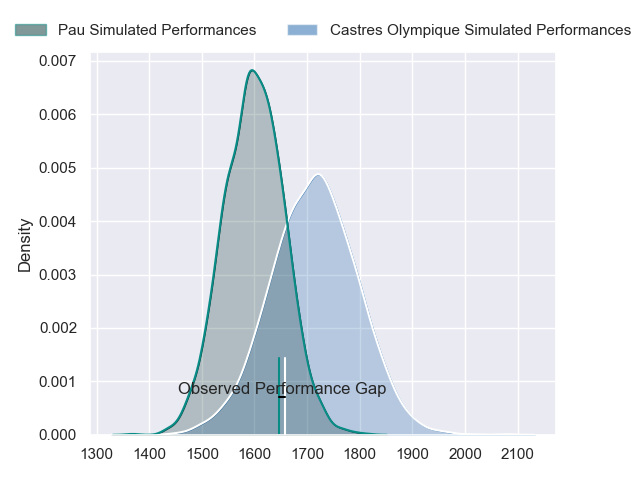
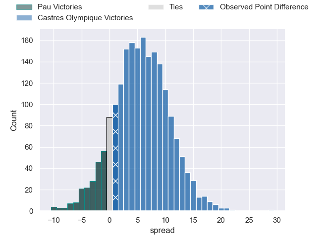
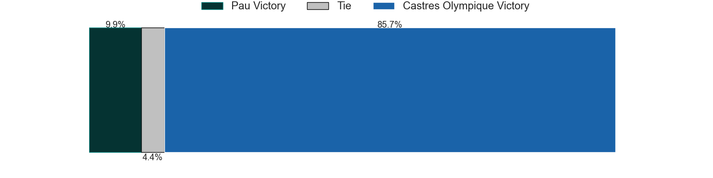
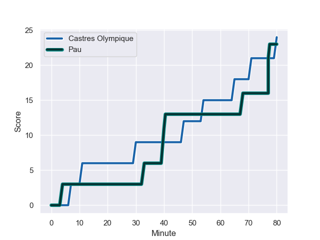
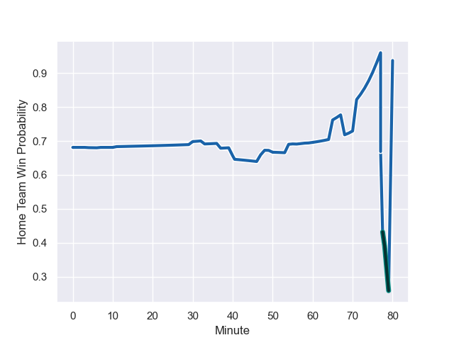

---  
layout: page  
title: Pau at Castres Olympique; 23-24  
date: 2023-08-19 18:00:00 -0500  
categories: match review  
---
# Pau at Castres Olympique; 23-24

# Club Level Predictions

The first set of predictions treats a club as the smallest object, as the club develops its members, organizes a gameplan, and deploys its players as needed for each match. This club model has a prediction of 0.653, which translates to predicting Castres Olympique to win by 5.6.

Each club has a rating and a rating deviation (simiar to a Glicko system), and expected performances can be generated. This allows for simulated matches and spreads like the ones below.
## Projected Performances

## Projected Spreads

## Projected Results

# Player Level Predictions - Version 1

Treating teams instead as an entity made up of the currently active players, I have ratings for each player in an altogether different system. These can be combined to form team ratings once teamsheets are announced, weighting starters a bit higher than the reserves. After the match is played, players can be weighted by their minutes on the field, allowing for an accurate measure of the team's composition. With these compiled team ratings, we can make predictions, measure inaccuracy, and update the individual player ratings.
## Prediction with Player Minutes: Castres Olympique by 37.0

Castres Olympique by 33.0 on a neutral field
## Prediction without Player Minutes: Castres Olympique by 37.7

Castres Olympique by 33.7 on a neutral pitch

## Scores over Time

## Win Probability over Time

There were 10 large changes in win probability in this match

|   Away Minutes | Away Player              |   Away elo |   Away Percentile |   Number |   Home Percentile |   Home elo | Home Player                |   Home Minutes |
|---------------:|:-------------------------|-----------:|------------------:|---------:|------------------:|-----------:|:---------------------------|---------------:|
|             54 | Hayden Thompson-Stringer |      54.28 |       1.01956e+06 |        1 |       1.01961e+06 |      72.98 | Quentin Walcker            |             50 |
|             56 | Lucas Rey                |      52.85 |       1.01958e+06 |        2 |       1.01956e+06 |      77.75 | Gaëtan Barlot              |             59 |
|             54 | Nicolas Corato           |      51.7  |       1.01962e+06 |        3 |       1.01954e+06 |      82.95 | Wilfried Hounkpatin        |             50 |
|             54 | Guillaume Ducat          |      54.62 |       1.01956e+06 |        4 |       1.01956e+06 |      78.54 | Gauthier Maravat           |             48 |
|             14 | Mickael Capelli          |      52.21 |       1.0196e+06  |        5 |       1.01955e+06 |      79.53 | Thomas Staniforth          |             80 |
|             48 | Martin Puech             |      52.51 |       1.01959e+06 |        6 |       1.0196e+06  |      74.33 | Mathieu Babillot           |             80 |
|             80 | Reece Hewat              |      51.82 |       1.01961e+06 |        7 |       1.01962e+06 |      72.62 | Nick Champion de Crespigny |             48 |
|             80 | Luke Whitelock           |      52.67 |       1.01959e+06 |        8 |       1.01955e+06 |      80.88 | Tyler Ardron               |             80 |
|             56 | Dan Robson               |      53.24 |       1.01957e+06 |        9 |       1.01959e+06 |      74.62 | Jérémy Fernandez           |             70 |
|             80 | Joe Simmonds             |      51.94 |       1.0196e+06  |       10 |       1.01958e+06 |      76.07 | Louis Le Brun              |             50 |
|             80 | Thomas Carol             |      56.75 |       1.01955e+06 |       11 |       1.0196e+06  |      74.07 | Josaia Raisuqe             |             54 |
|             37 | Jale Vatubua             |      55.02 |       1.01956e+06 |       12 |       1.01961e+06 |      73.17 | Adrea Cocagi               |             80 |
|             80 | Samuel Ezeala            |      53.47 |       1.01957e+06 |       13 |       1.0196e+06  |      73.59 | Adrien Seguret             |             80 |
|             80 | Clément Laporte          |      52.35 |       1.01959e+06 |       14 |       1.01956e+06 |      77.1  | Geoffrey Palis             |             80 |
|             80 | Jack Maddocks            |      53.04 |       1.01958e+06 |       15 |       1.01961e+06 |      73.37 | Julien Dumora              |             80 |
|             66 | Fabrice Metz             |      52.07 |       1.0196e+06  |       16 |       1.01222e+06 |      87.32 | Baptiste Cope              |             32 |
|             43 | Axel Desperes            |      85.37 |       1.0127e+06  |       17 |     nan           |      74.93 | Leone Nakarawa             |             32 |
|             32 | Sacha Zegueur            |      35.97 |  918280           |       18 |       1.01961e+06 |      72.79 | Pierre Popelin             |             30 |
|             26 | Rémi Seneca              |      53.71 |     nan           |       19 |     nan           |      73.82 | Antoine Tichit             |             30 |
|             26 | Hugo Auradou             |      57.87 |  996246           |       20 |     nan           |      75.27 | Levan Chilachava           |             30 |
|             26 | Siate Tokolahi           |      56.04 |     nan           |       21 |       1.01962e+06 |      72.46 | Nathanael Hulleu           |             26 |
|             24 | Thibault Daubagna        |      55.48 |       1.01955e+06 |       22 |     nan           |      75.65 | Loris Zarantonello         |             21 |
|             24 | Romain Ruffenach         |      53.98 |     nan           |       23 |     nan           |      76.55 | Gauthier Doubrère          |             10 |

# Player Level Predictions - Version 2

Treating teams instead as an entity made up of the currently active players, I have ratings for each player in an altogether different system. These can be combined to form team ratings once teamsheets are announced, weighting starters a bit higher than the reserves. After the match is played, players can be weighted by their minutes on the field, allowing for an accurate measure of the team's composition. With these compiled team ratings, we can make predictions, measure inaccuracy, and update the individual player ratings.
## Prediction with Player Minutes: Castres Olympique by 5.6

Castres Olympique by 0.7 on a neutral field
## Prediction without Player Minutes: Castres Olympique by 5.4

Castres Olympique by 0.5 on a neutral pitch

|   Away Minutes | Away Player              |   Away elo |   Away variance |   Number |   Home variance |   Home elo | Home Player                |   Home Minutes |
|---------------:|:-------------------------|-----------:|----------------:|---------:|----------------:|-----------:|:---------------------------|---------------:|
|             54 | Hayden Thompson-Stringer |      46.65 |              50 |        1 |              50 |      46.65 | Quentin Walcker            |             50 |
|             56 | Lucas Rey                |      46.65 |              50 |        2 |              50 |      46.65 | Gaëtan Barlot              |             59 |
|             54 | Nicolas Corato           |      46.65 |              50 |        3 |              50 |      46.65 | Wilfried Hounkpatin        |             50 |
|             54 | Guillaume Ducat          |      46.65 |              50 |        4 |              50 |      46.65 | Gauthier Maravat           |             48 |
|             14 | Mickael Capelli          |      46.65 |              50 |        5 |              50 |      46.65 | Thomas Staniforth          |             80 |
|             48 | Martin Puech             |      46.65 |              50 |        6 |              50 |      46.65 | Mathieu Babillot           |             80 |
|             80 | Reece Hewat              |      46.65 |              50 |        7 |              50 |      46.65 | Nick Champion de Crespigny |             48 |
|             80 | Luke Whitelock           |      46.65 |              50 |        8 |              50 |      46.65 | Tyler Ardron               |             80 |
|             56 | Dan Robson               |      46.65 |              50 |        9 |              50 |      46.65 | Jérémy Fernandez           |             70 |
|             80 | Joe Simmonds             |      46.65 |              50 |       10 |              50 |      46.65 | Louis Le Brun              |             50 |
|             80 | Thomas Carol             |      46.65 |              50 |       11 |              50 |      46.65 | Josaia Raisuqe             |             54 |
|             37 | Jale Vatubua             |      46.65 |              50 |       12 |              50 |      46.65 | Adrea Cocagi               |             80 |
|             80 | Samuel Ezeala            |      46.65 |              50 |       13 |              50 |      46.65 | Adrien Seguret             |             80 |
|             80 | Clément Laporte          |      46.65 |              50 |       14 |              50 |      46.65 | Geoffrey Palis             |             80 |
|             80 | Jack Maddocks            |      46.65 |              50 |       15 |              50 |      46.65 | Julien Dumora              |             80 |
|             66 | Fabrice Metz             |      46.65 |              50 |       16 |              50 |      43.63 | Baptiste Cope              |             32 |
|             43 | Axel Desperes            |      46.6  |              50 |       17 |              50 |      46.65 | Leone Nakarawa             |             32 |
|             32 | Sacha Zegueur            |      17.46 |              50 |       18 |              50 |      46.65 | Pierre Popelin             |             30 |
|             26 | Rémi Seneca              |      46.65 |              50 |       19 |              50 |      46.65 | Antoine Tichit             |             30 |
|             26 | Hugo Auradou             |      23.93 |              50 |       20 |              50 |      46.65 | Levan Chilachava           |             30 |
|             26 | Siate Tokolahi           |      46.65 |              50 |       21 |              50 |      46.65 | Nathanael Hulleu           |             26 |
|             24 | Thibault Daubagna        |      46.65 |              50 |       22 |              50 |      46.65 | Loris Zarantonello         |             21 |
|             24 | Romain Ruffenach         |      46.65 |              50 |       23 |              50 |      46.65 | Gauthier Doubrère          |             10 |

