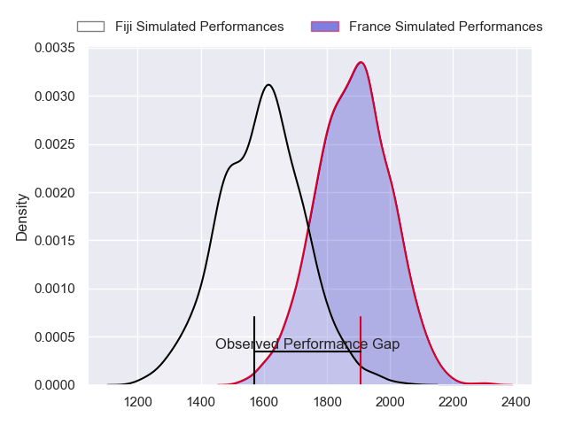
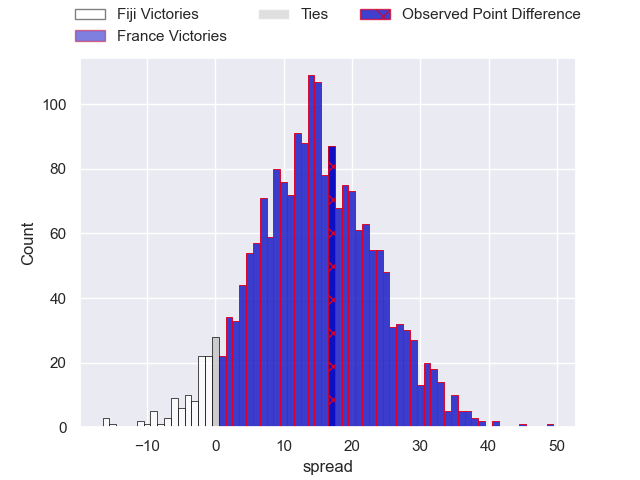
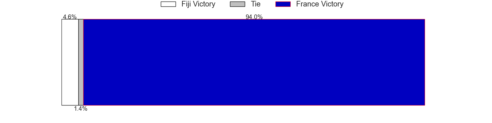
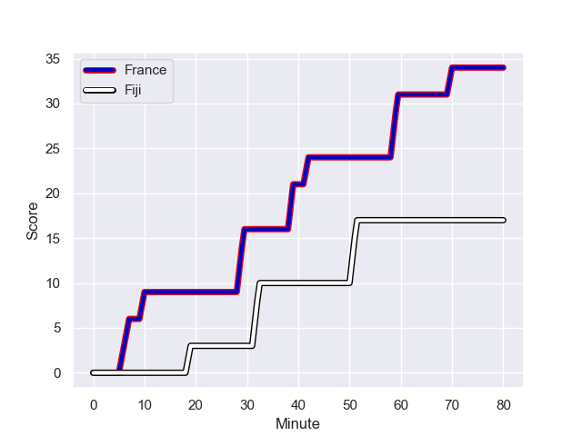
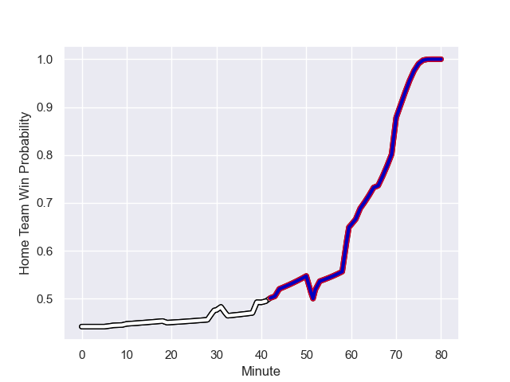

---  
layout: page  
title: Fiji at France; 17-34  
date: 2023-08-19 18:00:00 -0500  
categories: match review  
---
# Fiji at France; 17-34

# Club Level Predictions

The first set of predictions treats a club as the smallest object, as the club develops its members, organizes a gameplan, and deploys its players as needed for each match. This club model has a prediction of 0.825, which translates to predicting France to win by 14.6.

Each club has a rating and a rating deviation (simiar to a Glicko system), and expected performances can be generated. This allows for simulated matches and spreads like the ones below.
## Projected Performances

## Projected Spreads

## Projected Results

# Player Level Predictions - Version 1

Treating teams instead as an entity made up of the currently active players, I have ratings for each player in an altogether different system. These can be combined to form team ratings once teamsheets are announced, weighting starters a bit higher than the reserves. After the match is played, players can be weighted by their minutes on the field, allowing for an accurate measure of the team's composition. With these compiled team ratings, we can make predictions, measure inaccuracy, and update the individual player ratings.
## Prediction with Player Minutes: Fiji by 6.2

Fiji by 10.2 on a neutral field
## Prediction without Player Minutes: Fiji by 7.4

Fiji by 11.4 on a neutral pitch

## Scores over Time

## Win Probability over Time

There were 6 large changes in win probability in this match

|   Away Minutes | Away Player               |   Away elo |   Away Percentile |   Number |   Home Percentile |   Home elo | Home Player          |   Home Minutes |
|---------------:|:--------------------------|-----------:|------------------:|---------:|------------------:|-----------:|:---------------------|---------------:|
|             66 | Eroni Cama Mawi           |      97.72 |       1.01513e+06 |        1 |       1.01682e+06 |      86.22 | Reda Wardi           |             44 |
|             53 | Tevita Ikanivere          |     126.51 |  943089           |        2 |       1.01618e+06 |      84.27 | Peato Mauvaka        |             80 |
|             42 | Mesake Doge               |      71.31 |  926203           |        3 |       1.01679e+06 |      89.54 | Uini Atonio          |             44 |
|             80 | Isoa Nasilasila           |     134.85 |  997731           |        4 |       1.01606e+06 |      72.13 | Florian Verhaeghe    |             62 |
|             80 | Te Ahiwaru Cirikidaveta   |     102.53 |  893483           |        5 |       1.01845e+06 |      88.05 | Paul Willemse        |             62 |
|             31 | Ratu Meli Derenalagi      |     105.47 |  997688           |        6 |       1.01613e+06 |      97.17 | Francois Cros        |             52 |
|             74 | Levani Botia              |      86.2  |       1.01682e+06 |        7 |       1.01673e+06 |      84.02 | Dylan Cretin         |             80 |
|             80 | Viliame Mata              |      93.76 |       1.01845e+06 |        8 |       1.0168e+06  |      85.65 | Gregory Alldritt     |             52 |
|             80 | Frank Lomani              |      84.98 |  883437           |        9 |       1.01625e+06 |      89.78 | Maxime Lucu          |             62 |
|             80 | Caleb Muntz               |      94.93 |  943000           |       10 |       1.01681e+06 |      89.65 | Antoine Hastoy       |             62 |
|             80 | Vinaya Habosi             |      93.98 |       1.01845e+06 |       11 |       1.01621e+06 |     100.45 | Yoram Moefana        |             80 |
|             80 | Semi Radradra             |      94.95 |       1.01845e+06 |       12 |       1.01678e+06 |      88.65 | Jonathan Danty       |             80 |
|             40 | Iosefo Masi               |      81.42 |       1.01295e+06 |       13 |       1.01844e+06 |      88.46 | Arthur Vincent       |             80 |
|             72 | Jiuta Wainiqolo           |      94.74 |       1.01622e+06 |       14 |  994702           |     108.79 | Louis Bielle-Biarrey |             80 |
|             66 | Sireli Maqala             |     105.71 |  993455           |       15 |       1.01845e+06 |      88.25 | Melvyn Jaminet       |             80 |
|             49 | Albert Tuisue             |      95.53 |     nan           |       16 |       1.01525e+06 |      90.38 | Thomas Laclayat      |             36 |
|             38 | Luke Tagi                 |      94.69 |     nan           |       17 |  903802           |     111.11 | Jean-Baptiste Gros   |             36 |
|             27 | Sam Matavesi              |      94.44 |     nan           |       18 |  887359           |     102.07 | Pierre Bourgarit     |             28 |
|             14 | Kalaveti Ravouvou         |     146.21 |  997761           |       19 |  747149           |     118.09 | Sekou Macalou        |             28 |
|             14 | Jone Koroiduadua          |      94.2  |     nan           |       20 |  797240           |      97.3  | Bastien Chalureau    |             18 |
|              8 | Simione Kuruvoli          |      95.23 |     nan           |       21 |     nan           |      88.68 | Baptiste Serin       |             18 |
|             40 | Ilaisa Droasese           |      87.3  |  974385           |       22 |       1.01622e+06 |      96.84 | Matthieu Jalibert    |             18 |
|              6 | Temo Sukayawa Mayanavanua |      88.44 |     nan           |       23 |       1.01675e+06 |      81.5  | Thibaud Flament      |             18 |

# Player Level Predictions - Version 2

Treating teams instead as an entity made up of the currently active players, I have ratings for each player in an altogether different system. These can be combined to form team ratings once teamsheets are announced, weighting starters a bit higher than the reserves. After the match is played, players can be weighted by their minutes on the field, allowing for an accurate measure of the team's composition. With these compiled team ratings, we can make predictions, measure inaccuracy, and update the individual player ratings.
## Prediction with Player Minutes: France by 3.3

Fiji by 0.4 on a neutral field
## Prediction without Player Minutes: France by 2.0

Fiji by 1.6 on a neutral pitch

|   Away Minutes | Away Player               |   Away elo |   Away variance |   Number |   Home variance |   Home elo | Home Player          |   Home Minutes |
|---------------:|:--------------------------|-----------:|----------------:|---------:|----------------:|-----------:|:---------------------|---------------:|
|             66 | Eroni Cama Mawi           |      46.65 |           50    |        1 |           50    |      46.65 | Reda Wardi           |             44 |
|             53 | Tevita Ikanivere          |      58.94 |           47.92 |        2 |           50    |      46.65 | Peato Mauvaka        |             80 |
|             42 | Mesake Doge               |      48.01 |           49.47 |        3 |           50    |      46.65 | Uini Atonio          |             44 |
|             80 | Isoa Nasilasila           |      59.2  |           47.48 |        4 |           50    |      46.65 | Florian Verhaeghe    |             62 |
|             80 | Te Ahiwaru Cirikidaveta   |      48.85 |           48.41 |        5 |           50    |      46.65 | Paul Willemse        |             62 |
|             31 | Ratu Meli Derenalagi      |      61.38 |           49.09 |        6 |           50    |      46.65 | Francois Cros        |             52 |
|             74 | Levani Botia              |      46.65 |           50    |        7 |           50    |      46.65 | Dylan Cretin         |             80 |
|             80 | Viliame Mata              |      46.65 |           50    |        8 |           50    |      46.65 | Gregory Alldritt     |             52 |
|             80 | Frank Lomani              |      61.6  |           48.23 |        9 |           50    |      46.65 | Maxime Lucu          |             62 |
|             80 | Caleb Muntz               |      51.74 |           49.25 |       10 |           50    |      46.65 | Antoine Hastoy       |             62 |
|             80 | Vinaya Habosi             |      46.65 |           50    |       11 |           50    |      46.65 | Yoram Moefana        |             80 |
|             80 | Semi Radradra             |      46.65 |           50    |       12 |           50    |      46.65 | Jonathan Danty       |             80 |
|             40 | Iosefo Masi               |      62.63 |           47.74 |       13 |           50    |      46.65 | Arthur Vincent       |             80 |
|             72 | Jiuta Wainiqolo           |      46.65 |           50    |       14 |           49.74 |      66.01 | Louis Bielle-Biarrey |             80 |
|             66 | Sireli Maqala             |      65.44 |           50    |       15 |           50    |      46.65 | Melvyn Jaminet       |             80 |
|             49 | Albert Tuisue             |      46.65 |           50    |       16 |           50    |      46.65 | Thomas Laclayat      |             36 |
|             38 | Luke Tagi                 |      46.65 |           50    |       17 |           50    |      88.07 | Jean-Baptiste Gros   |             36 |
|             27 | Sam Matavesi              |      46.65 |           50    |       18 |           49.49 |      84.84 | Pierre Bourgarit     |             28 |
|             14 | Kalaveti Ravouvou         |      54.79 |           48.11 |       19 |           49.76 |      91.95 | Sekou Macalou        |             28 |
|             14 | Jone Koroiduadua          |      46.65 |           50    |       20 |           50    |      67.37 | Bastien Chalureau    |             18 |
|              8 | Simione Kuruvoli          |      46.65 |           50    |       21 |           50    |      46.65 | Baptiste Serin       |             18 |
|             40 | Ilaisa Droasese           |      59.85 |           48.02 |       22 |           50    |      46.65 | Matthieu Jalibert    |             18 |
|              6 | Temo Sukayawa Mayanavanua |      46.65 |           50    |       23 |           50    |      46.65 | Thibaud Flament      |             18 |

