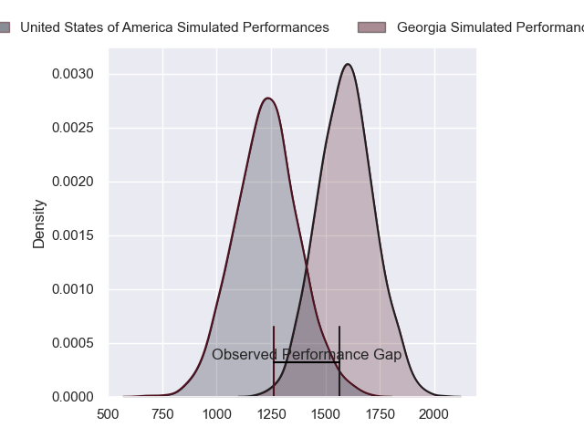
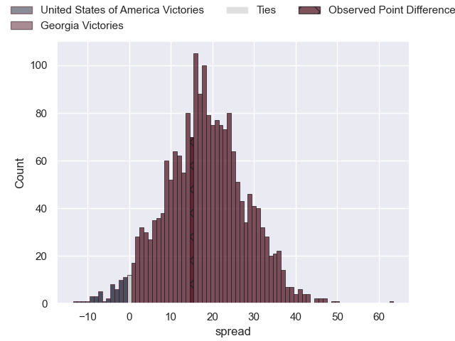
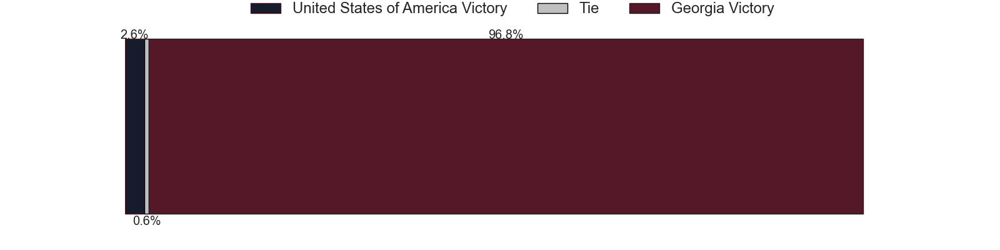
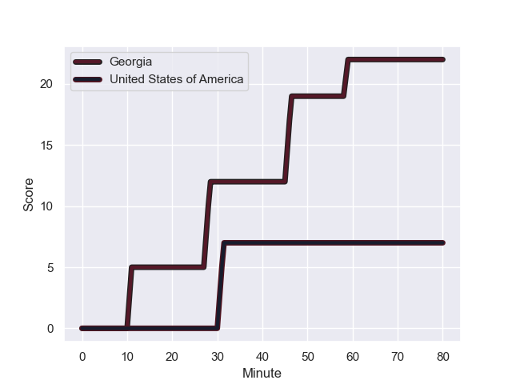
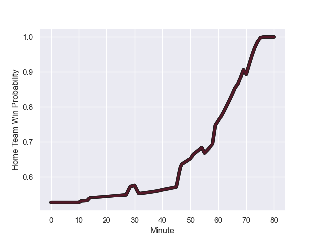

---  
layout: page  
title: United States of America at Georgia; 7-22  
date: 2023-08-19 18:00:00 -0500  
categories: match review  
---
# United States of America at Georgia; 7-22

# Club Level Predictions

The first set of predictions treats a club as the smallest object, as the club develops its members, organizes a gameplan, and deploys its players as needed for each match. This club model has a prediction of 0.87, which translates to predicting Georgia to win by 18.2.

Each club has a rating and a rating deviation (simiar to a Glicko system), and expected performances can be generated. This allows for simulated matches and spreads like the ones below.
## Projected Performances

## Projected Spreads

## Projected Results

# Player Level Predictions - Version 1

Treating teams instead as an entity made up of the currently active players, I have ratings for each player in an altogether different system. These can be combined to form team ratings once teamsheets are announced, weighting starters a bit higher than the reserves. After the match is played, players can be weighted by their minutes on the field, allowing for an accurate measure of the team's composition. With these compiled team ratings, we can make predictions, measure inaccuracy, and update the individual player ratings.
## Prediction with Player Minutes: Georgia by 8.6

Georgia by 4.6 on a neutral field
## Prediction without Player Minutes: Georgia by 7.2

Georgia by 3.2 on a neutral pitch

## Scores over Time

## Win Probability over Time

There were 4 large changes in win probability in this match

|   Away Minutes | Away Player     |   Away elo |   Away Percentile |   Number |   Home Percentile |   Home elo | Home Player           |   Home Minutes |
|---------------:|:----------------|-----------:|------------------:|---------:|------------------:|-----------:|:----------------------|---------------:|
|             67 | Jack Iscaro     |      70.19 |       1.01544e+06 |        1 |       1.01835e+06 |      69.93 | Nika Abuladze         |             51 |
|             67 | Dylan Fawsitt   |      52.77 |       1.01641e+06 |        2 |       1.01835e+06 |      69.53 | Shalva Mamukashvili   |             55 |
|             40 | Kaleb Geiger    |      72.97 |  997564           |        3 |       1.01628e+06 |      90.01 | Beka Gigashvili       |             55 |
|             80 | Sam Golla       |      58.91 |       1.0167e+06  |        4 |       1.01798e+06 |      73.74 | Nodar Cheishvili      |             80 |
|             69 | Greg Peterson   |      63.86 |       1.01744e+06 |        5 |       1.01599e+06 |      76.79 | Konstantin Mikautadze |             59 |
|             80 | Cam Dolan       |      66.34 |       1.01666e+06 |        6 |       1.01799e+06 |      72.51 | Luka Ivanishvili      |             67 |
|             80 | Paddy Ryan      |      63.18 |       1.01554e+06 |        7 |       1.01836e+06 |      69.01 | Giorgi Tsutskiridze   |             80 |
|             14 | Thomas Tu'avao  |      74.68 |  959624           |        8 |       1.01835e+06 |      69.34 | Tornike Jalagonia     |             80 |
|             47 | Ruben de Haas   |      73.16 |       1.01807e+06 |        9 |       1.0161e+06  |      64.45 | Vasil Lobzhanidze     |             59 |
|             80 | Luke Carty      |      60.48 |       1.01558e+06 |       10 |       1.01797e+06 |      78.46 | Luka Matkava          |             80 |
|             80 | Nate Augspurger |      75.11 |       1.01633e+06 |       11 |       1.01835e+06 |      69.72 | Sandro Todua          |             63 |
|             32 | Tommaso Boni    |      67.59 |       1.01745e+06 |       12 |       1.01799e+06 |      72.94 | Merab Sharikadze      |             80 |
|             80 | Tevita Lopeti   |      60.64 |       1.01552e+06 |       13 |       1.01836e+06 |      68.85 | Giorgi Kveseladze     |             80 |
|             75 | Christian Dyer  |      73.97 |       1.01562e+06 |       14 |       1.00423e+06 |      83.88 | Aka Tabutsadze        |             80 |
|             80 | Chris Mattina   |     119.88 |  932623           |       15 |       1.01835e+06 |      69.17 | Davit Niniashvili     |             70 |
|             13 | Jake Turnbull   |      85.73 |  817312           |       16 |       1.01603e+06 |      68.67 | Guram Papidze         |             25 |
|             13 | Peter Malcolm   |      64.89 |       1.01549e+06 |       17 |     nan           |      47.85 | Tengiz Zamtaradze     |             25 |
|             40 | Paul Mullen     |      71.75 |       1.01568e+06 |       18 |       1.01654e+06 |      83.6  | Guram Gogichashvili   |             29 |
|             11 | Nate Brakeley   |      69.76 |       1.01633e+06 |       19 |       1.01798e+06 |      74.05 | Lado Chachanidze      |             21 |
|             66 | Luke White      |      61.28 |       1.01556e+06 |       20 |       1.01798e+06 |      74.41 | Otar Giorgadze        |             13 |
|             33 | Nick McCarthy   |      63.97 |       1.01745e+06 |       21 |       1.018e+06   |      72.14 | Gela Aprasidze        |             21 |
|             48 | Dominic Besag   |      68.22 |     nan           |       22 |       1.018e+06   |      71.5  | Demur Tapladze        |             17 |
|              5 | Lauina Futi     |     108.73 |  981619           |       23 |       1.01799e+06 |      72.72 | Mirian Modebadze      |             10 |

# Player Level Predictions - Version 2

Treating teams instead as an entity made up of the currently active players, I have ratings for each player in an altogether different system. These can be combined to form team ratings once teamsheets are announced, weighting starters a bit higher than the reserves. After the match is played, players can be weighted by their minutes on the field, allowing for an accurate measure of the team's composition. With these compiled team ratings, we can make predictions, measure inaccuracy, and update the individual player ratings.
## Prediction with Player Minutes: Georgia by 2.0

United States of America by 1.3 on a neutral field
## Prediction without Player Minutes: Georgia by 1.9

United States of America by 1.5 on a neutral pitch

|   Away Minutes | Away Player     |   Away elo |   Away variance |   Number |   Home variance |   Home elo | Home Player           |   Home Minutes |
|---------------:|:----------------|-----------:|----------------:|---------:|----------------:|-----------:|:----------------------|---------------:|
|             67 | Jack Iscaro     |      46.65 |           50    |        1 |              50 |      46.65 | Nika Abuladze         |             51 |
|             67 | Dylan Fawsitt   |      46.65 |           50    |        2 |              50 |      46.65 | Shalva Mamukashvili   |             55 |
|             40 | Kaleb Geiger    |      51.86 |           50    |        3 |              50 |      46.65 | Beka Gigashvili       |             55 |
|             80 | Sam Golla       |      46.65 |           50    |        4 |              50 |      46.65 | Nodar Cheishvili      |             80 |
|             69 | Greg Peterson   |      46.65 |           50    |        5 |              50 |      46.65 | Konstantin Mikautadze |             59 |
|             80 | Cam Dolan       |      46.65 |           50    |        6 |              50 |      46.65 | Luka Ivanishvili      |             67 |
|             80 | Paddy Ryan      |      46.65 |           50    |        7 |              50 |      46.65 | Giorgi Tsutskiridze   |             80 |
|             14 | Thomas Tu'avao  |      43.35 |           50    |        8 |              50 |      46.65 | Tornike Jalagonia     |             80 |
|             47 | Ruben de Haas   |      46.65 |           50    |        9 |              50 |      46.65 | Vasil Lobzhanidze     |             59 |
|             80 | Luke Carty      |      46.65 |           50    |       10 |              50 |      46.65 | Luka Matkava          |             80 |
|             80 | Nate Augspurger |      46.65 |           50    |       11 |              50 |      46.65 | Sandro Todua          |             63 |
|             32 | Tommaso Boni    |      46.65 |           50    |       12 |              50 |      46.65 | Merab Sharikadze      |             80 |
|             80 | Tevita Lopeti   |      46.65 |           50    |       13 |              50 |      46.65 | Giorgi Kveseladze     |             80 |
|             75 | Christian Dyer  |      46.65 |           50    |       14 |              50 |      46.65 | Aka Tabutsadze        |             80 |
|             80 | Chris Mattina   |      70.64 |           50    |       15 |              50 |      46.65 | Davit Niniashvili     |             70 |
|             13 | Jake Turnbull   |      85.3  |           48.72 |       16 |              50 |      46.65 | Guram Papidze         |             25 |
|             13 | Peter Malcolm   |      46.65 |           50    |       17 |              50 |      53    | Tengiz Zamtaradze     |             25 |
|             40 | Paul Mullen     |      46.65 |           50    |       18 |              50 |      46.65 | Guram Gogichashvili   |             29 |
|             11 | Nate Brakeley   |      46.65 |           50    |       19 |              50 |      46.65 | Lado Chachanidze      |             21 |
|             66 | Luke White      |      46.65 |           50    |       20 |              50 |      46.65 | Otar Giorgadze        |             13 |
|             33 | Nick McCarthy   |      46.65 |           50    |       21 |              50 |      46.65 | Gela Aprasidze        |             21 |
|             48 | Dominic Besag   |      46.65 |           50    |       22 |              50 |      46.65 | Demur Tapladze        |             17 |
|              5 | Lauina Futi     |      70.94 |           47.55 |       23 |              50 |      46.65 | Mirian Modebadze      |             10 |

