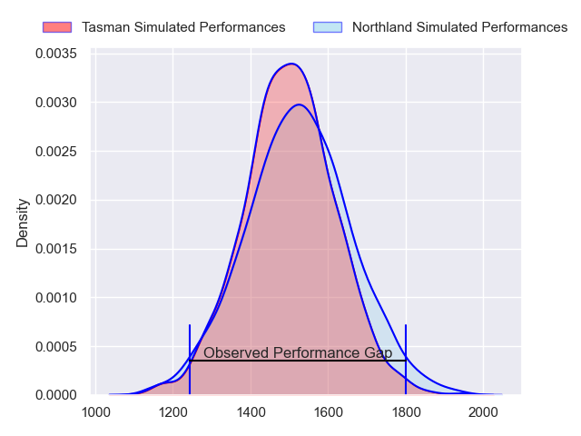
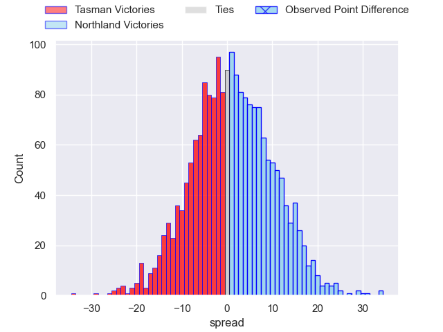
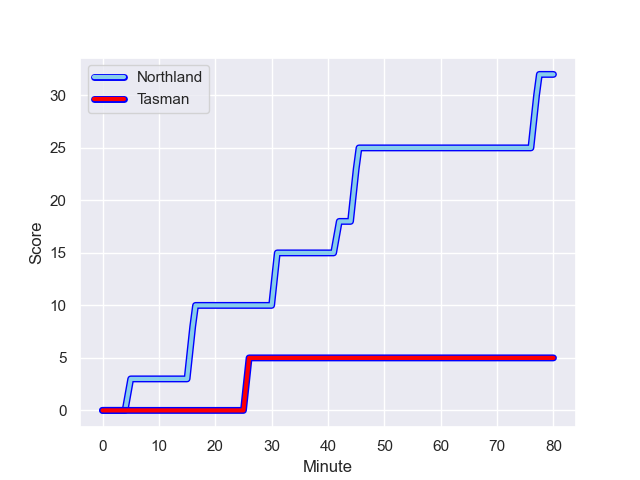
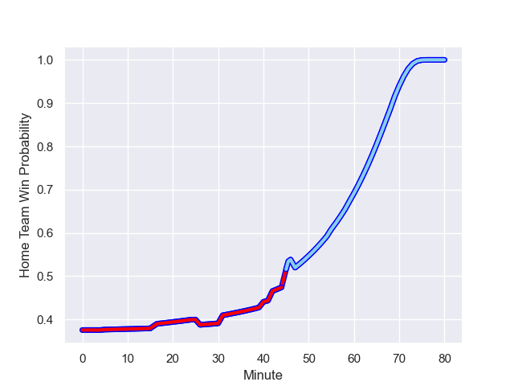

---  
layout: page  
title: Tasman at Northland; 5-32  
date: 2023-08-19 18:00:00 -0500  
categories: match review  
---
# Tasman at Northland; 5-32

# Club Level Predictions

The first set of predictions treats a club as the smallest object, as the club develops its members, organizes a gameplan, and deploys its players as needed for each match. This club model has a prediction of 0.536, which translates to predicting Northland to win by 1.3.

Each club has a rating and a rating deviation (simiar to a Glicko system), and expected performances can be generated. This allows for simulated matches and spreads like the ones below.
## Projected Performances

## Projected Spreads

## Projected Results

# Player Level Predictions - Version 1

Treating teams instead as an entity made up of the currently active players, I have ratings for each player in an altogether different system. These can be combined to form team ratings once teamsheets are announced, weighting starters a bit higher than the reserves. After the match is played, players can be weighted by their minutes on the field, allowing for an accurate measure of the team's composition. With these compiled team ratings, we can make predictions, measure inaccuracy, and update the individual player ratings.
## Prediction with Player Minutes: Tasman by 18.1

Tasman by 22.1 on a neutral field
## Prediction without Player Minutes: Tasman by 15.0

Tasman by 19.0 on a neutral pitch

## Scores over Time

## Win Probability over Time

There were 6 large changes in win probability in this match

|   Away Minutes | Away Player            |   Away elo |   Away Percentile |   Number |   Home Percentile |   Home elo | Home Player           |   Home Minutes |
|---------------:|:-----------------------|-----------:|------------------:|---------:|------------------:|-----------:|:----------------------|---------------:|
|             47 | Ryan Cameron Coxon     |      80.15 |       1.01721e+06 |        1 |       1.01664e+06 |      53.1  | Jarred Adams          |             55 |
|             47 | Quentin MacDonald      |      82.94 |       1.0172e+06  |        2 |       1.01763e+06 |      71.05 | Bruce Kauika-Peterson |             59 |
|             47 | Sam Matenga            |      62.08 |       1.01547e+06 |        3 |       1.01768e+06 |      71.33 | Remsy Lemisio         |             59 |
|             80 | Antonio Shalfoon       |      84.14 |       1.01802e+06 |        4 |       1.01762e+06 |      67.93 | Sam Weir Caird        |             80 |
|             80 | Quinten Strange        |      77.85 |  830058           |        5 |       1.01663e+06 |      55.38 | Liam Hallam-Eames     |             40 |
|             80 | Max Hicks              |      85.99 |  989569           |        6 |       1.01761e+06 |      73.12 | Rob Rush              |             80 |
|             80 | Anton Segner           |      70.31 |  986690           |        7 |       1.01761e+06 |      67.9  | Jonah Mau'u           |             80 |
|             69 | Tim Sail               |      88.84 |       1.01718e+06 |        8 |       1.01788e+06 |      70.69 | Sam McNamara          |             25 |
|             47 | Noah Hotham            |      87.56 |       1.0172e+06  |        9 |       1.01765e+06 |      70.84 | Lisati Milo-Harris    |             55 |
|             47 | Tim O'Malley           |      76.95 |       1.0172e+06  |       10 |       1.01768e+06 |      72.41 | Rivez Reihana         |             55 |
|             80 | Macca Springer         |      84.87 |       1.01719e+06 |       11 |       1.01769e+06 |      67.6  | Heremaia Murray       |             80 |
|             80 | Alex Nankivell         |     103.31 |  785228           |       12 |       1.01806e+06 |      67.54 | Blake Hohaia          |             80 |
|             80 | Levi Aumua             |     121.21 |  770266           |       13 |  827447           |      97.69 | Tamati Tua            |             40 |
|             80 | Timoci Tavatavanawai   |      83.18 |  986755           |       14 |       1.01763e+06 |      70.44 | Brady Rush            |             80 |
|             59 | Tomasi Alosio Logotuli |      86.84 |       1.01802e+06 |       15 |  945194           |      85.67 | Joshua Moorby         |             80 |
|             33 | Kershawl Sykes-Martin  |      97.54 |       1.00508e+06 |       16 |       1.01767e+06 |      68.51 | Matt Matich           |             55 |
|             33 | Luca Inch              |      80.9  |     nan           |       17 |  739072           |     102.69 | Jack Goodhue          |             40 |
|             33 | Taine Robinson         |      83.28 |       1.01722e+06 |       18 |     nan           |      68.13 | Hayden Jurlina        |             40 |
|             33 | Louie Chapman          |      87.94 |       1.01648e+06 |       19 |       1.01764e+06 |      63.82 | Daniel Hawkins        |             25 |
|             33 | Feleti Kaitu'u         |      84.82 |       1.01717e+06 |       20 |       1.01558e+06 |      72.47 | Rob Cobb              |             25 |
|             21 | Will Gualter           |      79.71 |     nan           |       21 |     nan           |      65.78 | Trent Hape            |             25 |
|             11 | Angus Fletcher         |      78.74 |     nan           |       22 |       1.01769e+06 |      70.15 | Matt Moulds           |             21 |
|            nan | nan                    |     nan    |     nan           |       23 |     nan           |      67.98 | Coree Te Whata-Colley |             21 |

# Player Level Predictions - Version 2

Treating teams instead as an entity made up of the currently active players, I have ratings for each player in an altogether different system. These can be combined to form team ratings once teamsheets are announced, weighting starters a bit higher than the reserves. After the match is played, players can be weighted by their minutes on the field, allowing for an accurate measure of the team's composition. With these compiled team ratings, we can make predictions, measure inaccuracy, and update the individual player ratings.
## Prediction with Player Minutes: Tasman by 1.3

Tasman by 4.6 on a neutral field
## Prediction without Player Minutes: Tasman by 1.1

Tasman by 4.4 on a neutral pitch

|   Away Minutes | Away Player            |   Away elo |   Away variance |   Number |   Home variance |   Home elo | Home Player           |   Home Minutes |
|---------------:|:-----------------------|-----------:|----------------:|---------:|----------------:|-----------:|:----------------------|---------------:|
|             47 | Ryan Cameron Coxon     |      46.65 |              50 |        1 |              50 |      46.65 | Jarred Adams          |             55 |
|             47 | Quentin MacDonald      |      46.65 |              50 |        2 |              50 |      46.65 | Bruce Kauika-Peterson |             59 |
|             47 | Sam Matenga            |      46.65 |              50 |        3 |              50 |      46.65 | Remsy Lemisio         |             59 |
|             80 | Antonio Shalfoon       |      46.65 |              50 |        4 |              50 |      46.65 | Sam Weir Caird        |             80 |
|             80 | Quinten Strange        |      77.92 |              50 |        5 |              50 |      46.65 | Liam Hallam-Eames     |             40 |
|             80 | Max Hicks              |      53.07 |              50 |        6 |              50 |      46.65 | Rob Rush              |             80 |
|             80 | Anton Segner           |      49.48 |              50 |        7 |              50 |      46.65 | Jonah Mau'u           |             80 |
|             69 | Tim Sail               |      46.65 |              50 |        8 |              50 |      46.65 | Sam McNamara          |             25 |
|             47 | Noah Hotham            |      46.65 |              50 |        9 |              50 |      46.65 | Lisati Milo-Harris    |             55 |
|             47 | Tim O'Malley           |      46.65 |              50 |       10 |              50 |      46.65 | Rivez Reihana         |             55 |
|             80 | Macca Springer         |      46.65 |              50 |       11 |              50 |      46.65 | Heremaia Murray       |             80 |
|             80 | Alex Nankivell         |     101.22 |              50 |       12 |              50 |      46.65 | Blake Hohaia          |             80 |
|             80 | Levi Aumua             |      78.16 |              50 |       13 |              50 |      52.03 | Tamati Tua            |             40 |
|             80 | Timoci Tavatavanawai   |      58.8  |              50 |       14 |              50 |      46.65 | Brady Rush            |             80 |
|             59 | Tomasi Alosio Logotuli |      46.65 |              50 |       15 |              50 |      45.64 | Joshua Moorby         |             80 |
|             33 | Kershawl Sykes-Martin  |      59.71 |              50 |       16 |              50 |      46.65 | Matt Matich           |             55 |
|             33 | Luca Inch              |      46.65 |              50 |       17 |              50 |     108.02 | Jack Goodhue          |             40 |
|             33 | Taine Robinson         |      46.65 |              50 |       18 |              50 |      46.65 | Hayden Jurlina        |             40 |
|             33 | Louie Chapman          |      46.65 |              50 |       19 |              50 |      46.65 | Daniel Hawkins        |             25 |
|             33 | Feleti Kaitu'u         |      46.65 |              50 |       20 |              50 |      46.65 | Rob Cobb              |             25 |
|             21 | Will Gualter           |      46.65 |              50 |       21 |              50 |      46.65 | Trent Hape            |             25 |
|             11 | Angus Fletcher         |      46.65 |              50 |       22 |              50 |      46.65 | Matt Moulds           |             21 |
|            nan | nan                    |     nan    |             nan |       23 |              50 |      46.65 | Coree Te Whata-Colley |             21 |

