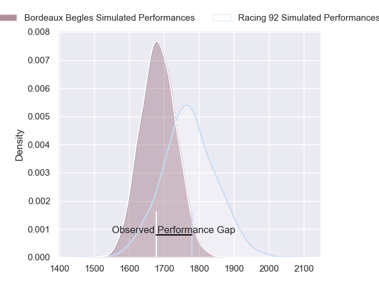
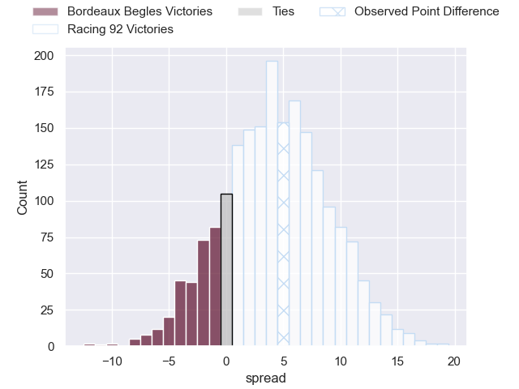
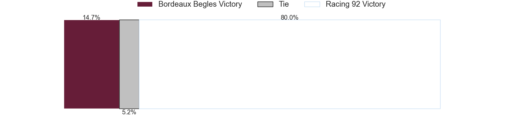
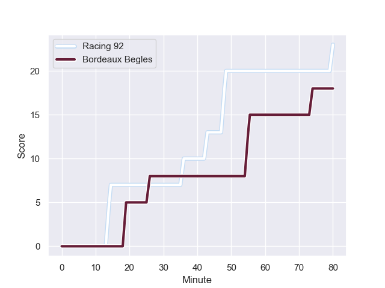
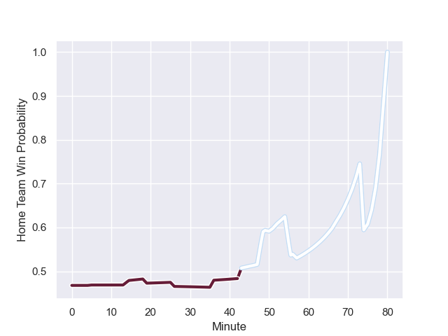

---  
layout: page  
title: Bordeaux Begles at Racing 92; 18-23  
date: 2023-08-19 18:00:00 -0500  
categories: match review  
---
# Bordeaux Begles at Racing 92; 18-23

# Club Level Predictions

The first set of predictions treats a club as the smallest object, as the club develops its members, organizes a gameplan, and deploys its players as needed for each match. This club model has a prediction of 0.623, which translates to predicting Racing 92 to win by 4.4.

Each club has a rating and a rating deviation (simiar to a Glicko system), and expected performances can be generated. This allows for simulated matches and spreads like the ones below.
## Projected Performances

## Projected Spreads

## Projected Results

# Player Level Predictions - Version 1

Treating teams instead as an entity made up of the currently active players, I have ratings for each player in an altogether different system. These can be combined to form team ratings once teamsheets are announced, weighting starters a bit higher than the reserves. After the match is played, players can be weighted by their minutes on the field, allowing for an accurate measure of the team's composition. With these compiled team ratings, we can make predictions, measure inaccuracy, and update the individual player ratings.
## Prediction with Player Minutes: Bordeaux Begles by 1.6

Bordeaux Begles by 5.6 on a neutral field
## Prediction without Player Minutes: Bordeaux Begles by 1.1

Bordeaux Begles by 5.1 on a neutral pitch

## Scores over Time

## Win Probability over Time

There were 11 large changes in win probability in this match

|   Away Minutes | Away Player               |   Away elo |   Away Percentile |   Number |   Home Percentile |   Home elo | Home Player         |   Home Minutes |
|---------------:|:--------------------------|-----------:|------------------:|---------:|------------------:|-----------:|:--------------------|---------------:|
|              5 | Jefferson Poirot          |      91.19 |       1.01621e+06 |        1 |       1.01168e+06 |      84.93 | Thomas Moukoro      |             50 |
|             57 | Maxime Lamothe            |      88.02 |       1.01626e+06 |        2 |       1.01584e+06 |      83.76 | Camille Chat        |             50 |
|             57 | Carlu Johann Sadie        |      71.49 |       1.01682e+06 |        3 |       1.01583e+06 |      80.42 | Cedate Gomes Sa     |             57 |
|             57 | Thomas Jolmes             |      85.91 |       1.01627e+06 |        4 |       1.01673e+06 |      77.53 | Baptiste Chouzenoux |             80 |
|             80 | Kane Douglas              |      89.91 |       1.01623e+06 |        5 |       1.01584e+06 |      83.29 | Boris Palu          |             80 |
|             80 | Mahamadou Diaby           |      89.29 |       1.01624e+06 |        6 |       1.01577e+06 |      95.45 | Wenceslas Lauret    |             80 |
|             46 | Bastien Vergnes Taillefer |      97.01 |       1.01617e+06 |        7 |       1.01831e+06 |      78.73 | Maxime Baudonne     |             80 |
|             46 | Marko Gazzotti            |      77.94 |       1.00912e+06 |        8 |       1.01831e+06 |      78.55 | Jordan Joseph       |             52 |
|             75 | Paul Abadie               |      64.26 |       1.01611e+06 |        9 |       1.01579e+06 |      83.84 | Nolann Le Garrec    |             76 |
|             80 | Zack Holmes               |      88.25 |       1.01623e+06 |       10 |       1.01573e+06 |      80.45 | Tristan Tedder      |             80 |
|             80 | Madosh Tambwe             |      97.94 |       1.01618e+06 |       11 |  898121           |      83.89 | Wame Naituvi        |              5 |
|             80 | Ben Tapuai                |      83.85 |       1.01831e+06 |       12 |       1.01652e+06 |      83.79 | Henry Chavancy      |             80 |
|             80 | Nicolas Depoortere        |     103.49 |       1.01101e+06 |       13 |       1.01579e+06 |      86.91 | Olivier Klemenczak  |             57 |
|             71 | Pablo Uberti              |      82.48 |       1.01832e+06 |       14 |       1.01583e+06 |      84.17 | Donovan Taofifenua  |             80 |
|             80 | Romain Buros              |      82.68 |       1.01832e+06 |       15 |       1.01653e+06 |      80.87 | Max Spring          |             67 |
|             75 | Ugo Boniface              |      90.69 |     nan           |       16 |       1.01582e+06 |      84.71 | Fabien Sanconnie    |             75 |
|             34 | Raphaël Lakafia           |      92.66 |     nan           |       17 |  924042           |      73.42 | Janick Tarrit       |             30 |
|             34 | Antoine Miquel            |      82.89 |     nan           |       18 |       1.01582e+06 |      82.46 | Eddy Ben Arous      |             30 |
|             23 | Christopher Vaotoa        |      95.86 |  871900           |       19 |       1.01652e+06 |      82.56 | Ibrahim Diallo      |             28 |
|             23 | Adam Coleman              |      83.11 |     nan           |       20 |       1.01581e+06 |      85.7  | Francis Saili       |             23 |
|             23 | Clément Maynadier         |      83.34 |     nan           |       21 |     nan           |      78.92 | Will Griff John     |             23 |
|              9 | Nans Ducuing              |      83.58 |     nan           |       22 |       1.01584e+06 |      84.22 | Antoine Gibert      |             13 |
|              5 | Théo Nanette              |      82.3  |     nan           |       23 |     nan           |      79.12 | James Hall          |              4 |

# Player Level Predictions - Version 2

Treating teams instead as an entity made up of the currently active players, I have ratings for each player in an altogether different system. These can be combined to form team ratings once teamsheets are announced, weighting starters a bit higher than the reserves. After the match is played, players can be weighted by their minutes on the field, allowing for an accurate measure of the team's composition. With these compiled team ratings, we can make predictions, measure inaccuracy, and update the individual player ratings.
## Prediction with Player Minutes: Racing 92 by 4.0

Bordeaux Begles by 0.7 on a neutral field
## Prediction without Player Minutes: Racing 92 by 3.7

Bordeaux Begles by 1.0 on a neutral pitch

|   Away Minutes | Away Player               |   Away elo |   Away variance |   Number |   Home variance |   Home elo | Home Player         |   Home Minutes |
|---------------:|:--------------------------|-----------:|----------------:|---------:|----------------:|-----------:|:--------------------|---------------:|
|              5 | Jefferson Poirot          |      46.65 |              50 |        1 |              50 |      39.33 | Thomas Moukoro      |             50 |
|             57 | Maxime Lamothe            |      46.65 |              50 |        2 |              50 |      46.65 | Camille Chat        |             50 |
|             57 | Carlu Johann Sadie        |      46.65 |              50 |        3 |              50 |      46.65 | Cedate Gomes Sa     |             57 |
|             57 | Thomas Jolmes             |      46.65 |              50 |        4 |              50 |      46.65 | Baptiste Chouzenoux |             80 |
|             80 | Kane Douglas              |      46.65 |              50 |        5 |              50 |      46.65 | Boris Palu          |             80 |
|             80 | Mahamadou Diaby           |      46.65 |              50 |        6 |              50 |      46.65 | Wenceslas Lauret    |             80 |
|             46 | Bastien Vergnes Taillefer |      46.65 |              50 |        7 |              50 |      46.65 | Maxime Baudonne     |             80 |
|             46 | Marko Gazzotti            |      51.33 |              50 |        8 |              50 |      46.65 | Jordan Joseph       |             52 |
|             75 | Paul Abadie               |      46.65 |              50 |        9 |              50 |      46.65 | Nolann Le Garrec    |             76 |
|             80 | Zack Holmes               |      46.65 |              50 |       10 |              50 |      46.65 | Tristan Tedder      |             80 |
|             80 | Madosh Tambwe             |      46.65 |              50 |       11 |              50 |      39.88 | Wame Naituvi        |              5 |
|             80 | Ben Tapuai                |      46.65 |              50 |       12 |              50 |      46.65 | Henry Chavancy      |             80 |
|             80 | Nicolas Depoortere        |      55.2  |              50 |       13 |              50 |      46.65 | Olivier Klemenczak  |             57 |
|             71 | Pablo Uberti              |      46.65 |              50 |       14 |              50 |      46.65 | Donovan Taofifenua  |             80 |
|             80 | Romain Buros              |      46.65 |              50 |       15 |              50 |      46.65 | Max Spring          |             67 |
|             75 | Ugo Boniface              |      46.65 |              50 |       16 |              50 |      46.65 | Fabien Sanconnie    |             75 |
|             34 | Raphaël Lakafia           |      46.65 |              50 |       17 |              50 |      41.53 | Janick Tarrit       |             30 |
|             34 | Antoine Miquel            |      46.65 |              50 |       18 |              50 |      46.65 | Eddy Ben Arous      |             30 |
|             23 | Christopher Vaotoa        |      43.64 |              50 |       19 |              50 |      46.65 | Ibrahim Diallo      |             28 |
|             23 | Adam Coleman              |      46.65 |              50 |       20 |              50 |      46.65 | Francis Saili       |             23 |
|             23 | Clément Maynadier         |      46.65 |              50 |       21 |              50 |      46.65 | Will Griff John     |             23 |
|              9 | Nans Ducuing              |      46.65 |              50 |       22 |              50 |      46.65 | Antoine Gibert      |             13 |
|              5 | Théo Nanette              |      46.65 |              50 |       23 |              50 |      46.65 | James Hall          |              4 |

