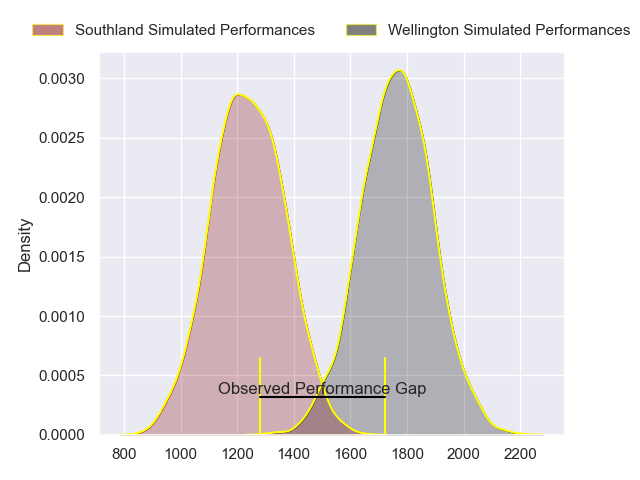
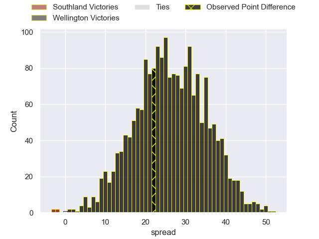
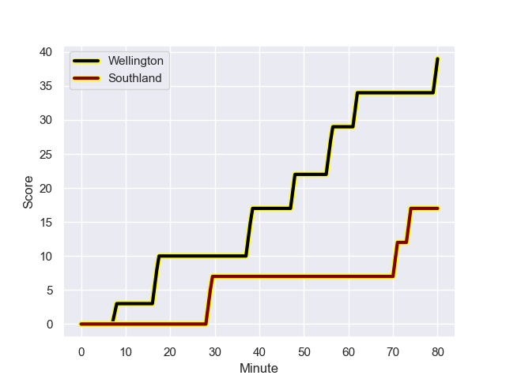
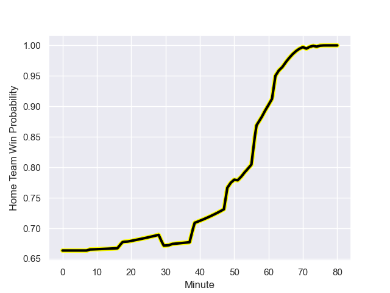

---  
layout: page  
title: Southland at Wellington; 17-39  
date: 2023-08-19 18:00:00 -0500  
categories: match review  
---
# Southland at Wellington; 17-39

# Club Level Predictions

The first set of predictions treats a club as the smallest object, as the club develops its members, organizes a gameplan, and deploys its players as needed for each match. This club model has a prediction of 0.943, which translates to predicting Wellington to win by 26.3.

Each club has a rating and a rating deviation (simiar to a Glicko system), and expected performances can be generated. This allows for simulated matches and spreads like the ones below.
## Projected Performances

## Projected Spreads

## Projected Results

# Player Level Predictions - Version 1

Treating teams instead as an entity made up of the currently active players, I have ratings for each player in an altogether different system. These can be combined to form team ratings once teamsheets are announced, weighting starters a bit higher than the reserves. After the match is played, players can be weighted by their minutes on the field, allowing for an accurate measure of the team's composition. With these compiled team ratings, we can make predictions, measure inaccuracy, and update the individual player ratings.
## Prediction with Player Minutes: Wellington by 33.5

Wellington by 29.5 on a neutral field
## Prediction without Player Minutes: Wellington by 34.4

Wellington by 30.4 on a neutral pitch

## Scores over Time

## Win Probability over Time

There were 3 large changes in win probability in this match

|   Away Minutes | Away Player           |   Away elo |   Away Percentile |   Number |   Home Percentile |   Home elo | Home Player                   |   Home Minutes |
|---------------:|:----------------------|-----------:|------------------:|---------:|------------------:|-----------:|:------------------------------|---------------:|
|             57 | Joe Walsh             |      67.33 |       1.01784e+06 |        1 |       1.01754e+06 |      90.87 | Cameron Orr                   |             57 |
|             59 | Jack Taylor           |      66.13 |       1.01786e+06 |        2 |       1.01801e+06 |      84.97 | James O'Reilly                |             57 |
|             51 | Morgan Mitchell       |      55.8  |       1.01667e+06 |        3 |       1.01757e+06 |      85.24 | PJ Sheck                      |             57 |
|             80 | Shneil Singh          |      94.74 |  918156           |        4 |  985983           |      93.32 | Caleb Delany                  |             80 |
|             80 | Josh Bekhuis          |      66.73 |       1.01784e+06 |        5 |       1.01756e+06 |      88.61 | Akira Ieremia                 |             57 |
|             80 | Blair Ryall           |      66.2  |       1.01784e+06 |        6 |       1.01754e+06 |      91.58 | Dominic Ropeti                |             80 |
|             80 | Leroy Ferguson        |      75.62 |       1.01778e+06 |        7 |  635107           |     110.75 | Ardie Savea                   |             63 |
|             19 | Dylan Nel             |      67.59 |       1.01785e+06 |        8 |       1.01757e+06 |      83.27 | Keelan Whitman                |             80 |
|             53 | Jay Renton            |      66.83 |       1.01787e+06 |        9 |       1.01759e+06 |      87.64 | Kyle Preston                  |             57 |
|             53 | Greg Dyer             |      70.35 |       1.01787e+06 |       10 |       1.0176e+06  |      84.92 | Ruben Love                    |             63 |
|             80 | Gabriel Hamer-Webb    |      65.37 |       1.01806e+06 |       11 |       1.01758e+06 |      88.16 | Pepesana Patafilo             |             80 |
|             80 | Matt Whaanga          |      69.4  |  915300           |       12 |       1.01801e+06 |      83.81 | Riley Higgins                 |             80 |
|             80 | Noah Foster           |      66.59 |       1.0178e+06  |       13 |  890695           |     109.64 | Billy Proctor                 |             64 |
|             49 | Viliami Fine          |      73.38 |       1.01781e+06 |       14 |       1.018e+06   |      83.54 | Connor Garden-Bachop          |             80 |
|             80 | Rory van Vugt         |      74.69 |       1.01783e+06 |       15 |       1.0176e+06  |      84.89 | Tjay Clarke                   |             80 |
|             23 | Jonah Aoina           |      68.77 |     nan           |       16 |  916755           |      97.46 | Xavier Numia                  |             23 |
|             29 | Quinn Harrison-Jones  |      71.25 |     nan           |       17 |       1.01755e+06 |      84.68 | Josh Southall                 |             23 |
|             21 | Ben Strang            |      61.73 |       1.01233e+06 |       18 |     nan           |      84.96 | Josiah Tavita-Metcalfe        |             23 |
|             13 | Semisi Tupou Ta’eiloa |      68.85 |     nan           |       19 |       1.018e+06   |      85.77 | Peter Lakai                   |             17 |
|             48 | Grayson Knapp         |      65.69 |     nan           |       20 |     nan           |      84.76 | Teofilo Paulo                 |             23 |
|             27 | Kaisei Tamura         |      68.8  |     nan           |       21 |       1.01756e+06 |      87.23 | Kemara Henare Hauiti-Parapara |             23 |
|             27 | Dan Hollinshead       |      65.84 |     nan           |       22 |       1.01486e+06 |      87.18 | Aidan Morgan                  |             17 |
|             31 | Tevita Latu           |      65.54 |     nan           |       23 |       1.01758e+06 |      84.42 | Losilosivale Filipo           |             16 |

# Player Level Predictions - Version 2

Treating teams instead as an entity made up of the currently active players, I have ratings for each player in an altogether different system. These can be combined to form team ratings once teamsheets are announced, weighting starters a bit higher than the reserves. After the match is played, players can be weighted by their minutes on the field, allowing for an accurate measure of the team's composition. With these compiled team ratings, we can make predictions, measure inaccuracy, and update the individual player ratings.
## Prediction with Player Minutes: Wellington by 7.5

Wellington by 4.1 on a neutral field
## Prediction without Player Minutes: Wellington by 7.8

Wellington by 4.4 on a neutral pitch

|   Away Minutes | Away Player           |   Away elo |   Away variance |   Number |   Home variance |   Home elo | Home Player                   |   Home Minutes |
|---------------:|:----------------------|-----------:|----------------:|---------:|----------------:|-----------:|:------------------------------|---------------:|
|             57 | Joe Walsh             |      46.65 |              50 |        1 |           50    |      46.65 | Cameron Orr                   |             57 |
|             59 | Jack Taylor           |      46.65 |              50 |        2 |           50    |      46.65 | James O'Reilly                |             57 |
|             51 | Morgan Mitchell       |      46.65 |              50 |        3 |           50    |      46.65 | PJ Sheck                      |             57 |
|             80 | Shneil Singh          |      67.42 |              50 |        4 |           50    |      56.11 | Caleb Delany                  |             80 |
|             80 | Josh Bekhuis          |      46.65 |              50 |        5 |           50    |      46.65 | Akira Ieremia                 |             57 |
|             80 | Blair Ryall           |      46.65 |              50 |        6 |           50    |      46.65 | Dominic Ropeti                |             80 |
|             80 | Leroy Ferguson        |      46.65 |              50 |        7 |           47.68 |     124.27 | Ardie Savea                   |             63 |
|             19 | Dylan Nel             |      46.65 |              50 |        8 |           50    |      46.65 | Keelan Whitman                |             80 |
|             53 | Jay Renton            |      46.65 |              50 |        9 |           50    |      46.65 | Kyle Preston                  |             57 |
|             53 | Greg Dyer             |      46.65 |              50 |       10 |           50    |      46.65 | Ruben Love                    |             63 |
|             80 | Gabriel Hamer-Webb    |      46.65 |              50 |       11 |           50    |      46.65 | Pepesana Patafilo             |             80 |
|             80 | Matt Whaanga          |      34.11 |              50 |       12 |           50    |      46.65 | Riley Higgins                 |             80 |
|             80 | Noah Foster           |      46.65 |              50 |       13 |           50    |      81.11 | Billy Proctor                 |             64 |
|             49 | Viliami Fine          |      46.65 |              50 |       14 |           50    |      46.65 | Connor Garden-Bachop          |             80 |
|             80 | Rory van Vugt         |      46.65 |              50 |       15 |           50    |      46.65 | Tjay Clarke                   |             80 |
|             23 | Jonah Aoina           |      46.65 |              50 |       16 |           50    |      78.87 | Xavier Numia                  |             23 |
|             29 | Quinn Harrison-Jones  |      46.65 |              50 |       17 |           50    |      46.65 | Josh Southall                 |             23 |
|             21 | Ben Strang            |      46.23 |              50 |       18 |           50    |      46.65 | Josiah Tavita-Metcalfe        |             23 |
|             13 | Semisi Tupou Ta’eiloa |      46.65 |              50 |       19 |           50    |      46.65 | Peter Lakai                   |             17 |
|             48 | Grayson Knapp         |      46.65 |              50 |       20 |           50    |      46.65 | Teofilo Paulo                 |             23 |
|             27 | Kaisei Tamura         |      46.65 |              50 |       21 |           50    |      46.65 | Kemara Henare Hauiti-Parapara |             23 |
|             27 | Dan Hollinshead       |      46.65 |              50 |       22 |           50    |      46.65 | Aidan Morgan                  |             17 |
|             31 | Tevita Latu           |      46.65 |              50 |       23 |           50    |      46.65 | Losilosivale Filipo           |             16 |

