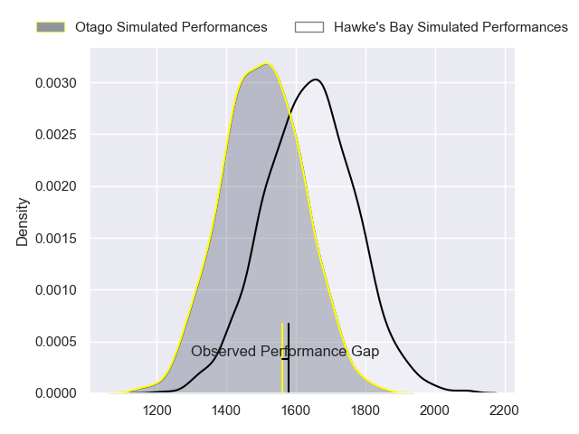
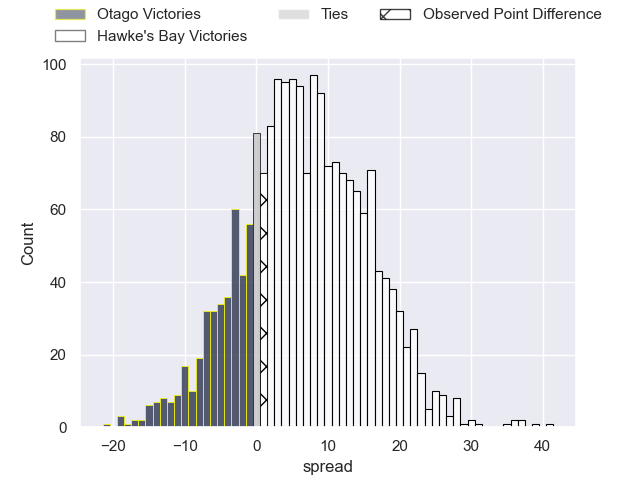
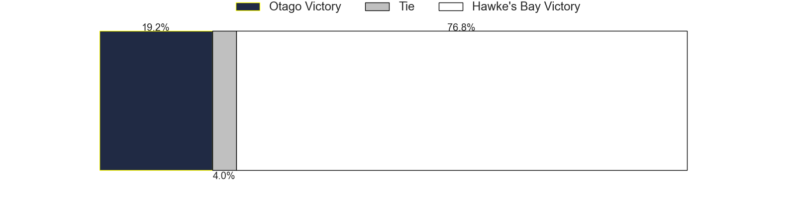
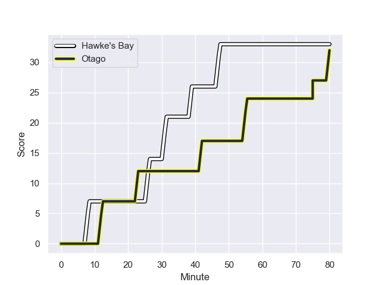
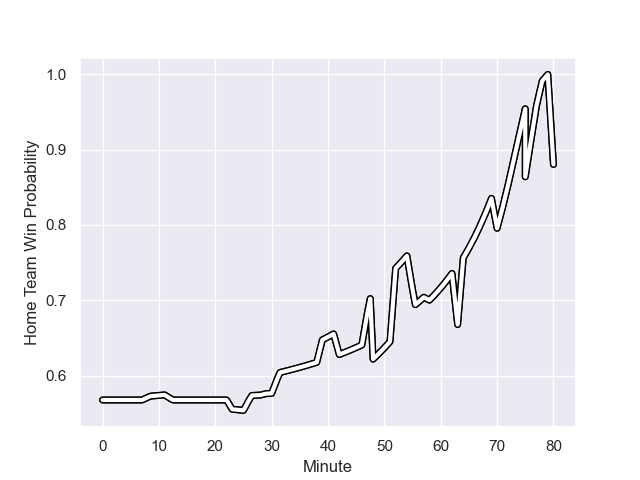

---  
layout: page  
title: Otago at Hawke's Bay; 32-33  
date: 2023-08-20 18:00:00 -0500  
categories: match review  
---
# Otago at Hawke's Bay; 32-33

# Club Level Predictions

The first set of predictions treats a club as the smallest object, as the club develops its members, organizes a gameplan, and deploys its players as needed for each match. This club model has a prediction of 0.677, which translates to predicting Hawke's Bay to win by 6.9.

Each club has a rating and a rating deviation (simiar to a Glicko system), and expected performances can be generated. This allows for simulated matches and spreads like the ones below.
## Projected Performances

## Projected Spreads

## Projected Results

# Player Level Predictions - Version 1

Treating teams instead as an entity made up of the currently active players, I have ratings for each player in an altogether different system. These can be combined to form team ratings once teamsheets are announced, weighting starters a bit higher than the reserves. After the match is played, players can be weighted by their minutes on the field, allowing for an accurate measure of the team's composition. With these compiled team ratings, we can make predictions, measure inaccuracy, and update the individual player ratings.
## Prediction with Player Minutes: Hawke's Bay by 15.8

Hawke's Bay by 11.8 on a neutral field
## Prediction without Player Minutes: Hawke's Bay by 12.4

Hawke's Bay by 8.4 on a neutral pitch

## Scores over Time

## Win Probability over Time

There were 19 large changes in win probability in this match

|   Away Minutes | Away Player                |   Away elo |   Away Percentile |   Number |   Home Percentile |   Home elo | Home Player                |   Home Minutes |
|---------------:|:---------------------------|-----------:|------------------:|---------:|------------------:|-----------:|:---------------------------|---------------:|
|             64 | Rohan Wingham              |      70.29 |       1.01734e+06 |        1 |       1.01856e+06 |      73.41 | Isileli Tu'ungafasi        |             48 |
|             64 | Henry Bell                 |      65.8  |       1.01562e+06 |        2 |  988009           |      87.79 | Tyrone Thompson            |             80 |
|             52 | Saula Ma'u                 |      70.81 |       1.01734e+06 |        3 |       1.01653e+06 |      83.68 | Joe Apikotoa               |             63 |
|             57 | Josh Dickson               |      67.62 |       1.01737e+06 |        4 |       1.01822e+06 |      74.45 | Geoffrey Cridge            |             64 |
|             80 | Will Tucker                |      66.76 |       1.01735e+06 |        5 |       1.01755e+06 |      75.33 | Tom Parsons                |             80 |
|             80 | Sean Withy                 |      69.98 |       1.01733e+06 |        6 |       1.01822e+06 |      74.2  | Josh Gimblett              |             80 |
|             58 | Tom Sanders                |      67.58 |       1.01856e+06 |        7 |       1.01764e+06 |      78.29 | Sam Smith                  |             70 |
|             80 | Christian Lio-Willie       |      85.34 |  986445           |        8 |  915829           |      81.69 | Devan Flanders             |             80 |
|             80 | Kieran McClea              |      59.55 |       1.01358e+06 |        9 |       1.01756e+06 |      76.62 | Folau Fakatava             |             74 |
|             29 | Cameron Millar             |      70.18 |       1.01813e+06 |       10 |       1.0176e+06  |      77.39 | Lincoln McClutchie         |             80 |
|             17 | Jona Nareki                |      83.14 |       1.01636e+06 |       11 |       1.01807e+06 |      76.05 | Anzelo Tuitavuki           |             52 |
|             80 | Jack Leslie                |      70.3  |       1.01813e+06 |       12 |       1.01657e+06 |      74.3  | Chase Tiatia               |             80 |
|             80 | Thomas Carlos Umaga-Jensen |      70.16 |       1.01732e+06 |       13 |  944802           |      85.36 | Ollie Sapsford             |             80 |
|             80 | Josh Whaanga               |      65.95 |       1.01737e+06 |       14 |       1.01648e+06 |      81.88 | Paul Balekana              |             80 |
|             52 | Sam Gilbert                |      83.74 |       1.01635e+06 |       15 |       1.01759e+06 |      75.07 | Harry Godfrey              |             48 |
|             16 | Ben Lopas                  |      72.14 |     nan           |       16 |       1.01537e+06 |      70.19 | Kianu Kereru-Symes         |             32 |
|             28 | Jermaine Ainsley           |      86.05 |       1.01636e+06 |       17 |       1.01761e+06 |      75.2  | Pouri Gordon Rakete-Stones |             17 |
|             16 | Ricky Jackson              |      71.97 |     nan           |       18 |     nan           |      77.37 | Hunter Morrison            |             16 |
|             22 | Sam Fischli                |      62.4  |       1.01702e+06 |       19 |     nan           |      72.39 | Patrick Tuifua             |             10 |
|             23 | Fabian Holland             |      69.3  |       1.01738e+06 |       20 |     nan           |      73.58 | Sam Wye                    |              6 |
|             51 | Finn Hurley                |      67.82 |       1.01736e+06 |       21 |       1.01761e+06 |      79.89 | Nicholas Grigg             |             28 |
|             63 | Jeremiah Asi               |      67.73 |     nan           |       22 |       1.01559e+06 |      71.98 | Caleb Makene               |             32 |
|             28 | Nathan Hastie              |      67.89 |     nan           |       23 |     nan           |     nan    | nan                        |            nan |

# Player Level Predictions - Version 2

Treating teams instead as an entity made up of the currently active players, I have ratings for each player in an altogether different system. These can be combined to form team ratings once teamsheets are announced, weighting starters a bit higher than the reserves. After the match is played, players can be weighted by their minutes on the field, allowing for an accurate measure of the team's composition. With these compiled team ratings, we can make predictions, measure inaccuracy, and update the individual player ratings.
## Prediction with Player Minutes: Hawke's Bay by 2.8

Otago by 0.6 on a neutral field
## Prediction without Player Minutes: Hawke's Bay by 2.8

Otago by 0.5 on a neutral pitch

|   Away Minutes | Away Player                |   Away elo |   Away variance |   Number |   Home variance |   Home elo | Home Player                |   Home Minutes |
|---------------:|:---------------------------|-----------:|----------------:|---------:|----------------:|-----------:|:---------------------------|---------------:|
|             64 | Rohan Wingham              |      46.65 |              50 |        1 |              50 |      46.65 | Isileli Tu'ungafasi        |             48 |
|             64 | Henry Bell                 |      46.65 |              50 |        2 |              50 |      42.66 | Tyrone Thompson            |             80 |
|             52 | Saula Ma'u                 |      46.65 |              50 |        3 |              50 |      46.65 | Joe Apikotoa               |             63 |
|             57 | Josh Dickson               |      46.65 |              50 |        4 |              50 |      46.65 | Geoffrey Cridge            |             64 |
|             80 | Will Tucker                |      46.65 |              50 |        5 |              50 |      46.65 | Tom Parsons                |             80 |
|             80 | Sean Withy                 |      46.65 |              50 |        6 |              50 |      46.65 | Josh Gimblett              |             80 |
|             58 | Tom Sanders                |      46.65 |              50 |        7 |              50 |      46.65 | Sam Smith                  |             70 |
|             80 | Christian Lio-Willie       |      66.99 |              50 |        8 |              50 |      59.92 | Devan Flanders             |             80 |
|             80 | Kieran McClea              |      54.33 |              50 |        9 |              50 |      46.65 | Folau Fakatava             |             74 |
|             29 | Cameron Millar             |      46.65 |              50 |       10 |              50 |      46.65 | Lincoln McClutchie         |             80 |
|             17 | Jona Nareki                |      46.65 |              50 |       11 |              50 |      46.65 | Anzelo Tuitavuki           |             52 |
|             80 | Jack Leslie                |      46.65 |              50 |       12 |              50 |      46.65 | Chase Tiatia               |             80 |
|             80 | Thomas Carlos Umaga-Jensen |      46.65 |              50 |       13 |              50 |      51.82 | Ollie Sapsford             |             80 |
|             80 | Josh Whaanga               |      46.65 |              50 |       14 |              50 |      46.65 | Paul Balekana              |             80 |
|             52 | Sam Gilbert                |      46.65 |              50 |       15 |              50 |      46.65 | Harry Godfrey              |             48 |
|             16 | Ben Lopas                  |      46.65 |              50 |       16 |              50 |      46.65 | Kianu Kereru-Symes         |             32 |
|             28 | Jermaine Ainsley           |      46.65 |              50 |       17 |              50 |      46.65 | Pouri Gordon Rakete-Stones |             17 |
|             16 | Ricky Jackson              |      46.65 |              50 |       18 |              50 |      46.65 | Hunter Morrison            |             16 |
|             22 | Sam Fischli                |      46.65 |              50 |       19 |              50 |      46.65 | Patrick Tuifua             |             10 |
|             23 | Fabian Holland             |      46.65 |              50 |       20 |              50 |      46.65 | Sam Wye                    |              6 |
|             51 | Finn Hurley                |      46.65 |              50 |       21 |              50 |      46.65 | Nicholas Grigg             |             28 |
|             63 | Jeremiah Asi               |      46.65 |              50 |       22 |              50 |      46.65 | Caleb Makene               |             32 |
|             28 | Nathan Hastie              |      46.65 |              50 |       23 |             nan |     nan    | nan                        |            nan |

