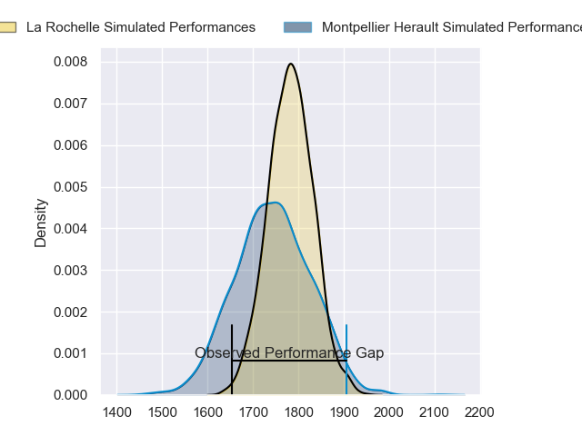
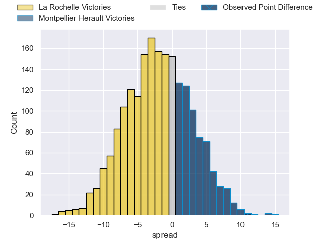
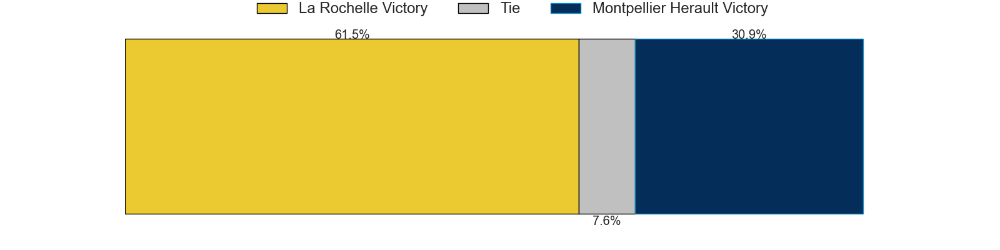
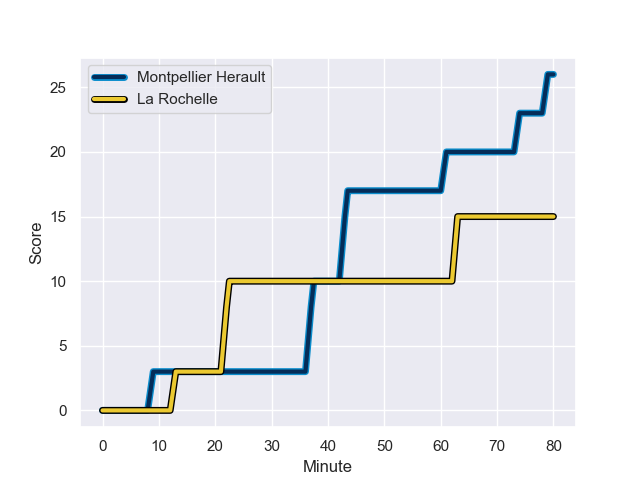
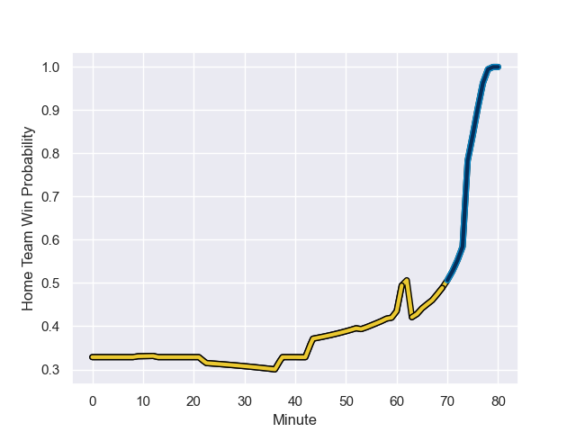

---  
layout: page  
title: La Rochelle at Montpellier Herault; 15-26  
date: 2023-08-20 18:00:00 -0500  
categories: match review  
---
# La Rochelle at Montpellier Herault; 15-26

# Club Level Predictions

The first set of predictions treats a club as the smallest object, as the club develops its members, organizes a gameplan, and deploys its players as needed for each match. This club model has a prediction of 0.446, which translates to predicting La Rochelle to win by 1.9.

Each club has a rating and a rating deviation (simiar to a Glicko system), and expected performances can be generated. This allows for simulated matches and spreads like the ones below.
## Projected Performances

## Projected Spreads

## Projected Results

# Player Level Predictions - Version 1

Treating teams instead as an entity made up of the currently active players, I have ratings for each player in an altogether different system. These can be combined to form team ratings once teamsheets are announced, weighting starters a bit higher than the reserves. After the match is played, players can be weighted by their minutes on the field, allowing for an accurate measure of the team's composition. With these compiled team ratings, we can make predictions, measure inaccuracy, and update the individual player ratings.
## Prediction with Player Minutes: La Rochelle by 27.0

La Rochelle by 31.0 on a neutral field
## Prediction without Player Minutes: La Rochelle by 26.1

La Rochelle by 30.1 on a neutral pitch

## Scores over Time

## Win Probability over Time

There were 10 large changes in win probability in this match

|   Away Minutes | Away Player               |   Away elo |   Away Percentile |   Number |   Home Percentile |   Home elo | Home Player                         |   Home Minutes |
|---------------:|:--------------------------|-----------:|------------------:|---------:|------------------:|-----------:|:------------------------------------|---------------:|
|             57 | Thierry Paiva             |      83.96 |       1.01584e+06 |        1 |       1.01858e+06 |      66.59 | Enzo Forletta                       |             53 |
|             68 | Quentin Lespiaucq-Brettes |      93.81 |       1.01694e+06 |        2 |       1.01857e+06 |      67.99 | Silalotu Latu                       |             41 |
|             53 | Aleksandre Kuntelia       |      81.36 |       1.01002e+06 |        3 |       1.01857e+06 |      66.93 | George (Karl) Tu'inukuafe           |             41 |
|             80 | Thomas Lavault            |      93.36 |       1.01695e+06 |        4 |       1.01857e+06 |      67.75 | Elliott Stooke                      |             80 |
|             74 | Rémi Picquette            |      78.47 |       1.01586e+06 |        5 |       1.01599e+06 |      71.68 | Tyler Evan Duguid                   |             65 |
|             80 | Ultan Dillane             |      89.63 |       1.01696e+06 |        6 |       1.01858e+06 |      66.75 | Nicolaas Jacobus Janse van Rensburg |             80 |
|             59 | Oscar Jegou               |      85.42 |       1.01582e+06 |        7 |       1.01601e+06 |      69.37 | Alexandre Bécognée                  |             80 |
|             80 | Judicael Cancoriet        |      82.53 |       1.01577e+06 |        8 |       1.01858e+06 |      66.28 | Marco Tauleigne                     |             67 |
|             60 | Tawera Kerr-Barlow        |     100.48 |       1.01695e+06 |        9 |  944861           |      48.48 | Léo Coly                            |             79 |
|             80 | Ihaia West                |      98.53 |       1.01618e+06 |       10 |       1.016e+06   |      74.96 | Louis Carbonel                      |             77 |
|             60 | Hoani Bosmorin            |      87.27 |       1.01486e+06 |       11 |       1.01857e+06 |      67.12 | George Bridge                       |             80 |
|             80 | Jules Favre               |      81.8  |       1.01587e+06 |       12 |       1.01857e+06 |      67.31 | Jan Lodewyk Serfontein              |             80 |
|             80 | Jack Nowell               |      84.32 |       1.01857e+06 |       13 |       1.01598e+06 |      75.43 | Thomas Darmon                       |             80 |
|             80 | Teddy Thomas              |      84.73 |       1.01857e+06 |       14 |       1.01602e+06 |      68.48 | Gabriel Ngandebe                    |             55 |
|             74 | Dillyn Leyds              |     102.15 |       1.01694e+06 |       15 |       1.016e+06   |      71.26 | Julien Tisseron                     |             80 |
|             27 | Georges-Henri Colombe     |      92.85 |     nan           |       16 |     nan           |      68.26 | Vano Karkadze                       |             39 |
|             23 | Karl Sorin                |      84.52 |     nan           |       17 |     nan           |      66.43 | D'Arcy Rae                          |             39 |
|             21 | Noé Della Schiava         |      92.7  |     nan           |       18 |     nan           |      67.53 | Baptiste Erdocio                    |             27 |
|             20 | Teddy Iribaren            |      88.85 |       1.01575e+06 |       19 |  904937           |      68.84 | Clément Doumenc                     |             25 |
|             20 | Nathan Bollengier         |      84.13 |     nan           |       20 |     nan           |      80.16 | Pierre Lucas                        |             15 |
|             12 | Sacha Idoumi              |      91.38 |     nan           |       21 |       1.00946e+06 |      63.34 | Lenni Nouchi                        |             13 |
|              6 | Thomas Berjon             |      89.28 |     nan           |       22 |     nan           |      79.51 | Louis Foursans-Bourdette            |              3 |
|              6 | Thomas Ployet             |      80.83 |       1.01583e+06 |       23 |       1.00248e+06 |      90.69 | Aubin Eymeri                        |              1 |

# Player Level Predictions - Version 2

Treating teams instead as an entity made up of the currently active players, I have ratings for each player in an altogether different system. These can be combined to form team ratings once teamsheets are announced, weighting starters a bit higher than the reserves. After the match is played, players can be weighted by their minutes on the field, allowing for an accurate measure of the team's composition. With these compiled team ratings, we can make predictions, measure inaccuracy, and update the individual player ratings.
## Prediction with Player Minutes: Montpellier Herault by 4.6

La Rochelle by 0.2 on a neutral field
## Prediction without Player Minutes: Montpellier Herault by 4.7

La Rochelle by 0.1 on a neutral pitch

|   Away Minutes | Away Player               |   Away elo |   Away variance |   Number |   Home variance |   Home elo | Home Player                         |   Home Minutes |
|---------------:|:--------------------------|-----------:|----------------:|---------:|----------------:|-----------:|:------------------------------------|---------------:|
|             57 | Thierry Paiva             |      46.65 |              50 |        1 |              50 |      46.65 | Enzo Forletta                       |             53 |
|             68 | Quentin Lespiaucq-Brettes |      46.65 |              50 |        2 |              50 |      46.65 | Silalotu Latu                       |             41 |
|             53 | Aleksandre Kuntelia       |      43.52 |              50 |        3 |              50 |      46.65 | George (Karl) Tu'inukuafe           |             41 |
|             80 | Thomas Lavault            |      46.65 |              50 |        4 |              50 |      46.65 | Elliott Stooke                      |             80 |
|             74 | Rémi Picquette            |      46.65 |              50 |        5 |              50 |      46.65 | Tyler Evan Duguid                   |             65 |
|             80 | Ultan Dillane             |      46.65 |              50 |        6 |              50 |      46.65 | Nicolaas Jacobus Janse van Rensburg |             80 |
|             59 | Oscar Jegou               |      47    |              50 |        7 |              50 |      46.65 | Alexandre Bécognée                  |             80 |
|             80 | Judicael Cancoriet        |      46.65 |              50 |        8 |              50 |      46.65 | Marco Tauleigne                     |             67 |
|             60 | Tawera Kerr-Barlow        |      46.65 |              50 |        9 |              50 |      38.6  | Léo Coly                            |             79 |
|             80 | Ihaia West                |      46.65 |              50 |       10 |              50 |      46.65 | Louis Carbonel                      |             77 |
|             60 | Hoani Bosmorin            |      46.28 |              50 |       11 |              50 |      46.65 | George Bridge                       |             80 |
|             80 | Jules Favre               |      46.65 |              50 |       12 |              50 |      46.65 | Jan Lodewyk Serfontein              |             80 |
|             80 | Jack Nowell               |      46.65 |              50 |       13 |              50 |      46.65 | Thomas Darmon                       |             80 |
|             80 | Teddy Thomas              |      46.65 |              50 |       14 |              50 |      46.65 | Gabriel Ngandebe                    |             55 |
|             74 | Dillyn Leyds              |      46.65 |              50 |       15 |              50 |      46.65 | Julien Tisseron                     |             80 |
|             27 | Georges-Henri Colombe     |      46.65 |              50 |       16 |              50 |      46.65 | Vano Karkadze                       |             39 |
|             23 | Karl Sorin                |      46.65 |              50 |       17 |              50 |      46.65 | D'Arcy Rae                          |             39 |
|             21 | Noé Della Schiava         |      46.67 |              50 |       18 |              50 |      46.65 | Baptiste Erdocio                    |             27 |
|             20 | Teddy Iribaren            |      46.65 |              50 |       19 |              50 |      53.13 | Clément Doumenc                     |             25 |
|             20 | Nathan Bollengier         |      46.65 |              50 |       20 |              50 |      46.65 | Pierre Lucas                        |             15 |
|             12 | Sacha Idoumi              |      45.7  |              50 |       21 |              50 |      44.33 | Lenni Nouchi                        |             13 |
|              6 | Thomas Berjon             |      46.65 |              50 |       22 |              50 |      46.65 | Louis Foursans-Bourdette            |              3 |
|              6 | Thomas Ployet             |      46.65 |              50 |       23 |              50 |      51.21 | Aubin Eymeri                        |              1 |

