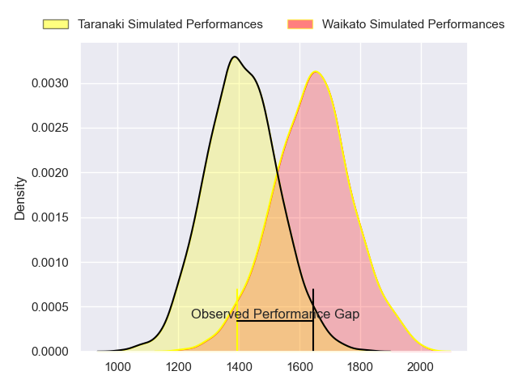
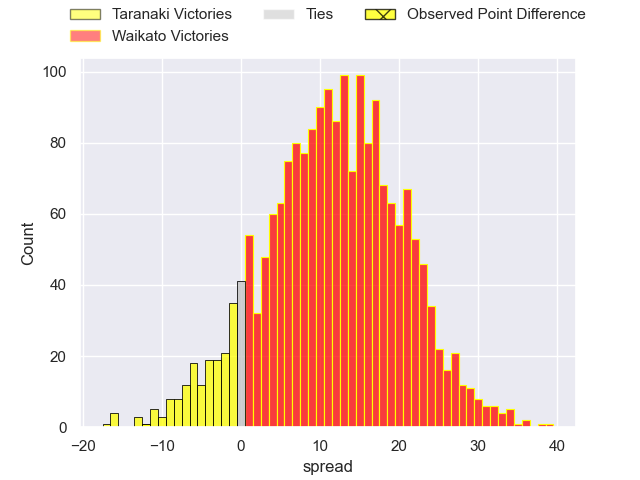
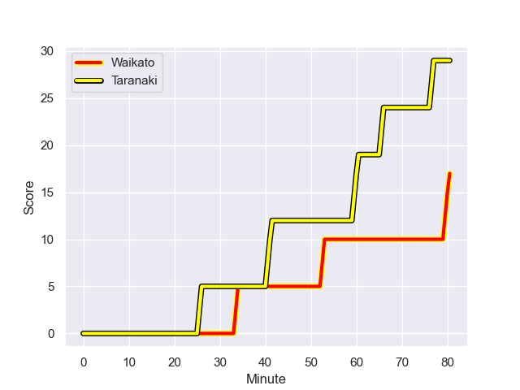
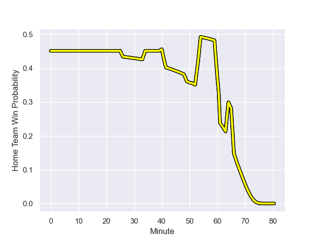

---  
layout: page  
title: Taranaki at Waikato; 29-17  
date: 2023-08-20 18:00:00 -0500  
categories: match review  
---
# Taranaki at Waikato; 29-17

# Club Level Predictions

The first set of predictions treats a club as the smallest object, as the club develops its members, organizes a gameplan, and deploys its players as needed for each match. This club model has a prediction of 0.775, which translates to predicting Waikato to win by 11.5.

Each club has a rating and a rating deviation (simiar to a Glicko system), and expected performances can be generated. This allows for simulated matches and spreads like the ones below.
## Projected Performances

## Projected Spreads

## Projected Results

# Player Level Predictions - Version 1

Treating teams instead as an entity made up of the currently active players, I have ratings for each player in an altogether different system. These can be combined to form team ratings once teamsheets are announced, weighting starters a bit higher than the reserves. After the match is played, players can be weighted by their minutes on the field, allowing for an accurate measure of the team's composition. With these compiled team ratings, we can make predictions, measure inaccuracy, and update the individual player ratings.
## Prediction with Player Minutes: Taranaki by 4.5

Taranaki by 8.5 on a neutral field
## Prediction without Player Minutes: Taranaki by 0.3

Taranaki by 4.3 on a neutral pitch

## Scores over Time

## Win Probability over Time

There were 10 large changes in win probability in this match

|   Away Minutes | Away Player                   |   Away elo |   Away Percentile |   Number |   Home Percentile |   Home elo | Home Player                  |   Home Minutes |
|---------------:|:------------------------------|-----------:|------------------:|---------:|------------------:|-----------:|:-----------------------------|---------------:|
|             54 | Jared Proffit                 |      80.43 |       1.01742e+06 |        1 |  944717           |      89.88 | Ollie Norris                 |             40 |
|             54 | Bradley Slater                |     103.43 |       1.01491e+06 |        2 |       1.01801e+06 |      79.1  | Pita Alemania Jr Anae-Ah Sue |             63 |
|             54 | Michael Bent                  |      74.04 |       1.01745e+06 |        3 |  987141           |      78.26 | George Dyer                  |             67 |
|             67 | Jesse Parete                  |      68.65 |       1.01702e+06 |        4 |       1.01492e+06 |      99.21 | Laghlan McWhannell           |             49 |
|             61 | Hemopo Cunningham             |      83.99 |       1.0174e+06  |        5 |  785476           |      90.24 | James Tucker                 |             80 |
|             80 | Kaylum Boshier                |      82.86 |       1.01742e+06 |        6 |       1.01822e+06 |      72.29 | Xavier Saifoloi              |             51 |
|             80 | Tom Florence                  |      66.15 |       1.01682e+06 |        7 |       1.01793e+06 |      75.4  | Patrick McCurran             |             80 |
|             80 | Pita Gus Sowakula             |      98.45 |  878334           |        8 |       1.01658e+06 |      85.35 | Simon Parker                 |             80 |
|             54 | Logan Crowley                 |      79.44 |       1.01744e+06 |        9 |       1.0149e+06  |     100.01 | Cortez Lee Ratima            |             61 |
|             64 | Jayson Potroz                 |      87.56 |       1.01538e+06 |       10 |       1.01798e+06 |      72.47 | Taha Kemara                  |             80 |
|             80 | Kini Naholo                   |     116.73 |  961249           |       11 |  992842           |      58.06 | Daniel Sinkinson             |             80 |
|             54 | Teihorangi Walden             |      58.98 |       1.01631e+06 |       12 |       1.01812e+06 |      77.69 | Austin Anderson              |             40 |
|             80 | Meihana Grindlay              |      83.05 |       1.01745e+06 |       13 |       1.01802e+06 |      74.71 | Bailyn Sullivan              |             78 |
|             80 | Jacob Ratumaitavuki-Kneepkens |      84.56 |       1.01741e+06 |       14 |       1.01797e+06 |      77.25 | Gideon Wrampling             |             54 |
|             80 | Stephen Perofeta              |     106.39 |  828288           |       15 |       1.01658e+06 |      79.4  | Liam Coombes-Fabling         |             80 |
|             26 | Reuben O'Neill                |      77.02 |       1.01804e+06 |       16 |       1.01793e+06 |      84.1  | Mason Tupaea                 |             40 |
|             26 | Ricky Riccitelli              |      86.5  |  787992           |       17 |     nan           |      75.55 | Quinn Tupaea                 |             40 |
|             26 | Kyle Stewart                  |      69.25 |       1.01541e+06 |       18 |       1.01795e+06 |      75.8  | Hamilton Burr                |             31 |
|             26 | Adam Lennox                   |      75.83 |     nan           |       19 |       1.01823e+06 |      71.94 | Te Rama Reuben               |             29 |
|             26 | Daniel Rona                   |      98.53 |     nan           |       20 |       1.01799e+06 |      76.54 | Tepaea Cook-Savage           |             26 |
|             19 | Millenium Sanerivi            |      73.06 |       1.01534e+06 |       21 |       1.018e+06   |      75.67 | Xavier Roe                   |             19 |
|             16 | Matty McKenzie                |      76.03 |       1.01744e+06 |       22 |     nan           |      80.58 | Caleb Ralph                  |             17 |
|             13 | Fiti Sa                       |      79.06 |     nan           |       23 |       1.01797e+06 |      77.15 | Solomone Tukuafu             |             13 |
|            nan | nan                           |     nan    |     nan           |       24 |       1.01794e+06 |      78.02 | Malachi Wrampling-Alec       |              2 |

# Player Level Predictions - Version 2

Treating teams instead as an entity made up of the currently active players, I have ratings for each player in an altogether different system. These can be combined to form team ratings once teamsheets are announced, weighting starters a bit higher than the reserves. After the match is played, players can be weighted by their minutes on the field, allowing for an accurate measure of the team's composition. With these compiled team ratings, we can make predictions, measure inaccuracy, and update the individual player ratings.
## Prediction with Player Minutes: Taranaki by 0.4

Taranaki by 3.8 on a neutral field
## Prediction without Player Minutes: Waikato by 0.4

Taranaki by 3.0 on a neutral pitch

|   Away Minutes | Away Player                   |   Away elo |   Away variance |   Number |   Home variance |   Home elo | Home Player                  |   Home Minutes |
|---------------:|:------------------------------|-----------:|----------------:|---------:|----------------:|-----------:|:-----------------------------|---------------:|
|             54 | Jared Proffit                 |      46.65 |              50 |        1 |              50 |      62.78 | Ollie Norris                 |             40 |
|             54 | Bradley Slater                |      46.65 |              50 |        2 |              50 |      46.65 | Pita Alemania Jr Anae-Ah Sue |             63 |
|             54 | Michael Bent                  |      46.65 |              50 |        3 |              50 |      58.3  | George Dyer                  |             67 |
|             67 | Jesse Parete                  |      46.65 |              50 |        4 |              50 |      46.65 | Laghlan McWhannell           |             49 |
|             61 | Hemopo Cunningham             |      46.65 |              50 |        5 |              50 |      66.26 | James Tucker                 |             80 |
|             80 | Kaylum Boshier                |      46.65 |              50 |        6 |              50 |      46.65 | Xavier Saifoloi              |             51 |
|             80 | Tom Florence                  |      46.65 |              50 |        7 |              50 |      46.65 | Patrick McCurran             |             80 |
|             80 | Pita Gus Sowakula             |      82.43 |              50 |        8 |              50 |      46.65 | Simon Parker                 |             80 |
|             54 | Logan Crowley                 |      46.65 |              50 |        9 |              50 |      46.65 | Cortez Lee Ratima            |             61 |
|             64 | Jayson Potroz                 |      46.65 |              50 |       10 |              50 |      46.65 | Taha Kemara                  |             80 |
|             80 | Kini Naholo                   |      85.92 |              50 |       11 |              50 |      40.79 | Daniel Sinkinson             |             80 |
|             54 | Teihorangi Walden             |      46.65 |              50 |       12 |              50 |      46.65 | Austin Anderson              |             40 |
|             80 | Meihana Grindlay              |      46.65 |              50 |       13 |              50 |      46.65 | Bailyn Sullivan              |             78 |
|             80 | Jacob Ratumaitavuki-Kneepkens |      46.65 |              50 |       14 |              50 |      46.65 | Gideon Wrampling             |             54 |
|             80 | Stephen Perofeta              |      95.46 |              50 |       15 |              50 |      46.65 | Liam Coombes-Fabling         |             80 |
|             26 | Reuben O'Neill                |      46.65 |              50 |       16 |              50 |      46.65 | Mason Tupaea                 |             40 |
|             26 | Ricky Riccitelli              |      44.59 |              50 |       17 |              50 |      46.65 | Quinn Tupaea                 |             40 |
|             26 | Kyle Stewart                  |      46.65 |              50 |       18 |              50 |      46.65 | Hamilton Burr                |             31 |
|             26 | Adam Lennox                   |      46.65 |              50 |       19 |              50 |      46.65 | Te Rama Reuben               |             29 |
|             26 | Daniel Rona                   |      46.65 |              50 |       20 |              50 |      46.65 | Tepaea Cook-Savage           |             26 |
|             19 | Millenium Sanerivi            |      46.65 |              50 |       21 |              50 |      46.65 | Xavier Roe                   |             19 |
|             16 | Matty McKenzie                |      46.65 |              50 |       22 |              50 |      46.65 | Caleb Ralph                  |             17 |
|             13 | Fiti Sa                       |      46.65 |              50 |       23 |              50 |      46.65 | Solomone Tukuafu             |             13 |
|            nan | nan                           |     nan    |             nan |       24 |              50 |      46.65 | Malachi Wrampling-Alec       |              2 |

