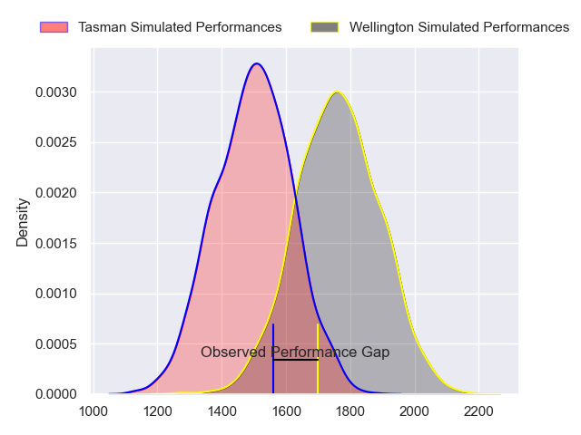
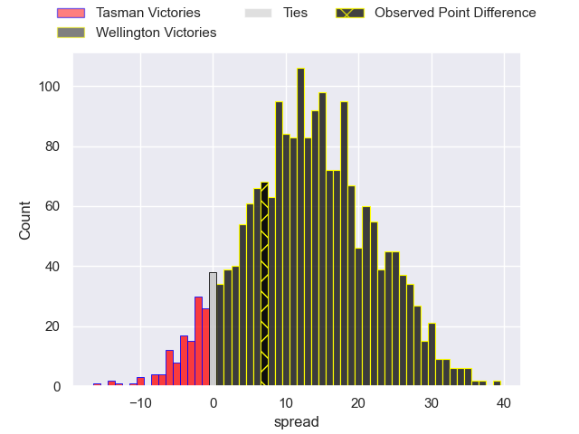
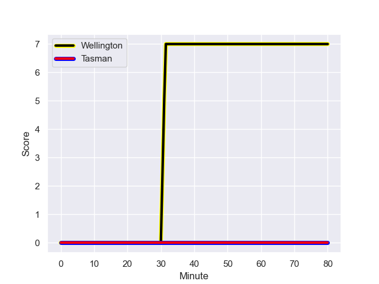
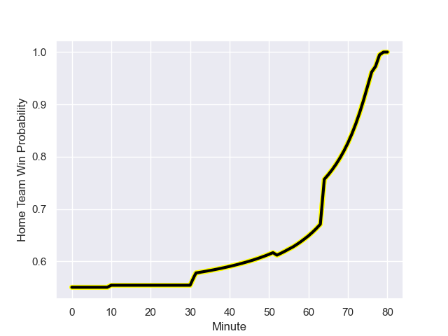

---  
layout: page  
title: Tasman at Wellington; 0-7  
date: 2023-08-23 18:00:00 -0500  
categories: match review  
---
# Tasman at Wellington; 0-7

# Club Level Predictions

The first set of predictions treats a club as the smallest object, as the club develops its members, organizes a gameplan, and deploys its players as needed for each match. This club model has a prediction of 0.806, which translates to predicting Wellington to win by 13.2.

Each club has a rating and a rating deviation (simiar to a Glicko system), and expected performances can be generated. This allows for simulated matches and spreads like the ones below.
## Projected Performances

## Projected Spreads

## Projected Results

# Player Level Predictions - Version 1

Treating teams instead as an entity made up of the currently active players, I have ratings for each player in an altogether different system. These can be combined to form team ratings once teamsheets are announced, weighting starters a bit higher than the reserves. After the match is played, players can be weighted by their minutes on the field, allowing for an accurate measure of the team's composition. With these compiled team ratings, we can make predictions, measure inaccuracy, and update the individual player ratings.
## Prediction with Player Minutes: Wellington by 12.8

Wellington by 8.8 on a neutral field
## Prediction without Player Minutes: Wellington by 14.8

Wellington by 10.8 on a neutral pitch

## Scores over Time

## Win Probability over Time

There were 3 large changes in win probability in this match

|   Away Minutes | Away Player           |   Away elo |   Away Percentile |   Number |   Home Percentile |   Home elo | Home Player                   |   Home Minutes |
|---------------:|:----------------------|-----------:|------------------:|---------:|------------------:|-----------:|:------------------------------|---------------:|
|             64 | Kershawl Sykes-Martin |      81.47 |       1.01733e+06 |        1 |           1016913 |      85.99 | Xavier Numia                  |             56 |
|             64 | Feleti Kaitu'u        |      78.67 |       1.01738e+06 |        2 |           1018136 |      78.12 | James O'Reilly                |             60 |
|             52 | Sam Matenga           |      60.48 |       1.01548e+06 |        3 |           1017718 |      87.37 | Siale Lauaki                  |             56 |
|             80 | Antonio Shalfoon      |      70.84 |       1.01816e+06 |        4 |            986294 |      83.75 | Caleb Delany                  |             80 |
|             80 | Quinten Strange       |      76.31 |  830222           |        5 |           1018580 |      79.63 | Dominic Bird                  |             56 |
|             80 | Max Hicks             |      84.06 |       1.01637e+06 |        6 |           1016760 |      75.9  | Brad Shields                  |             80 |
|             64 | Seta Baker            |      78.9  |       1.01733e+06 |        7 |            635179 |     108.92 | Ardie Savea                   |             60 |
|             80 | Anton Segner          |      64.9  |  986998           |        8 |           1018139 |      82.47 | Peter Lakai                   |             80 |
|             64 | Noah Hotham           |      76.38 |       1.01739e+06 |        9 |           1017705 |      82.08 | Kemara Henare Hauiti-Parapara |             77 |
|             10 | Taine Robinson        |      83.4  |       1.01731e+06 |       10 |           1017668 |      84.69 | Aidan Morgan                  |             80 |
|             80 | Macca Springer        |      74.79 |       1.01736e+06 |       11 |           1017713 |      77.81 | Pepesana Patafilo             |             60 |
|             80 | Alex Nankivell        |     100.1  |  785346           |       12 |           1017730 |      80.87 | Peter Ionatana Umaga-Jensen   |             60 |
|             80 | Levi Aumua            |      86.04 |       1.01651e+06 |       13 |            890901 |     107.33 | Billy Proctor                 |             80 |
|             80 | Timoci Tavatavanawai  |      84.62 |       1.01652e+06 |       14 |           1017695 |      82.12 | Losilosivale Filipo           |             80 |
|             80 | Tom Marshall          |      78.4  |       1.01735e+06 |       15 |           1017724 |      76.71 | Ruben Love                    |             80 |
|             16 | Quentin MacDonald     |      74.25 |       1.01735e+06 |       16 |           1017643 |      85.37 | Cameron Orr                   |             24 |
|             28 | Luca Inch             |      76.14 |     nan           |       17 |           1017708 |      78.08 | PJ Sheck                      |             24 |
|             16 | Ryan Cameron Coxon    |      73.01 |       1.01734e+06 |       18 |           1017680 |      80.36 | Josh Southall                 |             20 |
|             16 | Angus Fletcher        |      76.83 |     nan           |       19 |           1017652 |      88.52 | Hugo Plummer                  |             24 |
|             16 | Louie Chapman         |      88.71 |       1.0165e+06  |       20 |           1017649 |      81.75 | Dominic Ropeti                |             20 |
|             44 | Tim O'Malley          |      76.05 |       1.01732e+06 |       21 |           1017690 |      82.85 | Kyle Preston                  |              3 |
|             26 | Will Gualter          |      76.1  |     nan           |       22 |           1018141 |      74.21 | Riley Higgins                 |             20 |
|            nan | nan                   |     nan    |     nan           |       23 |           1017672 |      78.91 | Tjay Clarke                   |             20 |

# Player Level Predictions - Version 2

Treating teams instead as an entity made up of the currently active players, I have ratings for each player in an altogether different system. These can be combined to form team ratings once teamsheets are announced, weighting starters a bit higher than the reserves. After the match is played, players can be weighted by their minutes on the field, allowing for an accurate measure of the team's composition. With these compiled team ratings, we can make predictions, measure inaccuracy, and update the individual player ratings.
## Prediction with Player Minutes: Wellington by 4.0

Wellington by 0.6 on a neutral field
## Prediction without Player Minutes: Wellington by 4.6

Wellington by 1.2 on a neutral pitch

|   Away Minutes | Away Player           |   Away elo |   Away variance |   Number |   Home variance |   Home elo | Home Player                   |   Home Minutes |
|---------------:|:----------------------|-----------:|----------------:|---------:|----------------:|-----------:|:------------------------------|---------------:|
|             64 | Kershawl Sykes-Martin |      46.65 |              50 |        1 |           50    |      46.65 | Xavier Numia                  |             56 |
|             64 | Feleti Kaitu'u        |      46.65 |              50 |        2 |           50    |      46.65 | James O'Reilly                |             60 |
|             52 | Sam Matenga           |      46.65 |              50 |        3 |           50    |      46.65 | Siale Lauaki                  |             56 |
|             80 | Antonio Shalfoon      |      46.65 |              50 |        4 |           50    |      56.11 | Caleb Delany                  |             80 |
|             80 | Quinten Strange       |      77.92 |              50 |        5 |           50    |      46.65 | Dominic Bird                  |             56 |
|             80 | Max Hicks             |      46.65 |              50 |        6 |           50    |      46.65 | Brad Shields                  |             80 |
|             64 | Seta Baker            |      46.65 |              50 |        7 |           47.68 |     124.51 | Ardie Savea                   |             60 |
|             80 | Anton Segner          |      49.48 |              50 |        8 |           50    |      46.65 | Peter Lakai                   |             80 |
|             64 | Noah Hotham           |      46.65 |              50 |        9 |           50    |      46.65 | Kemara Henare Hauiti-Parapara |             77 |
|             10 | Taine Robinson        |      46.65 |              50 |       10 |           50    |      46.65 | Aidan Morgan                  |             80 |
|             80 | Macca Springer        |      46.65 |              50 |       11 |           50    |      46.65 | Pepesana Patafilo             |             60 |
|             80 | Alex Nankivell        |     101.22 |              50 |       12 |           50    |      46.65 | Peter Ionatana Umaga-Jensen   |             60 |
|             80 | Levi Aumua            |      46.65 |              50 |       13 |           50    |      81.11 | Billy Proctor                 |             80 |
|             80 | Timoci Tavatavanawai  |      46.65 |              50 |       14 |           50    |      46.65 | Losilosivale Filipo           |             80 |
|             80 | Tom Marshall          |      46.65 |              50 |       15 |           50    |      46.65 | Ruben Love                    |             80 |
|             16 | Quentin MacDonald     |      46.65 |              50 |       16 |           50    |      46.65 | Cameron Orr                   |             24 |
|             28 | Luca Inch             |      46.65 |              50 |       17 |           50    |      46.65 | PJ Sheck                      |             24 |
|             16 | Ryan Cameron Coxon    |      46.65 |              50 |       18 |           50    |      46.65 | Josh Southall                 |             20 |
|             16 | Angus Fletcher        |      46.65 |              50 |       19 |           50    |      46.65 | Hugo Plummer                  |             24 |
|             16 | Louie Chapman         |      46.65 |              50 |       20 |           50    |      46.65 | Dominic Ropeti                |             20 |
|             44 | Tim O'Malley          |      46.65 |              50 |       21 |           50    |      46.65 | Kyle Preston                  |              3 |
|             26 | Will Gualter          |      46.65 |              50 |       22 |           50    |      46.65 | Riley Higgins                 |             20 |
|            nan | nan                   |     nan    |             nan |       23 |           50    |      46.65 | Tjay Clarke                   |             20 |

