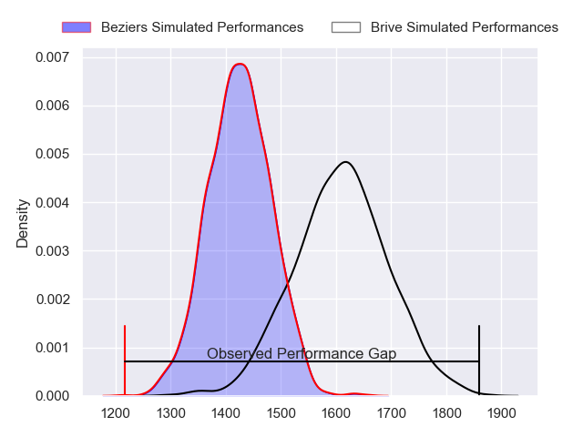
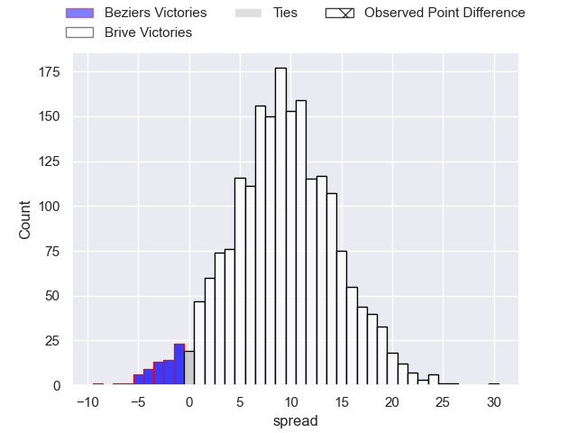
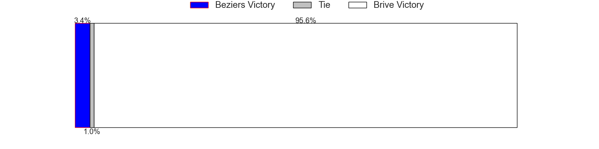
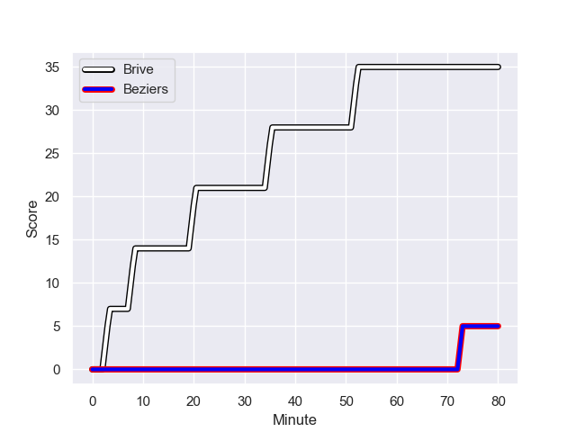
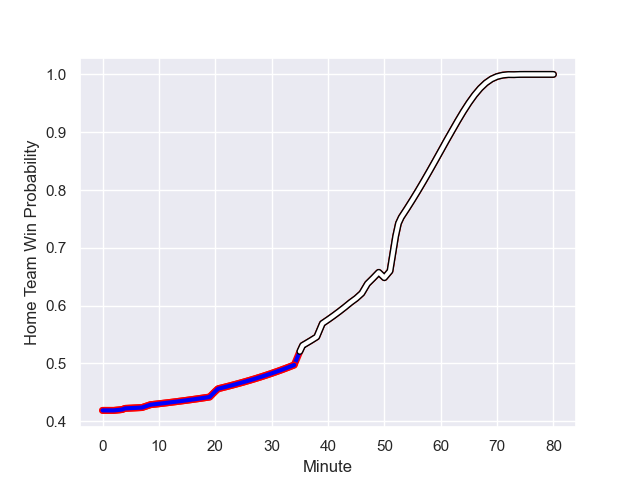

---  
layout: page  
title: Beziers at Brive; 5-35  
date: 2023-08-24 18:00:00 -0500  
categories: match review  
---
# Beziers at Brive; 5-35

# Club Level Predictions

The first set of predictions treats a club as the smallest object, as the club develops its members, organizes a gameplan, and deploys its players as needed for each match. This club model has a prediction of 0.739, which translates to predicting Brive to win by 9.2.

Each club has a rating and a rating deviation (simiar to a Glicko system), and expected performances can be generated. This allows for simulated matches and spreads like the ones below.
## Projected Performances

## Projected Spreads

## Projected Results

# Player Level Predictions - Version 1

Treating teams instead as an entity made up of the currently active players, I have ratings for each player in an altogether different system. These can be combined to form team ratings once teamsheets are announced, weighting starters a bit higher than the reserves. After the match is played, players can be weighted by their minutes on the field, allowing for an accurate measure of the team's composition. With these compiled team ratings, we can make predictions, measure inaccuracy, and update the individual player ratings.
## Prediction with Player Minutes: Beziers by 10.2

Beziers by 14.2 on a neutral field
## Prediction without Player Minutes: Beziers by 11.1

Beziers by 15.1 on a neutral pitch

## Scores over Time

## Win Probability over Time

There were 1 large changes in win probability in this match

|   Away Minutes | Away Player         |   Away elo |   Away Percentile |   Number |   Home Percentile |   Home elo | Home Player           |   Home Minutes |
|---------------:|:--------------------|-----------:|------------------:|---------:|------------------:|-----------:|:----------------------|---------------:|
|             45 | Yannick Arroyo      |      79.93 |       1.01931e+06 |        1 |       1.01926e+06 |      64.25 | Wesley Tapueluelu     |              4 |
|             39 | Wilmar Arnoldi      |      77.92 |       1.01934e+06 |        2 |  968948           |      94.42 | Issam Hamel           |             50 |
|             53 | Jon Zabala Arrieta  |      77.52 |       1.01935e+06 |        3 |       1.01922e+06 |      69.26 | Marcel van der Merwe  |             39 |
|             80 | Hans Nkinsi         |      78.78 |       1.01935e+06 |        4 |       1.0192e+06  |      72.81 | Sitakeli Timani       |             80 |
|             47 | John Madigan        |      77.47 |       1.01935e+06 |        5 |       1.01921e+06 |      66.66 | Julien Delannoy       |             39 |
|             47 | Pierrick Gunther    |      77.48 |       1.01932e+06 |        6 |       1.00314e+06 |      74.2  | Sasha Gue             |             80 |
|             80 | Clément Ancely      |      79.7  |       1.01933e+06 |        7 |       1.01924e+06 |      67.45 | Retief Marais         |             80 |
|             80 | Sias Koen           |      79.89 |       1.01931e+06 |        8 |       1.01925e+06 |      71.92 | Ross Moriarty         |             47 |
|             50 | Jean Victor Goillot |      77.51 |       1.01935e+06 |        9 |       1.01921e+06 |      71.34 | Julien Blanc          |             45 |
|             39 | Victor Dreuille     |      85.07 |  872085           |       10 |       1.01924e+06 |      68.41 | Jackson Garden-Bachop |             80 |
|             39 | Gabin Lorre         |     101.17 |  997337           |       11 |       1.01926e+06 |      71.44 | Asaeli Tuivuaka       |             80 |
|             80 | Paul Recor          |      71.52 |  997583           |       12 |       1.01927e+06 |      71.16 | Sam Johnson           |             80 |
|             80 | Branden Holder      |      78.89 |       1.01934e+06 |       13 |       1.01922e+06 |      73.21 | Paula Walisolio       |             62 |
|             80 | Maxime Espeut       |     114.03 |  929048           |       14 |       1.01922e+06 |      74.16 | Arthur Bonneval       |             80 |
|             80 | Charly Malié        |      79.45 |       1.01933e+06 |       15 |       1.01924e+06 |      65.1  | Stuart Olding         |             52 |
|             41 | Taleta Tupuola      |      80.94 |       1.01931e+06 |       16 |       1.01925e+06 |      67.52 | Daniel Brennan        |             76 |
|             41 | Harry Glynn         |      97.42 |       1.00979e+06 |       17 |     nan           |      69.08 | Tevita Ratuva         |             41 |
|             41 | Yvann Lalevee       |      81.24 |  998705           |       18 |       1.00956e+06 |      95.71 | Vakh Abdaladze        |             41 |
|             35 | Giorgi Akhaladze    |      77.21 |  963789           |       19 |     nan           |      66.19 | Léo Carbonneau        |             35 |
|             33 | Pierre Gayraud      |      77.51 |     nan           |       20 |     nan           |      67.08 | Saïd Hireche          |             33 |
|             33 | William van Bost    |      57.44 |  934314           |       21 |     nan           |      68.93 | Adrien Pelissié       |             30 |
|             30 | Liam Rimet          |      94.69 |     nan           |       22 |       1.01072e+06 |      83.24 | Mathis Ferté          |             28 |
|             27 | Julien Rasamoelina  |      69.67 |     nan           |       23 |       1.01926e+06 |      71.59 | Benjamin Lefranc      |             18 |

# Player Level Predictions - Version 2

Treating teams instead as an entity made up of the currently active players, I have ratings for each player in an altogether different system. These can be combined to form team ratings once teamsheets are announced, weighting starters a bit higher than the reserves. After the match is played, players can be weighted by their minutes on the field, allowing for an accurate measure of the team's composition. With these compiled team ratings, we can make predictions, measure inaccuracy, and update the individual player ratings.
## Prediction with Player Minutes: Brive by 3.7

Beziers by 1.1 on a neutral field
## Prediction without Player Minutes: Brive by 3.6

Beziers by 1.1 on a neutral pitch

|   Away Minutes | Away Player         |   Away elo |   Away variance |   Number |   Home variance |   Home elo | Home Player           |   Home Minutes |
|---------------:|:--------------------|-----------:|----------------:|---------:|----------------:|-----------:|:----------------------|---------------:|
|             45 | Yannick Arroyo      |      46.65 |              50 |        1 |              50 |      46.65 | Wesley Tapueluelu     |              4 |
|             39 | Wilmar Arnoldi      |      46.65 |              50 |        2 |              50 |      62.12 | Issam Hamel           |             50 |
|             53 | Jon Zabala Arrieta  |      46.65 |              50 |        3 |              50 |      46.65 | Marcel van der Merwe  |             39 |
|             80 | Hans Nkinsi         |      46.65 |              50 |        4 |              50 |      46.65 | Sitakeli Timani       |             80 |
|             47 | John Madigan        |      46.65 |              50 |        5 |              50 |      46.65 | Julien Delannoy       |             39 |
|             47 | Pierrick Gunther    |      46.65 |              50 |        6 |              50 |      34.65 | Sasha Gue             |             80 |
|             80 | Clément Ancely      |      46.65 |              50 |        7 |              50 |      46.65 | Retief Marais         |             80 |
|             80 | Sias Koen           |      46.65 |              50 |        8 |              50 |      46.65 | Ross Moriarty         |             47 |
|             50 | Jean Victor Goillot |      46.65 |              50 |        9 |              50 |      46.65 | Julien Blanc          |             45 |
|             39 | Victor Dreuille     |      39.55 |              50 |       10 |              50 |      46.65 | Jackson Garden-Bachop |             80 |
|             39 | Gabin Lorre         |      75.76 |              50 |       11 |              50 |      46.65 | Asaeli Tuivuaka       |             80 |
|             80 | Paul Recor          |      47.52 |              50 |       12 |              50 |      46.65 | Sam Johnson           |             80 |
|             80 | Branden Holder      |      46.65 |              50 |       13 |              50 |      46.65 | Paula Walisolio       |             62 |
|             80 | Maxime Espeut       |      58.47 |              50 |       14 |              50 |      46.65 | Arthur Bonneval       |             80 |
|             80 | Charly Malié        |      46.65 |              50 |       15 |              50 |      46.65 | Stuart Olding         |             52 |
|             41 | Taleta Tupuola      |      46.65 |              50 |       16 |              50 |      46.65 | Daniel Brennan        |             76 |
|             41 | Harry Glynn         |      47.62 |              50 |       17 |              50 |      46.65 | Tevita Ratuva         |             41 |
|             41 | Yvann Lalevee       |      53.8  |              50 |       18 |              50 |      49.34 | Vakh Abdaladze        |             41 |
|             35 | Giorgi Akhaladze    |      45.39 |              50 |       19 |              50 |      46.65 | Léo Carbonneau        |             35 |
|             33 | Pierre Gayraud      |      46.65 |              50 |       20 |              50 |      46.65 | Saïd Hireche          |             33 |
|             33 | William van Bost    |      31.28 |              50 |       21 |              50 |      46.65 | Adrien Pelissié       |             30 |
|             30 | Liam Rimet          |      49.58 |              50 |       22 |              50 |      38.43 | Mathis Ferté          |             28 |
|             27 | Julien Rasamoelina  |      48.05 |              50 |       23 |              50 |      46.65 | Benjamin Lefranc      |             18 |

